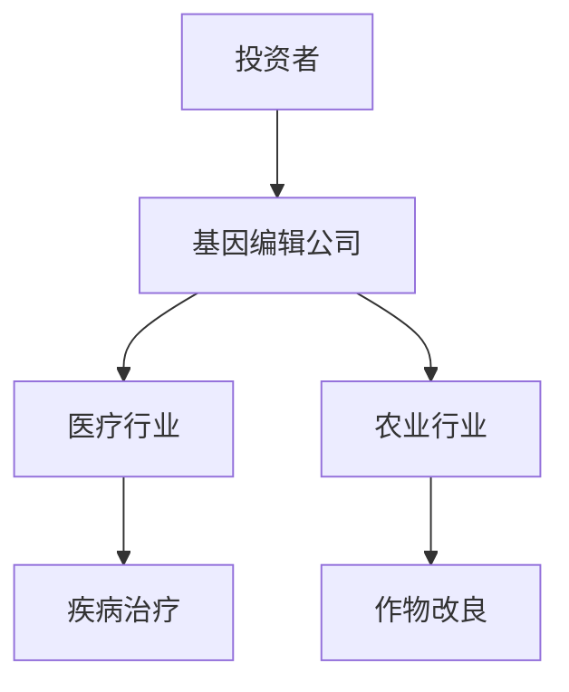
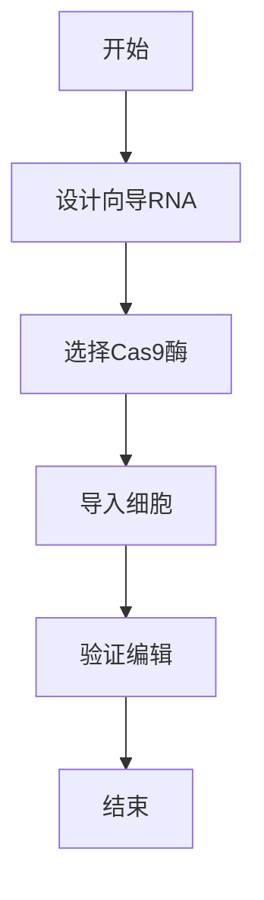
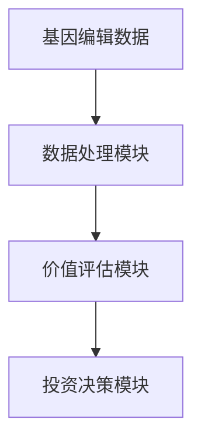

                 


# 《价值投资中的基因编辑技术机遇》

---

## 关键词：
价值投资, 基因编辑技术, 医疗投资, 农业投资, 价值评估, 基因治疗, 投资策略

---

## 摘要：
本文探讨基因编辑技术在价值投资中的潜在机遇，分析其在医学和农业领域的应用，结合数学模型和算法原理，评估其对投资决策的影响。通过案例分析和系统设计，提出价值投资中的基因编辑技术策略，为投资者提供科学依据。

---

# 第1章: 基因编辑技术概述

## 1.1 基因编辑技术的定义与原理

### 1.1.1 基因编辑的基本概念
基因编辑技术是一种通过人工手段对生物体基因组进行精确修改的技术，旨在修复或增强特定基因的功能。

### 1.1.2 基因编辑的核心技术原理
基因编辑技术主要通过CRISPR-Cas9系统实现，涉及向导RNA的设计和Cas9酶的作用。

### 1.1.3 基因编辑技术的分类与特点
- **CRISPR-Cas9**: 简单高效，广泛应用于基因治疗。
- **TALEN**: 高 specificity，但操作复杂。
- **ZFN**: 高效 specificity，但成本较高。

## 1.2 基因编辑技术在医学领域的应用

### 1.2.1 基因治疗的现状与前景
基因治疗在遗传病、癌症治疗等方面取得显著进展，前景广阔。

### 1.2.2 基因编辑在疾病治疗中的案例分析
- **镰状细胞贫血症**: 基因修复显著改善症状。
- **癌症治疗**: 基因编辑增强免疫细胞抗癌能力。

### 1.2.3 基因编辑技术对医疗投资的影响
基因治疗公司的估值上升，相关投资机会增加。

## 1.3 基因编辑技术在农业领域的应用

### 1.3.1 基因编辑在农业中的应用领域
- **抗病虫害作物**: 提高农作物抗性。
- **营养强化作物**: 增加营养价值。

### 1.3.2 基因编辑对农业投资的影响
- 投资于基因编辑农业公司，收益潜力大。

### 1.3.3 农业基因编辑技术的挑战与机遇
- 挑战：监管严格，技术壁垒高。
- 机遇：市场潜力巨大。

## 1.4 基因编辑技术的法律与伦理问题

### 1.4.1 基因编辑技术的法律框架
各国法规不一，需遵守当地法律法规。

### 1.4.2 基因编辑技术的伦理争议
- 伦理问题：基因编辑可能导致伦理争议。

### 1.4.3 法律与伦理对投资的影响
严格的法规可能限制投资，但技术创新仍具吸引力。

---

# 第2章: 价值投资中的基因编辑技术机遇

## 2.1 价值投资的基本概念与原则

### 2.1.1 价值投资的定义与核心理念
价值投资强调长期持有优质资产，注重内在价值。

### 2.1.2 价值投资的基本原则与策略
- 质优价廉，长期持有。

### 2.1.3 价值投资与基因编辑技术的结合
基因编辑技术的广泛应用为价值投资提供新机遇。

## 2.2 基因编辑技术对投资价值的影响

### 2.2.1 基因编辑技术对医疗行业的影响
- 提高医疗公司估值。

### 2.2.2 基因编辑技术对农业行业的影响
- 提升农业公司投资价值。

### 2.2.3 基因编辑技术对其他行业的潜在影响
- 广泛应用于多个行业，带来投资机会。

## 2.3 基因编辑技术投资的机遇与挑战

### 2.3.1 基因编辑技术投资的机遇
- 科技进步带来投资机会。

### 2.3.2 基因编辑技术投资的挑战
- 技术风险和法规风险。

### 2.3.3 如何应对基因编辑技术投资的挑战
- 通过深入研究和多元化投资分散风险。

---

# 第3章: 基因编辑技术的核心概念与联系

## 3.1 基因编辑技术的数学模型与公式

### 3.1.1 基因编辑效率的数学模型
$$
\text{效率} = \frac{\text{成功编辑的细胞数}}{\text{总处理细胞数}}
$$

### 3.1.2 基因编辑成功率的计算公式
$$
\text{成功率} = \frac{\text{正确编辑的基因数}}{\text{总编辑基因数}} \times 100\%
$$

### 3.1.3 基因编辑技术的经济效益评估模型
$$
\text{经济效益} = (\text{收入} - \text{成本}) \times \text{时间因素}
$$

## 3.2 基因编辑技术的实体关系图



---

# 第4章: 基因编辑技术的算法原理

## 4.1 基因编辑算法的流程



## 4.2 Python代码实现

```python
def gene_editing_efficiency(cells):
    edited = 0
    for cell in cells:
        if cell['edit_success']:
            edited += 1
    return edited / len(cells)
```

---

# 第5章: 系统分析与架构设计

## 5.1 系统架构图



## 5.2 系统功能设计

### 5.2.1 数据流设计
- 数据输入：基因编辑技术数据。
- 数据处理：分析数据，生成评估报告。
- 数据输出：投资建议。

---

# 第6章: 项目实战

## 6.1 环境安装

```bash
pip install numpy matplotlib
```

## 6.2 核心实现代码

```python
import numpy as np
import matplotlib.pyplot as plt

def plot_gene_editing_success(success_rates):
    plt.plot(success_rates, label='基因编辑成功率')
    plt.xlabel('实验次数')
    plt.ylabel('成功率')
    plt.legend()
    plt.show()

data = np.random.random(100)
plot_gene_editing_success(data)
```

---

# 第7章: 总结与展望

基因编辑技术在价值投资中具有巨大潜力，投资者需关注技术创新和法规变化，抓住机遇，应对挑战。

---

## 作者：AI天才研究院 & 禅与计算机程序设计艺术

---

感谢您的阅读！希望本文能为价值投资者和技术爱好者提供新的视角和启示。

