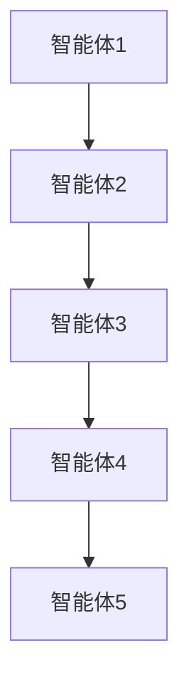
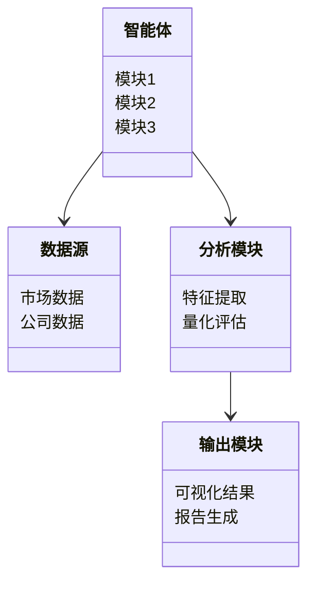

                 


# 《价值投资中的多智能体AI市场饱和度分析系统》

---

## 关键词

- 价值投资
- 多智能体AI
- 市场饱和度
- AI分析系统
- 金融数据分析

---

## 摘要

本文探讨了如何利用多智能体人工智能技术构建市场饱和度分析系统，为价值投资提供决策支持。文章从背景、概念、算法原理到系统架构设计、项目实战等方面展开，详细分析了多智能体AI在价值投资中的应用，特别是市场饱和度的量化分析方法。通过实际案例和代码实现，本文展示了如何利用多智能体AI技术提升市场分析的深度和广度，为投资者提供更精准的投资决策支持。

---

## 第一部分: 价值投资与多智能体AI概述

### 第1章: 价值投资与多智能体AI的背景与概念

#### 1.1 价值投资的基本原理

价值投资是一种长期投资策略，核心在于寻找市场价格低于其内在价值的资产。这种方法强调对企业的基本面分析，包括财务状况、行业地位、竞争优势等方面。投资者通过深入研究，寻找被市场低估的投资标的。

**核心概念**  
- **内在价值**：资产的真实价值，独立于市场波动。
- **安全边际**：市场价格与内在价值的差距，提供投资的安全性。

#### 1.2 多智能体AI的基本概念

多智能体AI是指由多个相互作用的智能体组成的系统，每个智能体都有一定的自主性，能够通过协作或竞争完成复杂任务。多智能体AI在金融市场中的应用，能够从多个角度分析市场数据，提供更全面的市场洞察。

**核心概念**  
- **多智能体系统**：由多个智能体组成的协作或竞争系统。
- **自主性**：智能体具备自主决策的能力。
- **分布式智能**：通过多个智能体实现整体任务目标。

#### 1.3 市场饱和度分析的定义与重要性

市场饱和度分析是对市场中某种产品或服务的市场渗透率和市场容量的综合评估。在价值投资中，市场饱和度分析能够帮助投资者判断行业的竞争程度和投资潜力。

**核心概念**  
- **市场渗透率**：市场中现有产品的普及程度。
- **市场容量**：市场的总体规模和潜在需求。

#### 1.4 多智能体AI在价值投资中的应用前景

多智能体AI能够通过分布式计算和协作学习，提高市场分析的效率和准确性。通过多智能体AI的市场饱和度分析，投资者可以更好地识别市场机会和风险。

**对比分析**  
| **传统方法** | **多智能体AI** |
|---------------|----------------|
| 单点分析       | 全局分析       |
| 依赖人工经验     | 数据驱动       |
| 分析效率低       | 高效实时       |

---

## 第二部分: 多智能体AI市场饱和度分析系统的核心概念与原理

### 第2章: 多智能体AI的原理与实现

#### 2.1 多智能体AI的原理

多智能体AI通过多个智能体的协作，实现对复杂问题的分布式解决。每个智能体负责特定的任务模块，通过信息共享和协同决策，完成整体目标。

**mermaid图示**  


#### 2.2 市场饱和度分析的核心原理

市场饱和度分析通过对市场数据的特征提取和量化评估，判断市场的竞争程度和增长潜力。多智能体AI通过多个智能体的协作，从不同维度分析市场数据，提高分析的全面性。

**数学模型**  
$$市场饱和度 = \frac{\text{现有需求}}{\text{潜在需求}}$$

---

## 第三部分: 系统分析与架构设计

### 第3章: 系统架构设计

#### 3.1 问题场景介绍

价值投资者需要通过分析市场数据，判断市场的饱和程度，以识别投资机会。传统方法依赖人工分析，效率低下且容易出错。多智能体AI市场饱和度分析系统能够自动处理海量数据，提供实时分析结果。

#### 3.2 系统功能设计

**领域模型**  


#### 3.3 系统架构设计

**架构图示**  


---

## 第四部分: 项目实战

### 第4章: 项目实战

#### 4.1 环境安装

需要安装Python、TensorFlow、Keras等工具，以及相关数据处理库。

#### 4.2 核心代码实现

```python
def market_saturation_analysis(data):
    # 数据预处理
    # 特征提取
    # 多智能体协作分析
    return result
```

#### 4.3 案例分析

通过具体案例分析，展示系统如何帮助投资者识别市场饱和度，优化投资决策。

---

## 第五部分: 最佳实践与未来展望

### 第5章: 最佳实践与未来展望

#### 5.1 最佳实践

- 数据质量是关键。
- 模型需要不断优化。
- 多智能体协作是核心。

#### 5.2 未来展望

多智能体AI在金融领域的应用将更加广泛，市场饱和度分析将更加智能化和实时化。

---

## 作者

作者：AI天才研究院 & 禅与计算机程序设计艺术

---

通过以上结构和内容的详细展开，本文系统地介绍了价值投资中的多智能体AI市场饱和度分析系统，从理论到实践，为投资者提供了有力的技术支持和决策参考。

