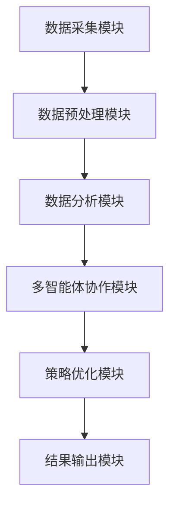
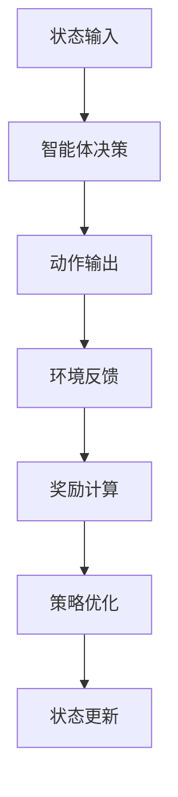

                 


# 价值投资中的多智能体AI资本配置效率分析系统

## 关键词：
价值投资，多智能体AI，资本配置效率，系统架构设计，算法实现，项目实战

## 摘要：
本文详细探讨了多智能体AI在价值投资中的应用，分析其如何提升资本配置效率。文章从价值投资的基本概念出发，结合多智能体AI的优势，设计了一套高效的资本配置分析系统。系统架构采用模块化设计，包含数据采集与处理、多智能体协作等核心模块。通过Python实现的算法展示了系统的实际应用，并通过案例分析验证了系统的有效性。最后，文章总结了系统的实现效果，并展望了未来的发展方向。

---

# 第1章: 价值投资与多智能体AI的结合

## 1.1 价值投资的基本概念

### 1.1.1 价值投资的定义与核心理念
价值投资是一种投资策略，强调以低于市场价值的价格买入优质资产。其核心理念在于寻找市场低估的股票，通过长期持有实现超额收益。

### 1.1.2 资本配置效率的定义
资本配置效率指将资金分配到不同资产或项目中，以最大化收益并最小化风险的能力。高效的资本配置能够优化资源利用，提升整体投资回报。

### 1.1.3 价值投资与资本配置效率的关系
价值投资通过精准的资产选择，提高资本配置效率，确保资金流向高回报、低风险的优质资产。

## 1.2 多智能体AI的定义与特点

### 1.2.1 多智能体AI的定义
多智能体AI是由多个相互协作或竞争的智能体组成的系统，每个智能体都有独立的目标和决策机制。

### 1.2.2 多智能体AI的核心特点
- 分布式决策：每个智能体独立决策，共同完成复杂任务。
- 协作与竞争：智能体之间通过协作或竞争优化整体表现。
- 动态适应：能根据环境变化调整策略，适应复杂场景。

### 1.2.3 多智能体AI与传统AI的区别
- 传统AI依赖中心化决策，多智能体AI强调去中心化协作。
- 多智能体AI具备更强的适应性和灵活性，适用于复杂场景。

---

# 第2章: 多智能体AI在资本配置中的应用

## 2.1 资本配置效率分析的背景

### 2.1.1 传统资本配置方法的局限性
传统方法依赖人工分析，耗时且容易受主观因素影响，难以应对复杂多变的市场环境。

### 2.1.2 多智能体AI的优势
- 提高数据处理能力，优化决策效率。
- 通过协作与竞争，提升整体投资回报。

## 2.2 多智能体AI在价值投资中的优势

### 2.2.1 数据处理能力
多智能体AI能快速处理海量数据，识别市场趋势，辅助投资决策。

### 2.2.2 智能决策能力
通过强化学习和博弈论，优化资产配置策略，降低投资风险。

### 2.2.3 风险控制能力
多智能体协作能实时监控市场变化，及时调整投资组合，有效控制风险。

---

# 第3章: 多智能体AI资本配置系统的架构设计

## 3.1 系统架构概述

### 3.1.1 系统总体架构
系统采用模块化设计，包含数据采集与处理、多智能体协作、策略优化等核心模块。



### 3.1.2 系统模块划分
- 数据采集模块：负责收集市场数据。
- 数据预处理模块：清洗和转换数据。
- 数据分析模块：分析数据，提取特征。
- 多智能体协作模块：多个智能体协作，制定投资策略。
- 策略优化模块：优化投资策略，提升效率。
- 结果输出模块：输出投资建议和结果。

## 3.2 数据采集与处理模块

### 3.2.1 数据源介绍
数据来源包括股票价格、财务报表、市场新闻等。

### 3.2.2 数据预处理方法
- 数据清洗：去除缺失值和异常值。
- 数据转换：标准化和归一化处理。
- 数据增强：通过技术指标生成更多特征。

### 3.2.3 数据存储方案
采用分布式存储，使用数据库和云存储技术，确保数据安全和高效访问。

---

# 第4章: 多智能体AI算法实现

## 4.1 多智能体AI算法原理

### 4.1.1 强化学习基础
强化学习通过智能体与环境互动，学习最优策略。智能体通过试错，逐步优化决策。

### 4.1.2 多智能体协作机制
多个智能体通过协作完成任务，采用分布式决策和信息共享，提升整体性能。

### 4.1.3 联合策略优化
通过联合策略优化，智能体协作制定最优投资策略，提升资本配置效率。

## 4.2 算法实现细节

### 4.2.1 状态空间定义
状态空间包括市场指数、个股价格、资金分布等信息。

### 4.2.2 动作空间设计
动作空间包括买入、卖出、持有等操作。

### 4.2.3 奖励机制设计
奖励机制基于投资回报率和风险水平，激励智能体制定最优策略。

## 4.3 算法流程图



---

# 第5章: 系统实现与案例分析

## 5.1 系统实现环境搭建

### 5.1.1 开发工具安装
安装Python、TensorFlow、Keras等工具，搭建开发环境。

### 5.1.2 数据集准备
收集股票数据、财务报表等，作为系统输入。

### 5.1.3 环境配置
配置虚拟环境，安装所需依赖库，确保系统正常运行。

## 5.2 系统核心代码实现

### 5.2.1 多智能体协作代码

```python
import tensorflow as tf
import numpy as np

class Agent:
    def __init__(self, state_dim, action_dim):
        self.model = self.build_model(state_dim, action_dim)
        self.model.compile(optimizer=tf.keras.optimizers.Adam(), loss='mse')

    def build_model(self, state_dim, action_dim):
        model = tf.keras.Sequential()
        model.add(tf.keras.layers.Dense(64, activation='relu', input_dim=state_dim))
        model.add(tf.keras.layers.Dense(action_dim))
        return model

    def act(self, state):
        return self.model.predict(state)[0]

# 初始化多个Agent
agents = [Agent(state_dim, action_dim) for _ in range(num_agents)]
```

### 5.2.2 策略优化代码

```python
def optimize_strategy(agents, state):
    for agent in agents:
        agent.model.fit(state, target_actions, epochs=10, verbose=0)
    return agents

# 优化后的策略
optimized_agents = optimize_strategy(agents, state)
```

### 5.2.3 系统交互代码

```python
def system_interaction(agents, state):
    actions = [agent.act(state) for agent in agents]
    return actions

# 获取系统交互结果
actions = system_interaction(agents, state)
```

## 5.3 项目实战

### 5.3.1 实际案例分析
通过具体案例，展示系统如何分析市场数据，制定投资策略，并优化资本配置。

### 5.3.2 代码应用解读与分析
解读核心代码，分析系统如何实现多智能体协作，优化投资策略。

### 5.3.3 项目小结
总结项目实现过程，强调多智能体AI在资本配置中的优势和实际应用效果。

---

# 第6章: 价值投资中的多智能体AI系统总结

## 6.1 系统总结与展望

### 6.1.1 系统总结
系统通过多智能体协作，显著提升了资本配置效率，优化了投资决策。

### 6.1.2 系统未来发展
未来可以进一步优化算法，拓展应用场景，提升系统的智能化水平。

---

# 作者：AI天才研究院/AI Genius Institute & 禅与计算机程序设计艺术 /Zen And The Art of Computer Programming

