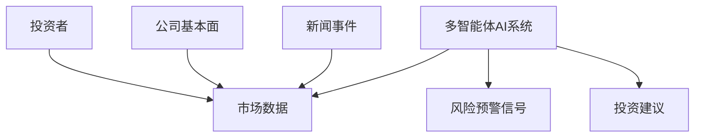
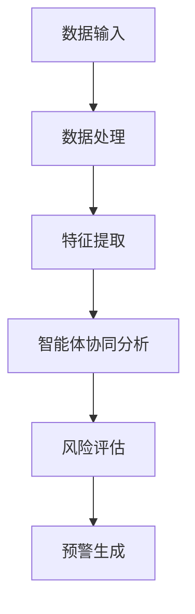

                 

# 《价值投资中的多智能体AI风险预警系统》

---

## 关键词：价值投资，多智能体AI，风险预警，金融数据分析，人工智能

---

## 摘要

价值投资是一种以基本面分析为基础的投资策略，旨在通过识别市场中的估值偏差来实现长期收益。然而，金融市场中的不确定性使得风险预警成为价值投资中的关键环节。多智能体人工智能（Multi-Agent AI）技术的引入，为风险预警提供了新的可能性。本文将探讨如何利用多智能体AI构建风险预警系统，并分析其在价值投资中的应用潜力。

---

## 第1章：价值投资的背景与意义

### 1.1 价值投资的核心理念

#### 1.1.1 价值投资的定义与特点

价值投资是一种长期投资策略，其核心在于寻找市场价格低于其内在价值的资产。与短期交易不同，价值投资强调对公司基本面的深入分析，关注企业的盈利能力、财务状况和行业地位等因素。其特点包括：

- **长期性**：注重长期收益而非短期波动。
- **安全性**：通过识别低估资产降低投资风险。
- **逆向思维**：在市场恐慌时寻找机会，在市场乐观时保持警惕。

#### 1.1.2 价值投资在金融市场的地位

价值投资自本杰明·格雷厄姆和戴维·多德提出以来，一直是金融投资的重要流派。其方法论在机构投资、个人投资等领域广泛应用，并成为巴菲特等著名投资者的理论基础。在现代金融市场中，价值投资的重要性体现在以下几个方面：

- **分散化投资**：通过多样化投资降低风险。
- **长期收益**：价值投资通过长期持有优质资产实现收益。
- **基本面分析**：深入分析企业的财务状况和行业地位，为投资决策提供依据。

#### 1.1.3 价值投资与传统投资的区别

与传统投资相比，价值投资更加注重基本面分析和长期视角。传统投资可能更关注市场趋势和技术分析，而价值投资则更关注企业的内在价值。这种区别使得价值投资在市场波动中表现出更强的抗风险能力。

---

### 1.2 风险预警在价值投资中的重要性

#### 1.2.1 风险预警的定义与作用

风险预警是指通过分析市场数据和企业基本面信息，识别潜在风险并提前发出预警信号。在价值投资中，风险预警的作用尤为关键，因为它可以帮助投资者在市场波动加剧时及时调整投资策略。

#### 1.2.2 风险预警在价值投资中的应用场景

风险预警在价值投资中的应用场景包括：

- **识别低估资产**：通过分析市场数据，识别价格被低估的资产。
- **监测财务风险**：通过分析企业的财务状况，识别潜在的财务危机。
- **应对市场波动**：在市场波动加剧时，及时调整投资组合以降低风险。

#### 1.2.3 风险预警的挑战与解决方案

尽管风险预警在价值投资中具有重要作用，但也面临一些挑战：

- **数据复杂性**：金融市场数据具有高度的不确定性和复杂性。
- **模型局限性**：传统的统计模型可能无法捕捉所有潜在风险。
- **信息滞后性**：数据采集和处理可能存在时间滞后。

为了解决这些问题，多智能体AI技术被引入，通过分布式计算和协同学习，提高风险预警的准确性和实时性。

---

## 第2章：多智能体AI的基本概念与优势

### 2.1 多智能体AI的核心概念

#### 2.1.1 多智能体系统的定义

多智能体系统（Multi-Agent System, MAS）是指由多个智能体（Agent）组成的分布式系统。每个智能体都是一个能够感知环境、做出决策并采取行动的独立实体。

#### 2.1.2 多智能体系统的组成与特点

多智能体系统由以下几个关键组成部分组成：

- **智能体**：具有感知、决策和行动能力的独立实体。
- **环境**：智能体所处的外部环境，包括金融市场数据、企业基本面信息等。
- **通信机制**：智能体之间进行信息交换的渠道。
- **协作机制**：智能体之间协同工作的规则和策略。

多智能体系统的特点包括：

- **分布式计算**：多个智能体协同完成任务。
- **自主性**：每个智能体具有自主决策能力。
- **协作性**：智能体之间通过协作实现共同目标。

#### 2.1.3 多智能体系统与单智能体系统的区别

与单智能体系统相比，多智能体系统具有以下优势：

- **分布式计算能力**：多个智能体可以同时处理大量数据。
- **协作能力**：通过协作提高整体系统的智能性和准确性。
- **容错性**：单个智能体的故障不会导致整个系统崩溃。

---

### 2.2 AI在风险预警中的应用潜力

#### 2.2.1 AI在金融数据分析中的优势

人工智能在金融数据分析中的优势体现在以下几个方面：

- **快速处理能力**：AI可以快速处理海量数据，提高分析效率。
- **模式识别**：通过机器学习算法识别数据中的潜在模式。
- **实时监控**：AI可以实时监控市场数据，及时发现潜在风险。

#### 2.2.2 多智能体AI在风险预警中的独特价值

多智能体AI在风险预警中的独特价值包括：

- **分布式计算能力**：多个智能体可以同时分析不同类型的金融数据。
- **协同学习能力**：通过协同学习，多个智能体可以共同优化风险预警模型。
- **动态适应能力**：多智能体系统可以根据市场变化动态调整预警策略。

#### 2.2.3 多智能体AI的风险预警能力对比分析

与传统风险预警方法相比，多智能体AI具有以下优势：

- **高准确性**：通过多个智能体的协同分析，提高风险预警的准确性。
- **实时性**：多智能体系统可以实时处理市场数据，提高预警的及时性。
- **灵活性**：多智能体系统可以根据市场变化动态调整预警策略。

---

## 第3章：多智能体AI风险预警系统的实体关系图

为了更好地理解多智能体AI风险预警系统的组成，我们可以通过实体关系图来展示各部分之间的关系。

在上述实体关系图中，投资者通过市场数据、公司基本面和新闻事件等信息输入到多智能体AI系统中。系统通过分析这些数据，生成风险预警信号和投资建议，帮助投资者做出决策。

---

## 第4章：多智能体AI风险预警系统的流程图

为了更好地理解多智能体AI风险预警系统的流程，我们可以通过流程图来展示系统的运行步骤。

在上述流程图中，系统首先接收数据输入，然后进行数据处理和特征提取。接下来，多个智能体协同分析数据，生成风险评估结果，并最终生成风险预警信号。

---

## 第5章：多智能体AI风险预警系统的算法原理

### 5.1 多智能体协同学习算法

#### 5.1.1 基于强化学习的多智能体算法

多智能体协同学习的算法可以通过强化学习来实现。每个智能体通过与环境和其他智能体的互动，学习最优策略。

#### 5.1.2 多智能体系统中的信息交互

在多智能体系统中，智能体之间需要通过通信机制进行信息交互。信息交互的方式包括：

- **直接通信**：智能体之间直接交换信息。
- **间接通信**：通过共享数据库或其他中间媒介进行信息交换。

#### 5.1.3 多智能体算法的实现步骤

多智能体算法的实现步骤包括：

1. **初始化**：设置智能体的初始状态和参数。
2. **感知环境**：智能体感知外部环境并获取数据。
3. **决策与行动**：智能体基于感知数据做出决策并采取行动。
4. **学习与优化**：通过强化学习算法优化智能体的策略。

---

### 5.2 风险预警的数学模型

#### 5.2.1 风险评估的数学公式

风险评估的数学公式可以表示为：

$$
风险值 = \sum_{i=1}^{n} w_i \cdot f_i
$$

其中，$w_i$ 是第 $i$ 个因素的权重，$f_i$ 是第 $i$ 个因素的风险值。

---

## 第6章：多智能体AI风险预警系统的实现

### 6.1 系统设计与实现

#### 6.1.1 数据采集与预处理

数据采集与预处理是系统实现的第一步。我们需要从多个数据源采集市场数据、公司基本面信息和新闻事件等数据，并进行清洗和特征提取。

#### 6.1.2 系统实现

系统实现的核心部分是多智能体协同学习算法。我们需要实现智能体之间的通信机制，并通过强化学习算法优化智能体的策略。

#### 6.1.3 系统测试

系统测试是确保系统性能的重要步骤。我们需要对系统进行单元测试、集成测试和性能测试，确保系统的稳定性和准确性。

---

## 第7章：总结与展望

### 7.1 总结

本文详细探讨了多智能体AI在价值投资中的应用，特别是风险预警系统的设计与实现。通过多智能体AI技术，我们可以提高风险预警的准确性和实时性，为价值投资者提供有力支持。

### 7.2 展望

未来，随着人工智能技术的不断发展，多智能体AI在金融领域的应用将更加广泛。我们可以进一步优化多智能体协同学习算法，提高系统的智能化水平，并探索更多应用场景。

---

## 参考文献

1. Ben Graham, *The Intelligent Investor*
2. David L. tinder, *The New Finance: The Case for Financial Arms and the Need for a New Approach*
3. Richard O. Perlov, *Multi-Agent Systems: Introduction to Distributed Intelligence*

---

## 作者简介

作者：AI天才研究院/AI Genius Institute & 禅与计算机程序设计艺术/Zen And The Art of Computer Programming

---

感谢您的阅读！希望这篇文章能为您提供有价值的信息和启示！

