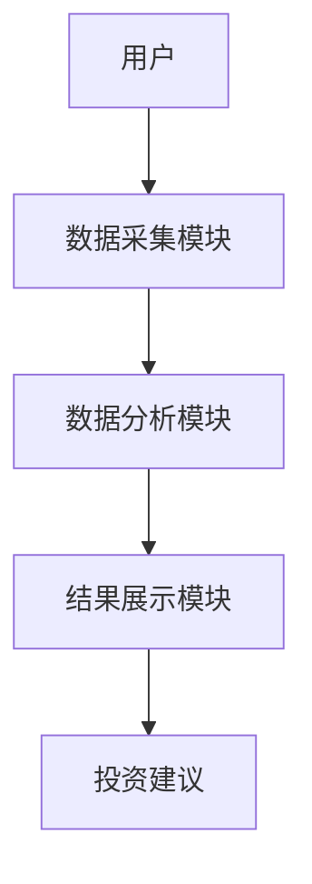

                 

# 价值投资中的太空旅游技术前景

---

## 关键词：
- 价值投资、太空旅游、卫星技术、运载火箭、太空资源开发

---

## 摘要：
本文探讨了太空旅游技术领域的投资机会，分析了卫星技术、运载火箭和太空资源开发等核心领域的技术发展和市场潜力。通过构建技术评估模型和系统架构设计，为投资者提供科学的投资决策依据，揭示太空旅游技术的未来发展趋势和价值投资机会。

---

# 引言

## 第1章：太空旅游技术的背景与重要性
### 1.1 太空旅游技术的定义与现状
- **1.1.1 太空旅游技术的定义**：指利用运载工具将人类送入太空并返回的技术，包括卫星、火箭和太空资源开发等。
- **1.1.2 当前发展现状**：商业航天公司如SpaceX、Blue Origin和Virgin Galactic推动了技术进步和降低成本。
- **1.1.3 重要性与未来展望**：太空旅游将从高端奢侈品变为大众化服务，预计未来十年市场将快速增长。

### 1.2 价值投资在太空旅游中的作用
- **1.2.1 价值投资概念**：寻找被低估的优质资产，通过长期持有获得收益。
- **1.2.2 技术与投资的结合**：分析技术成熟度、市场需求和商业模式，识别投资机会。
- **1.2.3 潜力与挑战**：高风险高回报，需关注政策、技术和市场因素。

---

## 第二部分：太空旅游技术的核心概念

## 第2章：卫星技术与应用
### 2.1 卫星技术的原理与分类
- **2.1.1 原理**：利用卫星接收和发射信号，实现通信、导航和地球观测。
- **2.1.2 分类**：
  - 通信卫星：提供全球通信服务。
  - 导航卫星：如GPS，提供精准定位。
  - 观测卫星：用于气象、资源探测等。

### 2.2 卫星技术的发展与挑战
- **2.2.1 技术进步**： miniaturization和AI技术提升卫星效率。
- **2.2.2 市场需求**：通信、导航和地球观测的多样化需求。

---

## 第三部分：价值投资中的技术评估

## 第4章：技术评估模型构建
### 4.1 评估模型的构建原理
- **核心指标**：市场容量、技术成熟度、政策支持、成本效益。
- **权重分配**：市场容量40%，技术成熟度30%，政策支持20%，成本效益10%。

### 4.2 评估指标与权重
| 指标                | 权重 |
|---------------------|------|
| 市场容量            | 40%  |
| 技术成熟度          | 30%  |
| 政策支持            | 20%  |
| 成本效益            | 10%  |

---

## 第四部分：系统分析与架构设计

## 第5章：系统架构设计
### 5.1 价值评估系统功能设计
- 数据采集模块：收集市场、技术和财务数据。
- 数据分析模块：应用机器学习模型进行预测。
- 结果展示模块：生成可视化报告。

### 5.2 系统架构图

---

## 第五部分：项目实战

## 第6章：SpaceX案例分析
### 6.1 SpaceX的技术优势
- 可重复使用火箭降低成本。
- 高效的供应链管理和生产流程。

### 6.2 投资评估
- **市场容量**：全球航天市场预计年增长10%。
- **技术成熟度**：猎鹰9号的成功发射和回收。
- **政策支持**：政府补贴和国际合作。

---

## 结论

太空旅游技术领域具有巨大的投资潜力，但需结合技术、市场和政策多方面因素进行评估。通过构建科学的评估模型和系统架构，投资者可以更准确地识别高价值的技术和公司。未来，随着技术进步和市场需求增长，太空旅游将带来更多投资机会。

---

## 附录
- **附录A**：相关数据和图表。
- **附录B**：参考文献和进一步阅读资料。

---

## 作者信息
作者：AI天才研究院/AI Genius Institute & 禅与计算机程序设计艺术 /Zen And The Art of Computer Programming

---

以上是《价值投资中的太空旅游技术前景》的技术博客文章，详细分析了太空旅游技术的各个方面，并结合价值投资的方法进行了深入探讨。

