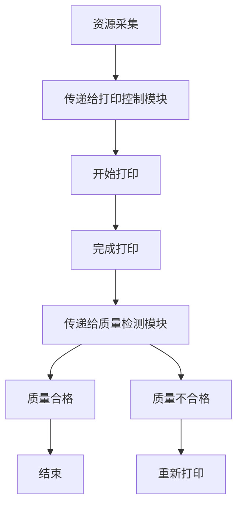

                 


# 太空资源3D打印技术的价值投资前景

## 关键词：太空资源，3D打印技术，价值投资，增材制造，太空开发

## 摘要：  
太空资源的开发与利用是21世纪人类探索的重要方向之一，而3D打印技术作为一项革命性的制造技术，正在为太空资源的利用带来前所未有的可能性。本文从价值投资的角度，深入分析太空资源3D打印技术的发展现状、技术原理、应用场景及其投资价值。通过技术原理的解析、算法实现的详细阐述、数学模型的建立与分析，以及系统架构的设计与实现，全面探讨太空资源3D打印技术的潜力与挑战，为投资者提供科学的决策参考。

---

## 第1章: 背景介绍

### 1.1 太空资源的定义与现状

#### 1.1.1 太空资源的定义  
太空资源是指存在于地球之外的宇宙空间中的资源，包括但不限于月球、火星、小行星、卫星等天体上的物质，以及太阳能、微陨石等能量与物质资源。这些资源具有高度的战略价值，但开发难度极大。

#### 1.1.2 太空资源的现状与分布  
目前，太空资源的开发仍处于起步阶段，但随着技术的进步，其潜力逐渐被挖掘。主要分布包括：  
1. **月球**：丰富的钛、铝等金属资源。  
2. **火星**：含有大量水冰、铁矿石等资源。  
3. **小行星**：富含贵金属和稀有金属。  
4. **太阳风**：可提取氢、氧等元素用于太空站建设。  

#### 1.1.3 太空资源开发的挑战与机遇  
- **挑战**：运输成本高昂、技术复杂、环境恶劣。  
- **机遇**：太空资源的开发将推动材料科学、能源技术、航天技术的进步，带来巨大的经济价值。

### 1.2 3D打印技术的定义与特点

#### 1.2.1 3D打印技术的定义  
3D打印技术（增材制造）是一种通过逐层堆叠材料，按照数字模型直接制造物体的技术。与传统减材制造不同，3D打印具有高度的灵活性和定制化能力。

#### 1.2.2 3D打印技术的核心特点  
- **快速原型**：能够快速制造复杂形状的物体。  
- **材料利用率高**：减少材料浪费。  
- **定制化能力强**：支持复杂结构的制造。  
- **适用性广**：适用于金属、塑料、陶瓷等多种材料。  

#### 1.2.3 3D打印技术与传统制造的区别  
| 特性         | 3D打印技术                | 传统制造技术               |  
|--------------|---------------------------|-----------------------------|  
| 制造方式     | 增材制造                  | 减材制造                  |  
| 材料利用率   | 高                       | 低                       |  
| 复杂度       | 支持复杂结构              | 适用于简单结构             |  
| 成本         | 初期高，后期低            | 初期低，后期高             |  

### 1.3 太空资源与3D打印技术的结合

#### 1.3.1 太空资源开发中的技术需求  
- **轻量化材料**：减少航天器的重量，降低发射成本。  
- **复杂结构制造**：适合太空环境的特殊结构。  
- **快速修复能力**：在太空环境下快速修复设备。  

#### 1.3.2 3D打印技术在太空资源开发中的应用  
- **月球基地建设**：使用月壤作为原材料，现场打印建筑构件。  
- **航天器制造**：直接在太空中制造航天器部件，减少地球运输成本。  
- **设备维修**：通过3D打印技术快速修复设备，延长设备寿命。  

#### 1.3.3 太空资源3D打印技术的前景与潜力  
- **降低太空开发成本**：通过本地化资源利用，减少地球运输依赖。  
- **推动技术创新**：推动新型材料、制造工艺的研发。  
- **开启太空经济新纪元**：为太空资源商业化奠定基础。  

---

## 第2章: 核心概念与联系

### 2.1 太空资源的核心概念

#### 2.1.1 太空资源的分类与属性  
| 类型         | 描述                     |  
|--------------|--------------------------|  
| 矿物资源     | 金属（钛、铁）和非金属（硅、氧）等。 |  
| 能量资源     | 太阳能、微陨石中的能量。       |  
| 水资源       | 冰、液态水等。             |  

#### 2.1.2 太空资源开发的关键技术  
- **采掘技术**：从天体表面采集资源。  
- **提取技术**：从混合物中提取有用成分。  
- **存储技术**：在太空环境中长期保存资源。  

#### 2.1.3 太空资源开发的经济价值  
- **战略价值**：为国家提供资源保障。  
- **商业价值**：为太空公司创造利润。  
- **技术价值**：推动相关技术进步。  

### 2.2 3D打印技术的核心概念

#### 2.2.1 3D打印技术的原理与流程  
- **数字建模**：设计三维模型。  
- **材料准备**：选择合适的打印材料。  
- **分层制造**：逐层堆叠材料形成物体。  

#### 2.2.2 3D打印技术的材料与设备  
| 材料         | 常见设备               |  
|--------------|------------------------|  
| 金属粉末     | 激光烧结机             |  
| 塑料丝       | FDM打印机             |  
| 陶瓷粉末     | SLS打印机             |  

#### 2.2.3 3D打印技术的性能指标  
- **打印精度**：影响最终产品的质量。  
- **打印速度**：影响生产效率。  
- **材料利用率**：影响成本效益。  

### 2.3 太空资源与3D打印技术的联系

#### 2.3.1 3D打印技术在太空资源开发中的应用场景  
- **月球建筑**：利用月壤打印建筑构件。  
- **航天器制造**：在太空中直接打印航天器部件。  
- **设备维修**：快速修复太空设备。  

#### 2.3.2 太空资源对3D打印技术的推动作用  
- **新型材料研发**：推动新型航天材料的开发。  
- **极端环境适应性**：推动3D打印技术在恶劣环境中的应用。  

#### 2.3.3 两者结合的协同效应与挑战  
- **协同效应**：降低太空开发成本，提高效率。  
- **挑战**：技术成熟度不足，资源获取困难。  

---

## 第3章: 太空资源3D打印技术的核心算法原理

### 3.1 3D打印技术的算法原理

#### 3.1.1 3D打印的分层制造算法  
分层制造是3D打印的核心步骤，通过将三维模型分解为多个二维层，逐层打印。  
**流程图：**

```mermaid
graph TD
    A[开始] --> B[读取3D模型]
    B --> C[分解为二维层]
    C --> D[选择打印材料]
    D --> E[开始打印]
    E --> F[完成一层]
    F --> G[判断是否完成所有层]
    G --> H[结束] || G --> C[继续分解]
```

#### 3.1.2 打印路径规划算法  
路径规划算法用于优化打印路径，减少材料浪费和时间。  
**代码示例：**

```python
def print_path Planning(layers):
    optimized_path = []
    for layer in layers:
        start_point = layer.start
        end_point = layer.end
        optimized_path.extend(get_optimal_path(start_point, end_point))
    return optimized_path
```

#### 3.1.3 材料优化算法  
材料优化算法通过数学模型计算最优材料用量。  
**数学模型：**

$$ 成本 = 材料用量 \times 单位材料成本 $$  
$$ 材料用量 = \sum_{i=1}^{n} 网格单元体积 $$  

---

## 第4章: 太空资源3D打印技术的数学模型

### 4.1 材料利用率模型

$$ 材料利用率 = \frac{实际使用材料}{设计材料需求} \times 100\% $$  

### 4.2 成本计算模型

$$ 总成本 = 设备成本 + 材料成本 + 维护成本 $$  

### 4.3 打印时间模型

$$ 打印时间 = \frac{总层数 \times 单层时间}{并行打印层数} $$  

---

## 第5章: 太空资源3D打印技术的系统架构设计

### 5.1 项目场景介绍

- **项目目标**：在月球上建立3D打印工厂。  
- **主要功能**：资源采集、3D打印、质量检测。  

### 5.2 系统功能设计

#### 5.2.1 系统功能模块
| 模块         | 功能描述                     |  
|--------------|-----------------------------|  
| 资源采集模块 | 从月壤中采集原材料。       |  
| 打印控制模块 | 控制3D打印机进行制造。     |  
| 质量检测模块 | 检测打印产品质量。         |  

#### 5.2.2 系统功能流程图



---

## 第6章: 太空资源3D打印技术的项目实战

### 6.1 环境安装

- **硬件**：3D打印机、计算机、控制系统。  
- **软件**：CAD建模软件、3D打印控制软件。  

### 6.2 核心代码实现

#### 6.2.1 3D打印路径规划代码

```python
def get_optimal_path(start, end):
    path = []
    current = start
    while current != end:
        next_point = get_next_point(current)
        path.append(next_point)
        current = next_point
    return path
```

#### 6.2.2 系统接口设计

- **输入接口**：接收3D模型文件。  
- **输出接口**：输出打印路径和G代码。  

### 6.3 实际案例分析

#### 6.3.1 月球建筑案例  
在月球上打印一个小型建筑构件，使用月壤作为材料，打印时间约24小时。  

#### 6.3.2 航天器制造案例  
在太空中直接打印航天器部件，节省运输成本。  

---

## 第7章: 太空资源3D打印技术的最佳实践

### 7.1 投资策略

- **长期视角**：关注技术成熟和商业化进程。  
- **技术驱动**：投资技术创新型企业。  
- **风险控制**：分散投资，降低技术失败风险。  

### 7.2 应用注意事项

- **技术可行性**：确保技术成熟度。  
- **经济可行性**：评估成本与收益。  
- **政策支持**：关注政府政策和法规。  

### 7.3 未来展望

- **技术突破**：新型材料和工艺的开发。  
- **商业化应用**：太空资源开发的商业化。  
- **国际合作**：全球合作推动技术进步。  

---

## 第8章: 小结

太空资源3D打印技术是未来太空开发的重要方向，其技术潜力和经济价值巨大。通过技术创新、成本控制和商业化应用，太空资源3D打印技术将推动人类探索更广阔的宇宙空间。投资者应关注技术发展，合理配置资源，抓住这一领域的投资机会。

---

## 作者：AI天才研究院 & 禅与计算机程序设计艺术

