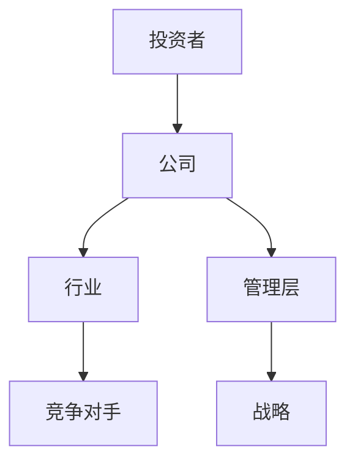

                 


# 《价值投资中的定性分析：超越数字的洞察》

---

## 关键词：  
价值投资、定性分析、公司治理、行业地位、管理层质量、投资决策、定性评估

---

## 摘要：  
本文深入探讨了价值投资中定性分析的重要性及其实际应用。在投资决策中，定量分析固然重要，但定性分析同样不可或缺。本文从定性分析的核心要素入手，结合实际案例，系统地阐述了如何通过定性分析评估公司治理、行业地位、管理层质量等因素，帮助投资者超越数字，实现更明智的投资决策。文章还提供了丰富的工具和方法，帮助读者将定性分析融入投资策略中。

---

# 第一部分：价值投资中的定性分析基础

## 第1章：价值投资与定性分析概述

### 1.1 价值投资的核心理念  
- 价值投资的起源与定义：起源于本杰明·格雷厄姆的价值投资理论，强调以低于内在价值的价格买入优质资产。  
- 价值投资的基本原则：安全边际、长期视角、逆向思维。  
- 定性分析在价值投资中的地位：定性分析是识别“优质资产”的关键工具，帮助投资者超越数字，洞察企业内在价值。  

### 1.2 定性分析的背景与重要性  
- 传统定量分析的局限性：仅关注财务指标（如市盈率、ROE）难以全面反映企业价值。  
- 定性分析的定义与特点：关注企业战略、管理、行业地位等非财务因素，具有主观性和模糊性。  
- 定性分析在投资决策中的作用：帮助投资者识别企业的长期竞争优势和潜在风险。  

### 1.3 定性分析的核心要素  
- 公司治理：包括股权结构、董事会构成、管理层稳定性等。  
- 行业地位：企业在行业中的竞争优势、市场占有率等。  
- 管理层质量：管理层的战略眼光、决策能力、道德水平等。  

---

## 第2章：定性分析的核心概念与联系

### 2.1 定性分析的核心要素  
- **公司治理**：公司治理结构决定了管理层的决策效率和企业稳定性。  
- **行业地位**：企业在行业中的地位直接影响其竞争优势和未来发展潜力。  
- **管理层质量**：管理层的战略能力和执行力是企业成功的关键因素。  

### 2.2 定性分析要素对比表格  
| 要素       | 定义                         | 影响因素                     | 评估方法             |
|------------|------------------------------|------------------------------|----------------------|
| 公司治理   | 公司的管理结构和决策机制     | 股权结构、董事会构成、管理层稳定性 | 治理评分模型          |
| 行业地位   | 企业在行业中的竞争优势       | 市场占有率、行业趋势、竞争格局   | 行业地位分析框架      |
| 管理层质量 | 管理层的战略眼光和决策能力   | 管理层背景、过往业绩、战略规划   | 管理层质量评估模型    |

### 2.3 定性分析的ER实体关系图  


### 2.4 本章小结  
本章通过对比表格和实体关系图，清晰地展示了定性分析的核心要素及其相互关系，为后续的分析奠定了基础。

---

## 第3章：定性分析的算法原理与数学模型

### 3.1 定性分析的算法原理  
- **定性评分模型**：通过给定性要素打分，综合评估企业的整体质量。  
- **层次分析法（AHP）**：用于权重分配和决策优先级排序。  
- **治理评分模型**：结合公司治理的多个维度，评估企业的治理风险。  

### 3.2 定性分析的数学模型  
- **层次分析法（AHP）公式**：用于计算各要素的权重。  
  $$ AHP 权重 = \frac{\sum (\text{判断矩阵得分})}{\sum \text{所有判断矩阵得分}} $$  
- **定性评分公式**：  
  $$ \text{综合评分} = \sum (\text{各要素权重} \times \text{要素得分}) $$  

### 3.3 定性分析工具的Python实现  
以下是一个简单的定性评分模型的Python代码示例：  
```python
def qualitative_score(company_info):
    # 定义权重
    weights = {'治理': 0.3, '行业地位': 0.4, '管理层': 0.3}
    # 计算得分
    score = sum(weights[feature] * company_info[feature] for feature in weights)
    return score

# 示例数据
company = {
    '治理': 85,
    '行业地位': 90,
    '管理层': 75
}

print(qualitative_score(company))  # 输出综合评分
```

---

## 第4章：系统分析与架构设计

### 4.1 定性分析的系统架构  
- **系统功能设计**：包括数据采集、定性评估、结果展示等功能。  
- **系统架构图**：  
  ```mermaid
  graph LR
      A(投资者) --> B(数据采集模块)
      B --> C(定性分析模块)
      C --> D(结果展示模块)
      C --> E(报告生成模块)
  ```

### 4.2 定性分析的系统交互流程  
- **投资者输入**：选择目标企业。  
- **数据采集**：获取企业治理、行业地位、管理层等信息。  
- **定性评估**：应用算法模型进行评分。  
- **结果展示**：生成可视化报告。  

---

## 第5章：项目实战

### 5.1 实战案例：苹果公司定性分析  
- **背景介绍**：苹果公司是全球领先的科技企业，具有强大的行业地位和优秀的管理层。  
- **案例分析**：  
  1. **公司治理**：苹果的股权结构稳定，董事会经验丰富。  
  2. **行业地位**：苹果在智能手机市场的占有率遥遥领先。  
  3. **管理层质量**：蒂姆·库克的领导力和战略规划能力备受认可。  

### 5.2 定性分析工具的实现  
- **代码实现**：  
  ```python
  def analyze_company(company_name):
      # 数据采集模块
      import requests
      response = requests.get(f'https://api.companydata/{company_name}')
      data = response.json()
      
      # 定性评估模块
      governance_score = data['governance_score']
      industry_position = data['industry_position']
      management_score = data['management_score']
      
      # 综合评分
      total_score = governance_score * 0.3 + industry_position * 0.4 + management_score * 0.3
      return total_score

  print(analyze_company('苹果'))  # 输出评分结果
  ```

### 5.3 投资决策建议  
- **综合评分结果**：苹果公司在定性分析中的综合评分为92分，显示出极高的投资价值。  
- **投资建议**：长期持有，关注技术创新和市场拓展。  

---

## 第6章：最佳实践与小结

### 6.1 最佳实践  
- **定期更新分析**：企业环境和行业趋势不断变化，需定期更新定性分析结果。  
- **结合定量分析**：定性分析应与定量分析相结合，实现全面评估。  
- **注重管理层沟通**：通过投资者关系管理获取更多定性信息。  

### 6.2 小结  
定性分析是价值投资中不可或缺的工具，帮助投资者超越数字，洞察企业的真实价值。通过系统化的分析方法和工具，投资者可以更明智地做出投资决策。

---

## 作者：  
AI天才研究院/AI Genius Institute & 禅与计算机程序设计艺术/Zen And The Art of Computer Programming

