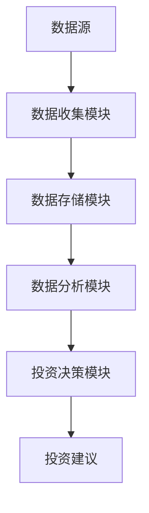
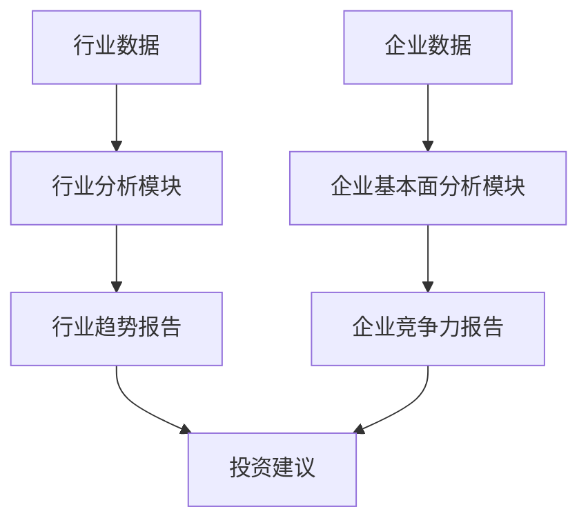
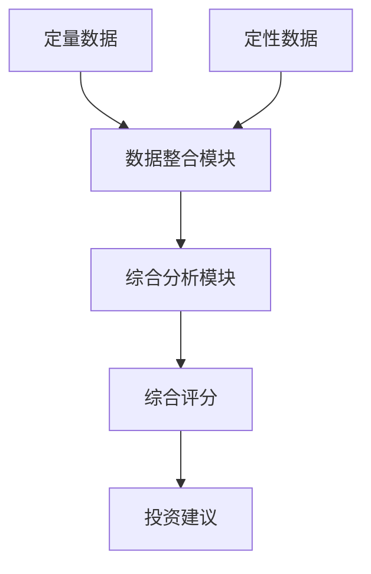

                 

# 价值投资中的定量vs定性分析：平衡的艺术

> 关键词：价值投资，定量分析，定性分析，投资决策，风险管理，资产配置

> 摘要：价值投资是通过深入分析企业的内在价值，寻找市场价格低于内在价值的股票进行投资。本文探讨了在价值投资中定量分析和定性分析的平衡艺术。定量分析依赖于数学模型和数据，而定性分析则关注企业基本面和行业趋势。两者的结合是实现价值投资成功的关键。本文通过详细分析定量与定性分析的核心概念、方法与工具，以及它们在实际投资中的应用，为投资者提供了一个系统的投资框架。

---

## 第1章: 价值投资概述

### 1.1 价值投资的定义与核心理念
- 价值投资是一种投资策略，旨在通过识别市场价格低于内在价值的资产进行投资。
- 核心理念：寻找市场低估的优质企业，长期持有，分享企业成长的成果。
- 关键特征：
  - 侧重于基本面分析。
  - 强调安全边际。
  - 长期持有优质资产。

### 1.2 价值投资中的定量与定性分析
- 定量分析：通过数学模型和数据量化企业的价值。
- 定性分析：通过非量化因素（如管理层素质、行业地位）评估企业的潜在价值。
- 平衡艺术：将定量与定性分析相结合，构建全面的投资决策框架。

---

## 第2章: 定量分析的核心概念与方法

### 2.1 定量分析的定义与特点
- 定量分析：基于数据和数学模型，对企业价值进行量化评估。
- 特点：
  - 客观性：依赖数据和公式，减少主观判断。
  - 可重复性：方法和模型可以重复应用。
  - 时效性：需要及时更新数据以适应市场变化。

### 2.2 常用的定量分析工具与指标
#### 2.2.1 常用估值指标
- 市盈率（P/E）：$$P/E = \frac{Price}{Earnings}$$
- 市净率（P/B）：$$P/B = \frac{Price}{Book\ Value}$$
- 股息率：$$Dividend\ Yield = \frac{Dividend}{Price}$$
- 内在价值模型：$$Intrinsic\ Value = \frac{Earnings}{WACC}$$

#### 2.2.2 估值模型
- 现金流折现模型（DCF）：
  1. 计算自由现金流（FCFF）：
     $$FCFF = EBIT(1-T) + Depreciation - Capital\ Expenditure$$
  2. 计算加权平均资本成本（WACC）：
     $$WACC = \left( \frac{D}{D+E} \right) \times Cost\ of\ Debt \times (1-T) + \left( \frac{E}{D+E} \right) \times Cost\ of\ Equity$$
  3. 折现现金流至现值，计算企业内在价值。

#### 2.2.3 数据分析工具
- Excel：用于基本的数据分析和图表绘制。
- Python：使用Pandas、NumPy等库进行高级数据分析。
- SQL：用于从数据库中提取和处理财务数据。

### 2.3 定量分析的系统架构设计

#### 2.3.1 系统功能模块
- 数据收集模块：
  - 从金融数据库（如Yahoo Finance、 Bloomberg）获取实时数据。
  - 数据清洗与预处理。
- 数据分析模块：
  - 计算估值指标。
  - 构建估值模型。
- 投资决策模块：
  - 根据分析结果生成投资建议。

#### 2.3.2 系统架构图

### 2.4 定量分析的实战应用

#### 2.4.1 股票筛选策略
- 基于市盈率和市净率的双低策略：选择P/E和P/B均低于行业平均水平的股票。
- 基于股息率的高息策略：选择股息率高于行业平均水平的股票。

#### 2.4.2 投资组合构建
- 根据定量分析结果，筛选出潜在投资标的。
- 结合风险承受能力，分配投资权重。
- 定期 rebalancing 投资组合，以保持目标配置。

---

## 第3章: 定性分析的核心概念与方法

### 3.1 定性分析的定义与特点
- 定性分析：通过非量化因素评估企业的潜在价值。
- 特点：
  - 主观性：依赖分析师的判断和经验。
  - 深度性：关注企业的基本面和行业趋势。
  - 战略性：帮助投资者识别长期增长机会。

### 3.2 定性分析的关键要素
#### 3.2.1 企业基本面分析
- 行业地位：企业在行业中的竞争力和市场份额。
- 管理层素质：管理团队的经验、能力和战略眼光。
- 核心竞争力：企业的竞争优势，如技术壁垒、品牌优势等。

#### 3.2.2 行业趋势分析
- 行业生命周期：行业处于增长期还是衰退期。
- 政策影响：政府政策对企业经营的影响。
- 技术进步：技术发展对企业未来业绩的推动作用。

### 3.3 定性分析的系统架构设计

#### 3.3.1 系统功能模块
- 行业分析模块：
  - 收集行业报告和政策信息。
  - 分析行业趋势和风险。
- 企业基本面分析模块：
  - 评估企业管理层和核心竞争力。
  - 分析企业的竞争优势和潜在风险。

#### 3.3.2 系统架构图

### 3.4 定性分析的实战应用

#### 3.4.1 企业竞争力评估
- 通过分析企业的市场份额、技术壁垒和管理团队，评估企业的竞争优势。
- 例如：评估某科技企业的研发投入占比和专利数量，判断其技术优势。

#### 3.4.2 行业趋势判断
- 分析行业生命周期，判断行业的增长潜力。
- 例如：判断人工智能行业是否处于增长期，是否值得投资。

---

## 第4章: 定量与定性分析的结合

### 4.1 平衡艺术的核心理念
- 定量分析提供数据支持，定性分析提供深度洞察。
- 两者结合可以弥补各自的不足，提高投资决策的准确性。

### 4.2 综合分析的系统架构设计

#### 4.2.1 系统功能模块
- 数据整合模块：
  - 将定量和定性数据进行整合。
  - 例如：将企业的财务数据与行业趋势数据结合。
- 综合分析模块：
  - 利用机器学习算法（如随机森林、神经网络）进行综合评估。
  - 生成综合评分和投资建议。

#### 4.2.2 系统架构图

### 4.3 实战应用

#### 4.3.1 综合评分模型
- 将定量和定性指标赋予不同权重，计算综合评分。
  - 例如：P/E（30%）、行业趋势（40%）、管理层素质（30%）。
- 根据综合评分，对企业进行评级和排序。

#### 4.3.2 投资组合优化
- 根据综合分析结果，筛选出具有较高内在价值和成长潜力的企业。
- 结合风险承受能力，优化投资组合配置。

---

## 第5章: 价值投资中的风险管理

### 5.1 风险管理的核心理念
- 风险管理是投资成功的关键，贯穿投资决策的全过程。
- 通过分散投资、设置止损和动态调整投资组合，降低投资风险。

### 5.2 定量与定性分析在风险管理中的应用
- 定量分析：通过波动率、VaR等指标评估投资组合的风险。
- 定性分析：通过分析市场环境和企业潜在风险，判断投资标的的潜在风险。

### 5.3 风险管理的实战应用
- 设置止损线：当股价下跌至某一阈值时，卖出股票。
- 定期 rebalancing：根据市场变化和企业基本面，调整投资组合配置。

---

## 第6章: 价值投资的未来展望

### 6.1 人工智能与大数据的应用
- 利用机器学习算法，提高定量分析的效率和准确性。
- 通过自然语言处理技术，提取定性分析中的非结构化数据。

### 6.2 可持续投资与ESG因素
- ESG（环境、社会、治理）因素日益成为投资者关注的焦点。
- 将ESG指标纳入综合评分模型，提高投资决策的可持续性。

### 6.3 全球化与多样化投资
- 随着全球化的深入，投资者需要关注全球市场的机会和风险。
- 通过多元化配置，降低投资风险，提高投资收益。

---

## 结语

价值投资中的定量与定性分析是相辅相成的，只有将两者结合起来，才能做出更全面的投资决策。未来，随着人工智能和大数据技术的发展，定量与定性分析的结合将更加紧密，为投资者提供更强大的工具和方法。

---

## 作者

作者：AI天才研究院/AI Genius Institute & 禅与计算机程序设计艺术/Zen And The Art of Computer Programming

