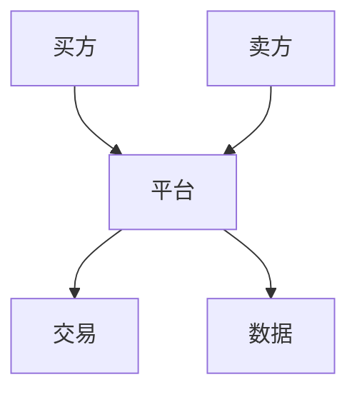

                 

# 价值投资中的平台经济分析

## 关键词：
- 价值投资
- 平台经济
- 商业模式
- 价值评估
- 风险管理

## 摘要：
本文探讨了在平台经济背景下，价值投资的应用与分析。通过系统介绍平台经济的商业模式和价值评估方法，结合价值投资的核心理论与工具，分析了如何在平台经济中识别投资机会、评估企业价值，并制定有效的风险管理策略。文章还通过实际案例分析，展示了平台经济与价值投资结合的可行性与实际效果。

---

# 第1章 平台经济与价值投资概述

## 1.1 平台经济的定义与特点
### 1.1.1 平台经济的定义
平台经济是一种通过数字技术构建的双边或多边市场结构，通过连接供需双方，降低交易成本，创造价值。平台经济的核心在于通过技术手段将分散的需求和供给高效匹配，形成网络效应和规模经济。

**平台经济的三要素**：
1. **用户群体**：平台需要同时吸引两个或多个群体，形成双边或多边市场。
2. **技术基础设施**：平台依赖技术手段（如算法、数据）实现供需匹配。
3. **网络效应**：用户数量的增加会增强平台的价值，形成正反馈循环。

### 1.1.2 平台经济的核心特点
- **双边性**：平台同时服务于买方和卖方，形成双边市场。
- **网络效应**：用户数量增加会增强平台的吸引力。
- **数据驱动**：平台依赖数据进行匹配和优化。
- **轻资产模式**：平台本身不持有库存或生产资料，主要通过技术和服务创造价值。

### 1.1.3 平台经济的双边市场特征
平台经济的双边市场特征可以通过以下 **Mermaid图** 展示：

### 1.1.4 平台经济的分类
平台经济可以分为以下几类：
1. **信息匹配平台**：如滴滴出行、Airbnb，通过平台匹配供需。
2. **交易服务平台**：如淘宝、京东，提供线上交易服务。
3. **内容分发平台**：如YouTube、微信，提供内容分发和社交服务。
4. **技术服务平台**：如GitHub、AWS，提供技术开发支持。

## 1.2 价值投资的定义与特点
### 1.2.1 价值投资的定义
价值投资是一种投资策略，强调以低于内在价值的价格买入优质资产，长期持有，等待其价值回归。价值投资的核心理念是寻找市场低估的股票，通过分析企业的基本面（如财务状况、行业地位）来判断其长期价值。

### 1.2.2 价值投资的核心理念
- **安全边际**：买入价格低于内在价值，确保有足够的安全空间。
- **长期视角**：关注企业的长期盈利能力，而非短期价格波动。
- **企业质量**：选择具有强大竞争优势、稳定财务状况的企业。

### 1.2.3 价值投资与成长投资的区别
| 方面 | 价值投资 | 成长投资 |
|------|----------|----------|
| 目标 | 寻找低估资产 | 寻找高增长企业 |
| 时间框架 | 长期持有 | 短期收益 |
| 风险偏好 | 低风险 | 高风险 |

### 1.2.4 价值投资的适用场景
价值投资适用于市场波动较大、个股估值偏离内在价值的情况。在平台经济中，价值投资可以用于识别那些被市场低估的优质平台企业。

## 1.3 平台经济与价值投资的结合
### 1.3.1 平台经济中的价值投资机会
平台经济具有网络效应和规模经济，优质平台企业能够通过数据和技术不断优化服务，形成强大的竞争优势。这些企业往往具有较高的护城河，适合价值投资。

### 1.3.2 平台经济与价值投资的核心联系
- 平台经济的网络效应与价值投资的安全边际相辅相成。
- 平台企业的长期盈利能力为价值投资提供了基础。

### 1.3.3 平台经济中价值投资的挑战
- **高估值风险**：平台企业前期投入大，估值可能过高。
- **竞争风险**：平台经济容易吸引新进入者，竞争激烈。
- **政策风险**：平台企业可能面临政策监管风险。

---

# 第2章 平台经济的商业模式与价值评估

## 2.1 平台经济的主要商业模式
### 2.1.1 双边市场模式
双边市场模式是指平台同时服务于买方和卖方，通过匹配供需双方创造价值。例如，滴滴出行连接司机和乘客，Airbnb连接房东和租客。

### 2.1.2 多边市场模式
多边市场模式是指平台服务于多个群体，例如阿里巴巴的服务对象包括商家、消费者和第三方服务提供商。

### 2.1.3 平台抽成模式
平台抽成模式是指平台从每笔交易中收取一定比例的佣金。例如，滴滴出行从每笔订单中收取一定比例的服务费。

## 2.2 平台经济的价值评估方法
### 2.2.1 用户价值评估
用户价值评估是平台经济价值评估的重要组成部分。可以通过以下步骤进行：
1. **用户数量评估**：评估平台的活跃用户数量和增长潜力。
2. **用户粘性评估**：分析用户的留存率和使用频率。
3. **用户生命周期价值（CLV）**：通过分析用户的生命周期，估算每个用户的长期价值。

### 2.2.2 收入与利润评估
收入与利润评估是价值评估的重要部分。可以通过以下步骤进行：
1. **收入来源分析**：分析平台的主要收入来源，如交易佣金、广告收入等。
2. **成本结构分析**：评估平台的运营成本，包括技术开发、市场推广等。
3. **盈利能力分析**：通过利润表分析平台的盈利能力，重点关注毛利率和净利率。

### 2.2.3 市场地位评估
市场地位评估是平台经济价值评估的关键部分。可以通过以下步骤进行：
1. **市场份额分析**：分析平台在市场中的份额。
2. **竞争分析**：评估平台的竞争优势，如网络效应、品牌影响力等。
3. **未来增长潜力**：分析平台的未来增长潜力，包括市场规模和技术进步。

## 2.3 平台经济中的成本与收益分析
### 2.3.1 平台经济的成本结构
平台经济的成本结构主要包括：
- **技术开发成本**：平台的技术开发和维护成本。
- **市场推广成本**：吸引用户和合作伙伴的推广成本。
- **运营成本**：平台的日常运营成本，包括服务器维护、客服支持等。

### 2.3.2 平台经济的收益来源
平台经济的收益来源主要包括：
- **交易佣金**：从每笔交易中收取一定比例的佣金。
- **广告收入**：通过广告位销售获取收入。
- **会员服务**：通过会员订阅获取收入。
- **数据销售**：通过数据分析和挖掘获取收入。

### 2.3.3 平台经济的规模效应
平台经济的规模效应是指随着用户数量的增加，平台的边际成本逐渐下降，而收益却在增加。这种规模效应是平台经济的核心竞争优势之一。

---

# 第3章 价值投资的核心理论与工具

## 3.1 价值投资的基本原理
### 3.1.1 股票的内在价值
股票的内在价值是指企业未来现金流的现值。可以通过以下公式计算：

$$
\text{内在价值} = \sum_{t=1}^{\infty} \frac{CF_t}{(1 + r)^t}
$$

其中，$CF_t$ 是第 $t$ 年的现金流，$r$ 是折现率。

### 3.1.2 市场价值与内在价值的关系
市场价值是指股票在市场上的交易价格，内在价值是股票的理论价值。当市场价值低于内在价值时，股票具有投资价值。

### 3.1.3 股东价值最大化
股东价值最大化是价值投资的核心目标，通过选择具有高内在价值且被低估的股票，实现股东价值的最大化。

## 3.2 价值投资的关键工具
### 3.2.1 基本面分析
基本面分析是通过分析企业的财务状况、行业地位、管理团队等因素，评估企业的内在价值。

### 3.2.2 财务指标分析
财务指标分析是基本面分析的重要部分。常用的财务指标包括：
- **市盈率（P/E）**：市盈率 = 每股市价 / 每股收益。
- **市净率（P/B）**：市净率 = 每股市价 / 每股净资产。
- **股息率**：股息率 = 每股股息 / 每股市价。

### 3.2.3 行业分析
行业分析是通过分析行业的发展趋势、竞争格局、政策环境等因素，评估企业的外部环境。

## 3.3 价值投资中的风险管理
### 3.3.1 风险的定义与分类
风险是指投资结果的不确定性。风险可以分为系统性风险和非系统性风险。

- **系统性风险**：影响整个市场的风险，如经济周期、政策变化等。
- **非系统性风险**：影响特定资产的风险，如企业经营风险。

### 3.3.2 价值投资中的风险控制
- **分散投资**：通过投资不同的股票降低非系统性风险。
- **长期持有**：通过长期持有降低短期市场波动的影响。
- **价值陷阱识别**：识别那些看似低估但实际有问题的企业。

### 3.3.3 投资组合的分散化
投资组合的分散化是降低风险的重要策略。通过将资金分配到不同的资产类别、行业和地域，可以有效降低投资风险。

---

# 第4章 平台经济中的价值投资策略

## 4.1 平台经济中的竞争优势分析
### 4.1.1 平台的网络效应
网络效应是指随着用户数量的增加，平台的价值也增加。例如，微信的用户越多，其社交价值越高。

### 4.1.2 平台的成本优势
平台的成本优势是指平台在技术和运营上的成本优势。例如，亚马逊通过大数据和人工智能优化供应链管理。

### 4.1.3 平台的护城河
护城河是指平台的竞争优势，防止竞争对手进入市场的障碍。例如，淘宝的网络效应和品牌忠诚度是其护城河。

## 4.2 平台经济中的风险管理
### 4.2.1 平台经济的风险因素
- **技术风险**：平台依赖技术，技术落后可能导致竞争力下降。
- **政策风险**：政策变化可能影响平台的运营。
- **竞争风险**：新进入者可能导致市场竞争加剧。

### 4.2.2 平台经济中的风险管理策略
- **分散投资**：通过投资不同类型的平台企业降低风险。
- **长期持有**：通过长期持有分享平台经济的长期增长。
- **动态调整**：根据市场变化及时调整投资策略。

---

# 第5章 案例分析与实证研究

## 5.1 案例分析：某平台企业的价值评估
### 5.1.1 平台企业的基本情况
某平台企业是一家领先的在线教育平台，用户数量快速增长，市场占有率高。

### 5.1.2 财务指标分析
- **市盈率（P/E）**：假设该平台企业的股价为50元，每股收益为5元，市盈率为10倍。
- **市净率（P/B）**：假设该平台企业的股价为50元，每股净资产为20元，市净率为2.5倍。

### 5.1.3 价值评估
通过基本面分析，该平台企业的内在价值为60元/股，而当前股价为50元/股，具有较高的投资价值。

## 5.2 实证研究：平台经济中的价值投资回报
通过实证研究发现，长期投资于具有强大网络效应和竞争优势的平台企业，可以实现较高的投资回报。

---

# 第6章 风险管理与投资策略优化

## 6.1 平台经济中的风险管理
### 6.1.1 风险识别
识别平台经济中的风险因素，如技术风险、政策风险、竞争风险等。

### 6.1.2 风险评估
评估各个风险因素对平台企业的影响程度，制定相应的风险管理策略。

## 6.2 投资策略优化
### 6.2.1 分散化投资
通过投资不同类型的平台企业，降低投资风险。

### 6.2.2 长期持有
通过长期持有分享平台经济的长期增长。

### 6.2.3 动态调整
根据市场变化及时调整投资策略，优化投资组合。

---

# 第7章 平台经济与价值投资的未来展望

## 7.1 平台经济的未来发展趋势
- **技术驱动**：人工智能、大数据等技术将进一步推动平台经济发展。
- **全球化**：平台经济将加速全球化进程，拓展国际市场。
- **生态化**：平台经济将向生态化方向发展，形成多方共赢的生态系统。

## 7.2 价值投资的未来发展趋势
- **智能化**：价值投资将借助人工智能技术，提高投资效率。
- **多元化**：价值投资将更加多元化，涵盖更多类型的资产。
- **全球化**：价值投资将更加全球化，寻找全球范围内的投资机会。

---

# 作者：AI天才研究院/AI Genius Institute & 禅与计算机程序设计艺术 /Zen And The Art of Computer Programming

---

**本文总结**：通过系统分析平台经济的商业模式和价值评估方法，结合价值投资的核心理论与工具，本文为投资者提供了在平台经济中进行价值投资的策略和方法。通过案例分析和实证研究，本文验证了平台经济中的价值投资策略的有效性，并展望了平台经济与价值投资的未来发展趋势。

