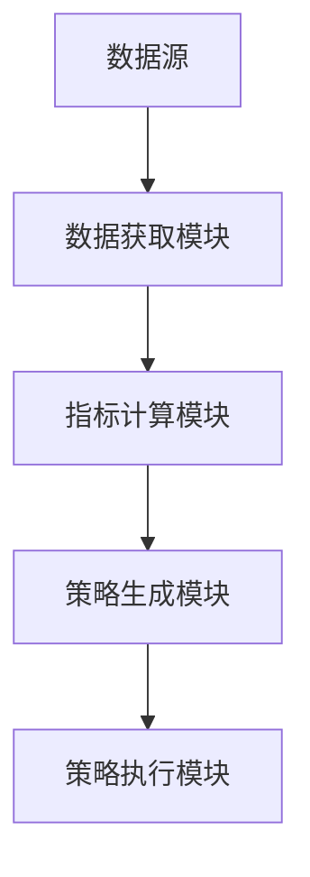
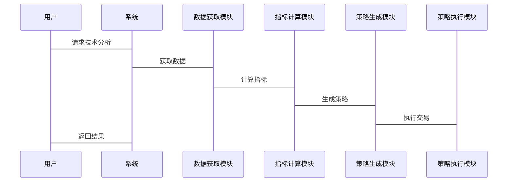

                 


# 《价值投资中的技术分析：是否有用？》

---

## 关键词
价值投资, 技术分析, 股票投资, 股票分析, 股市投资

---

## 摘要
价值投资与技术分析是两种不同的投资方法，但它们在股票市场中都有广泛的应用。本文将从背景、方法、有效性、算法原理、系统架构、案例分析等多个角度，详细探讨技术分析在价值投资中的作用和意义，帮助读者理解技术分析是否在价值投资中真正有用。

---

## 第一部分：价值投资与技术分析的背景与基础

### 第1章：价值投资与技术分析的概述

#### 1.1 价值投资的基本概念
- **1.1.1 价值投资的定义**
  价值投资是一种基于对公司内在价值的评估，寻找市场价格低于内在价值的股票进行投资的方法。其核心理念是寻找被市场低估的企业，长期持有，等待其价值回归。
  
- **1.1.2 价值投资的核心理念**
  - **长期视角**：关注企业的长期价值，而非短期市场波动。
  - **安全边际**：买入价格应低于企业的真实价值，以降低风险。
  - **价值发现**：通过深入分析企业的财务状况、行业地位和竞争优势，发现其潜在价值。

- **1.1.3 价值投资的适用范围**
  价值投资适用于那些基本面良好、具有持续竞争优势的企业，特别适合长期投资者。

#### 1.2 技术分析的基本概念
- **1.2.1 技术分析的定义**
  技术分析是通过分析历史价格和成交量等市场数据，预测未来价格走势的一种方法。其核心假设是市场行为包含所有信息，价格走势具有可预测性。

- **1.2.2 技术分析的主要工具**
  - **K线图**：展示一段时间内的价格波动。
  - **移动平均线（MA）**：平滑价格走势，识别趋势。
  - **相对强弱指数（RSI）**：衡量资产的超买或超卖状态。
  - **MACD**：通过指数平滑移动平均线判断趋势和动能。

- **1.2.3 技术分析的理论基础**
  - **道氏理论**：市场价格走势反映所有信息，价格走势分为趋势和修正趋势。
  - **趋势理论**：价格走势有趋势，交易者应顺势而为。
  - **支撑与阻力**：支撑位是价格下跌时的支撑点，阻力位是价格上涨时的阻力点。

#### 1.3 价值投资与技术分析的联系与区别
- **联系**
  - 价值投资关注企业内在价值，技术分析关注市场价格波动，两者可以互补。
  - 技术分析可以帮助识别买入和卖出的时机，而价值投资帮助确定投资标的。
  
- **区别**
  - **目标**：价值投资追求长期收益，技术分析关注短期价格波动。
  - **方法**：价值投资基于基本面分析，技术分析基于价格和成交量数据。
  - **适用场景**：价值投资适用于寻找低估企业，技术分析适用于交易时机的选择。

---

## 第2章：价值投资中的技术分析方法

### 2.1 技术分析的核心方法

#### 2.1.1 K线图的解读
K线图通过展示开盘价、收盘价、最高价和最低价，帮助投资者分析价格走势和市场情绪。例如，大阳线表示市场看涨，大阴线表示市场看跌。

#### 2.1.2 移动平均线（MA）的应用
- **MA的定义**：MA是一定时间内的平均价格，用于平滑价格波动。
- **MA的应用**：
  - 短期MA（如5日、10日）用于识别短期趋势。
  - 长期MA（如50日、200日）用于识别长期趋势。
  - MA交叉（如短期MA上穿长期MA）作为买入信号。

#### 2.1.3 相对强弱指数（RSI）的使用
- **RSI的定义**：RSI是衡量资产超买或超卖状态的指标，范围在0到100之间。
- **RSI的应用**：
  - 当RSI高于70时，资产可能超买，提示卖出。
  - 当RSI低于30时，资产可能超卖，提示买入。

#### 2.1.4 麦迪劳指标（MACD）的分析
- **MACD的定义**：MACD由两条线组成，分别是短期和长期移动平均线的差值，以及一条信号线。
- **MACD的应用**：
  - 当短期线（通常是12日）上穿长期线（通常是26日）时，视为买入信号。
  - 当短期线下穿信号线时，视为卖出信号。

### 2.2 技术分析的高级技巧

#### 2.2.1 支撑位与阻力位的识别
- **支撑位**：价格下跌时遇到支撑，形成买入机会。
- **阻力位**：价格上涨时遇到阻力，形成卖出机会。

#### 2.2.2 趋势线与通道线的绘制
- **趋势线**：连接多个低点或高点，用于识别价格趋势。
- **通道线**：由趋势线和其平行线组成，用于识别价格波动范围。

#### 2.2.3 量价关系的分析
- **量价关系**：成交量是价格走势的确认指标。例如，价格上升且成交量放大，表示趋势强劲。

#### 2.2.4 形态分析的应用
- **反转形态**：如头肩顶、双顶等，提示价格趋势反转。
- **持续形态**：如三角形、矩形等，提示价格将继续当前趋势。

### 2.3 技术分析在价值投资中的应用

#### 2.3.1 技术分析在选股中的作用
- 通过技术指标筛选出具有上涨潜力的股票，结合基本面分析确认其内在价值。

#### 2.3.2 技术分析在交易时机的选择
- 利用技术指标确定买入和卖出的最佳时机，降低投资风险。

#### 2.3.3 技术分析在风险控制中的应用
- 设置止损位和止盈位，控制投资风险，锁定投资收益。

---

## 第3章：技术分析的有效性分析

### 3.1 技术分析的有效性理论

#### 3.1.1 技术分析有效性的定义
技术分析的有效性指技术指标和方法能否准确预测价格走势并为投资者带来超额收益。

#### 3.1.2 技术分析有效性的争议
- **有效派**：认为技术分析可以捕捉市场趋势，帮助投资者获利。
- **无效派**：认为技术分析无法战胜市场，价格走势随机。

#### 3.1.3 技术分析有效性的实证研究
- **实证结果**：部分技术指标在某些市场环境下表现出一定的预测能力，但整体效果有限。
- **原因分析**：
  - 市场参与者的理性行为可能导致技术分析失效。
  - 技术分析依赖历史数据，而历史不一定重复。

### 3.2 影响技术分析有效性的因素

#### 3.2.1 市场结构
- **高效市场**：价格反映所有信息，技术分析无效。
- **低效市场**：价格反映部分信息，技术分析有一定效果。

#### 3.2.2 投资者的认知偏差
- **过度自信**：投资者可能过度依赖技术分析，忽略基本面因素。
- **从众心理**：投资者可能因多数人使用技术分析而跟风操作。

#### 3.2.3 市场环境
- **牛市**：技术分析可能放大价格波动，增加获利机会。
- **熊市**：技术分析可能加剧价格下跌，增加亏损风险。

### 3.3 技术分析的局限性

#### 3.3.1 技术分析无法预测黑天鹅事件
- **黑天鹅事件**：如金融危机、突发政策变化等，无法通过技术分析预测。

#### 3.3.2 技术分析依赖假设
- **假设一**：市场行为反映所有信息。
- **假设二**：价格走势具有可预测性。
- **假设三**：历史会重复。

#### 3.3.3 技术分析的主观性
- 同一技术指标在不同投资者眼中可能解读不同，导致操作策略差异。

---

## 第4章：技术分析的算法与数学模型

### 4.1 移动平均线（MA）的算法

#### 4.1.1 MA的计算公式
$$ MA_n = \frac{1}{n} \sum_{i=1}^{n} P_i $$
其中，\( P_i \) 是第 \( i \) 天的价格，\( n \) 是天数。

#### 4.1.2 MA的实现代码
```python
import pandas as pd

def compute_ma(data, window):
    return data['close'].rolling(window).mean()
```

### 4.2 相对强弱指数（RSI）的算法

#### 4.2.1 RSI的计算公式
$$ RSI = \frac{100}{1 + \frac{A}{B}} $$
其中，\( A \) 是上涨幅度的平均值，\( B \) 是下跌幅度的平均值。

#### 4.2.2 RSI的实现代码
```python
def compute_rsi(data, window):
    up = data['close'].diff().fillna(0)
    down = -up
    avg_up = up.rolling(window).mean()
    avg_down = down.rolling(window).mean()
    return 100 * (avg_up / (avg_up + avg_down))
```

---

## 第5章：价值投资的技术分析系统架构

### 5.1 系统功能设计
- **数据获取模块**：获取股票的历史价格和成交量数据。
- **指标计算模块**：计算移动平均线、RSI等技术指标。
- **策略生成模块**：根据技术指标生成买入和卖出信号。
- **策略执行模块**：根据策略信号执行交易操作。

### 5.2 系统架构设计


### 5.3 系统接口设计
- **输入接口**：接收股票代码和时间范围。
- **输出接口**：输出技术指标和交易信号。

### 5.4 系统交互流程


---

## 第6章：价值投资中的技术分析案例分析

### 6.1 案例背景
以某股票为例，分析其价格走势和相关技术指标。

### 6.2 案例分析
```python
import pandas as pd
import matplotlib.pyplot as plt

# 假设data为包含'close'价格的数据
data = pd.read_csv('stock_data.csv')
data['ma20'] = data['close'].rolling(20).mean()
data['rsi14'] = compute_rsi(data, 14)

plt.figure(figsize=(12, 6))
plt.plot(data['close'], label='Close Price')
plt.plot(data['ma20'], label='20-Day MA')
plt.plot(data['rsi14'], label='RSI(14)')
plt.legend()
plt.show()
```

### 6.3 案例结论
- **技术指标的信号**：例如，当RSI低于30时，买入信号出现。
- **实际操作建议**：结合技术分析和基本面分析，做出投资决策。

---

## 第7章：价值投资中的技术分析最佳实践

### 7.1 最佳实践 tips
- **结合基本面分析**：技术分析辅助，基本面分析主导。
- **设置止损和止盈**：控制风险，锁定收益。
- **选择合适的指标**：根据市场环境和投资目标选择指标。

### 7.2 小结
技术分析在价值投资中可以作为辅助工具，帮助投资者更好地把握市场趋势和交易时机。然而，其有效性依赖于市场环境和投资者的正确使用。

### 7.3 注意事项
- 技术分析不能孤立使用，需结合市场环境和企业基本面。
- 技术分析的信号应与实际操作相结合，避免机械交易。

### 7.4 拓展阅读
- 《投资学》（书籍推荐）
- 技术分析的经典著作（如《股票作手回忆录》）

---

## 结论

技术分析在价值投资中的作用是有限的，但它可以作为辅助工具，帮助投资者更好地把握市场趋势和交易时机。然而，技术分析的有效性依赖于市场环境、投资者的使用方式以及与基本面分析的结合。投资者在使用技术分析时，应保持理性，结合实际情况做出决策。

---

## 作者

作者：AI天才研究院/AI Genius Institute & 禅与计算机程序设计艺术/Zen And The Art of Computer Programming

---

希望这篇文章能够帮助读者更好地理解技术分析在价值投资中的作用，并为实际投资决策提供有价值的参考。

