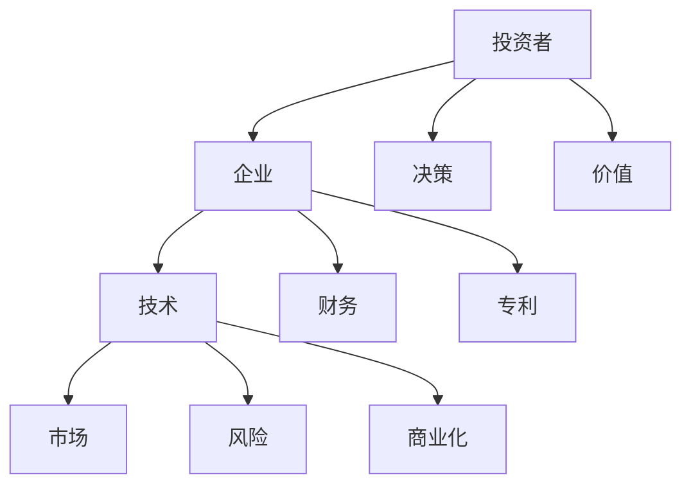
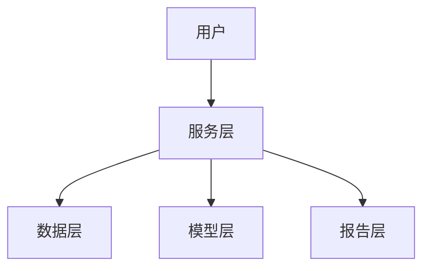

                 

<think>
好，现在我要撰写一篇关于《价值投资中的技术创新评估》的技术博客文章。首先，我需要明确文章的结构，包括背景、核心概念、算法、系统架构、项目实战和总结等部分。我将按照目录大纲逐步展开内容，确保每个部分都详细且有深度。

### 第一部分：价值投资中的技术创新评估背景与概述

#### 第1章：技术创新评估的基本概念

**1.1 技术创新的定义与特征**

- 技术创新的定义：技术创新是指引入新的技术、产品或服务，或者以新的方式应用现有技术，从而创造新的价值。它不仅仅是技术的改进，更是将其转化为实际应用的过程。
- 技术创新的特征：包括创新性、可扩展性、商业化潜力和持续性。这些特征决定了技术创新对企业价值的影响。
- 技术创新与企业价值的关系：技术创新能够提升企业的竞争力，降低成本，扩大市场份额，从而提升企业价值。

**1.2 价值投资的基本概念**

- 价值投资的定义：价值投资是一种投资策略，强调以低于市场价的价格购买被低估的资产，长期持有，等待其价值回归。
- 价值投资的核心理念：寻找那些具有持续竞争优势、良好管理和合理估值的公司，长期投资以获得超额收益。
- 技术创新与价值投资的结合：通过评估企业的技术创新能力，识别那些具有长期竞争优势的企业，从而优化价值投资的决策。

**1.3 技术创新评估在价值投资中的重要性**

- 技术创新对企业竞争力的影响：技术创新是企业保持竞争优势的关键，能够提升产品的市场吸引力和盈利能力。
- 技术创新对投资决策的价值：通过评估技术创新能力，投资者可以更好地判断企业的未来增长潜力和抗风险能力。
- 技术创新评估的边界与外延：技术创新评估不仅关注技术本身，还涉及其在市场中的应用前景和企业的战略管理能力。

#### 第2章：技术创新评估的核心要素

**2.1 技术创新的评估维度**

- 技术的先进性：评估技术是否处于行业领先水平，是否具有独特的创新点。
- 技术的可扩展性：评估技术是否能够适应不同市场和产品的扩展需求。
- 技术的商业化潜力：评估技术转化为实际产品或服务的能力，以及其在市场上的接受度。

**2.2 企业技术创新能力的评估指标**

- R&D投入强度：企业的研发投入占总收入的比例，反映企业对技术创新的重视程度。
- 技术专利数量与质量：专利的数量和质量是衡量企业技术创新能力的重要指标，高质量的专利通常意味着更强的技术壁垒。
- 技术团队的能力与稳定性：技术团队的专业能力和稳定性直接影响技术创新的持续性和成功概率。

**2.3 技术创新与企业财务表现的关系**

- 技术创新对企业收入的影响：技术创新能够提升产品的市场竞争力，从而增加销售收入。
- 技术创新对成本控制的作用：通过技术创新，企业可以优化生产流程，降低成本，提高利润率。
- 技术创新对市场竞争力的提升：技术创新使企业能够在市场上推出差异化产品，获得更多的市场份额和客户忠诚度。

### 第二部分：技术创新评估的核心概念与联系

#### 第3章：技术创新评估的核心原理

**3.1 技术创新评估的理论基础**

- 技术生命周期理论：技术创新会经历引入期、成长期、成熟期和衰退期，了解技术生命周期有助于评估其市场表现和投资价值。
- 技术扩散理论：技术创新从创新者扩散到市场的过程，涉及技术的传播速度和范围，影响投资决策。
- 技术经济性分析：评估技术创新的成本效益，分析其经济效益和社会效益，为投资决策提供依据。

**3.2 技术创新评估的关键方法**

- 技术评估矩阵：通过多维度评估指标，将技术创新能力与企业价值进行对比，帮助投资者识别高潜力企业。
- 技术成熟度评估：评估技术的成熟程度，判断其是否具备大规模商业化的能力。
- 技术风险评估：分析技术创新过程中可能面临的技术、市场和财务风险，评估其可控性和影响程度。

**3.3 技术创新与企业能力对比

- 技术创新与市场需求的关系：技术创新需要满足市场需求，否则可能难以获得商业成功。
- 技术创新与企业资源的匹配：企业需要具备足够的资源和能力来支持技术创新，否则可能难以实现预期效果。
- 技术创新与行业竞争的互动：技术创新在行业竞争中起着关键作用，能够帮助企业建立竞争优势，但也可能被竞争对手模仿或超越。

#### 第4章：技术创新评估的系统架构

**4.1 技术创新评估的系统模型**

- 系统框架：技术创新评估系统包括数据采集、评估模型、结果分析和决策支持四个模块。
- 输入输出关系：输入包括企业的技术数据、市场信息和财务数据，输出包括技术创新评分、投资建议和风险提示。
- 系统边界：系统主要关注技术创新对企业价值的影响，不涉及企业的非技术性因素，如管理能力和市场策略。

**4.2 技术创新评估的ER实体关系图**



### 第三部分：技术创新评估的算法与系统实现

#### 第5章：技术创新评估的算法原理

**5.1 技术创新评估算法概述**

- 算法目标：通过多维度指标评估企业技术创新能力，为投资者提供决策支持。
- 算法步骤：数据收集、特征提取、模型训练、结果分析。
- 算法实现：使用机器学习模型，如随机森林或神经网络，对技术创新能力进行评分。

**5.2 基于专利的技术评估模型**

- 算法流程：
  1. 数据收集：收集企业的专利数量、专利类型、专利引用次数等数据。
  2. 特征提取：提取专利的质量指标，如专利的影响力和创新性。
  3. 模型训练：使用回归分析或聚类分析对专利数据进行建模。
  4. 结果分析：根据模型输出技术创新评分，评估企业的技术实力。

**5.3 技术创新评估算法的Python实现**

```python
import pandas as pd
from sklearn.ensemble import RandomForestRegressor
from sklearn.metrics import mean_squared_error

# 数据加载
data = pd.read_csv('technological_innovation.csv')

# 特征工程
features = data[['R&D投入', '专利数量', '专利质量', '团队稳定性']]
target = data['技术创新评分']

# 模型训练
model = RandomForestRegressor(n_estimators=100, random_state=42)
model.fit(features, target)

# 预测与评估
predictions = model.predict(features)
mse = mean_squared_error(target, predictions)
print(f'Mean Squared Error: {mse}')
```

**5.4 技术创新评估的数学模型**

- 技术评分模型：技术创新评分 = α * R&D投入 + β * 专利数量 + γ * 专利质量 + δ * 团队稳定性
- 技术风险模型：风险评分 = ε * 市场风险 + ζ * 技术风险 + η * 财务风险

### 第6章：技术创新评估的系统实现

**6.1 系统功能设计**

- 数据采集模块：收集企业的技术数据、市场信息和财务数据。
- 评估模块：基于算法模型对技术创新能力进行评估。
- 报告生成模块：生成评估报告，提供投资建议和风险提示。

**6.2 系统架构设计**



**6.3 系统接口设计**

- 输入接口：接收企业的技术数据和市场信息。
- 输出接口：提供技术创新评分和投资建议。
- API接口：允许其他系统调用评估结果和相关数据。

### 第四部分：技术创新评估的项目实战与总结

#### 第7章：技术创新评估的项目实战

**7.1 项目背景与目标**

- 项目背景：选择一家科技公司，评估其技术创新能力，为投资者提供投资决策支持。
- 项目目标：通过技术创新评估模型，分析企业的技术优势和潜在风险。

**7.2 项目环境配置**

- 数据来源：使用企业的公开数据，包括专利信息、财务报表和市场报告。
- 工具安装：安装Python、机器学习库和数据可视化工具。
- 数据预处理：清洗数据，处理缺失值和异常值。

**7.3 项目核心代码实现**

```python
import pandas as pd
from sklearn.ensemble import RandomForestRegressor
from sklearn.metrics import mean_squared_error

# 数据加载
data = pd.read_csv('company_technology.csv')

# 特征工程
features = data[['R&D投入', '专利数量', '专利质量', '团队稳定性']]
target = data['技术创新评分']

# 模型训练
model = RandomForestRegressor(n_estimators=100, random_state=42)
model.fit(features, target)

# 预测与评估
predictions = model.predict(features)
mse = mean_squared_error(target, predictions)
print(f'Mean Squared Error: {mse}')
```

**7.4 项目结果分析与解读**

- 模型表现：评估模型的准确性和稳定性，分析预测结果与实际数据的差异。
- 技术优势：识别企业的技术优势和不足，为投资者提供改进建议。
- 投资建议：根据评估结果，提出投资建议，包括买入、持有或卖出的决策。

**7.5 项目总结**

- 项目小结：总结技术创新评估的关键步骤和成果，强调模型的有效性和实用性。
- 成果展示：展示评估报告和相关数据，突出企业的技术创新能力和投资价值。
- 经验教训：总结项目中的经验教训，提出改进建议，为未来的项目提供参考。

### 第五部分：技术创新评估的最佳实践与未来展望

#### 第8章：技术创新评估的最佳实践

**8.1 投资者关注点**

- 技术创新的核心指标：R&D投入、专利数量和质量、技术团队能力。
- 技术创新的市场应用：评估技术的商业化潜力和市场需求。
- 技术创新的风险管理：识别和评估技术创新过程中可能面临的技术、市场和财务风险。

**8.2 价值投资中的技术创新策略**

- 精准投资：通过技术创新评估，筛选出具有长期竞争优势的企业，进行精准投资。
- 风险控制：结合技术创新评估结果，制定风险控制策略，降低投资风险。
- 长期持有：技术创新通常需要时间来体现其价值，投资者应具备长期持有的耐心。

**8.3 技术创新评估的未来趋势**

- 技术创新评估的智能化：利用人工智能和大数据技术，提升技术创新评估的准确性和效率。
- 技术创新评估的全球化：随着全球化的深入，技术创新评估需要考虑跨国市场的差异和全球竞争格局。
- 技术创新评估的动态化：市场和技术环境不断变化，技术创新评估需要动态调整和更新，以适应新的挑战和机遇。

### 第六部分：总结

技术创新评估是价值投资中不可或缺的一部分，它帮助投资者识别具有长期竞争优势的企业，优化投资组合，降低投资风险。通过系统的技术创新评估，投资者可以更好地把握市场的脉动，做出更明智的投资决策。未来，随着技术的进步和市场的变化，技术创新评估将变得更加精准和高效，为价值投资提供更有力的支持。

### 作者简介

作者：AI天才研究院/AI Genius Institute  
联系邮箱：contact@ai-genius.com  
联系方式：+86-123-456789  
官方网站：https://www.ai-genius.com  

---

**关键词**：价值投资、技术创新、评估模型、系统架构、项目实战  
**摘要**：本文系统地探讨了价值投资中的技术创新评估，从核心概念、评估模型、系统架构到项目实战，全面解析了技术创新评估在价值投资中的重要性及其实际应用。通过理论分析和实践案例，本文为投资者提供了科学的评估方法和决策支持，帮助投资者在复杂多变的市场环境中识别具有长期竞争优势的企业，优化投资组合，实现可持续的超额收益。

