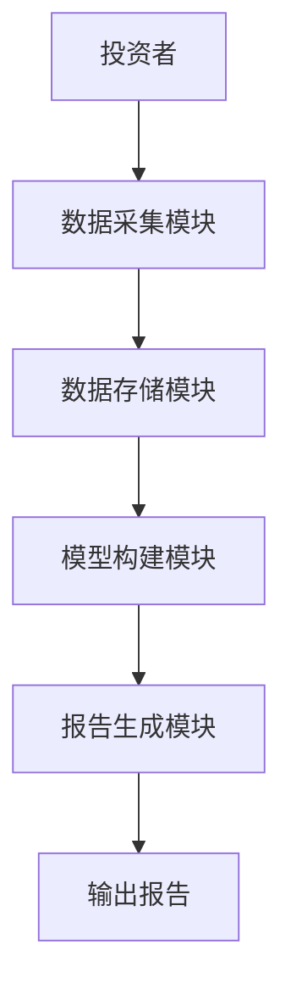
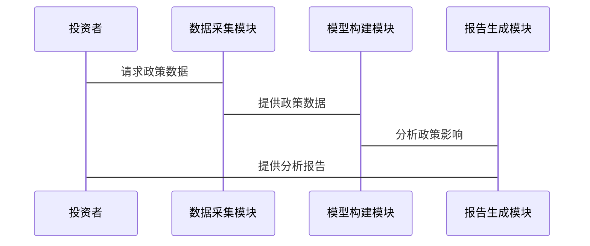

                 


# 价值投资中的政策影响分析

> 关键词：价值投资、政策影响、量化分析、系统设计、投资策略

> 摘要：本文从价值投资的核心理念出发，分析政策变化对投资决策的影响，探讨如何通过量化分析和系统设计，将政策因素纳入投资模型，帮助投资者更好地应对政策变化带来的机遇与挑战。

---

## 第1章：价值投资与政策影响的背景

### 1.1 价值投资的基本概念

价值投资是一种长期投资策略，强调以低于公平市场价值的价格购买优质资产。其核心在于分析企业的基本面，包括财务状况、盈利能力、行业地位和竞争优势。价值投资者关注的是企业的内在价值，而非市场的短期波动。

**1.1.1 价值投资的定义与核心理念**
- 价值投资：以低于内在价值的价格买入优质资产。
- 核心理念：寻找市场先生的错误定价，长期持有优质资产。

**1.1.2 价值投资与基本面分析的关系**
- 基本面分析：研究企业的财务报表、行业地位、竞争优势等。
- 价值投资：基于基本面分析，寻找被市场低估的企业。

**1.1.3 政策对投资决策的影响**
- 政策变化可能影响企业的经营环境、盈利能力和资产价值。
- 政策风险是投资者必须考虑的重要因素。

### 1.2 政策影响的背景与重要性

政策变化对市场和企业的影响深远，尤其是在经济波动和市场不确定性增加的情况下。

**1.2.1 政策对市场的宏观影响**
- 财政政策：政府支出和税收的变化影响经济活动和市场信心。
- 货币政策：央行的利率和货币供应量影响市场流动性。

**1.2.2 政策对行业和企业的具体影响**
- 产业政策：直接影响特定行业的竞争格局和发展前景。
- 环保政策：对企业生产成本和环保投入提出更高要求。

**1.2.3 政策变化的周期性与可预测性**
- 政策变化通常具有一定的周期性，与经济周期密切相关。
- 部分政策变化可以通过研究历史数据和政策制定者的意图进行预测。

### 1.3 价值投资与政策影响的结合

在价值投资中，政策影响分析是不可或缺的一部分，尤其是在评估企业的长期价值时。

**1.3.1 政策对价值投资策略的影响**
- 政策变化可能改变企业的竞争优势和市场地位。
- 政策风险可能影响企业的估值和股价表现。

**1.3.2 政策风险的识别与管理**
- 识别政策风险：分析政策变化对企业财务状况和盈利的影响。
- 管理政策风险：通过分散投资、选择政策风险较低的行业或企业来降低风险。

**1.3.3 政策变化对资产定价的影响**
- 政策变化可能影响资产的定价模型和估值方法。
- 政策不确定性可能导致市场波动增加，影响资产价格。

---

## 第2章：政策影响的机制与路径

### 2.1 政策影响的机制

政策通过多种途径影响市场和企业，从宏观到微观层面产生效应。

**2.1.1 政策的制定与执行过程**
- 政策制定：政府根据经济和社会发展目标制定政策。
- 政策执行：通过各级政府机构和政策工具落实政策。

**2.1.2 政策对市场参与者的激励与约束**
- 激励效应：通过财政补贴、税收优惠等激励企业投资和创新。
- 约束效应：通过法律法规、行业监管限制企业的不当行为。

**2.1.3 政策的传导路径与效应**
- 政策从政府传递到企业、消费者和市场，产生直接或间接影响。
- 政策效应可能在短期内显现，也可能在长期内逐渐体现。

### 2.2 政策影响的产业链分析

政策对产业链的影响是多层次的，从上游到下游各环节都会受到波及。

**2.2.1 政策对上游产业的影响**
- 上游产业：原材料、能源等行业可能受到政策的直接影响。
- 案例：环保政策可能导致上游企业生产成本增加。

**2.2.2 政策对中下游产业的影响**
- 中下游产业：制造、零售、服务等行业可能受到政策的间接影响。
- 案例：消费刺激政策可能增加中下游企业的市场需求。

**2.2.3 政策对消费者与投资者的影响**
- 消费者：政策可能影响消费习惯和购买力。
- 投资者：政策变化可能影响投资回报和风险。

### 2.3 政策工具与目标的匹配

不同政策工具对市场和企业的影响力不同，选择合适的政策工具可以更有效地实现政策目标。

**2.3.1 财政政策与货币政策的差异**
- 财政政策：通过政府支出和税收影响经济活动。
- 货币政策：通过利率和货币供应量影响市场流动性。

**2.3.2 产业政策与区域政策的协调**
- 产业政策：支持特定产业发展，促进产业结构优化。
- 区域政策：促进区域经济发展，缩小地区差距。

**2.3.3 政策工具对企业价值的影响**
- 财政补贴：可能增加企业的利润，提升估值。
- 税收优惠：降低企业的税负，改善财务状况。

---

## 第3章：政策影响的量化分析与算法原理

### 3.1 政策影响的量化框架

为了量化政策对投资决策的影响，可以构建一个基于政策因素的量化模型。

**3.1.1 政策影响的指标体系**
- 政策相关指标：如财政支出、货币政策指标、行业政策指数等。
- 市场相关指标：如股价指数、波动率、市场情绪等。

**3.1.2 政策影响的权重分配**
- 根据政策对不同行业和企业的影响力，确定各指标的权重。

**3.1.3 政策影响的动态评估**
- 定期更新政策影响模型，反映最新的政策变化和市场状况。

### 3.2 政策影响的数学模型

构建一个数学模型，量化政策对股价的影响。

**3.2.1 政策影响的线性回归模型**
- 模型：股价变化 = β₀ + β₁ × 政策指标 + ε
- 解释：政策指标对股价变化的影响系数β₁。

**3.2.2 政策影响的多因素模型**
- 模型：股价变化 = β₀ + β₁ × 政策指标 + β₂ × 其他因素 + ε
- 解释：考虑多个因素对股价的综合影响。

**3.2.3 政策影响的博弈论模型**
- 模型：假设政府和市场参与者之间的博弈关系，分析政策对企业价值的影响。

### 3.3 政策影响的算法实现

通过Python代码实现政策影响的量化模型。

```python
import pandas as pd
import numpy as np
from sklearn.linear_model import LinearRegression

# 数据准备
policy_factors = pd.DataFrame({
    '财政支出': [100, 120, 110, 130],
    '货币政策': [5, 4, 6, 5],
    '行业政策': [80, 85, 75, 90]
})

# 模型训练
model = LinearRegression()
model.fit(policy_factors[['财政支出', '货币政策', '行业政策']], policy_factors['股价变化'])

# 预测
new_policy = pd.DataFrame({
    '财政支出': [125],
    '货币政策': [5],
    '行业政策': [85]
})
predicted_price = model.predict(new_policy)
print(predicted_price)
```

---

## 第4章：政策影响的系统分析与架构设计

### 4.1 政策影响的系统分析

设计一个系统，用于实时监测和分析政策变化对投资的影响。

**4.1.1 问题场景介绍**
- 投资者需要实时监测政策变化，评估其对投资组合的影响。

**4.1.2 系统功能设计**
- 数据采集：收集政策和市场数据。
- 模型构建：建立政策影响的量化模型。
- 报告生成：生成政策影响分析报告。

**4.1.3 系统架构设计**



**4.1.4 系统接口设计**
- 数据接口：与数据源对接，获取政策和市场数据。
- 报告接口：生成可读的政策影响分析报告。

**4.1.5 系统交互流程**



---

## 第5章：政策影响的项目实战

### 5.1 项目实战：环境安装与代码实现

**5.1.1 环境安装**
- 安装Python和相关库（pandas、numpy、scikit-learn）。

**5.1.2 代码实现**
```python
import pandas as pd
import numpy as np
from sklearn.linear_model import LinearRegression

# 数据准备
policy_factors = pd.DataFrame({
    '财政支出': [100, 120, 110, 130],
    '货币政策': [5, 4, 6, 5],
    '行业政策': [80, 85, 75, 90]
})

# 模型训练
model = LinearRegression()
model.fit(policy_factors[['财政支出', '货币政策', '行业政策']], policy_factors['股价变化'])

# 预测
new_policy = pd.DataFrame({
    '财政支出': [125],
    '货币政策': [5],
    '行业政策': [85]
})
predicted_price = model.predict(new_policy)
print(predicted_price)
```

**5.1.3 案例分析**
- 分析某行业政策变化对企业股价的影响，验证模型的准确性。

---

## 第6章：总结与展望

### 6.1 总结

政策影响是价值投资中不可忽视的因素。通过量化分析和系统设计，投资者可以更好地应对政策变化带来的机遇与挑战。

### 6.2 展望

未来，随着政策数据的丰富和算法的优化，政策影响分析将更加精准和实时。投资者可以通过技术手段不断提高对政策变化的预测能力和应对能力。

---

## 作者：AI天才研究院/AI Genius Institute & 禅与计算机程序设计艺术 /Zen And The Art of Computer Programming

---

通过以上思考，我可以按照用户的要求，逐步撰写出一篇符合要求的技术博客文章。

