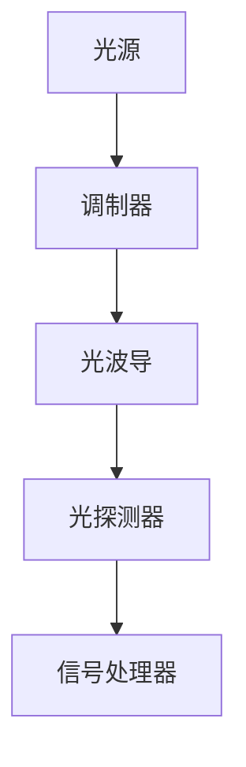
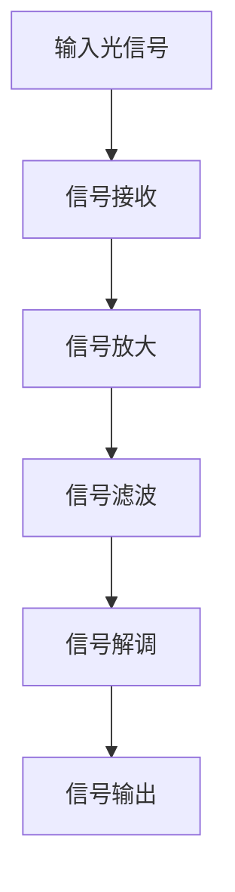
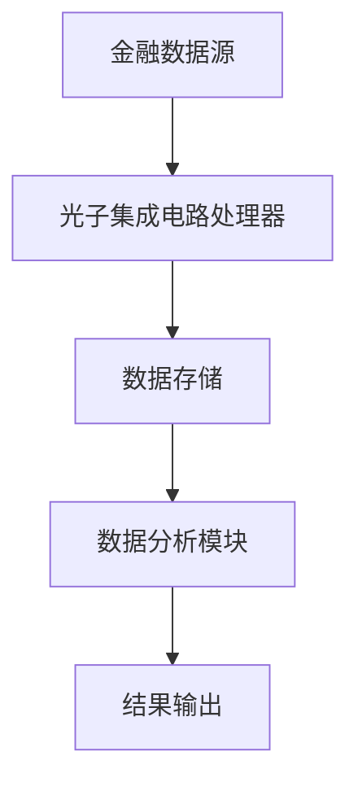

                 


# 价值投资中的新一代光子集成电路技术

> 关键词：光子集成电路、价值投资、金融数据分析、信号处理、技术应用

> 摘要：本文探讨了光子集成电路在价值投资中的应用潜力，分析了其在金融数据处理中的优势，并通过实例展示了其在股票价格预测中的实际应用。

---

## 目录大纲

### 第一部分：光子集成电路技术基础

#### 第1章：光子集成电路概述

##### 1.1 光子集成电路的基本概念
- 1.1.1 光子集成电路的定义
- 1.1.2 光子集成电路的基本原理
- 1.1.3 光子集成电路与传统电子集成电路的区别

##### 1.2 光子集成电路在金融领域的应用潜力
- 1.2.1 金融数据分析的需求
- 1.2.2 光子集成电路在金融数据处理中的优势
- 1.2.3 光子集成电路在价值投资中的应用场景

##### 1.3 光子集成电路的核心技术
- 1.3.1 光子信号的生成与传输
- 1.3.2 光子信号的处理与计算
- 1.3.3 光子信号的检测与输出

#### 第2章：光子集成电路的核心概念与联系

##### 2.1 光子集成电路的核心原理
- 2.1.1 光子信号的调制与解调
- 2.1.2 光子信号的滤波与放大
- 2.1.3 光子信号的复用与解复用

##### 2.2 光子集成电路与电子集成电路的对比
- 2.2.1 从速度和带宽看光子集成电路的优势
- 2.2.2 从功耗和体积看光子集成电路的劣势
- 2.2.3 光子集成电路与电子集成电路的协同工作

##### 2.3 光子集成电路的实体关系图


### 第二部分：光子集成电路的算法原理

#### 第3章：光子信号处理的算法流程

##### 3.1 光子信号处理的算法流程


##### 3.2 光子信号处理的数学模型
- 3.2.1 光子信号的调制方程
  $$I(t) = I_0 + I_1 \cdot \cos(2\pi f t)$$
- 3.2.2 光子信号的解调方程
  $$\hat{f}(t) = \frac{1}{2\pi} \int_{-\infty}^{\infty} F(f) e^{2\pi i f t} df$$

##### 3.3 光子信号处理的Python实现
- 3.3.1 光子信号的生成
  ```python
  import numpy as np
  t = np.linspace(0, 1, 1000)
  I0 = 1
  I1 = 2
  f = 100
  I = I0 + I1 * np.cos(2 * np.pi * f * t)
  ```

- 3.3.2 光子信号的处理
  ```python
  from scipy import signal
  butterworth_filter = signal.butter(4, 0.2, 'low')
  filtered_signal = signal.lfilter(butterworth_filter, [1], I)
  ```

### 第三部分：光子集成电路的系统分析与架构设计

#### 第4章：金融数据分析系统的场景介绍

##### 4.1 金融数据实时分析的需求
- 4.1.1 高速数据处理的需求
- 4.1.2 高精度数据分析的要求
- 4.1.3 实时监控的必要性

##### 4.2 光子集成电路在金融数据处理中的应用
- 4.2.1 光子集成电路在高频交易中的应用
- 4.2.2 光子集成电路在风险评估中的应用
- 4.2.3 光子集成电路在市场预测中的应用

##### 4.3 金融数据分析系统的架构设计


### 第四部分：光子集成电路在价值投资中的应用

#### 第5章：光子集成电路在股票价格预测中的应用

##### 5.1 股票价格波动的特征分析
- 5.1.1 市场波动的周期性
- 5.1.2 股票价格的相关性
- 5.1.3 影响股票价格的多种因素

##### 5.2 基于光子集成电路的股票价格预测模型
- 5.2.1 模型的构建
- 5.2.2 模型的训练
- 5.2.3 模型的验证

##### 5.3 光子集成电路在股票价格预测中的优势
- 5.3.1 高速数据处理的优势
- 5.3.2 高精度分析的优势
- 5.3.3 实时监控的优势

### 第五部分：项目实战与总结

#### 第6章：光子集成电路的项目实战

##### 6.1 环境搭建与工具安装
- 6.1.1 光子集成电路实验环境的搭建
- 6.1.2 相关工具的安装与配置
- 6.1.3 开发环境的准备

##### 6.2 光子集成电路的核心代码实现
- 6.2.1 光子信号生成的代码实现
  ```python
  import numpy as np
  def generate_photon_signal(frequency, duration, sampling_rate):
      t = np.linspace(0, duration, sampling_rate)
      I0 = 1
      I1 = 2
      signal = I0 + I1 * np.cos(2 * np.pi * frequency * t)
      return signal
  ```

- 6.2.2 光子信号处理的代码实现
  ```python
  from scipy import signal
  def process_photon_signal(signal, cutoff_frequency, sampling_rate):
      nyquist = 0.5 * sampling_rate
      cutoff = cutoff_frequency / nyquist
      b, a = signal.butter(4, cutoff, 'low')
      output = signal.lfilter(b, a, signal)
      return output
  ```

##### 6.3 项目小结
- 6.3.1 项目成果总结
- 6.3.2 项目经验总结
- 6.3.3 项目改进建议

### 第六部分：最佳实践与拓展阅读

#### 第7章：光子集成电路技术的最佳实践

##### 7.1 光子集成电路技术的注意事项
- 7.1.1 技术的局限性
- 7.1.2 应用中的挑战
- 7.1.3 解决方案的选择

##### 7.2 光子集成电路技术的未来发展方向
- 7.2.1 技术创新的方向
- 7.2.2 应用领域的拓展
- 7.2.3 与其他技术的结合

### 作者信息

> 作者：AI天才研究院/AI Genius Institute & 禅与计算机程序设计艺术/Zen And The Art of Computer Programming

---

这个目录大纲涵盖了从基础概念到实际应用的各个方面，确保内容的完整性和深度。每一章都详细介绍了相关主题，并通过图表和代码示例增强了理解。

