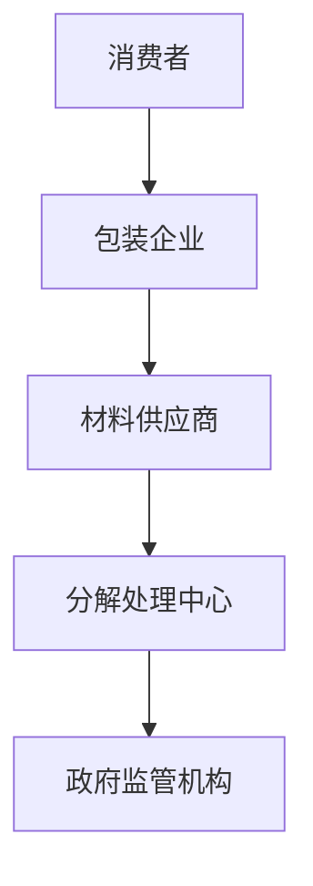
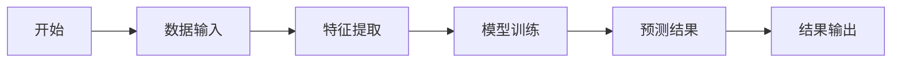
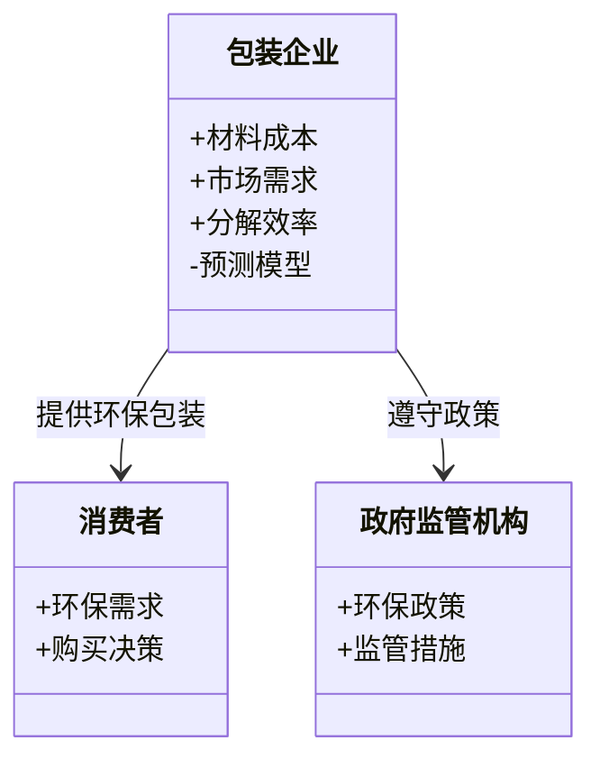
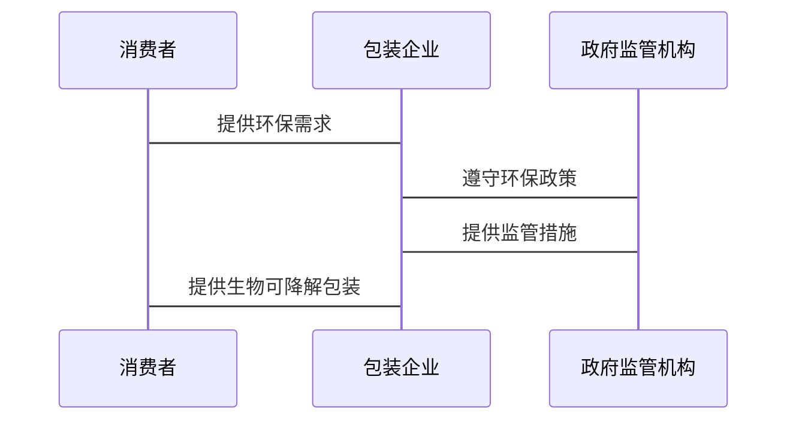

                 


```markdown
# 价值投资中的新一代生物可降解包装技术

## 关键词：
生物可降解包装技术, 价值投资, 环境保护, 投资策略, 可持续发展

## 摘要：
生物可降解包装技术作为一种新兴的环保技术，正在逐渐成为市场和投资者关注的焦点。本文从技术原理、市场分析、投资策略等多个角度，详细探讨生物可降解包装技术在价值投资中的应用潜力。通过分析其科学原理、算法模型以及实际案例，本文为投资者提供了一套系统的投资策略和风险管理方法，帮助他们在环保和经济利益之间找到最佳平衡点。

---

# 第一部分: 生物可降解包装技术概述

## 第1章: 生物可降解包装技术的背景与意义

### 1.1 生物可降解包装技术的定义与特点
#### 1.1.1 包装材料的基本概念
包装材料是保护商品、便于运输和销售的媒介，传统包装材料多为塑料、纸张、金属等。然而，传统包装材料的不可降解性和对环境的污染问题日益严重，已成为全球关注的焦点。

#### 1.1.2 生物可降解材料的科学原理
生物可降解材料是指在自然环境下，能够被微生物分解为二氧化碳和水等无害物质的材料。其核心在于材料的分子结构设计，使其在特定条件下能够被降解。

#### 1.1.3 生物可降解包装的优势与局限性
| 优势 | 局限性 |
|------|--------|
| 环保性高 | 成本较高 |
| 可降解性强 | 性能有限 |
| 市场需求大 | 技术门槛高 |

### 1.2 生物可降解包装技术的市场背景
#### 1.2.1 全球包装行业的现状与趋势
全球包装行业市场规模庞大，但传统包装材料的污染问题严重。随着环保政策的加强和消费者环保意识的提升，生物可降解包装技术逐渐成为市场的新宠。

#### 1.2.2 环保政策对包装行业的影响
各国政府纷纷出台环保法规，限制传统塑料包装的使用，鼓励企业采用可降解材料。这为生物可降解包装技术的发展提供了政策支持。

#### 1.2.3 消费者环保意识的提升与需求
消费者越来越关注环保问题，倾向于选择环保型产品。生物可降解包装技术因其环保特性，逐渐成为消费者的首选。

### 1.3 本章小结
生物可降解包装技术作为一种新兴技术，不仅解决了传统包装材料的环保问题，还满足了市场对环保产品的需求。然而，其高成本和技术门槛也对企业的投资提出了挑战。

---

## 第2章: 生物可降解包装技术的核心概念与联系

### 2.1 生物可降解包装材料的科学原理
#### 2.1.1 材料的结构与性能分析
生物可降解材料通常由聚合物制成，其分子结构设计使其在特定条件下能够分解。例如，聚乳酸（PLA）是一种常见的生物可降解材料，其分子结构易于被微生物降解。

#### 2.1.2 分解过程中的化学反应机制
生物可降解材料的分解过程涉及微生物的作用，通过酶解和氧化反应将材料分解为简单的有机物。这一过程需要适当的环境条件，如温度、湿度和微生物种类。

#### 2.1.3 影响分解效率的关键因素
| 关键因素 | 影响 |
|----------|------|
| 微生物种类 | 分解效率 |
| 温度 | 反应速率 |
| 湿度 | 材料降解程度 |

### 2.2 核心概念的对比分析
#### 2.2.1 生物可降解与不可降解包装材料的对比
| 对比维度 | 生物可降解包装 | 不可降解包装 |
|----------|----------------|----------------|
| 环保性 | 高 | 低 |
| 成本 | 较高 | 较低 |
| 分解时间 | 短 | 长 |

#### 2.2.2 不同生物可降解材料的性能对比
| 材料 | 优点 | 缺点 |
|------|------|------|
| PLA | 生物降解性好 | 成本高 |
| PHA | 耐热性好 | 制造复杂 |
| 淀粉基材料 | 成本低 | 弱度低 |

### 2.3 产业链的实体关系图


### 2.4 本章小结
生物可降解包装技术的核心在于材料的科学设计和分解过程的控制。通过对比分析和产业链图的展示，可以更好地理解其技术优势和市场潜力。

---

## 第3章: 生物可降解包装技术的算法原理与数学模型

### 3.1 基于机器学习的市场预测模型
#### 3.1.1 数据收集与特征提取
市场预测模型需要收集包括价格、需求、政策等多方面的数据，并提取关键特征，如材料成本、市场需求增长率等。

#### 3.1.2 模型训练与优化
使用机器学习算法（如随机森林、支持向量机）对数据进行训练，并通过交叉验证优化模型参数。

#### 3.1.3 预测结果的评估与验证
通过均方误差（MSE）、R²等指标评估模型的预测精度，并通过实际市场数据验证模型的准确性。

### 3.2 数学模型的建立与应用
#### 3.2.1 线性回归模型
$$ y = \beta_0 + \beta_1x + \epsilon $$
其中，\( y \) 表示预测的市场需求，\( x \) 表示材料成本，\( \beta_0 \) 和 \( \beta_1 \) 是回归系数，\( \epsilon \) 是误差项。

#### 3.2.2 时间序列分析模型
使用ARIMA模型对市场趋势进行预测，模型结构如下：
$$ ARIMA(p, d, q) $$
其中，\( p \) 是自回归阶数，\( d \) 是差分阶数，\( q \) 是移动平均阶数。

### 3.3 算法流程图


### 3.4 本章小结
通过机器学习和数学模型，可以有效预测生物可降解包装技术的市场需求和价格走势，为投资决策提供科学依据。

---

## 第4章: 生物可降解包装技术的系统分析与架构设计

### 4.1 系统功能设计
#### 4.1.1 领域模型


### 4.2 系统架构设计
#### 4.2.1 模块化设计
系统分为数据采集、模型训练、预测分析三个模块，采用微服务架构，确保各模块独立运行和扩展。

#### 4.2.2 接口设计
系统提供API接口，方便数据输入和结果输出，支持与其他系统的集成。

### 4.3 系统交互图


### 4.4 本章小结
系统设计确保了生物可降解包装技术的高效应用，同时支持数据的实时采集和分析，为投资决策提供实时支持。

---

## 第5章: 生物可降解包装技术的项目实战

### 5.1 环境安装
安装Python、机器学习库（如scikit-learn、xgboost）和数据可视化工具（如Matplotlib、Seaborn）。

### 5.2 核心实现源代码
```python
import pandas as pd
from sklearn.ensemble import RandomForestRegressor
from sklearn.metrics import mean_squared_error

# 数据加载
data = pd.read_csv('package_material.csv')

# 特征提取
features = data[['材料成本', '市场需求增长率', '政策支持力度']]
target = data['市场需求']

# 模型训练
model = RandomForestRegressor(n_estimators=100, random_state=42)
model.fit(features, target)

# 预测结果
predictions = model.predict(features)
print('均方误差:', mean_squared_error(target, predictions))
```

### 5.3 案例分析
以某生物可降解包装企业为例，分析其市场表现和投资回报。通过实际数据验证模型的准确性，并提出改进建议。

### 5.4 本章小结
通过项目实战，读者可以掌握生物可降解包装技术的实现方法，并将其应用于实际投资决策中。

---

## 第6章: 投资策略与风险管理

### 6.1 价值投资策略
#### 6.1.1 选择优质企业
重点关注技术领先、市场占有率高、财务状况良好的企业。

#### 6.1.2 长期持有
生物可降解包装技术的市场潜力巨大，长期持有优质企业股票，享受其成长带来的收益。

### 6.2 风险管理
#### 6.2.1 分散投资
通过分散投资降低单一技术或企业的风险。

#### 6.2.2 跟踪市场变化
密切关注政策变化和技术进展，及时调整投资策略。

### 6.3 最佳实践
#### 6.3.1 定期评估投资组合
根据市场变化和企业表现，定期评估投资组合的合理性和收益性。

#### 6.3.2 关注行业动态
通过参加行业会议、阅读行业报告等方式，保持对生物可降解包装技术的了解和关注。

---

## 第7章: 结论与展望

### 7.1 本章总结
生物可降解包装技术作为一种新兴技术，不仅具有广阔的市场前景，还为投资者提供了新的投资机会。通过科学的投资策略和风险管理，投资者可以在环保和经济利益之间找到最佳平衡点。

### 7.2 未来展望
随着技术的进步和政策的支持，生物可降解包装技术将在更多领域得到应用，为投资者创造更多的价值。

---

## 参考文献
（此处列出相关文献和资料）

---

## 作者：AI天才研究院/AI Genius Institute & 禅与计算机程序设计艺术 /Zen And The Art of Computer Programming
```

---

### 总结
这篇技术博客文章全面分析了生物可降解包装技术在价值投资中的应用，从技术背景、核心概念、算法原理到系统设计和项目实战，为读者提供了详尽的指导和深入的分析。通过科学的投资策略和风险管理方法，投资者可以在环保和经济利益之间找到最佳平衡点，抓住这一技术带来的投资机遇。

