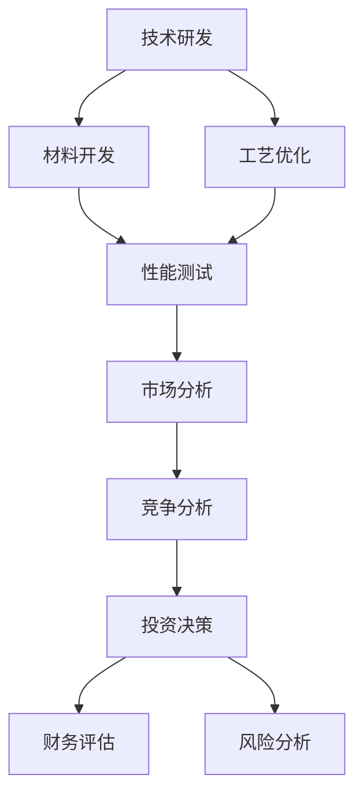

                 

# 价值投资中的新一代高能量密度固态电池技术

> 关键词：高能量密度、固态电池、价值投资、技术分析、数学模型、系统架构、案例分析

> 摘要：本文深入探讨了新一代高能量密度固态电池技术在价值投资中的应用潜力。通过分析固态电池的技术优势、市场前景以及投资价值，构建了技术与投资相结合的分析框架，并通过实际案例展示了如何在投资决策中应用这些分析。文章结合数学模型和系统架构设计，提供了从技术到投资的全面视角，为投资者和技术创新者提供了有价值的参考。

---

## 第一部分：背景介绍

### 第1章：高能量密度固态电池技术概述

#### 1.1 固态电池的基本概念

- **1.1.1 电池的基本工作原理**
  - 电池通过化学能转化为电能，主要由正极、负极、电解液和隔膜组成。
  - 锂电池因其高能量密度成为主流，但存在安全性问题。

- **1.1.2 固态电池的定义与特点**
  - 固态电池使用固态电解质替代传统液态电解液。
  - 具有更高的能量密度、更好的安全性和更长的循环寿命。

- **1.1.3 高能量密度的含义与重要性**
  - 能量密度是单位体积或单位质量的能量存储能力。
  - 高能量密度意味着更长的续航能力和更小的设备体积。

#### 1.2 固态电池的技术优势

- **1.2.1 与传统锂电池的对比分析**
  - 安全性：固态电池不易燃，避免了液态电解液的泄漏风险。
  - 循环寿命：固态电池的循环次数显著提高。
  - 能量密度：固态电池的能量密度可以达到传统锂电池的两倍以上。

- **1.2.2 安全性、能量密度和循环寿命的提升**
  - 固态电解质的使用显著提高了电池的安全性。
  - 新材料的应用（如金属锂负极）提升了能量密度和循环寿命。

- **1.2.3 固态电池的技术瓶颈与未来发展方向**
  - 制备成本高、技术难度大。
  - 研究重点：新型固态电解质材料、电池结构优化和生产工艺改进。

---

### 第2章：高能量密度固态电池的市场与投资价值

#### 2.1 全球锂电池市场的现状与趋势

- **2.1.1 全球锂电池市场容量与增长预测**
  - 2023年全球锂电池市场规模约为800亿美元，预计到2030年将增长至2000亿美元。
  - 高能量密度电池的需求主要来自电动汽车和储能系统。

- **2.1.2 固态电池在电动汽车领域的应用前景**
  - 电动汽车对高能量密度电池的需求日益增长。
  - 固态电池的推广将显著提升电动汽车的续航能力和降低成本。

- **2.1.3 固态电池在储能系统中的潜在价值**
  - 储能系统需要高能量密度和长循环寿命的电池。
  - 固态电池在电网储能和家庭储能中具有广泛的应用前景。

#### 2.2 投资价值分析框架

- **2.2.1 技术壁垒与市场竞争力分析**
  - 技术壁垒高，进入门槛高。
  - 市场竞争力取决于企业的研发能力、生产规模和成本控制。

- **2.2.2 企业财务状况与投资回报率评估**
  - 企业的财务健康状况直接影响投资回报。
  - 投资回报率与技术商业化进度密切相关。

- **2.2.3 行业政策与法规对投资的影响**
  - 政府政策（如补贴、税收优惠）对行业有重要影响。
  - 法规对电池技术的要求推动了技术进步。

---

### 第3章：固态电池技术的核心要素与创新

#### 3.1 固态电池的关键材料

- **3.1.1 固态电解质的类型与性能**
  - 晶态固体电解质：氧化物、硫化物和聚合物电解质。
  - 无机固体电解质：如Li6AlO1.8F0.2，具有高离子导电性和稳定性。

- **3.1.2 正负极材料的选择与优化**
  - 正极材料：高镍三元材料（如Li(NiCoMn)O4）和富锂锰基材料。
  - 负极材料：金属锂负极和石墨复合材料。

- **3.1.3 电解液的作用与改进方向**
  - 电解液用于传递离子，影响电池的导电性和稳定性。
  - 改进方向：开发更稳定的电解液，减少与固态电解质的界面问题。

#### 3.2 固态电池的制造工艺

- **3.2.1 制备技术的创新与挑战**
  - 固态电解质的制备技术：如溶胶-凝胶法、固相合成法。
  - 负极材料的制备：金属锂的沉积和保护层技术。

- **3.2.2 生产成本的控制与优化**
  - 生产设备的自动化和规模化。
  - 材料成本的优化：寻找 cheaper替代材料。

- **3.2.3 工艺流程的标准化与规模化**
  - 从实验室到量产的工艺优化。
  - 标准化生产流程的制定和执行。

---

### 第4章：固态电池技术的数学模型与能量密度计算

#### 4.1 电池能量密度的数学表达

- **4.1.1 能量密度公式**
  - 能量密度（Wh/kg）= (3/2) * V * C，其中V是电压，C是比容量。
  - 实例计算：若V=3.7V，C=200mAh/g，则能量密度为 (3/2)*3.7*200 = 1110Wh/kg。

- **4.1.2 比容量与能量密度的关系**
  - 高比容量材料的开发是提升能量密度的关键。
  - 通过优化正负极材料和电解质，提升比容量。

#### 4.2 固态电池性能的优化模型

- **4.2.1 材料选择的优化模型**
  - 使用线性规划模型选择最优材料组合。
  - 目标函数：最大化能量密度。
  - 约束条件：材料成本、工艺可行性。

- **4.2.2 制备工艺的优化模型**
  - 使用模拟优化算法（如遗传算法）优化工艺参数。
  - 目标函数：最小化生产成本。
  - 约束条件：工艺可行性、产品质量。

---

## 第二部分：价值投资中的固态电池技术分析与决策框架

### 第5章：技术与投资的结合：系统分析与架构设计

#### 5.1 技术分析框架

- **5.1.1 技术成熟度评估**
  - 使用技术成熟度指数（TRL）评估技术阶段。
  - TRL 1-3：实验室阶段。
  - TRL 4-6： prototype阶段。
  - TRL 7-9：商业化阶段。

- **5.1.2 技术经济性分析**
  - 投资回收期（IRR）计算。
  - 成本-效益分析：比较固态电池与传统电池的全生命周期成本。

#### 5.2 系统架构设计

- **5.2.1 系统功能设计**
  - 技术研发模块：材料开发、工艺优化。
  - 市场分析模块：市场容量、竞争分析。
  - 投资决策模块：财务评估、风险分析。

- **5.2.2 系统架构图**

---

### 第6章：固态电池技术的创新与挑战

#### 6.1 技术创新

- **6.1.1 新型固态电解质材料**
  - 无机固体电解质：如Li6AlO1.8F0.2，具有高离子导电性和稳定性。
  - 有机聚合物电解质：如PEN和PVDF，具有柔韧性和较好的离子导电性。

- **6.1.2 新型电池结构**
  - 全固态电池：完全使用固态电解质。
  - 液态-固态混合电池：部分使用液态电解液，降低制备难度。

#### 6.2 技术挑战

- **6.2.1 制备成本**
  - 固态电解质的制备成本高，规模化生产困难。
  - 新材料的研发和应用需要大量资金投入。

- **6.2.2 技术瓶颈**
  - 固态电解质与电极材料的界面问题。
  - 电池循环寿命和一致性的问题。

---

### 第7章：项目实战：固态电池技术评估与投资决策

#### 7.1 项目背景

- 某电动汽车制造商计划采用高能量密度固态电池技术，提升产品竞争力。

#### 7.2 项目实施

- **7.2.1 技术评估**
  - 评估固态电池的技术成熟度和商业化可行性。
  - 对比不同供应商的技术方案和成本。

- **7.2.2 投资决策**
  - 评估投资回收期和净现值。
  - 确定合作伙伴和供应链策略。

#### 7.3 项目小结

- 技术评估是投资决策的关键。
- 需要综合考虑技术风险、市场前景和财务可行性。

---

## 第三部分：总结与展望

### 第8章：总结与投资建议

#### 8.1 核心观点总结

- 固态电池技术具有高能量密度、高安全性和长循环寿命的优势。
- 该技术在电动汽车和储能系统中具有广泛应用前景。

#### 8.2 投资建议

- 关注技术领先的企业和创新团队。
- 重视技术商业化进程和市场容量。
- 分散投资风险，多元化投资标的。

#### 8.3 未来展望

- 固态电池技术的进一步突破将推动新能源产业的发展。
- 投资者应持续关注技术创新和政策变化。

---

## 作者

作者：AI天才研究院/AI Genius Institute & 禅与计算机程序设计艺术 /Zen And The Art of Computer Programming

---

以上是文章的完整目录和内容框架。接下来将按照这个结构展开详细撰写每部分内容。

