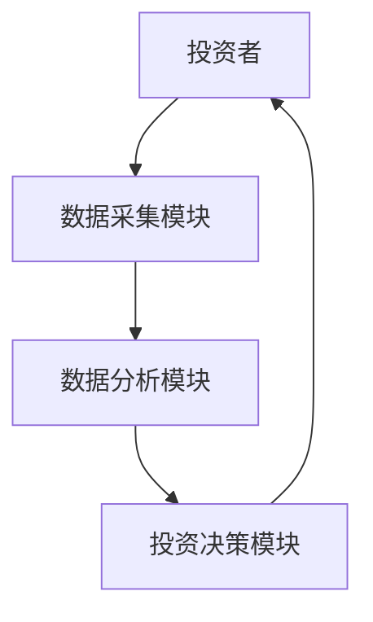

                 

# 价值投资中的新兴市场机会

> **关键词**：价值投资、新兴市场、股票估值、财务分析、投资策略

> **摘要**：  
> 本文深入探讨了价值投资在新兴市场中的应用机会，分析了新兴市场的特点、价值投资的核心理念以及如何通过系统化的方法识别投资机会。文章结合了理论分析、算法设计和实际案例，旨在为投资者提供一套科学的投资框架，帮助他们在新兴市场中发现低估资产并实现长期收益。

---

## 第一部分：价值投资与新兴市场概述

### 第1章：价值投资的基本概念

#### 1.1 价值投资的定义与核心理念

**1.1.1 价值投资的起源与发展**  
价值投资是一种以基本面分析为核心的长期投资策略，起源于20世纪初，由本杰明·格雷厄姆和戴维·多德提出。其核心理念是寻找市场低估的资产，通过长期持有实现价值回归带来的收益。  

**1.1.2 价值投资的核心原则**  
- 以合理的价格买入优质的资产。  
- 长期持有，避免频繁交易。  
- 重视企业的内在价值，而非市场情绪。  

**1.1.3 价值投资与成长投资的区别**  
- 价值投资关注低估的资产，注重安全边际。  
- 成长投资关注高成长性的资产，注重未来盈利能力。  

---

#### 1.2 新兴市场的定义与特征

**1.2.1 新兴市场的定义**  
新兴市场是指经济快速发展、但尚未完全成熟的国家或地区的金融市场。这些市场通常具有较高的增长潜力，但也伴随着较高的波动性和不确定性。  

**1.2.2 新兴市场的经济特征**  
- 经济增长速度快。  
- 金融市场不完全成熟，信息透明度较低。  
- 市场参与者以散户为主，机构投资者占比相对较低。  

**1.2.3 新兴市场的投资机会**  
- 新兴市场的资产往往被低估，存在较大的价值发现空间。  
- 新兴经济体的增长红利为投资者提供了长期收益的机会。  

---

#### 1.3 价值投资在新兴市场的适用性

**1.3.1 新兴市场中的价值投资策略**  
在新兴市场中，价值投资者需要更加注重企业的基本面分析，尤其是企业的盈利能力、财务健康状况和行业地位。  

**1.3.2 新兴市场与成熟市场的差异**  
- 成熟市场：信息透明度高，市场有效性较强。  
- 新兴市场：信息不对称严重，市场有效性较弱，存在较大的套利机会。  

**1.3.3 价值投资在新兴市场的挑战**  
- 市场波动性大，容易受到外部因素的影响。  
- 信息获取难度较高，需要投资者具备较强的分析能力。  

---

## 第二部分：价值投资的核心概念与分析框架

### 第2章：价值投资的核心概念

#### 2.1 市场有效性的分析

**2.1.1 市场有效性的定义**  
市场有效性是指市场价格能够充分反映所有可获取信息的程度。市场有效性分为弱有效、强有效和半强有效三种类型。  

**2.1.2 市场无效性的表现**  
- 价格短期偏离内在价值。  
- 市场参与者情绪化交易。  

**2.1.3 新兴市场中的市场有效性分析**  
新兴市场的价格通常存在较大的波动性，市场参与者的情绪化交易行为较为普遍，这为价值投资者提供了套利机会。  

---

#### 2.2 股票估值的基本原理

**2.2.1 股票估值的定义**  
股票估值是通过对企业的财务状况、盈利能力、行业地位等因素进行分析，确定其内在价值的过程。  

**2.2.2 常用估值指标**  
- 市盈率（P/E）：股价与每股净利润的比值。  
- 市净率（P/B）：股价与每股净资产的比值。  
- 市销率（P/S）：股价与每股销售收入的比值。  

**2.2.3 股票内在价值的计算方法**  
- 现金流折现模型（DCF模型）：通过预测企业未来现金流，折现到现值，确定其内在价值。  
- 股息贴现模型（DDM模型）：通过预测企业未来股息现金流，折现到现值，确定其内在价值。  

---

#### 2.3 财务报表分析

**2.3.1 财务报表的基本结构**  
财务报表包括资产负债表、利润表和现金流量表。  

**2.3.2 关键财务指标的分析**  
- 净利润率：衡量企业盈利能力。  
- 资产负债率：衡量企业财务健康状况。  
- 净现金流：衡量企业经营活动产生的现金流量。  

**2.3.3 财务报表分析在价值投资中的应用**  
通过分析财务报表，投资者可以评估企业的盈利能力、财务健康状况和成长潜力。  

---

## 第三部分：价值投资的算法与数学模型

### 第3章：价值投资的数学模型

#### 3.1 股票估值模型

**3.1.1 现金流折现模型（DCF模型）**  
DCF模型通过预测企业未来现金流，折现到现值，确定其内在价值。其公式为：  

$$ V = \frac{CF_1}{(1+r)^1} + \frac{CF_2}{(1+r)^2} + \dots + \frac{CF_n}{(1+r)^n} $$  

其中，$CF_i$ 表示第 $i$ 年的现金流，$r$ 表示折现率。  

**3.1.2 市盈率模型**  
市盈率模型通过比较企业的市盈率与行业平均水平，判断其估值是否合理。  

**3.1.3 市净率模型**  
市净率模型通过比较企业的市净率与行业平均水平，判断其估值是否合理。  

---

#### 3.2 市场情绪分析模型

**3.2.1 市场情绪的定义**  
市场情绪是指市场参与者对市场的看法和态度，通常通过成交量、价格波动等指标来衡量。  

**3.2.2 市场情绪的量化方法**  
- 布林格指标：衡量价格波动性。  
- 相对强弱指数（RSI）：衡量资产超买或超卖状态。  

---

#### 3.3 风险评估模型

**3.3.1 风险的定义与分类**  
风险是指投资收益的不确定性，分为系统性风险和非系统性风险。  

**3.3.2 风险评估的数学模型**  
- 方差-协方差模型：用于衡量资产组合的风险。  
- CAPM模型：用于计算资产的预期收益与风险之间的关系。  

---

## 第四部分：价值投资在新兴市场的系统分析与架构设计

### 第4章：新兴市场投资系统的架构设计

#### 4.1 投资系统的需求分析

**4.1.1 投资目标的确定**  
根据投资者的风险承受能力和收益目标，确定投资目标。  

**4.1.2 投资策略的选择**  
根据市场环境和资产特性，选择合适的投资策略。  

**4.1.3 投资风险的控制**  
通过分散投资、风险对冲等方法，控制投资风险。  

---

#### 4.2 投资系统的功能设计

**4.2.1 数据采集模块**  
- 从多个数据源获取实时数据，包括股价、成交量、财务报表等。  

**4.2.2 数据分析模块**  
- 应用价值投资模型，对资产进行估值和风险评估。  

**4.2.3 投资决策模块**  
- 根据分析结果，生成投资决策，如买入、卖出或持有。  

---

#### 4.3 投资系统的架构设计

**4.3.1 系统架构图**  

**4.3.2 数据流图**  

---

## 第五部分：价值投资的项目实战

### 第5章：新兴市场投资实战案例

#### 5.1 项目环境与工具安装

**5.1.1 投资分析工具的选择**  
推荐使用Python的Pandas、NumPy等库进行数据分析，使用Matplotlib进行数据可视化。  

**5.1.2 数据获取与处理工具的安装**  
安装Pandas、NumPy、Matplotlib等Python库。  

---

#### 5.2 投资策略的实现

**5.2.1 数据采集与清洗**  
从Yahoo Finance获取股票数据，并清洗数据。  

**5.2.2 股票估值模型的实现**  
实现DCF模型和市盈率模型，对目标资产进行估值。  

**5.2.3 投资决策系统的实现**  
根据估值结果，生成投资决策。  

---

#### 5.3 投资案例分析

**5.3.1 案例背景介绍**  
以印度市场为例，分析其投资机会。  

**5.3.2 投资策略的实施过程**  
通过DCF模型和市盈率模型，筛选低估资产。  

**5.3.3 投资结果的分析与总结**  
总结投资结果，分析策略的有效性。  

---

## 第六部分：价值投资的最佳实践

### 第6章：价值投资的关键点与注意事项

#### 6.1 投资理念的坚持

**6.1.1 价值投资的核心理念**  
始终坚持基本面分析，避免短期市场波动的干扰。  

**6.1.2 长期投资的重要性**  
通过长期持有，实现价值回归带来的收益。  

---

#### 6.2 投资策略的优化

**6.2.1 定期复盘与调整**  
根据市场变化和个人目标，定期复盘并调整投资策略。  

**6.2.2 多元化投资的重要性**  
通过分散投资，降低非系统性风险。  

---

#### 6.3 风险管理的技巧

**6.3.1 设置止损位**  
在投资组合中设置止损位，避免重大损失。  

**6.3.2 保持充足流动性**  
确保在市场波动时有足够的流动性应对突发事件。  

---

## 作者：AI天才研究院 & 禅与计算机程序设计艺术

