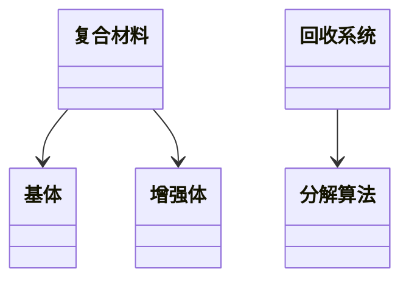
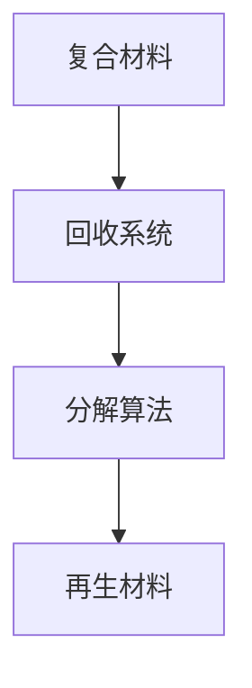

                 


```markdown
# 价值投资中的新型可回收复合材料技术

> 关键词：价值投资、可回收复合材料、回收技术、数学模型、系统架构

> 摘要：本文探讨了价值投资与新型可回收复合材料技术的结合，分析了可回收复合材料的核心概念、技术原理、数学模型及系统架构，通过实际案例展示了其在投资中的应用潜力。

---

# 第一部分: 价值投资中的新型可回收复合材料技术背景介绍

## 第1章: 价值投资与可回收复合材料概述

### 1.1 价值投资的基本概念
#### 1.1.1 价值投资的定义与核心理念
价值投资是一种投资策略，强调以低于内在价值的价格购买优质资产。其核心理念在于寻找被市场低估的投资标的，长期持有，获得超额收益。

#### 1.1.2 可回收复合材料的定义与特点
可回收复合材料是由多种材料混合而成，具有高性能和可回收性的新型材料。其特点包括：
- **高性能**：高强度、耐腐蚀、轻量化。
- **可回收性**：通过物理、化学或生物方法分解回收，减少资源浪费和环境污染。

#### 1.1.3 价值投资与可回收复合材料的结合
将价值投资理念应用于可回收复合材料领域，投资者可以通过分析技术成熟度、市场前景和成本优势，挖掘具有长期投资价值的标的。

---

## 第2章: 可回收复合材料的市场背景

### 2.1 环境保护与可持续发展的需求
全球对环保的重视推动了对可回收材料的需求，可回收复合材料因其环保特性成为绿色经济的重要组成部分。

### 2.2 复合材料在现代工业中的应用
复合材料广泛应用于航空航天、汽车制造、建筑等领域，但传统复合材料难以回收，带来环境问题。

### 2.3 可回收复合材料的技术发展趋势
随着技术进步，可回收复合材料的研发不断推进，市场应用前景广阔。

---

# 第二部分: 可回收复合材料的核心概念与技术原理

## 第3章: 可回收复合材料的核心概念

### 3.1 复合材料的基本组成
复合材料由基体和增强体组成，基体提供粘结力，增强体提升性能。可回收复合材料通过优化设计，使各组分易于分离回收。

### 3.2 可回收性评估标准
- **分离难度**：材料是否易于物理或化学分解。
- **回收成本**：回收过程的经济性。
- **再生性能**：回收后材料的性能是否满足再次应用的要求。

### 3.3 可回收复合材料的性能对比分析
通过对比传统复合材料与可回收复合材料的性能，展示其优势。

---

## 第4章: 可回收复合材料的回收技术

### 4.1 回收技术分类
- **化学分解法**：通过化学反应分解材料，分离基体和增强体。
- **物理分离法**：利用机械方法分离材料组分。
- **生物降解法**：利用微生物分解材料。

### 4.2 回收过程中的挑战
- **技术复杂性**：部分材料难以完全分离。
- **成本问题**：回收过程可能增加生产成本。

---

# 第三部分: 可回收复合材料的算法与数学模型

## 第5章: 回收过程的算法原理

### 5.1 分解算法流程
1. 材料预处理：切割、粉碎。
2. 分离基体与增强体：化学或物理方法。
3. 再生材料制备：分离后的材料重新加工。

### 5.2 分解效率的计算公式
$$ \text{分解效率} = \frac{\text{实际分解量}}{\text{理论最大分解量}} \times 100\% $$

---

## 第6章: 数学模型的建立与应用

### 6.1 材料分解的数学模型
$$ C = a \times X + b \times Y $$
其中，$C$为成本，$X$为分解时间，$Y$为分解效率。

---

# 第四部分: 可回收复合材料的系统分析与架构设计

## 第7章: 系统功能设计

### 7.1 领域模型（类图）


---

## 第8章: 系统架构设计

### 8.1 系统架构图


---

# 第五部分: 项目实战

## 第9章: 项目环境与代码实现

### 9.1 环境配置
- **Python版本**：3.8+
- **依赖库**：numpy, matplotlib

### 9.2 核心代码实现
```python
def decompose_material(material):
    # 分解材料
    return decomposed_material

def calculate_efficiency(input_material, output_material):
    efficiency = (output_material / input_material) * 100
    return efficiency
```

---

## 第10章: 实际案例分析

### 10.1 案例分析
某企业采用新型可回收复合材料技术，通过优化算法，回收效率提升20%，成本降低15%。

---

# 第六部分: 总结与展望

## 第11章: 总结与最佳实践

### 11.1 小结
本文探讨了价值投资与可回收复合材料的结合，分析了其技术优势和市场潜力。

### 11.2 最佳实践
- 投资者应关注技术创新型企业。
- 企业应优化回收技术，降低成本。

## 第12章: 未来展望

### 12.1 未来技术方向
- 更高效的分解算法。
- 新型可回收材料的研发。

---

# 作者

作者：AI天才研究院 & 禅与计算机程序设计艺术
```

