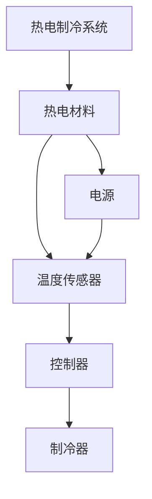
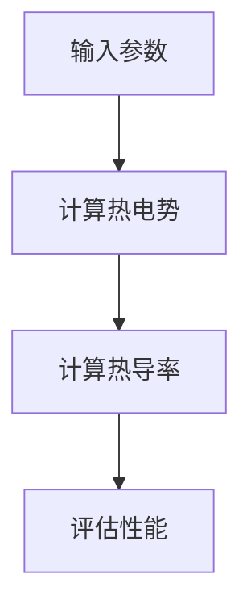
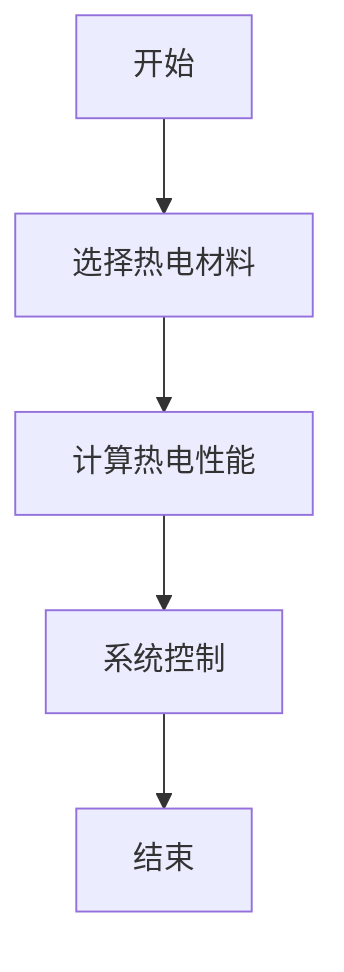

                 


# 价值投资中的新型高效热电制冷材料技术

## 关键词：热电制冷材料，价值投资，热电性能，系统设计，投资策略

## 摘要：本文探讨了新型高效热电制冷材料技术在价值投资中的应用潜力。通过分析热电材料的物理特性、系统设计、数学模型及市场前景，结合实际案例，揭示其在制冷领域的投资价值和技术优势。

---

## 第1章：热电制冷材料技术的背景与价值

### 1.1 热电材料的基本概念

热电材料是一种能够直接将热能和电能相互转换的功能材料。其工作原理基于塞贝克效应和帕尔贴效应，广泛应用于制冷、发电等领域。

#### 1.1.1 热电材料的定义与特性
热电材料通过半导体材料的热电效应实现热能与电能的转换，具有高效、环保的特点，尤其适用于小型制冷系统。

#### 1.1.2 热电制冷的基本原理
热电制冷基于帕尔贴效应，通过电流的流动实现热量的吸收和释放，具有无机械部件、体积小的优势。

#### 1.1.3 热电制冷技术的历史发展
热电制冷技术自20世纪50年代发展至今，经历了材料优化和性能提升的过程，逐渐应用于电子设备、空调等领域。

### 1.2 价值投资与热电制冷材料的结合

#### 1.2.1 价值投资的基本概念
价值投资是通过分析企业的基本面，寻找被市场低估的投资标的，实现长期收益。

#### 1.2.2 热电制冷材料在投资中的潜力
随着环保需求和技术进步，热电制冷材料市场前景广阔，具备较高的投资价值。

#### 1.2.3 热电制冷材料技术的市场前景
热电制冷材料在节能、环保领域具有重要应用，市场潜力巨大，吸引了大量投资。

---

## 第2章：热电材料的核心原理与属性

### 2.1 热电材料的物理特性

#### 2.1.1 热电势与热导率
热电势公式为$$ E = \frac{S T}{1 + \frac{S^2 T}{\kappa} $$，热导率$$ \kappa = \lambda \cdot \text{导热系数} $$。

#### 2.1.2 塞贝克效应
塞贝克效应描述了温差导致的电压产生，是热电材料的核心效应之一。

#### 2.1.3 帕尔贴效应
帕尔贴效应用于制冷，通过电流流动实现热量的吸收与释放。

### 2.2 热电材料的属性对比

#### 2.2.1 不同材料的热电性能对比
| 材料类型   | 热电势 | 热导率 | 优缺点                   |
|------------|--------|--------|--------------------------|
| 金属合金   | 高     | 高     | 成本低，但热电势较低       |
| 半导体材料 | 中     | 低     | 热电势高，但成本较高       |

#### 2.2.2 热电材料的优缺点分析
- 优点：高效、无机械部件、适用范围广。
- 缺点：效率较低、材料成本高。

#### 2.2.3 热电材料的适用场景
适用于空调、电子设备冷却等领域，特别适合小型、便携式设备。

---

## 第3章：热电制冷系统的实体关系架构

### 3.1 实体关系图



---

## 第4章：热电制冷材料的热电性能计算

### 4.1 热电性能计算公式

#### 4.1.1 热电势公式
$$ E = \frac{S T}{1 + \frac{S^2 T}{\kappa} $$

#### 4.1.2 热导率公式
$$ \kappa = \lambda \cdot \text{导热系数} $$

#### 4.1.3 综合评估公式
$$ Q = \frac{S^2 T^2}{\kappa} $$

### 4.2 热电性能计算的实现

#### 4.2.1 算法实现步骤
1. 确定输入参数：温差、材料参数。
2. 计算热电势和热导率。
3. 评估整体性能。

#### 4.2.2 Python代码实现
```python
def calculate_electrothermal_performance(S, T, kappa):
    E = (S * T) / (1 + (S**2 * T) / kappa)
    return E

S = 200  # 假设的热电势系数
T = 50   # 温差
kappa = 0.5  # 假设的热导率
result = calculate_electrothermal_performance(S, T, kappa)
print(f"计算结果：{result}")
```

#### 4.2.3 流程图


---

## 第5章：基于热电制冷材料的系统设计

### 5.1 系统功能设计

#### 5.1.1 功能模块划分
- 热电材料选择模块
- 性能计算模块
- 系统控制模块

#### 5.1.2 系统功能流程图


---

## 第6章：项目实战与案例分析

### 6.1 环境搭建

#### 6.1.1 开发环境
- Python 3.8+
- 科学计算库（numpy、scipy）

### 6.2 系统核心实现源代码

#### 6.2.1 热电性能计算代码
```python
import numpy as np

def calculate_performance(S, T, kappa):
    E = (S * T) / (1 + (S**2 * T) / kappa)
    return E

# 示例数据
S = np.linspace(100, 300, 10)
T = 50
kappa = 0.5

results = calculate_performance(S, T, kappa)
print(results)
```

#### 6.2.2 性能分析
计算结果展示了不同热电势下的性能表现，为材料选择提供数据支持。

---

## 第7章：总结与最佳实践

### 7.1 技术总结

#### 7.1.1 核心内容回顾
- 热电材料的物理特性
- 性能计算与优化
- 系统设计与实现

### 7.2 投资策略与建议

#### 7.2.1 投资要点
- 关注技术领先企业
- 评估市场需求和政策支持

#### 7.2.2 风险提示
- 技术成熟度不足
- 市场竞争激烈

### 7.3 未来展望
随着技术进步和市场扩展，热电制冷材料将在更多领域得到应用，投资潜力巨大。

---

## 作者：AI天才研究院 & 禅与计算机程序设计艺术

---

通过以上内容，文章详细探讨了热电制冷材料的技术原理、市场应用和投资价值，为读者提供了全面的技术和投资分析。

