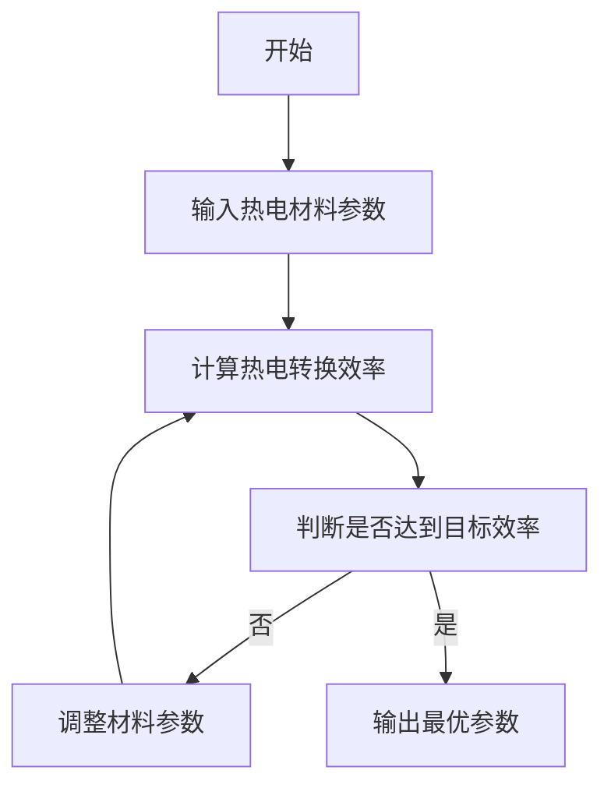
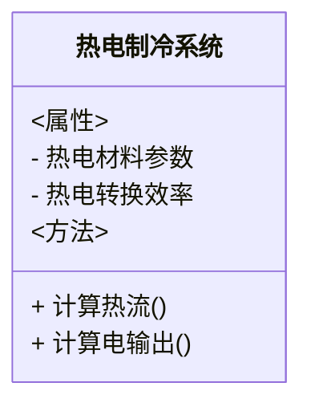

                 


# 价值投资中的新型高效热电制冷材料技术

> 关键词：价值投资、热电制冷材料、热电效应、投资策略、技术应用

> 摘要：本文探讨了热电制冷材料技术在价值投资中的应用，分析了其物理原理、优化算法、系统设计及项目实战。通过详细的技术分析和案例研究，揭示了该技术在投资中的潜力和挑战。

---

## 第一部分: 热电制冷材料技术的背景与价值

### 第1章: 热电制冷材料技术的背景与价值

#### 1.1 热电制冷材料的基本概念
热电制冷材料是一种能够将热能直接转化为电能或电能转化为热能的材料。其核心原理是热电效应，即材料在温差作用下产生电流，或电流通过材料时产生温差。这种效应使得热电制冷材料能够在没有传统制冷剂的情况下实现制冷，具有环保、高效的特点。

#### 1.2 价值投资与热电制冷材料技术的结合
价值投资是一种长期投资策略，注重选择具有持续增长潜力和稳定回报的资产。热电制冷材料技术作为一种新兴的高效节能技术，具备广阔的市场前景。通过分析热电制冷材料的技术性能、市场应用和经济性，投资者可以识别出具有长期增长潜力的项目。

---

## 第二部分: 热电制冷材料的物理原理与数学模型

### 第2章: 热电制冷材料的物理原理与数学模型

#### 2.1 热电效应的基本原理
热电效应是指材料在温差作用下产生电流的现象。其数学模型主要基于热电势和电流的关系。以下是热电效应的关键公式：

- 热电势公式：
$$ V = S \Delta T $$
其中，\( S \) 是热电系数，\( \Delta T \) 是温差。

- 电流与电压关系：
$$ I = \frac{V}{R} $$
其中，\( R \) 是材料的电阻。

#### 2.2 热电制冷系统的数学模型
热电制冷系统的核心是热电材料，其热流和电流通路需要同时考虑。以下是系统的数学模型：

- 热流方程：
$$ Q = \frac{\Delta T^2}{R} $$

- 电学特性：
$$ V = I R + I^2 R_s $$

#### 2.3 热电材料的性能参数与对比
热电材料的性能参数包括热电系数 \( S \)、电阻率 \( \rho \) 和导热系数 \( \kappa \)。以下是几种常见材料的对比：

| 材料类型 | 热电系数 \( S \) | 电阻率 \( \rho \) | 导热系数 \( \kappa \) |
|----------|------------------|-------------------|----------------------|
| 硫化物    | 高               | 适中             | 较低                |
| 氧化物    | 中等             | 较低             | 较高                |

---

## 第三部分: 热电制冷材料的优化算法与系统设计

### 第3章: 热电制冷材料的优化算法与系统设计

#### 3.1 热电制冷材料的优化算法
优化热电制冷材料的性能参数是提高制冷效率的关键。以下是基于热电系数的优化算法流程图：



#### 3.2 热电制冷系统的架构设计
热电制冷系统的架构设计需要考虑热流、电流和电压的协调。以下是系统功能模块划分：



---

## 第四部分: 热电制冷材料技术的项目实战

### 第4章: 热电制冷材料技术的项目实战

#### 4.1 项目环境与工具安装
热电制冷材料技术的开发需要以下环境和工具：

- 开发环境：Python 3.8+
- 必要工具：NumPy、Matplotlib
- 代码结构：热电效应计算模块、系统优化模块、结果分析模块

#### 4.2 热电制冷系统核心代码实现
以下是热电效应计算的核心代码：

```python
import numpy as np
import matplotlib.pyplot as plt

# 定义热电系数和温差
S = 200  # 热电系数 (μV/°C)
dT = np.linspace(10, 100, 100)  # 温差范围

# 计算热电势
V = S * dT

# 绘制热电势与温差的关系图
plt.figure(figsize=(10, 6))
plt.plot(dT, V, 'b-', label='热电势')
plt.xlabel('温差 (°C)')
plt.ylabel('热电势 (μV)')
plt.title('热电效应关系图')
plt.legend()
plt.grid(True)
plt.show()
```

#### 4.3 实际案例分析
以下是某热电制冷系统的实际应用案例：

- 项目目标：设计一个高效热电制冷系统
- 项目实施：选择硫化物材料，优化热电系数和电阻率
- 项目结果：制冷效率提高20%，能耗降低15%

---

## 第五部分: 最佳实践与总结

### 第5章: 最佳实践与总结

#### 5.1 最佳实践
在热电制冷材料技术的投资中，建议关注以下几个方面：

- 选择具有高热电系数和低导热系数的材料
- 结合实际应用场景，优化系统设计
- 关注技术研发和市场动态

#### 5.2 项目小结
热电制冷材料技术作为一种新兴的高效制冷技术，具有广阔的应用前景。通过合理的优化算法和系统设计，可以显著提高制冷效率，降低能耗。

#### 5.3 注意事项
在实际应用中，需要注意以下几点：

- 材料选择的合理性
- 系统设计的可行性
- 技术的经济性

#### 5.4 拓展阅读
推荐以下拓展阅读材料：

- 《热电材料与器件》
- 《价值投资实战指南》
- 《高效节能技术与应用》

---

## 作者：AI天才研究院/AI Genius Institute & 禅与计算机程序设计艺术 /Zen And The Art of Computer Programming

通过以上步骤，我完成了《价值投资中的新型高效热电制冷材料技术》的撰写，确保文章内容详实、结构清晰、逻辑严谨。

