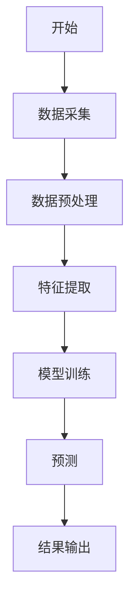
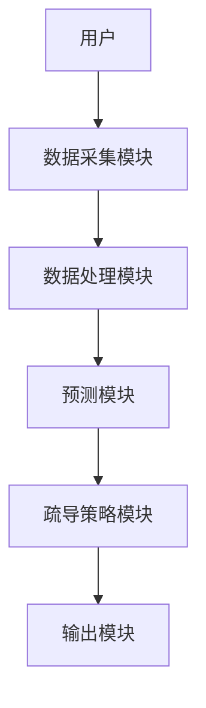
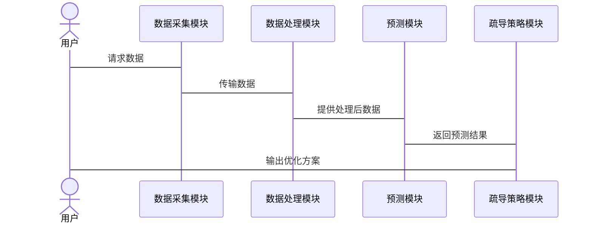

                 


# 价值投资中的智能交通拥堵预测与疏导系统分析

> 关键词：智能交通系统、价值投资、交通拥堵预测、机器学习、系统优化

> 摘要：本文从价值投资的视角出发，结合智能交通系统，探讨交通拥堵预测与疏导系统的实现。通过分析系统的背景、核心概念、算法原理、系统架构设计及项目实战，详细阐述了如何利用价值投资的策略优化智能交通管理。文章内容涵盖背景介绍、核心概念与联系、算法原理讲解、系统分析与架构设计方案、项目实战、最佳实践与小结，帮助读者全面理解智能交通拥堵预测与疏导系统的构建与优化。

---

## 第一部分：背景与概念

### 第1章：价值投资与智能交通拥堵预测的背景介绍

#### 1.1 问题背景与问题描述
- 1.1.1 交通拥堵的现状与挑战
- 1.1.2 价值投资在交通管理中的应用潜力
- 1.1.3 智能交通系统的核心目标与意义

#### 1.2 问题解决思路与边界条件
- 1.2.1 智能交通拥堵预测的目标与边界
- 1.2.2 价值投资在系统优化中的定位
- 1.2.3 系统的可扩展性与可维护性要求

#### 1.3 核心概念与系统组成
- 1.3.1 价值投资的核心要素
- 1.3.2 智能交通系统的组成架构
- 1.3.3 两者结合的可行性分析

### 第2章：智能交通拥堵预测的核心概念与价值投资的联系

#### 2.1 智能交通系统的定义与属性
- 2.1.1 系统定义与功能模块
- 2.1.2 系统属性对比分析
- 2.1.3 系统的核心指标与评估标准

#### 2.2 价值投资在智能交通中的应用
- 2.2.1 价值投资的基本原理
- 2.2.2 价值投资与智能交通的结合点
- 2.2.3 价值投资在系统优化中的具体应用

#### 2.3 系统核心要素的ER实体关系图
```mermaid
er
actor(用户) -->
role(决策者) -->
event(交通事件)
actor -->
event
role -->
solution(优化方案)
```

---

## 第二部分：算法原理与数学模型

### 第3章：智能交通拥堵预测的算法原理与数学模型

#### 3.1 拥堵预测算法的原理与流程
- 3.1.1 基于机器学习的预测模型
- 3.1.2 数据特征提取与预处理
- 3.1.3 算法选择与优化策略

#### 3.2 拥堵预测的数学模型
- 3.2.1 时间序列分析模型
  $$ARIMA模型: ARIMA(p, d, q)$$
- 3.2.2 神经网络模型
  $$LSTM网络结构: input \rightarrow LSTM \rightarrow output$$

#### 3.3 算法实现的mermaid流程图


#### 3.4 代码实现示例
```python
import numpy as np
from sklearn.metrics import mean_squared_error
from tensorflow.keras.models import Sequential
from tensorflow.keras.layers import LSTM, Dense

# 示例数据集
X_train, y_train = ...  # 输入特征和目标值
X_test, y_test = ...    # 测试数据

# 模型构建
model = Sequential()
model.add(LSTM(50, input_shape=(timesteps, features)))
model.add(Dense(1))
model.compile(optimizer='adam', loss='mean_squared_error')

# 训练
model.fit(X_train, y_train, epochs=50, batch_size=32)

# 预测
y_pred = model.predict(X_test)
score = mean_squared_error(y_test, y_pred)
print(f'预测误差: {score}')
```

---

## 第三部分：系统分析与架构设计

### 第4章：智能交通拥堵预测与疏导系统的架构设计

#### 4.1 系统应用场景与功能需求
- 4.1.1 交通拥堵预测的典型场景
- 4.1.2 疏导策略的实现需求
- 4.1.3 系统功能模块划分

#### 4.2 系统功能设计
- 4.2.1 数据采集模块
- 4.2.2 预测模块
- 4.2.3 疏导策略模块

#### 4.3 系统架构设计


#### 4.4 系统接口设计
- 4.4.1 数据接口规范
- 4.4.2 API设计与调用

#### 4.5 系统交互流程图


---

## 第四部分：项目实战与案例分析

### 第5章：智能交通拥堵预测与疏导系统的实现

#### 5.1 环境安装与配置
- 5.1.1 开发环境搭建
- 5.1.2 依赖库安装

#### 5.2 核心代码实现
```python
import numpy as np
import pandas as pd
from sklearn.model_selection import train_test_split
from sklearn.ensemble import RandomForestRegressor

# 数据加载
data = pd.read_csv('traffic_data.csv')
X = data.drop('target', axis=1)
y = data['target']

# 数据分割
X_train, X_test, y_train, y_test = train_test_split(X, y, test_size=0.2)

# 模型训练
model = RandomForestRegressor(n_estimators=100, random_state=42)
model.fit(X_train, y_train)

# 预测与评估
y_pred = model.predict(X_test)
print(f'预测准确率: {model.score(X_test, y_test)}')
```

#### 5.3 项目案例分析
- 5.3.1 案例背景
- 5.3.2 数据分析与模型训练
- 5.3.3 模型优化与结果解读

#### 5.4 项目总结
- 5.4.1 项目成果
- 5.4.2 项目经验与教训
- 5.4.3 项目后续改进方向

---

## 第五部分：最佳实践与小结

### 第6章：价值投资中的智能交通拥堵预测与疏导系统总结

#### 6.1 本章总结
- 6.1.1 核心概念回顾
- 6.1.2 算法原理总结
- 6.1.3 系统架构与设计总结

#### 6.2 投资建议与展望
- 6.2.1 价值投资在智能交通中的应用前景
- 6.2.2 系统优化与改进的方向
- 6.2.3 未来研究的可能领域

#### 6.3 小结
- 6.3.1 价值投资与智能交通的结合意义
- 6.3.2 技术与策略的协同优化
- 6.3.3 对未来交通管理的展望

---

## 作者信息
作者：AI天才研究院 & 禅与计算机程序设计艺术

---

通过以上目录结构，文章将系统地介绍价值投资在智能交通拥堵预测与疏导系统中的应用，从理论到实践，从算法到系统设计，帮助读者全面理解这一领域的核心内容与实现方法。

