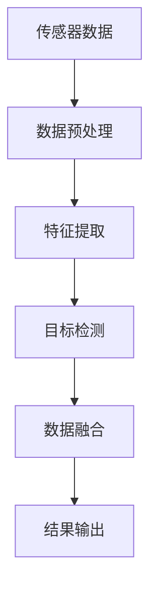
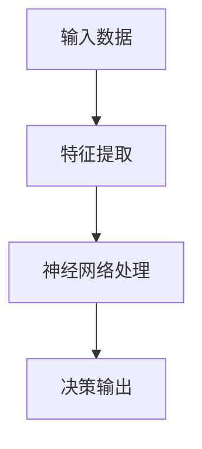
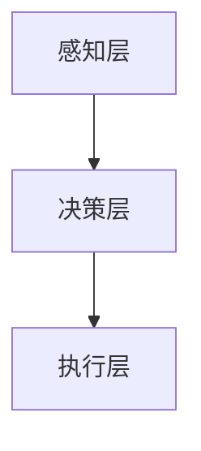
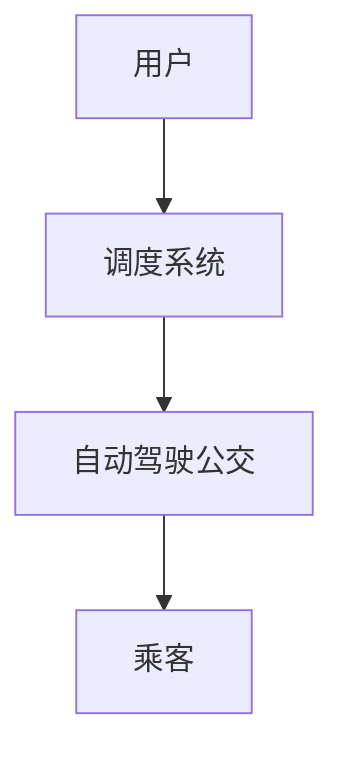

                 


```markdown
# 价值投资中的智能交通自动驾驶公交系统分析

> 关键词：价值投资，智能交通，自动驾驶公交系统，算法原理，系统架构

> 摘要：本文从价值投资的角度分析智能交通中的自动驾驶公交系统，探讨其核心技术、系统架构和经济价值。通过详细阐述传感器数据处理、路径规划和行为决策算法，结合系统设计和实际案例，评估其投资潜力。

---

# 第1章 价值投资与智能交通的结合

## 1.1 价值投资的基本概念

### 1.1.1 价值投资的定义
价值投资是一种投资策略，旨在通过识别市场中被低估的资产，长期持有以实现超额收益。

### 1.1.2 价值投资的核心理念
价值投资强调基本面分析，关注企业的内在价值，寻找市场价格低于内在价值的投资机会。

### 1.1.3 价值投资在现代金融中的应用
价值投资广泛应用于股票、房地产和其他资产领域，尤其在科技领域，如自动驾驶公交系统，具有潜力。

## 1.2 智能交通系统的定义与特点

### 1.2.1 智能交通系统的定义
智能交通系统（ITS）利用先进技术优化交通管理，提升效率和安全性。

### 1.2.2 智能交通系统的组成部分
- **传感器网络**：实时收集交通数据。
- **数据处理系统**：分析数据，优化交通流。
- **通信网络**：传输数据，支持实时决策。

### 1.2.3 自动驾驶公交系统的独特性
自动驾驶公交系统结合了自动驾驶技术和智能交通管理，提供高效、安全的公共交通服务。

## 1.3 自动驾驶公交系统的背景与现状

### 1.3.1 自动驾驶技术的发展历程
自动驾驶技术从概念到实际应用，经历了多年的技术积累和进步。

### 1.3.2 自动驾驶公交系统的全球现状
全球多个国家和地区已开始试点自动驾驶公交系统，展示其潜力和优势。

### 1.3.3 价值投资视角下的自动驾驶公交系统
从价值投资角度看，自动驾驶公交系统具有较高的市场潜力和投资价值。

## 1.4 本章小结
本章介绍了价值投资和智能交通的基本概念，分析了自动驾驶公交系统的背景和现状，为后续分析奠定了基础。

---

# 第2章 自动驾驶公交系统的核心概念与原理

## 2.1 自动驾驶的核心技术

### 2.1.1 传感器技术
自动驾驶依赖多种传感器，如激光雷达、摄像头和雷达，收集环境数据。

### 2.1.2 车载计算平台
高性能计算平台处理传感器数据，执行决策和控制任务。

### 2.1.3 软件算法
算法负责数据处理、路径规划和行为决策，是自动驾驶的核心。

## 2.2 自动驾驶公交系统的架构

### 2.2.1 系统整体架构
自动驾驶公交系统通常包括感知层、决策层和执行层。

### 2.2.2 数据流分析
数据从传感器收集，经处理后用于决策，最终控制车辆动作。

### 2.2.3 系统模块划分
- **感知模块**：识别环境。
- **决策模块**：制定行驶计划。
- **执行模块**：执行决策。

## 2.3 自动驾驶公交系统的运行机制

### 2.3.1 路径规划
路径规划算法计算车辆从起点到终点的最佳路径。

### 2.3.2 行为决策
基于实时数据，决策系统做出驾驶决策。

### 2.3.3 环境感知
通过传感器和算法，系统实时感知周围环境。

## 2.4 价值投资视角下的系统评估指标

### 2.4.1 系统安全性评估
安全性是自动驾驶公交系统的关键指标。

### 2.4.2 系统经济性分析
评估系统的建设和运营成本，及其经济效益。

### 2.4.3 系统社会影响
分析系统对社会的影响，如减少拥堵和排放。

## 2.5 本章小结
本章详细介绍了自动驾驶公交系统的核心技术及其运行机制，从价值投资角度分析了评估指标。

---

# 第3章 自动驾驶公交系统的算法原理

## 3.1 传感器数据处理算法

### 3.1.1 数据融合算法
将多传感器数据融合，提高感知准确性。

### 3.1.2 感知算法
使用计算机视觉和深度学习技术，识别物体和道路。

### 3.1.3 数据处理流程图（Mermaid）



## 3.2 路径规划算法

### 3.2.1 A*算法
A*算法通过计算最短路径，考虑障碍物和目标点。

### 3.2.2 RRT*算法
RRT*算法适用于复杂环境，动态规划路径。

### 3.2.3 算法实现代码示例

```python
import math

def distance(p1, p2):
    return math.hypot(p1[0]-p2[0], p1[1]-p2[1])

def a_star(start, end, obstacles):
    open_set = set([start])
    came_from = {}
    g_score = {start: 0}
    f_score = {start: distance(start, end)}
    
    while open_set:
        current = min(open_set, key=lambda x: f_score[x])
        if current == end:
            break
        open_set.remove(current)
        for neighbor in neighbors(current, obstacles):
            tentative_g_score = g_score[current] + distance(current, neighbor)
            if neighbor not in g_score or tentative_g_score < g_score[neighbor]:
                came_from[neighbor] = current
                g_score[neighbor] = tentative_g_score
                f_score[neighbor] = g_score[neighbor] + distance(neighbor, end)
                if neighbor not in open_set:
                    open_set.add(neighbor)
    return came_from, g_score
```

## 3.3 行为决策算法

### 3.3.1 基于规则的决策算法
根据预定义规则做出决策，适用于简单场景。

### 3.3.2 基于深度学习的决策算法
利用神经网络学习驾驶策略，适用于复杂环境。

### 3.3.3 算法流程图（Mermaid）



## 3.4 算法的数学模型与公式

### 3.4.1 路径规划的数学模型
路径规划可以通过优化问题模型表示：

$$ \text{minimize} \quad \sum_{i=1}^{n} (x_i - x_{i-1})^2 + (y_i - y_{i-1})^2 $$
$$ \text{subject to} \quad (x_i, y_i) \notin \text{障碍物} $$

### 3.4.2 行为决策的数学模型
行为决策模型可以表示为：

$$ \text{argmax} \quad Q(s, a) $$
其中，$s$ 是状态，$a$ 是动作。

### 3.4.3 传感器数据融合的数学公式
数据融合可以使用加权融合公式：

$$ y = \sum_{i=1}^{n} w_i x_i $$
其中，$w_i$ 是权重，$x_i$ 是输入数据。

## 3.5 本章小结
本章详细介绍了自动驾驶公交系统的算法原理，包括传感器数据处理、路径规划和行为决策算法，并给出了代码示例和数学模型。

---

# 第4章 自动驾驶公交系统的系统分析与架构设计

## 4.1 系统功能需求分析

### 4.1.1 用户需求分析
用户需求包括安全、舒适和高效。

### 4.1.2 系统功能模块划分
- **感知模块**：环境感知。
- **决策模块**：路径规划和行为决策。
- **执行模块**：车辆控制。

### 4.1.3 系统功能需求优先级
优先级：安全性 > 经济性 > 舒适性。

## 4.2 系统架构设计

### 4.2.1 分层架构设计
系统分为感知层、决策层和执行层。

### 4.2.2 模块化设计
各模块独立开发，便于维护和升级。

### 4.2.3 系统架构图（Mermaid）



## 4.3 系统接口设计

### 4.3.1 接口定义
- **输入接口**：传感器数据。
- **输出接口**：控制指令。

### 4.3.2 接口交互流程
传感器数据输入 -> 感知模块 -> 决策模块 -> 执行模块 -> 输出控制指令。

## 4.4 系统交互流程图（Mermaid）



## 4.5 本章小结
本章分析了自动驾驶公交系统的功能需求，设计了系统架构和接口，展示了交互流程。

---

# 第5章 项目实战：自动驾驶公交系统的核心实现

## 5.1 环境安装

### 5.1.1 操作系统
推荐使用Linux发行版，如Ubuntu。

### 5.1.2 开发工具
安装Python、ROS（Robot Operating System）和相关库。

## 5.2 核心功能实现

### 5.2.1 传感器数据处理
使用ROS节点处理激光雷达和摄像头数据。

### 5.2.2 路径规划实现
实现A*算法，计算车辆路径。

### 5.2.3 行为决策实现
基于深度学习模型，做出驾驶决策。

## 5.3 代码实现与解读

### 5.3.1 传感器数据处理代码

```python
import rospy
from sensor_msgs.msg import LaserScan

def laser_callback(data):
    # 处理激光数据
    pass

rospy.init_node('laser_processing')
rospy.Subscriber('laser_topic', LaserScan, laser_callback)
rospy.spin()
```

### 5.3.2 路径规划代码

```python
import rospy
from nav_msgs.msg import OccupancyGrid

def map_callback(data):
    # 处理地图数据，计算路径
    pass

rospy.init_node('path_planning')
rospy.Subscriber('map_topic', OccupancyGrid, map_callback)
rospy.spin()
```

### 5.3.3 行为决策代码

```python
import tensorflow as tf
import numpy as np

model = tf.keras.load_model('model.h5')
input_data = np.array([...])
prediction = model.predict(input_data)
```

## 5.4 实际案例分析

### 5.4.1 案例背景
假设在某城市试点自动驾驶公交系统。

### 5.4.2 数据分析
分析系统的安全性、经济性和社会影响。

## 5.5 项目小结
本章通过实际案例展示了自动驾驶公交系统的实现过程，分析了其核心功能和应用效果。

---

# 第6章 价值投资视角下的自动驾驶公交系统分析

## 6.1 投资价值分析

### 6.1.1 市场潜力
自动驾驶公交系统市场增长迅速，具有较大投资潜力。

### 6.1.2 技术壁垒
高技术壁垒保护投资价值。

## 6.2 投资风险分析

### 6.2.1 技术风险
技术不成熟可能导致投资失败。

### 6.2.2 市场风险
市场竞争激烈，可能导致收益下降。

## 6.3 投资策略建议

### 6.3.1 长期投资
自动驾驶公交系统属于长期投资，需耐心持有。

### 6.3.2 分散投资
分散投资降低风险，提升收益稳定性。

## 6.4 本章小结
本章从价值投资角度分析了自动驾驶公交系统的投资价值和风险，提出了投资策略建议。

---

# 作者：AI天才研究院 & 禅与计算机程序设计艺术
```

---

这篇博客文章详细分析了价值投资中的智能交通自动驾驶公交系统，从核心概念、算法原理到系统架构和项目实战，结合了技术细节和投资分析，为读者提供了全面的视角。

