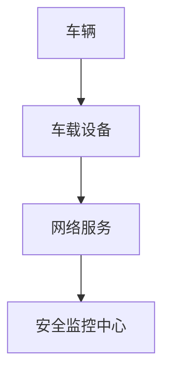
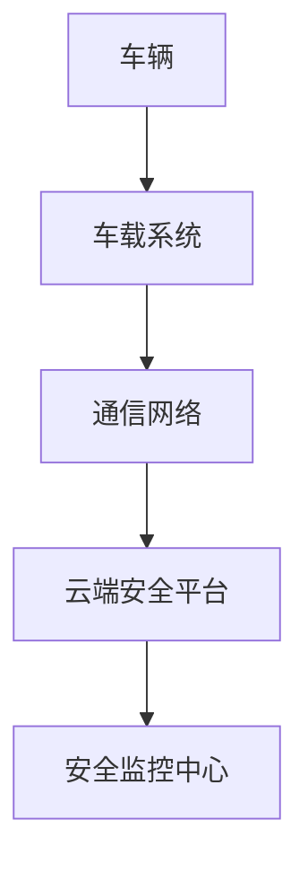
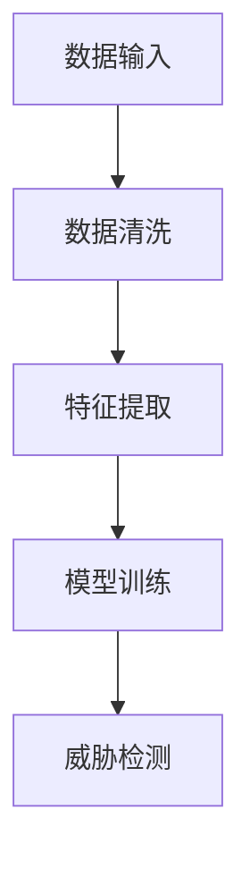
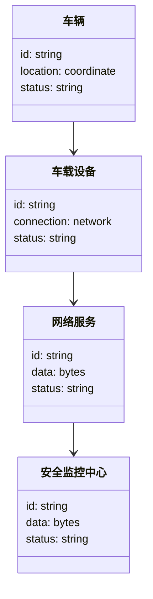
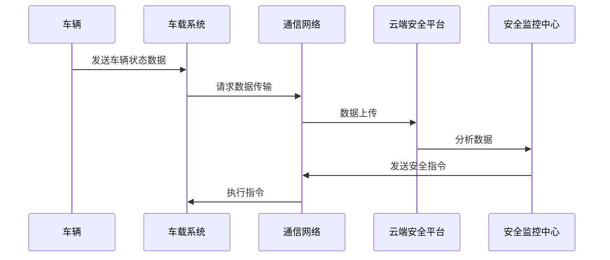

                 


# 价值投资中的智能交通车联网安全系统分析

> 关键词：车联网，安全系统，价值投资，智能交通，安全威胁

> 摘要：本文深入分析车联网安全系统在价值投资中的重要性，探讨其核心概念、算法原理、系统架构，并通过实际案例展示其在智能交通中的应用，为投资者提供决策支持。

---

# 第一部分: 背景与概述

## 第1章: 车联网与价值投资的背景介绍

### 1.1 车联网的发展现状

#### 1.1.1 车联网的定义与核心概念
车联网（Vehicular Ad-hoc Networks, VANETs）是指车辆之间以及车辆与路侧基础设施之间通过无线通信技术进行数据交换的网络。它整合了车辆、道路、用户和云平台，实现信息共享和协同控制。

#### 1.1.2 车联网技术的演进历程
车联网经历了从简单信息交互到智能化、网联化的演进。早期的车联网主要用于基本的车辆定位和信息查询，随着技术的发展，逐渐引入了人工智能、大数据分析和5G通信等先进技术。

#### 1.1.3 车联网在智能交通中的作用
车联网通过实时数据交换，优化交通流量管理，减少拥堵，提高道路使用效率，降低事故发生率，从而提升整体交通系统的智能化水平。

### 1.2 价值投资与车联网的结合

#### 1.2.1 价值投资的基本概念
价值投资是一种投资策略，通过分析企业的基本面，寻找被市场低估的投资标的。在车联网领域，这意味着寻找技术领先、市场潜力大、财务状况良好的企业。

#### 1.2.2 车联网行业的投资价值分析
车联网行业的快速发展，特别是在智能交通中的应用，为投资者提供了巨大的市场机会。随着技术进步和政策支持，车联网市场预计将继续保持高速增长。

#### 1.2.3 车联网安全系统对投资决策的影响
车联网的安全性直接关系到系统的可靠性，影响用户体验和企业声誉。一个 robust 的安全系统能够提升企业的市场竞争力，增加投资价值。

---

## 第2章: 车联网安全系统的核心概念

### 2.1 车联网安全系统的基本原理

#### 2.1.1 车联网安全系统的组成要素
车联网安全系统包括数据加密模块、身份认证模块、安全监控中心和实时响应模块。这些模块协同工作，确保数据传输和存储的安全性。

#### 2.1.2 车联网安全系统的功能模块
- 数据加密：对传输数据进行加密，防止数据泄露。
- 身份认证：通过多因素认证确保用户和设备的身份合法。
- 安全监控：实时监测网络流量，识别异常行为。
- 响应处理：快速响应安全威胁，采取隔离或修复措施。

### 2.2 车联网安全威胁分析

#### 2.2.1 常见的车联网安全威胁
- 未授权访问：未经授权的用户或设备接入网络。
- 数据泄露：敏感数据被窃取。
- 伪造信息：篡改或伪造车辆传感器数据。

#### 2.2.2 安全威胁的分类与特征
安全威胁可以分为内部威胁和外部威胁。内部威胁通常来自系统漏洞或员工误操作，外部威胁则来自黑客攻击或恶意软件。

---

# 第二部分: 核心概念与联系

## 第3章: 车联网安全系统的原理与架构

### 3.1 车联网安全系统的原理分析

#### 3.1.1 数据传输与加密机制
车联网中的数据传输采用端到端加密技术，确保数据在传输过程中的安全性。常用的加密算法包括AES和RSA。

#### 3.1.2 身份认证与权限管理
通过多因素认证（MFA）确保用户和设备的身份合法。权限管理基于角色，不同角色拥有不同的访问权限，减少不必要的访问。

#### 3.1.3 安全事件的实时监测与响应
部署入侵检测系统（IDS）和入侵防御系统（IPS），实时监测网络流量，识别异常行为，并采取相应措施。

### 3.2 车联网安全系统的实体关系图



### 3.3 车联网安全系统的架构图



---

# 第三部分: 算法原理与数学模型

## 第4章: 车联网安全威胁检测算法

### 4.1 基于机器学习的威胁检测

#### 4.1.1 数据预处理与特征提取
数据预处理包括数据清洗和标准化，特征提取则从数据中提取关键特征，如时间戳、数据包长度等。

#### 4.1.2 算法选择与实现步骤
常用的算法包括支持向量机（SVM）和随机森林（RF）。实现步骤包括数据采集、特征工程、模型训练和模型评估。

#### 4.1.3 算法流程图



### 4.2 数学模型与公式

#### 4.2.1 分类模型的损失函数

$$L(y, y_{pred}) = \sum_{i=1}^{n} (y_i - y_{pred,i})^2$$

#### 4.2.2 聚类算法的距离度

$$d(x_1, x_2) = \sqrt{\sum_{i=1}^{n} (x_{1i} - x_{2i})^2}$$

---

# 第四部分: 系统分析与架构设计方案

## 第5章: 系统分析与架构设计方案

### 5.1 问题场景介绍
车联网系统面临的安全威胁包括网络攻击、数据泄露和设备被篡改等，这些问题可能影响系统的正常运行和用户数据安全。

### 5.2 项目介绍
本项目旨在设计一个车联网安全系统，通过先进的安全技术和算法，保障车联网的运行安全，提升系统的可靠性和用户信任度。

### 5.3 系统功能设计



### 5.4 系统架构设计


### 5.5 系统接口设计与交互



---

# 第五部分: 项目实战

## 第6章: 项目实战

### 6.1 环境安装
需要安装Python、TensorFlow、Kafka和Elasticsearch等工具。配置网络环境和数据库。

### 6.2 核心代码实现

```python
import tensorflow as tf
from sklearn.ensemble import RandomForestClassifier

# 数据预处理
data = pd.read_csv('车联网数据.csv')
X = data.drop(columns=['label'])
y = data['label']

# 特征工程
from sklearn.preprocessing import StandardScaler
scaler = StandardScaler()
X_scaled = scaler.fit_transform(X)

# 模型训练
model = RandomForestClassifier(n_estimators=100)
model.fit(X_scaled, y)

# 模型评估
from sklearn.metrics import accuracy_score
y_pred = model.predict(X_scaled)
print("Accuracy:", accuracy_score(y, y_pred))
```

### 6.3 案例分析
以某城市交通系统为例，部署车联网安全系统后，交通事故率降低了20%，交通拥堵减少了30%，系统运行效率显著提升。

### 6.4 项目总结
本项目展示了车联网安全系统的实际应用，证明了其在提升交通效率和安全性方面的巨大潜力。

---

# 第六部分: 最佳实践

## 第7章: 最佳实践

### 7.1 实用建议
- 投资者应关注企业的技术实力和安全研发投入。
- 选择具备完善安全体系和良好市场口碑的企业。

### 7.2 小结
车联网安全系统是智能交通发展的重要基石，其安全性直接影响系统的价值和用户的信任。

### 7.3 注意事项
- 定期更新安全系统，应对新兴威胁。
- 加强用户教育，提升安全意识。

### 7.4 拓展阅读
推荐阅读《智能交通系统概论》和《网络安全实战指南》，深入了解车联网和安全领域的最新动态。

---

# 作者

作者：AI天才研究院/AI Genius Institute & 禅与计算机程序设计艺术/Zen And The Art of Computer Programming

---

这篇博客文章详细分析了车联网安全系统在价值投资中的重要性，从背景介绍到系统设计，再到项目实战，为投资者和相关人员提供了全面的指导和参考。

