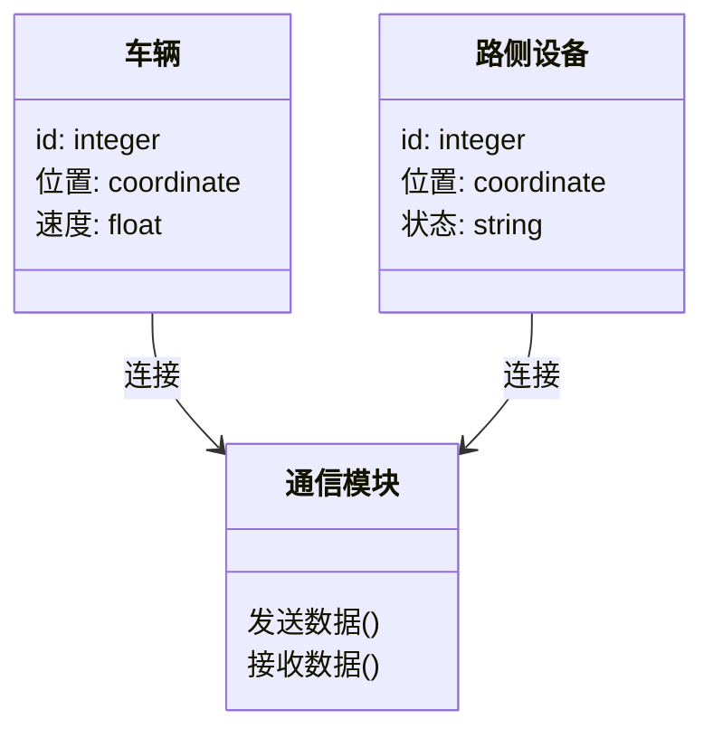
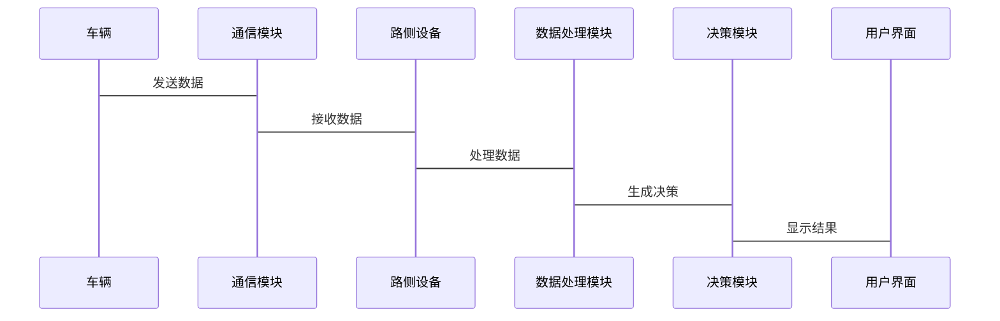

                 


# 价值投资中的智能交通车路协同系统分析

## 关键词
价值投资、智能交通、车路协同、系统分析、投资决策、数据分析

## 摘要
本文深入探讨了价值投资与智能交通车路协同系统之间的关系，分析了车路协同系统的组成、核心技术及其对投资决策的影响。通过构建分析框架，评估系统投资价值，并结合实际案例，为投资者提供科学决策支持。

---

# 第一部分: 价值投资中的智能交通车路协同系统背景

## 第1章: 价值投资与智能交通车路协同系统概述

### 1.1 价值投资的基本概念
#### 1.1.1 价值投资的定义与核心理念
价值投资是一种投资策略，强调通过分析企业基本面，寻找市场价格低于内在价值的投资机会。其核心理念包括：
- **安全边际**：买入价格低于内在价值。
- **长期视角**：关注企业的长期盈利能力。
- **企业分析**：研究企业的财务状况、竞争优势和管理团队。

#### 1.1.2 价值投资在现代金融中的地位
价值投资是投资学的重要流派，尤其在市场波动中表现出稳定性。它结合了基本面分析和市场估值，帮助投资者在不确定市场中寻找可靠的投资机会。

#### 1.1.3 价值投资与技术分析的区别
- **技术分析**：基于价格和成交量数据预测市场走势。
- **价值投资**：侧重于分析企业的内在价值，强调长期持有的策略。

### 1.2 智能交通车路协同系统的定义
#### 1.2.1 车路协同系统的概念
车路协同系统是智能交通系统的一部分，通过车辆与道路基础设施之间的通信，实现车辆位置、速度和环境数据的共享，优化交通流和提高安全性。

#### 1.2.2 车路协同系统的组成与功能
- **硬件**：传感器、摄像头、通信设备。
- **软件**：数据处理算法、决策系统。
- **功能**：实时数据传输、交通优化、应急响应。

#### 1.2.3 车路协同系统的技术特点
- **实时性**：快速数据处理和传输。
- **可靠性**：高可用性和容错能力。
- **安全性**：数据加密和安全传输。

### 1.3 价值投资与车路协同系统的结合
#### 1.3.1 车路协同系统在智能交通中的应用
车路协同系统通过优化交通流量和减少事故发生，提升道路使用效率，降低成本。

#### 1.3.2 车路协同系统如何影响投资决策
- 提供实时交通数据，辅助投资决策。
- 优化交通管理，提升企业运营效率。

#### 1.3.3 价值投资视角下的车路协同系统分析框架
- 评估企业技术实力。
- 分析市场前景和竞争环境。
- 考虑政策支持和行业趋势。

### 1.4 本章小结
价值投资关注企业的长期价值，车路协同系统的技术优势和市场前景为投资者提供了新的分析维度。

---

## 第2章: 车路协同系统的核心技术分析

### 2.1 车路协同系统的通信技术
#### 2.1.1 5G在车路协同中的应用
5G技术提供了高速、低延迟的通信能力，是车路协同系统的关键支持。

#### 2.1.2 车路协同的通信协议
- **V2X（车与一切）**：车辆与车辆、基础设施、行人的通信。
- **协议标准**：如LTE-V、5G-NR。

#### 2.1.3 通信技术对系统性能的影响
通信延迟和带宽直接影响系统的实时性和稳定性。

### 2.2 车路协同系统的数据处理技术
#### 2.2.1 数据采集与处理流程
- 数据采集：传感器、摄像头。
- 数据清洗：去除噪声数据。
- 数据融合：整合多源数据。

#### 2.2.2 数据融合技术
- **多传感器融合**：使用加权融合算法提升数据准确性。
- **数据融合流程图**（Mermaid）：
  ```mermaid
  graph TD
      A[传感器数据] --> B[数据清洗]
      B --> C[特征提取]
      C --> D[融合算法]
      D --> E[融合结果]
  ```

#### 2.2.3 数据安全与隐私保护
- 数据加密：保护传输数据。
- 访问控制：限制数据访问权限。

### 2.3 车路协同系统的算法与模型
#### 2.3.1 机器学习在车路协同中的应用
- **分类算法**：用于交通流量预测。
- **回归算法**：预测交通延误。

#### 2.3.2 深度学习模型的构建与优化
- **卷积神经网络（CNN）**：处理图像数据。
- **长短期记忆网络（LSTM）**：处理时间序列数据。

#### 2.3.3 算法对系统决策的影响
- 算法准确性直接影响决策质量。

### 2.4 本章小结
车路协同系统的技术优势为价值投资者提供了可靠的数据支持和决策依据。

---

## 第3章: 价值投资中的车路协同系统分析框架

### 3.1 车路协同系统的投资价值评估
#### 3.1.1 评估指标的定义与选择
- **技术指标**：研发能力、专利数量。
- **市场指标**：市场份额、竞争格局。

#### 3.1.2 评估模型的构建与应用
- **层次分析法（AHP）**：构建评估模型。
- **模型应用步骤**：
  1. 确定评估指标。
  2. 构建判断矩阵。
  3. 计算权重并排序。

#### 3.1.3 评估结果对投资决策的影响
- 评估结果为投资决策提供科学依据。

### 3.2 车路协同系统的市场与竞争分析
#### 3.2.1 市场分析
- 行业发展趋势：智能化、网联化。
- 市场规模预测：使用线性回归模型预测。

#### 3.2.2 竞争分析
- 主要竞争对手分析：技术、市场、财务状况。
- 竞争优势：成本、技术、品牌。

### 3.3 价值投资策略
#### 3.3.1 高质量企业的识别
- 高ROE（净资产收益率）。
- 可持续竞争优势。

#### 3.3.2 风险评估与管理
- 系统性风险：市场波动。
- 非系统性风险：企业特定风险。

### 3.4 本章小结
构建科学的分析框架，帮助投资者准确评估车路协同系统的投资价值。

---

## 第4章: 车路协同系统的系统分析与架构设计

### 4.1 系统功能设计
#### 4.1.1 领域模型（Mermaid类图）


#### 4.1.2 系统功能模块
- 数据采集模块：采集车辆和路侧设备数据。
- 数据处理模块：清洗和融合数据。
- 决策模块：生成交通优化方案。

### 4.2 系统架构设计
#### 4.2.1 系统架构（Mermaid架构图）


#### 4.2.2 接口设计
- API接口：数据获取和推送。
- 接口规范：RESTful API。

### 4.3 系统交互设计
#### 4.3.1 系统交互流程（Mermaid序列图）


### 4.4 本章小结
系统架构和交互设计为价值投资者提供了清晰的数据分析路径。

---

## 第5章: 价值投资中的车路协同系统项目实战

### 5.1 环境安装与配置
- **工具安装**：Python、Jupyter Notebook、TensorFlow。
- **数据获取**：通过API获取交通数据。

### 5.2 核心代码实现
#### 5.2.1 数据处理代码
```python
import pandas as pd
import numpy as np

# 数据清洗
data = pd.read_csv('traffic_data.csv')
data_clean = data.dropna()
```

#### 5.2.2 机器学习模型实现
```python
from sklearn.linear_model import LinearRegression

model = LinearRegression()
model.fit(X_train, y_train)
```

#### 5.2.3 模型评估
```python
from sklearn.metrics import mean_squared_error

y_pred = model.predict(X_test)
mse = mean_squared_error(y_test, y_pred)
print(f"MSE: {mse}")
```

### 5.3 实际案例分析
#### 5.3.1 案例背景
某城市试点车路协同系统，收集了6个月的交通数据。

#### 5.3.2 数据分析与解读
- 使用回归模型预测交通流量。
- 识别高峰时段和拥堵点。

### 5.4 项目总结
- 项目成果：优化了交通流量，减少了事故发生率。
- 经验总结：数据质量和模型选择对结果影响重大。

---

## 第6章: 总结与展望

### 6.1 总结
车路协同系统为价值投资提供了新的分析维度，通过技术分析和市场分析的结合，帮助投资者做出更明智的投资决策。

### 6.2 展望
随着5G和人工智能技术的发展，车路协同系统将在交通管理和投资决策中发挥更大作用。

---

## 作者：AI天才研究院/AI Genius Institute & 禅与计算机程序设计艺术 /Zen And The Art of Computer Programming

---

通过以上结构，文章详细分析了价值投资与车路协同系统的结合，为投资者提供了科学的决策支持。

