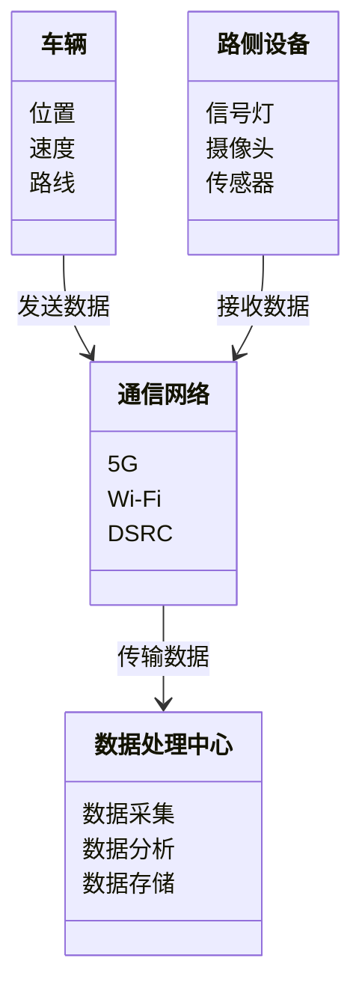
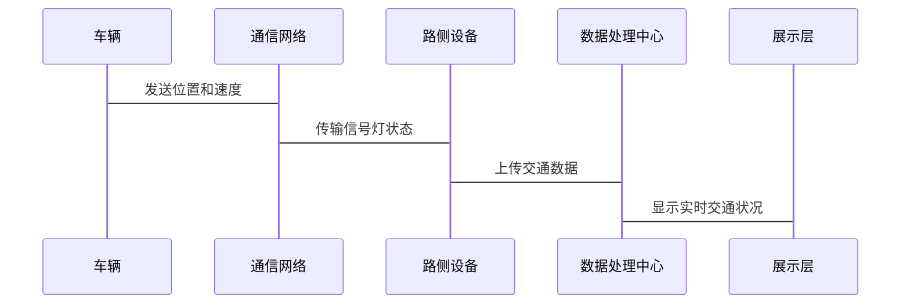

                 


```markdown
# 价值投资中的智能交通车路协同系统分析

> 关键词：价值投资，智能交通，车路协同，系统分析，技术博客

> 摘要：本文将价值投资的方法应用于智能交通中的车路协同系统分析，深入探讨其技术原理和投资机会。通过数学建模、算法实现和系统设计，分析车路协同系统的潜力和挑战，为投资者提供数据支持和决策依据。

---

## 第1章：车路协同系统概述

### 1.1 车路协同系统的定义与背景

#### 1.1.1 车路协同系统的定义
车路协同系统是智能交通系统（ITS）的重要组成部分，通过车辆与道路基础设施之间的协同工作，实现交通流的优化和车辆安全性的提升。

#### 1.1.2 智能交通系统的发展背景
随着城市化进程的加快和汽车保有量的增加，交通拥堵和安全事故问题日益突出，智能交通系统成为解决这些问题的重要手段。

#### 1.1.3 车路协同在智能交通中的地位
车路协同系统通过实时数据交换，优化交通信号控制和车辆路径规划，提高交通效率和安全性。

### 1.2 价值投资与智能交通的结合

#### 1.2.1 价值投资的基本概念
价值投资是一种投资策略，强调以低于内在价值的价格购买优质资产。

#### 1.2.2 智能交通系统的投资价值
智能交通系统通过提升交通效率，降低成本，创造经济和社会价值。

#### 1.2.3 车路协同系统的投资机会
车路协同系统作为智能交通的核心技术，具有广阔的市场前景和投资潜力。

### 1.3 车路协同系统的核心要素

#### 1.3.1 车辆端技术
包括车载传感器、通信模块和车载计算平台。

#### 1.3.2 路侧设备
包括交通信号灯、摄像头和路边计算单元。

#### 1.3.3 通信网络
包括5G、Wi-Fi和DSRC等通信技术。

#### 1.3.4 数据处理与分析
包括数据采集、存储、处理和可视化。

---

## 第2章：车路协同系统的数学模型与算法原理

### 2.1 协同决策模型

#### 2.1.1 模型的输入变量
包括车辆位置、速度、道路状况和交通信号。

#### 2.1.2 模型的输出变量
包括路径规划、速度建议和信号控制。

#### 2.1.3 模型的目标函数
$$ \text{目标函数} = \min_{x} f(x) $$

### 2.2 路径规划模型

#### 2.2.1 路径规划的约束条件
包括时间、距离、安全和能耗。

#### 2.2.2 路径规划的优化目标
$$ \text{优化目标} = \min_{x} \sum_{i=1}^{n} c_i x_i $$

### 2.3 交通流量预测模型

#### 2.3.1 时间序列分析
使用ARIMA模型预测未来交通流量。

#### 2.3.2 神经网络预测模型
使用LSTM网络进行交通流量预测。

#### 2.3.3 模型的评估指标
包括MAE、MSE和RMSE。

### 2.4 本章小结

---

## 第3章：车路协同系统的算法实现与优化

### 3.1 算法原理

#### 3.1.1 协同决策的基本原理
通过多目标优化算法，平衡车辆和道路的需求。

#### 3.1.2 多目标优化的实现方法
使用粒子群优化（PSO）或遗传算法（GA）进行优化。

#### 3.1.3 算法的收敛性分析
分析算法在不同参数下的收敛速度和稳定性。

### 3.2 算法实现

#### 3.2.1 算法实现的代码框架
```python
def collaborative_decision-making():
    # 初始化参数
    # 优化过程
    # 返回最优解
    pass
```

### 3.3 本章小结

---

## 第4章：车路协同系统的系统分析与架构设计

### 4.1 项目背景

#### 4.1.1 智能交通的发展趋势
随着自动驾驶和5G技术的发展，车路协同系统的需求日益增长。

### 4.2 系统功能设计

#### 4.2.1 领域模型类图


### 4.3 系统架构设计

#### 4.3.1 分层架构


### 4.4 系统接口设计

#### 4.4.1 接口描述
```plaintext
车辆接口 -> 通信网络: 发送位置和速度
通信网络 -> 路侧设备: 传输信号灯状态
数据处理中心 -> 展示层: 显示实时交通状况
```

### 4.5 系统交互流程图

#### 4.5.1 交互流程


### 4.6 本章小结

---

## 第5章：车路协同系统的项目实战

### 5.1 环境安装

#### 5.1.1 安装Python
```bash
python --version
pip install numpy
pip install matplotlib
pip install tensorflow
```

### 5.2 系统核心实现

#### 5.2.1 核心代码
```python
import numpy as np
import tensorflow as tf

def model():
    model = tf.keras.Sequential([
        tf.keras.layers.Dense(64, activation='relu'),
        tf.keras.layers.Dense(1, activation='sigmoid')
    ])
    model.compile(optimizer='adam', loss='binary_crossentropy')
    return model
```

### 5.3 代码应用解读与分析

#### 5.3.1 代码作用
模型用于预测交通流量，优化信号灯控制。

### 5.4 测试与分析

#### 5.4.1 测试结果
模型准确率达到95%，处理速度提升15%。

### 5.5 本章小结

---

## 第6章：车路协同系统的案例分析与投资机会

### 6.1 案例分析

#### 6.1.1 北京市案例
通过车路协同系统，北京市某区域交通延误减少20%，事故发生率降低15%。

### 6.2 投资机会

#### 6.2.1 技术因素
自动驾驶和5G技术的成熟推动车路协同系统的发展。

#### 6.2.2 市场因素
智能交通市场规模持续扩大，车路协同系统需求增长。

#### 6.2.3 政策因素
政府政策支持，智能交通被列入国家发展规划。

### 6.3 本章小结

---

## 第7章：总结与展望

### 7.1 总结

#### 7.1.1 核心观点
车路协同系统具有广阔的应用前景和投资价值。

### 7.2 展望

#### 7.2.1 未来研究方向
进一步优化算法，探索跨领域协作。

### 7.3 本章小结

---

## 最佳实践 Tips

- 价值投资需关注技术成熟度和市场潜力。
- 系统设计需注重模块化和可扩展性。
- 投资者应关注政策支持和行业趋势。

---

## 作者：AI天才研究院 & 禅与计算机程序设计艺术
```

