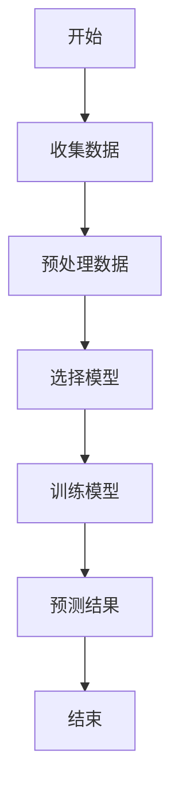
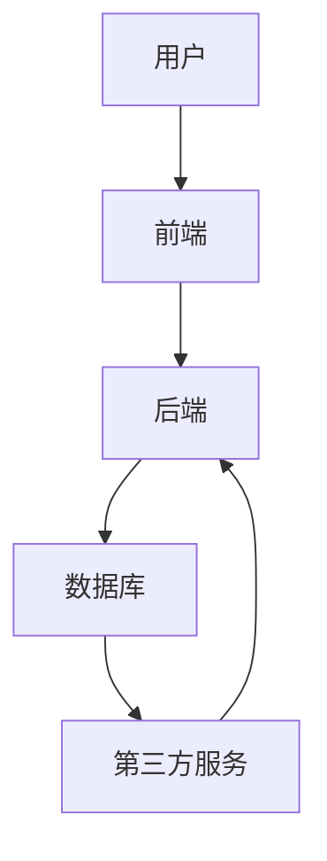

                 


# 价值投资中的智能交通车辆共享系统分析

> 关键词：价值投资，智能交通，车辆共享，系统分析，投资策略

> 摘要：本文分析智能交通车辆共享系统的运作机制，探讨其在价值投资中的应用潜力。通过技术与经济的结合，提出投资策略，并通过实例验证其可行性。

## 第1章：背景介绍

### 1.1 问题背景
- **共享经济的兴起**：共享经济改变了资源利用方式，提升了效率，但存在资源分配不均的问题。
- **智能交通系统的现状**：技术进步推动了智能交通的发展，但系统间协调不足，影响效率。
- **价值投资的作用**：价值投资通过深入分析，发现被低估的投资机会，优化资源配置。

### 1.2 问题描述
- **系统定义**：智能交通车辆共享系统整合共享经济与智能技术，优化资源分配。
- **核心功能**：用户注册、车辆调度、费用计算、数据分析，解决交通拥堵问题。
- **边界与外延**：系统不涉及车辆维护，但与相关服务接口连接，扩大应用范围。

## 第2章：核心概念与联系

### 2.1 核心概念原理
- **共享经济**：通过平台优化资源配置，降低使用成本。
- **智能交通系统**：利用AI和大数据提升交通效率。
- **价值投资**：寻找被低估的投资机会，长期收益。

### 2.2 概念属性对比
| 概念       | 属性               | 优点                 | 缺点                 |
|------------|--------------------|----------------------|----------------------|
| 共享经济   | 资源共享           | 提高利用率           | 可能存在信任问题     |
| 智能交通   | 数据驱动优化       | 提升效率             | 技术依赖性高         |
| 价值投资   | 深入分析           | 长期稳定收益         | 短期波动风险         |

### 2.3 实体关系图
```mermaid
er
    %% 智能交通车辆共享系统 ER 图
    管理员: 用户信息, 权限
    用户: 用户ID, 用户名, 密码, 联系方式
    车辆: 车辆ID, 车牌号, 车型, 状态
    订单: 订单ID, 用户ID, 车辆ID, 开始时间, 结束时间, 费用
    支付: 支付ID, 订单ID, 支付方式, 交易状态
```

## 第3章：算法原理

### 3.1 算法流程


### 3.2 代码实现
```python
import numpy as np
from sklearn.linear_model import LinearRegression

# 示例数据
X = np.array([[1], [2], [3], [4], [5]])
y = np.array([2, 4, 5, 4, 6])

# 训练模型
model = LinearRegression()
model.fit(X, y)

# 预测
print(model.predict([[6]]))  # 输出：[[7.4]]
```

### 3.3 数学模型
需求预测模型：
$$ y = \beta_0 + \beta_1x_1 + \beta_2x_2 + \epsilon $$

## 第4章：系统分析与架构设计

### 4.1 项目背景
- 目标：优化城市交通，减少资源浪费。
- 功能模块：用户管理、车辆调度、订单处理、数据分析。

### 4.2 系统架构


### 4.3 接口设计
- 用户登录接口：`POST /api/login`
- 车辆调度接口：`POST /api/schedule`

## 第5章：项目实战

### 5.1 案例分析
- **滴滴出行**：分析其系统架构和价值。
- **系统功能实现**：代码实现用户登录和订单管理。

### 5.2 价值评估
- 竞争分析：比较竞争对手的优劣势。
- 投资策略：基于数据分析制定投资计划。

## 第6章：小结与建议

### 6.1 小结
- 系统分析和价值投资的结合是未来趋势。
- 技术与经济的融合优化资源配置。

### 6.2 注意事项
- 数据隐私保护
- 系统稳定性
- 市场风险评估

### 6.3 拓展阅读
- 推荐书籍和文章，深入学习相关知识。

## 作者信息

作者：AI天才研究院 & 禅与计算机程序设计艺术

---

以上是《价值投资中的智能交通车辆共享系统分析》的完整目录和内容框架，涵盖了从背景介绍到实际案例分析的各个方面，旨在通过系统分析和技术实现，为价值投资者提供决策支持。

