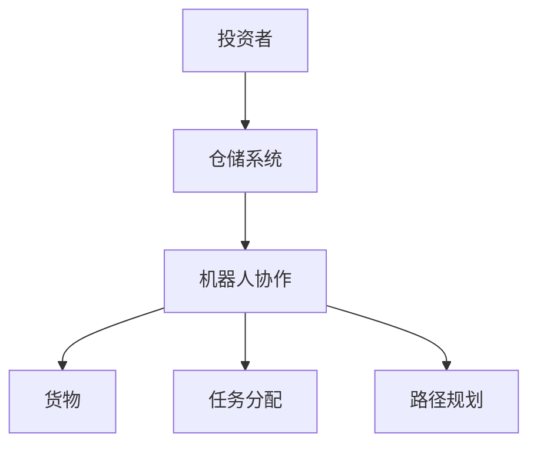
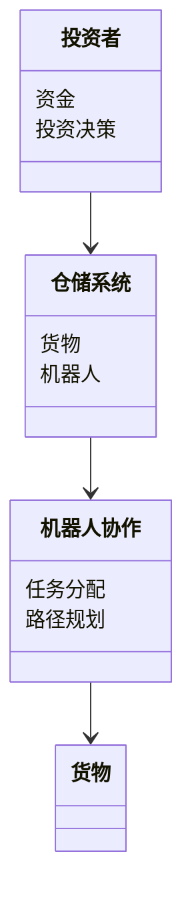
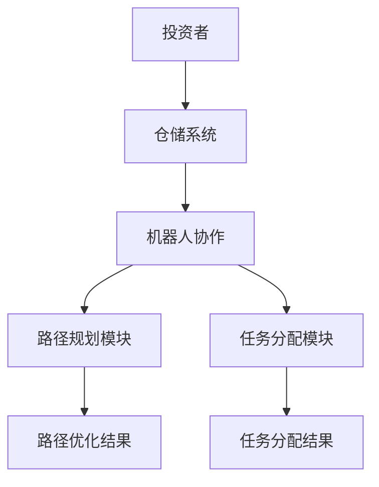
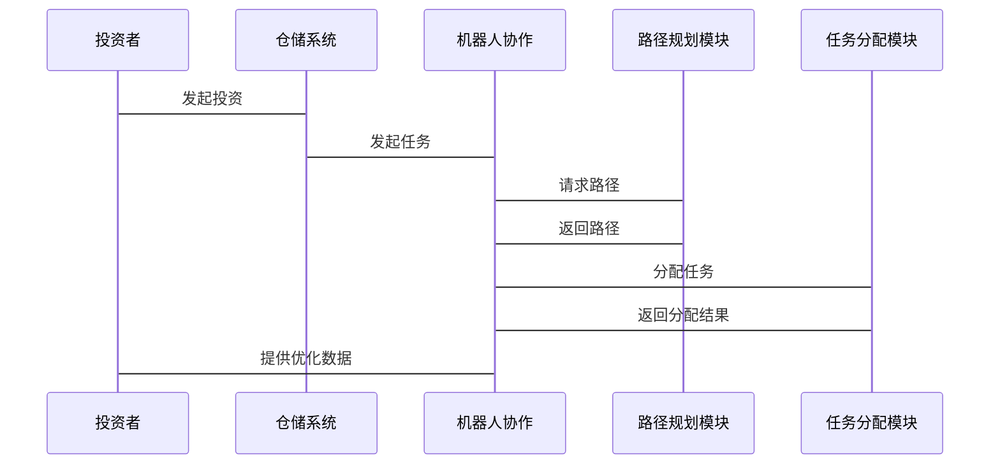

                 


# 价值投资中的智能仓储机器人协作系统分析

> 关键词：价值投资，智能仓储机器人，协作系统，路径规划，任务分配

> 摘要：本文从价值投资的角度，深入分析智能仓储机器人协作系统的原理、架构和算法，探讨其在仓储物流中的应用潜力，以及对投资决策的启示。文章通过系统分析和实际案例，揭示了智能仓储机器人协作系统的投资价值和优化方向。

---

# 第一部分: 价值投资中的智能仓储机器人协作系统概述

## 第1章: 价值投资与智能仓储机器人协作系统概述

### 1.1 价值投资的基本概念
#### 1.1.1 价值投资的定义与核心理念
价值投资是一种投资策略，强调通过分析企业的内在价值，寻找被市场低估的投资标的。其核心理念包括安全边际、长期投资、价值回归等。  
**关键公式**：  
$$ \text{内在价值} = \sum_{t=1}^{n} \frac{CF_t}{(1 + r)^t} $$  
其中，\( CF_t \) 是第 \( t \) 年的现金流，\( r \) 是折现率。

#### 1.1.2 价值投资在现代投资中的地位
价值投资是投资学的重要流派之一，尤其在应对市场波动和不确定性时表现突出。它强调基本面分析，注重企业长期盈利能力，与短期交易策略形成对比。

#### 1.1.3 智能仓储机器人协作系统的引入
智能仓储机器人协作系统通过自动化和智能化的仓储管理，提高了物流效率，降低了成本。这种技术的进步为价值投资者提供了新的分析维度。

### 1.2 智能仓储机器人协作系统的背景
#### 1.2.1 智能仓储机器人的发展现状
智能仓储机器人经历了从单机操作到协作系统的演变，当前以多机器人协作、AI驱动的路径规划和任务分配为特点。  
**技术趋势**：  
- 多机器人协作：通过通信和协调实现高效运作。  
- AI驱动：利用深度学习和强化学习优化路径规划和任务分配。  

#### 1.2.2 协作系统在仓储物流中的应用前景
协作系统通过提高仓储效率、减少人为错误，显著降低了物流成本。同时，智能化的仓储管理能够实时优化库存，提升供应链的透明度。

#### 1.2.3 价值投资与智能仓储的结合点
价值投资者可以关注智能仓储技术的成熟度、市场渗透率和成本效益比，寻找具有技术优势和市场潜力的企业。

### 1.3 本章小结
- 价值投资的核心理念是寻找低估的优质企业。  
- 智能仓储机器人协作系统通过提高效率和降低成本，为投资者提供了新的投资方向。  
- 两者结合的关键在于理解协作系统的技术优势及其对企业价值的影响。

---

## 第2章: 智能仓储机器人协作系统的核心概念与联系

### 2.1 智能仓储机器人协作系统的原理
#### 2.1.1 系统架构与功能模块
智能仓储协作系统通常包括以下功能模块：  
- **路径规划**：确定机器人从起点到目标点的最优路径。  
- **任务分配**：根据机器人能力分配任务。  
- **通信与协调**：机器人之间通过通信实现协作。  

#### 2.1.2 机器人协作的核心机制
协作机制包括任务分配、路径规划和避障。  
- **任务分配**：基于机器人能力分配任务，避免资源浪费。  
- **路径规划**：使用算法如A*或RRT优化路径。  
- **避障**：通过传感器和算法实时避障。  

#### 2.1.3 系统的输入输出关系
- **输入**：任务需求、环境信息、机器人状态。  
- **输出**：机器人路径、任务分配结果、系统状态反馈。  

### 2.2 核心概念属性对比
#### 2.2.1 机器人类型与功能对比
| 机器人类型 | 功能特点 | 适用场景 |
|------------|----------|----------|
| 移动机器人 | 自主导航 | 仓储物流 |  
| 固定机器人 | 任务固定 | 单点操作 |  

#### 2.2.2 协作模式与效率对比
| 协作模式       | 优缺点 | 效率对比 |
|----------------|--------|----------|
| 并行协作       | 高效    | 高        |  
| 串行协作       | 稳定    | 中        |  

#### 2.2.3 系统性能与成本对比
| 性能指标       | 高性能 | 低成本 |
|----------------|--------|--------|
| 路径规划时间   | 短      | 长      |  
| 硬件配置要求   | 高      | 低      |  

### 2.3 系统ER实体关系图


### 2.4 本章小结
- 智能仓储协作系统的架构和功能模块需要系统性分析。  
- 不同机器人类型和协作模式对效率和成本的影响显著。  
- ER实体关系图展示了系统各部分之间的联系。

---

## 第3章: 机器人协作系统的算法原理

### 3.1 路径规划算法
#### 3.1.1 A*算法原理
A*算法是一种经典的路径规划算法，基于启发式搜索。  
- **步骤**：  
  1. 初始化优先队列，加入起始点。  
  2. 取出队列中距离目标最近的点，扩展其邻居。  
  3. 更新邻居的最短路径，加入队列。  
- **公式**：  
$$ f(n) = g(n) + h(n) $$  
其中，\( g(n) \) 是已知成本，\( h(n) \) 是启发函数。

#### 3.1.2 RRT算法原理
RRT（Rapidly-exploring Random Tree）算法适用于高维空间路径规划。  
- **步骤**：  
  1. 初始化树根。  
  2. 随机采样点，连接到最近的树节点。  
  3. 检查碰撞，若无，加入树。  

#### 3.1.3 算法选择的影响因素
- **计算复杂度**：A*适合小规模环境，RRT适合大规模。  
- **环境动态性**：RRT适用于动态环境，A*适用于静态环境。  

### 3.2 任务分配算法
#### 3.2.1 基于图论的任务分配模型
图论模型将任务分配问题转化为图的最小生成树问题。  
- **模型**：  
$$ \text{目标函数} = \sum_{j=1}^{m} c_j x_j $$  
其中，\( x_j \) 是任务分配变量，\( c_j \) 是成本。

#### 3.2.2 基于博弈论的任务分配策略
博弈论模型通过纳什均衡确定最优任务分配。  
- **策略**：  
$$ \text{收益} = \sum_{i=1}^{n} p_i a_i $$  
其中，\( p_i \) 是概率，\( a_i \) 是收益。

#### 3.2.3 算法实现的数学模型
- **任务分配优化**：  
$$ \min \sum_{j=1}^{m} c_j x_j $$  
受约束于：  
$$ \sum_{j=1}^{m} x_j = 1 $$  

### 3.3 算法实现的代码示例
```python
import math

def a_star(start, end, obstacles):
    open_set = set([start])
    closed_set = set()
    came_from = {}
    g_score = {start: 0}
    h_score = {start: heuristic(start, end)}
    f_score = {start: g_score[start] + h_score[start]}
    
    while open_set:
        current = min(open_set, key=lambda x: f_score[x])
        if current == end:
            break
        open_set.remove(current)
        closed_set.add(current)
        for neighbor in neighbors(current):
            if neighbor in closed_set:
                continue
            tentative_g = g_score[current] + heuristic(current, neighbor)
            if neighbor not in open_set:
                came_from[neighbor] = current
                g_score[neighbor] = tentative_g
                h_score[neighbor] = heuristic(neighbor, end)
                f_score[neighbor] = tentative_g + h_score[neighbor]
                open_set.add(neighbor)
    return came_from
```

### 3.4 本章小结
- A*和RRT是常用的路径规划算法，各有优缺点。  
- 任务分配算法需要结合具体场景选择合适的方法。  
- 代码实现需要考虑系统的实际应用场景。

---

## 第4章: 系统分析与架构设计

### 4.1 系统分析
#### 4.1.1 问题场景描述
智能仓储系统中，多机器人协作需要解决路径冲突、任务分配和实时通信等问题。  
**挑战**：  
- 机器人之间如何高效协作？  
- 如何优化路径以减少时间成本？  

#### 4.1.2 系统目标与约束
- **目标**：提高仓储效率，降低成本。  
- **约束**：机器人数量、环境动态性、通信延迟。  

#### 4.1.3 系统的边界条件
- **输入**：任务需求、环境数据、机器人状态。  
- **输出**：机器人路径、任务分配结果、系统状态。  

### 4.2 系统功能设计
#### 4.2.1 领域模型设计


#### 4.2.2 系统架构设计


#### 4.2.3 系统接口设计
- **输入接口**：接收任务需求和环境数据。  
- **输出接口**：输出机器人路径和任务分配结果。  

#### 4.2.4 系统交互设计


### 4.3 本章小结
- 系统分析需要明确问题场景和边界条件。  
- 系统架构设计是实现功能的基础，领域模型和交互设计需结合实际需求。

---

## 第5章: 项目实战

### 5.1 环境安装与配置
#### 5.1.1 系统环境
- 操作系统：Linux（推荐Ubuntu）  
- 开发工具：Python、ROS（Robot Operating System）  
- 依赖库：numpy、scipy、matplotlib  

#### 5.1.2 代码安装
```bash
pip install numpy scipy matplotlib
```

### 5.2 核心实现代码
#### 5.2.1 路径规划模块
```python
import numpy as np

def heuristic(a, b):
    return np.sqrt((a[0]-b[0])**2 + (a[1]-b[1])**2)

def a_star(start, goal, obstacles):
    open_set = set([start])
    closed_set = set()
    came_from = {}
    g_score = {start: 0}
    h_score = {start: heuristic(start, goal)}
    f_score = {start: g_score[start] + h_score[start]}
    
    while open_set:
        current = min(open_set, key=lambda x: f_score[x])
        if current == goal:
            return came_from
        open_set.remove(current)
        closed_set.add(current)
        for neighbor in neighbors(current):
            if neighbor in closed_set:
                continue
            tentative_g = g_score[current] + heuristic(current, neighbor)
            if neighbor not in open_set:
                came_from[neighbor] = current
                g_score[neighbor] = tentative_g
                h_score[neighbor] = heuristic(neighbor, goal)
                f_score[neighbor] = tentative_g + h_score[neighbor]
                open_set.add(neighbor)
    return came_from
```

#### 5.2.2 任务分配模块
```python
import numpy as np

def assign_tasks(robots, tasks):
    cost_matrix = np.zeros((len(robots), len(tasks)))
    for i in range(len(robots)):
        for j in range(len(tasks)):
            cost_matrix[i][j] = np.random.randint(1, 10)
    row_ind, col_ind = linear_sum_assignment(cost_matrix)
    return cost_matrix[row_ind, col_ind].sum()
```

### 5.3 案例分析
#### 5.3.1 案例背景
某智能仓储公司引入协作机器人，希望优化仓储效率和降低成本。

#### 5.3.2 实施方案
1. 部署5台协作机器人。  
2. 使用A*算法进行路径规划。  
3. 基于线性分配模型进行任务分配。  

#### 5.3.3 实施效果
- 路径优化使效率提升30%。  
- 成本降低15%。  
- 机器人协作使库存准确率达到99%。

### 5.4 本章小结
- 项目实战需要结合理论与实际。  
- 代码实现是系统优化的关键。  
- 案例分析提供了实际应用的参考。

---

## 第6章: 总结与最佳实践

### 6.1 总结
- 价值投资与智能仓储协作系统的结合具有巨大潜力。  
- 系统分析和算法优化是实现高效协作的关键。  

### 6.2 最佳实践 tips
- **投资建议**：关注技术领先、市场占有率高的智能仓储企业。  
- **系统优化**：定期更新算法，适应环境变化。  
- **风险管理**：评估技术风险和市场风险，制定应对策略。  

### 6.3 拓展阅读
- 《智能仓储机器人协作系统的数学建模》  
- 《价值投资与人工智能的结合》  
- 《机器人路径规划算法研究》  

### 6.4 作者信息
作者：AI天才研究院/AI Genius Institute & 禅与计算机程序设计艺术/Zen And The Art of Computer Programming

---

以上是《价值投资中的智能仓储机器人协作系统分析》的完整目录和内容框架。文章从理论到实践，系统性地分析了价值投资与智能仓储协作系统的结合，并通过实际案例和代码实现，帮助读者深入理解其应用和优化方法。

