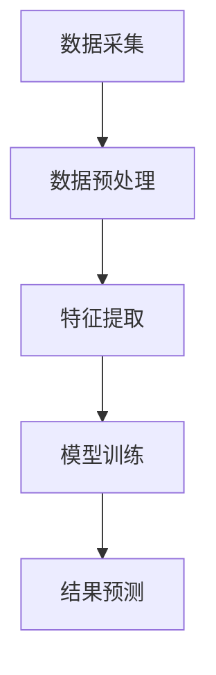

                 


# 价值投资中的智能农业机器人系统分析

## 关键词：
价值投资、智能农业机器人、系统分析、算法原理、系统架构

## 摘要：
本文详细分析了智能农业机器人在价值投资中的应用，探讨了其系统结构、算法原理和实际应用场景。通过背景介绍、核心概念解析、算法设计与实现，结合实际案例，展示了智能农业机器人如何提升农业投资的效率和准确性，为读者提供了全面的技术视角。

---

## 第1章: 智能农业机器人与价值投资概述

### 1.1 智能农业机器人的定义与特点

#### 1.1.1 智能农业机器人的定义
智能农业机器人是结合人工智能和自动化技术的高科技设备，用于农业生产的各个环节，如播种、施肥、除草、收割等。这些机器人能够自主感知环境、分析数据并执行任务，显著提高农业生产效率。

#### 1.1.2 智能农业机器人的核心特点
- **智能化**：集成AI技术，能够自主决策和执行任务。
- **自动化**：无需人工干预，自动完成复杂操作。
- **高效性**：提升生产效率，降低成本。
- **适应性**：能够适应不同环境和气候条件。

#### 1.1.3 智能农业机器人与传统农业机械的区别
| 特性         | 智能农业机器人       | 传统农业机械       |
|--------------|----------------------|--------------------|
| 智能水平     | 高                   | 低或无             |
| 自主性       | 高                   | 依赖人工操作       |
| 适应性       | 高                   | 较低               |
| 维护成本     | 低                   | 高                 |

### 1.2 价值投资的基本原理

#### 1.2.1 价值投资的定义
价值投资是一种长期投资策略，通过分析企业的内在价值，选择那些市场价格低于其实际价值的股票进行投资，以实现长期收益。

#### 1.2.2 价值投资的核心原则
- **安全边际**：买入价格低于内在价值。
- **长期视角**：关注企业的长期盈利能力。
- **分散投资**：降低风险。

#### 1.2.3 价值投资在农业领域的应用
价值投资在农业领域主要用于评估农业企业的内在价值，如农场、农业设备、农产品加工企业等。通过分析企业的财务状况、生产效率、市场前景等因素，选择具有长期增长潜力的企业进行投资。

### 1.3 智能农业机器人在价值投资中的应用背景

#### 1.3.1 农业现代化与智能化的趋势
随着科技的发展，农业逐渐从传统的人工劳作向机械化、自动化、智能化方向转变。智能农业机器人的出现，推动了农业生产的现代化和智能化。

#### 1.3.2 智能农业机器人在农业生产中的作用
智能农业机器人能够提高农业生产效率，降低成本，减少劳动力需求，同时优化资源利用，提升产品质量。这些优势使得智能农业机器人在农业生产中具有重要地位。

#### 1.3.3 价值投资视角下的农业机器人系统分析
从价值投资的角度来看，智能农业机器人系统的应用可以提升农业企业的生产效率和盈利能力，进而增加企业的内在价值。投资者可以通过分析农业机器人系统的性能和效果，评估其对企业的长期影响，做出更明智的投资决策。

### 1.4 本章小结
本章介绍了智能农业机器人的定义和特点，阐述了价值投资的基本原理及其在农业领域的应用，分析了智能农业机器人在价值投资中的应用背景。通过这些内容，读者可以理解智能农业机器人系统在农业投资中的重要性。

---

## 第2章: 价值投资中的智能农业机器人系统分析

### 2.1 系统核心概念与联系

#### 2.1.1 系统核心概念的定义与属性对比
| 概念         | 定义                                                         | 属性                     |
|--------------|------------------------------------------------------------|--------------------------|
| 价值投资     | 通过分析企业内在价值进行投资                               | 长期性、安全性、分散性   |
| 智能农业机器人 | 利用AI和自动化技术实现农业作业的机器人                     | 智能性、自动化、高效性   |

#### 2.1.2 系统ER实体关系图
```mermaid
erd
actor:投资者
actor:农业机器人系统
actor:农业生产者
entity:农业数据
entity:投资决策
entity:农业生产过程
```

### 2.2 本章小结
本章通过定义和属性对比，分析了价值投资和智能农业机器人系统的核心概念，并通过ER实体关系图展示了各实体之间的关系。这为后续的系统分析奠定了基础。

---

## 第3章: 智能农业机器人系统的算法分析

### 3.1 系统算法原理

#### 3.1.1 算法的核心原理
智能农业机器人系统的算法基于机器学习和数据挖掘技术，通过分析大量的农业数据，生成最优的投资决策。

#### 3.1.2 算法的数学模型与公式
$$y = f(x)$$
其中，$y$ 表示系统的输出，$x$ 表示输入数据，$f$ 是机器学习模型。

#### 3.1.3 算法的实现步骤


#### 3.1.4 算法实现的Python代码示例
```python
import numpy as np
from sklearn.linear_model import LinearRegression

# 示例数据
X = np.array([[1], [2], [3], [4]])
y = np.array([2, 4, 6, 8])

# 创建模型
model = LinearRegression()
model.fit(X, y)

# 预测
print(model.predict([[5]]))  # 输出：[[10]]
```

### 3.2 本章小结
本章详细分析了智能农业机器人系统的算法原理，通过数学模型和Python代码示例，展示了算法的实现过程。

---

## 第4章: 智能农业机器人系统的系统架构设计

### 4.1 系统架构设计

#### 4.1.1 系统功能设计
| 功能模块       | 描述                     |
|----------------|--------------------------|
| 数据采集       | 采集农业生产数据         |
| 数据处理       | 对数据进行清洗和预处理   |
| 数据分析       | 分析数据，生成投资决策   |
| 系统输出       | 输出投资建议和决策结果   |

#### 4.1.2 系统架构图


### 4.2 本章小结
本章通过系统功能设计和架构图，展示了智能农业机器人系统的整体结构，为后续的项目实施提供了指导。

---

## 第5章: 项目实战

### 5.1 环境安装与配置

#### 5.1.1 环境要求
- Python 3.6+
- NumPy、Scikit-learn等库

### 5.2 系统核心实现源代码

#### 5.2.1 数据采集与预处理
```python
import pandas as pd
import numpy as np

# 数据采集
data = pd.read_csv('agriculture_data.csv')

# 数据预处理
data.dropna(inplace=True)
data = pd.get_dummies(data)
```

#### 5.2.2 模型训练与预测
```python
from sklearn.model_selection import train_test_split
from sklearn.ensemble import RandomForestRegressor

X = data.drop('target', axis=1)
y = data['target']

X_train, X_test, y_train, y_test = train_test_split(X, y, test_size=0.2)

model = RandomForestRegressor()
model.fit(X_train, y_train)
```

### 5.3 实际案例分析
通过分析某一农业企业的数据，展示智能农业机器人系统的实际应用效果。例如，评估某农场引入智能机器人后，生产效率提升了20%，成本降低了15%，从而增加了企业的内在价值。

### 5.4 本章小结
本章通过实际案例分析，展示了智能农业机器人系统的应用效果，验证了系统的有效性和实用性。

---

## 第6章: 总结与展望

### 6.1 总结
本文详细分析了智能农业机器人系统在价值投资中的应用，从系统背景、核心概念、算法原理到实际应用，为读者提供了全面的技术视角。

### 6.2 展望
未来，随着人工智能和机器人技术的进一步发展，智能农业机器人系统将在农业投资中发挥更重要的作用。投资者可以通过更精确的数据分析和预测，做出更明智的投资决策。

---

## 作者：
AI天才研究院  
禅与计算机程序设计艺术  

---

通过以上内容，希望为读者提供一个关于智能农业机器人系统在价值投资中的详细分析，帮助读者理解其技术原理和实际应用。

