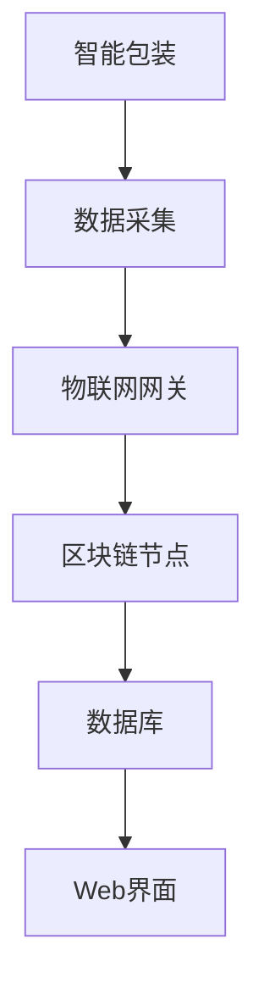

                 


# 价值投资中的智能包装与溯源系统分析

> 关键词：智能包装，溯源系统，价值投资，区块链，物联网，人工智能

> 摘要：本文分析了智能包装与溯源系统在价值投资中的应用，探讨了其核心原理、系统架构及项目实现，结合实际案例，总结了最佳实践和注意事项。

---

## 第一部分：背景介绍

### 第1章：智能包装与溯源系统概述

#### 1.1 问题背景
- **传统包装与溯源的局限性**：传统包装难以提供实时信息，溯源系统依赖人工操作，效率低且易出错。
- **价值投资中的信息不对称问题**：投资者难以获取产品的真实信息，影响决策。
- **智能技术的应用潜力**：智能包装和溯源系统通过物联网、区块链和人工智能技术，提供实时、准确的信息，助力价值投资。

#### 1.2 问题描述
- 智能包装与溯源系统的定义：整合智能技术的包装解决方案，结合区块链等技术实现产品全生命周期管理。
- 系统目标：提升透明度，减少信息不对称，帮助投资者做出明智决策。
- 当前挑战：技术集成复杂，数据安全风险，用户信任建立困难。

#### 1.3 问题解决
- 解决方案：采用智能包装和区块链技术，构建实时、透明的溯源系统。
- 技术优势：提升效率，降低成本，增强信任。

#### 1.4 系统边界与外延
- 边界：涵盖包装、物流、销售各环节，但不涉及最终消费者的使用数据。
- 外延：扩展至供应链金融、品牌管理等领域。

#### 1.5 核心要素组成
- 智能包装：集成传感器、RFID等技术。
- 溯源系统：区块链平台，记录产品信息。
- 价值评估模型：基于实时数据的分析模型。

---

## 第二部分：核心概念与联系

### 第2章：智能包装与溯源系统的核心原理

#### 2.1 核心原理
- 智能包装：利用传感器实时监测环境，记录数据。
- 溯源系统：区块链技术确保数据不可篡改，实现全程追踪。

#### 2.2 属性特征对比

| 属性         | 智能包装                         | 溯源系统                         |
|--------------|----------------------------------|----------------------------------|
| 功能         | 数据采集与传输                   | 数据存储与追踪                   |
| 技术         | 传感器、物联网                   | 区块链、分布式 ledger           |
| 应用场景       | 制造、物流                      | 追踪、防伪                      |

#### 2.3 ER图展示
```mermaid
er
    %% 智能包装与溯源系统 ER 图
    entity 智能包装 {
        key 属性: 包装ID
        属性: 温度、湿度、时间戳
    }
    
    entity 溯源系统 {
        key 属性: 产品ID
        属性: 生产日期、批次、供应链信息
    }
    
    relationship 关系 {
        智能包装 --> 溯源系统 : 记录包装状态
    }
```

---

## 第三部分：算法原理讲解

### 第3章：算法原理分析

#### 3.1 区块链算法
- **工作原理**：分布式账本，通过共识机制确保数据一致性。
- **代码示例**：
  ```python
  import hashlib

  def compute_hash(data):
      return hashlib.sha256(data.encode()).hexdigest()

  class Blockchain:
      def __init__(self):
          self.chain = []
          self.create_genesis_block()

      def create_genesis_block(self):
          self.chain.append({'index': 0, 'timestamp': '2023-01-01', 'data': 'genesis', 'hash': ''})

      def add_block(self, data):
          last_block = self.chain[-1]
          block_hash = compute_hash(data)
          new_block = {
              'index': len(self.chain),
              'timestamp': '2023-01-02',
              'data': data,
              'hash': block_hash
          }
          self.chain.append(new_block)
  ```

#### 3.2 物联网传感器算法
- **工作原理**：传感器实时采集数据，通过LoRa或NB-IoT传输。
- **数学模型**：
  $$ 温度数据 = \text{传感器读数} \times \text{校准系数} $$

#### 3.3 人工智能分类算法
- **工作原理**：利用机器学习分类产品状态。
- **代码示例**：
  ```python
  from sklearn.svm import SVC

  model = SVC()
  model.fit(X_train, y_train)
  prediction = model.predict(X_test)
  ```

---

## 第四部分：系统分析与架构设计

### 第4章：系统架构设计

#### 4.1 应用场景
- **红酒供应链**：从葡萄种植到成品销售的全流程监控。

#### 4.2 系统设计
- **功能模块**：
  - 数据采集模块：传感器采集环境数据。
  - 数据处理模块：数据清洗、分析。
  - 存储模块：区块链存储数据。
  - 展示模块：Web界面展示信息。

#### 4.3 系统架构图


---

## 第五部分：项目实战

### 第5章：红酒溯源系统实现

#### 5.1 环境安装
- **技术选型**：Python 3.8，Flask，Ethereum测试网。

#### 5.2 核心代码实现
- **传感器数据采集**：
  ```python
  import serial

  ser = serial.Serial('COM3', 9600)
  data = ser.readline().decode().strip()
  ```

- **区块链数据存储**：
  ```python
  from web3 import Web3

  w3 = Web3(Web3.HTTPProvider('https://ropsten.infura.io/v3/abc123'))
  contract = w3.eth.contract(address='0x...', abi=...)
  tx_hash = contract.functions.recordData(data).transact()
  ```

#### 5.3 案例分析
- **数据记录**：传感器记录温度和湿度，区块链记录每一步骤。
- **价值评估**：分析数据，评估红酒品质和价值。

---

## 第六部分：最佳实践

### 第6章：总结与展望

#### 6.1 最佳实践
- **数据安全**：采用多重加密和权限控制。
- **系统维护**：定期更新传感器和区块链节点。
- **用户教育**：培训用户如何解读数据。

#### 6.2 小结
智能包装与溯源系统通过技术手段解决价值投资中的信息不对称问题，提升效率和信任度。

#### 6.3 注意事项
- 数据隐私保护
- 技术集成风险
- 用户信任建立

#### 6.4 拓展阅读
- 区块链与供应链管理
- 物联网传感器技术

---

## 作者：AI天才研究院 & 禅与计算机程序设计艺术

---

这篇文章系统地分析了智能包装与溯源系统在价值投资中的应用，通过详细的章节结构和丰富的技术内容，帮助读者理解如何利用这些系统提升投资决策的效率和准确性。

