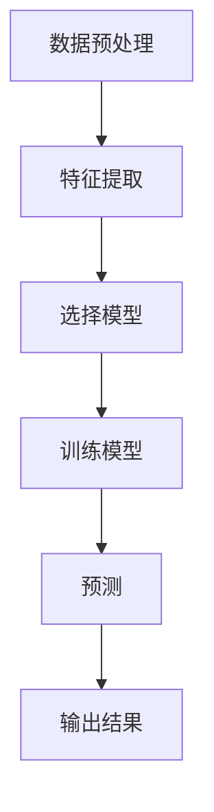
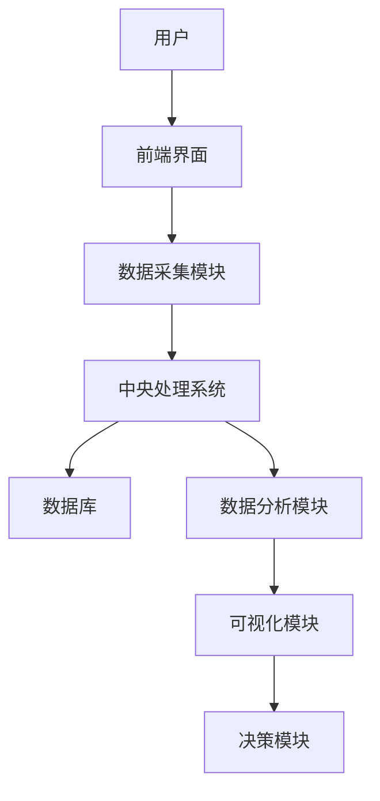
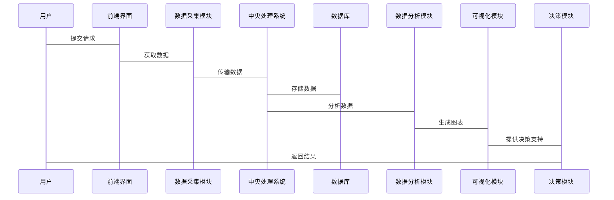

                 


# 价值投资中的智能城市地下水资源管理系统分析

> 关键词：价值投资、智能城市、地下水资源、管理系统、数据分析

> 摘要：本文从价值投资的角度，深入分析智能城市地下水资源管理系统的构建与应用。通过探讨系统的核心原理、关键技术、架构设计以及实际案例，揭示该系统如何帮助投资者识别和把握城市地下水资源管理领域的投资机会，实现长期稳健的价值增长。

---

# 第一部分: 价值投资与智能城市地下水资源管理的背景与概念

## 第1章: 价值投资与智能城市地下水资源管理概述

### 1.1 价值投资的基本概念

#### 1.1.1 价值投资的定义与核心理念
价值投资是一种长期投资策略，强调以低于市场价值的价格买入优质资产。其核心理念包括：
1. **内在价值**：资产的真实价值远高于市场短期波动带来的价格。
2. **安全边际**：买入价格与内在价值的差距越大，投资风险越小。
3. **长期视角**：关注企业的长期盈利能力，而非短期市场波动。

#### 1.1.2 价值投资在现代经济中的作用
价值投资不仅是一种投资策略，更是对市场规律的深刻理解。它帮助投资者在市场波动中保持理性，避免短期决策的盲目性。特别是在资源管理领域，价值投资可以帮助投资者识别那些能够长期稳定创造价值的项目。

#### 1.1.3 价值投资与智能技术的结合
随着人工智能、大数据等技术的快速发展，价值投资的分析工具和方法也在不断升级。智能技术能够帮助投资者更高效地分析数据、识别趋势，从而提高投资决策的准确性和效率。

---

### 1.2 智能城市地下水资源管理的背景

#### 1.2.1 城市化进程中水资源管理的挑战
城市化进程的加快带来了水资源需求的激增，同时也带来了水资源污染、过度开发等问题。传统的水资源管理方式已难以应对这些挑战，智能化管理成为必然趋势。

#### 1.2.2 智能技术在水资源管理中的应用
智能技术（如物联网、大数据、人工智能）的应用，使得地下水资源的监测、分析和管理更加高效。例如，通过传感器实时监测地下水位、水质等指标，并利用机器学习算法预测水资源的变化趋势。

#### 1.2.3 地下水资源管理的重要性
地下水资源是城市水资源的重要组成部分，其稳定性和可持续性直接关系到城市的经济发展和社会稳定。通过智能管理系统，可以实现对地下水资源的科学管理和优化配置。

---

### 1.3 价值投资与智能城市地下水资源管理的结合

#### 1.3.1 智能系统在水资源管理中的价值
智能系统能够通过数据分析和预测，帮助投资者识别那些在地下水资源管理领域具有长期增长潜力的项目和企业。

#### 1.3.2 价值投资视角下的水资源管理机会
从价值投资的角度来看，智能城市地下水资源管理系统不仅能够提高管理效率，还能降低运营成本，从而为投资者创造更高的收益。例如，通过智能系统优化水资源配置，可以减少浪费，提高水资源利用率。

#### 1.3.3 本章小结
本章从价值投资和智能技术的结合出发，分析了智能城市地下水资源管理系统的背景、核心理念和技术应用，为后续分析奠定了基础。

---

# 第二部分: 智能城市地下水资源管理系统的核心概念与技术

## 第2章: 智能城市地下水资源管理系统的原理与技术

### 2.1 系统的核心原理

#### 2.1.1 数据采集与处理技术
智能系统通过部署传感器和监测设备，实时采集地下水位、水质、流量等数据。这些数据经过预处理后，为后续分析提供基础。

#### 2.1.2 数据分析与预测模型
利用大数据分析和机器学习算法，系统能够预测地下水位的变化趋势，评估水资源的可持续性，并为决策提供支持。

#### 2.1.3 智能决策支持系统
基于分析结果，系统能够自动生成优化配置建议，帮助管理者做出科学决策。

---

### 2.2 系统的关键技术

#### 2.2.1 物联网技术在水资源管理中的应用
物联网技术通过传感器和通信网络，实现对地下水资源的实时监测和远程管理。

#### 2.2.2 大数据分析技术
大数据分析技术能够处理海量数据，发现数据中的规律和趋势，为水资源管理提供科学依据。

#### 2.2.3 人工智能算法的应用
人工智能算法（如时间序列分析、神经网络）能够提高预测的准确性和效率，帮助管理者更好地应对复杂情况。

---

### 2.3 系统的核心概念对比分析

#### 2.3.1 传统水资源管理与智能管理的对比
| 特性                | 传统管理                     | 智能管理                     |
|---------------------|-----------------------------|-----------------------------|
| 数据采集            | 人工采集，周期性             | 自动采集，实时性             |
| 分析方法            | 简单统计，经验判断           | 大数据分析，机器学习         |
| 决策效率            | 低效，依赖人工               | 高效，自动化决策             |

#### 2.3.2 核心概念的ER实体关系图
```mermaid
er
    entity 智能系统 {
        id: 系统ID
        name: 系统名称
        function: 功能模块
    }
    entity 数据源 {
        id: 数据源ID
        type: 数据类型
        source: 数据来源
    }
    entity 决策模块 {
        id: 决策ID
        rule: 决策规则
        outcome: 决策结果
    }
    
    智能系统 -[1..n]-> 数据源
    数据源 -[1]-> 决策模块
    智能系统 -[1]-> 决策模块
```

---

## 第3章: 系统的算法原理与数学模型

### 3.1 算法原理讲解

#### 3.1.1 时间序列分析算法
时间序列分析是一种常用的预测方法，适用于地下水位变化趋势的预测。其核心步骤包括数据预处理、模型选择和预测。

#### 3.1.2 机器学习算法
机器学习算法（如随机森林、支持向量机）能够通过训练数据，学习地下水位变化的规律，并进行预测。

#### 3.1.3 算法流程图


### 3.2 数学模型与公式

#### 3.2.1 时间序列模型（ARIMA）
ARIMA模型用于预测地下水位的变化。其数学公式如下：
$$ ARIMA(p, d, q) $$
其中：
- $p$：自回归（AR）阶数
- $d$：差分阶数
- $q$：移动平均（MA）阶数

#### 3.2.2 机器学习模型（随机森林）
随机森林是一种集成学习算法，适用于地下水位的分类和回归预测。其核心公式如下：
$$ y = \sum_{i=1}^{n} \text{特征权重} \times \text{特征值} $$

---

## 第4章: 系统分析与架构设计

### 4.1 系统功能设计

#### 4.1.1 数据采集模块
数据采集模块通过传感器实时采集地下水位、水质等数据，并将数据传输到中央处理系统。

#### 4.1.2 数据分析模块
数据分析模块对采集到的数据进行清洗、分析和建模，生成预测结果。

#### 4.1.3 可视化模块
可视化模块将分析结果以图表形式展示，帮助用户直观理解数据。

### 4.2 系统架构设计

#### 4.2.1 系统架构图


#### 4.2.2 接口设计
系统通过API接口与外部系统（如政府机构、企业）进行数据交互。

#### 4.2.3 交互流程图


---

## 第5章: 项目实战与案例分析

### 5.1 项目环境安装

#### 5.1.1 安装Python
```bash
python --version
pip install numpy pandas scikit-learn
```

#### 5.1.2 安装数据库
```bash
# 使用MySQL
pip install mysql-connector-python
```

### 5.2 系统核心实现

#### 5.2.1 数据采集模块
```python
import requests
import json

def collect_data():
    response = requests.get('http://sensor_api/v1/data')
    data = response.json()
    return data
```

#### 5.2.2 数据分析模块
```python
from sklearn.ensemble import RandomForestRegressor

def train_model(X, y):
    model = RandomForestRegressor()
    model.fit(X, y)
    return model
```

#### 5.2.3 可视化模块
```python
import matplotlib.pyplot as plt

def plot_data(data):
    plt.plot(data['time'], data['value'])
    plt.xlabel('时间')
    plt.ylabel('数值')
    plt.show()
```

### 5.3 实际案例分析

#### 5.3.1 案例背景
某城市面临地下水位下降的问题，希望通过智能系统优化水资源管理。

#### 5.3.2 数据分析与预测
通过机器学习模型预测未来地下水位的变化趋势，评估水资源的可持续性。

#### 5.3.3 投资机会分析
基于预测结果，识别那些在水资源管理领域具有长期增长潜力的企业和项目，进行价值投资。

---

## 第6章: 最佳实践与小结

### 6.1 小结
智能城市地下水资源管理系统通过大数据分析和人工智能技术，为投资者提供了科学的决策支持，帮助他们在价值投资中抓住机遇。

### 6.2 注意事项
1. 数据的准确性和完整性是系统运行的关键。
2. 算法的选择和优化需要结合具体场景。
3. 系统的安全性和稳定性需要高度重视。

### 6.3 拓展阅读
- 《智能城市：大数据与人工智能的应用》
- 《价值投资：从理论到实践》

---

# 作者：AI天才研究院/AI Genius Institute & 禅与计算机程序设计艺术 /Zen And The Art of Computer Programming

