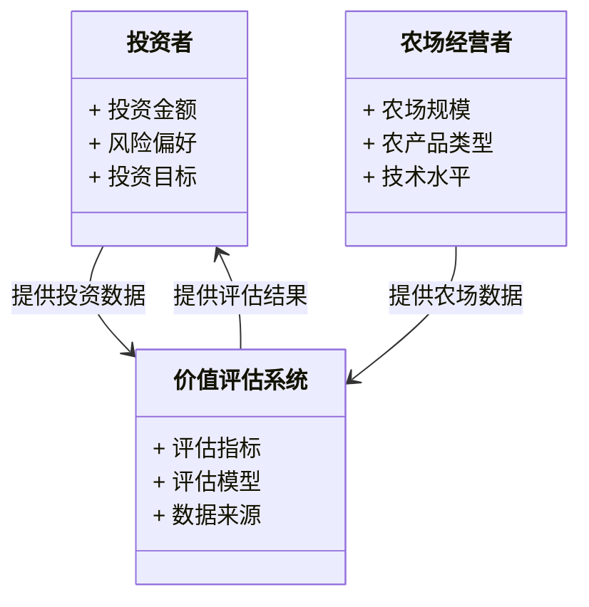
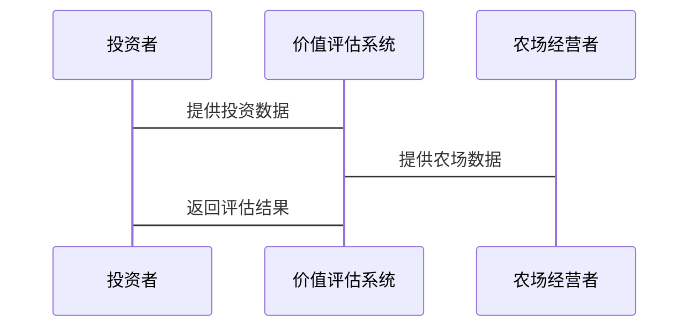

                 


# 价值投资中的智能城市垂直农场系统分析

## 关键词

- 价值投资
- 智能城市
- 垂直农场
- 系统分析
- 技术架构

## 摘要

本文详细分析了价值投资在智能城市垂直农场系统中的应用，从系统背景、核心概念、算法原理到系统架构，再到项目实战和最佳实践，全面阐述了如何通过技术手段优化农业投资决策，助力智能城市发展。

---

# 第一部分：价值投资与智能城市垂直农场的背景介绍

## 第1章：背景介绍

### 1.1 价值投资的基本概念

#### 1.1.1 价值投资的定义与核心理念

- **定义**：价值投资是一种长期投资策略，强调以低于内在价值的价格买入优质资产。
- **核心理念**：寻找市场低估的资产，通过长期持有实现收益。

#### 1.1.2 价值投资在现代经济中的应用

- 传统投资领域：股票、房地产等。
- 智能城市垂直农场：新兴领域，结合农业与科技。

#### 1.1.3 价值投资与智能城市垂直农场的结合

- 技术驱动的农业模式。
- 高效土地利用与可持续发展。

### 1.2 智能城市垂直农场的定义与特点

#### 1.2.1 垂直农场的定义与核心要素

- **定义**：在垂直空间内进行农业生产的模式，通常利用高层建筑或立体结构。
- **核心要素**：
  - 立体种植空间。
  - 自动化技术（如物联网、AI）。
  - 循环生态系统。

#### 1.2.2 智能城市垂直农场的技术特征

- **技术驱动**：物联网、AI、大数据分析。
- **高效生产**：垂直空间利用最大化。
- **可持续性**：资源循环利用，减少环境影响。

#### 1.2.3 垂直农场与传统农业的对比分析

| 特性             | 垂直农场       | 传统农业         |
|------------------|----------------|------------------|
| 土地利用效率     | 高             | 低               |
| 技术依赖         | 高             | 低               |
| 环境影响         | 小             | 大               |
| 生产效率         | 高             | 一般             |

### 1.3 问题背景与问题描述

#### 1.3.1 当前农业面临的挑战与痛点

- **土地资源有限**：传统农业依赖大面积土地，城市化加剧土地稀缺。
- **环境问题**：传统农业导致水土流失、污染等问题。
- **生产效率低**：依赖自然条件，难以规模化生产。

#### 1.3.2 智能城市垂直农场的解决方案

- **高效土地利用**：垂直空间利用最大化。
- **自动化生产**：减少人工干预，提高效率。
- **环境友好**：循环利用资源，减少污染。

#### 1.3.3 价值投资在垂直农场中的作用

- **投资价值**：垂直农场具有较高的投资回报潜力。
- **风险控制**：通过技术手段降低生产风险。

### 1.4 问题解决与边界分析

#### 1.4.1 垂直农场系统的功能边界

- **系统功能**：
  - 数据采集（温湿度、光照等）。
  - 自动化控制（灌溉、光照调节）。
  - 数据分析与优化。

- **边界条件**：
  - 系统仅负责生产过程的监控与优化。
  - 外部供应链（如种子、肥料）由其他系统处理。

#### 1.4.2 价值投资在垂直农场中的边界条件

- **投资范围**：
  - 仅考虑垂直农场的经济效益。
  - 不涉及外部市场波动。

#### 1.4.3 系统的可扩展性与可维护性分析

- **可扩展性**：
  - 系统支持模块化扩展。
  - 新技术（如AI算法）可快速集成。

- **可维护性**：
  - 模块化设计便于维护。
  - 支持实时数据更新与优化。

---

# 第二部分：垂直农场系统的核心概念与联系

## 第2章：核心概念与联系

### 2.1 核心概念原理

#### 2.1.1 垂直农场的系统架构原理

- **垂直种植空间**：利用立体结构，最大化空间利用。
- **自动化技术**：物联网、AI、大数据分析驱动生产过程。
- **循环生态系统**：水、营养循环利用，减少资源浪费。

#### 2.1.2 价值投资的核心算法原理

- **核心算法**：
  - 数据分析与预测。
  - 风险评估与优化。
  - 投资组合管理。

- **数学模型**：
  - 回归分析：预测农场产量与市场价格。
  - 风险评估：使用方差、协方差等指标评估投资风险。

### 2.2 核心概念属性特征对比

#### 2.2.1 垂直农场与传统农业的特征对比

| 特性             | 垂直农场       | 传统农业         |
|------------------|----------------|------------------|
| 生产效率         | 高             | 低               |
| 技术依赖         | 高             | 低               |
| 环境影响         | 小             | 大               |

### 2.3 ER实体关系图架构

```mermaid
erDiagram
    actor 投资者 {
        <属性> 投资金额
        <属性> 投资目标
        <属性> 风险偏好
    }
    actor 农场经营者 {
        <属性> 农场规模
        <属性> 农产品类型
        <属性> 技术水平
    }
    actor 价值评估系统 {
        <属性> 评估指标
        <属性> 评估模型
        <属性> 数据来源
    }
    投资者 --> 价值评估系统 : 提供投资数据
    农场经营者 --> 价值评估系统 : 提供农场数据
    价值评估系统 --> 投资者 : 提供评估结果
```

---

# 第三部分：算法原理

## 第3章：算法原理

### 3.1 算法原理

#### 3.1.1 算法流程

1. **数据采集**：收集垂直农场的生产数据（如产量、成本）。
2. **数据分析**：使用回归分析预测市场价格。
3. **风险评估**：评估投资风险。
4. **优化建议**：给出投资优化建议。

#### 3.1.2 算法实现

```python
import numpy as np
import pandas as pd
from sklearn.linear_model import LinearRegression

# 数据加载
data = pd.read_csv('farm_data.csv')

# 特征与目标变量
X = data[['产量', '成本']]
y = data['市场价格']

# 模型训练
model = LinearRegression()
model.fit(X, y)

# 预测
predicted_price = model.predict(X)
print(predicted_price)
```

#### 3.1.3 数学模型

$$ y = \beta_0 + \beta_1 x_1 + \beta_2 x_2 + \epsilon $$

其中：
- \( y \)：市场价格
- \( x_1 \)：产量
- \( x_2 \)：成本
- \( \beta_0, \beta_1, \beta_2 \)：回归系数
- \( \epsilon \)：误差项

---

# 第四部分：系统分析与架构设计

## 第4章：系统分析与架构设计

### 4.1 问题场景介绍

- **问题场景**：投资者需要评估垂直农场的投资价值。
- **目标**：设计一个系统，帮助投资者做出科学决策。

### 4.2 项目介绍

#### 4.2.1 项目目标

- 提供实时数据分析。
- 优化投资组合。

#### 4.2.2 系统功能设计



#### 4.2.3 系统架构设计


### 4.3 系统接口设计

#### 4.3.1 API接口

- **输入接口**：
  - `/api/input/investor_data`：接收投资者数据。
  - `/api/input/farm_data`：接收农场数据。
- **输出接口**：
  - `/api/output/assessment`：返回评估结果。

#### 4.3.2 交互序列图



---

# 第五部分：项目实战

## 第5章：项目实战

### 5.1 环境安装

- **Python环境**：安装Python 3.8+。
- **依赖库**：安装numpy、pandas、scikit-learn。

### 5.2 核心功能实现

#### 5.2.1 数据分析模块

```python
import numpy as np
import pandas as pd
from sklearn.linear_model import LinearRegression

# 数据加载
data = pd.read_csv('farm_data.csv')

# 特征与目标变量
X = data[['产量', '成本']]
y = data['市场价格']

# 模型训练
model = LinearRegression()
model.fit(X, y)

# 预测
predicted_price = model.predict(X)
print(predicted_price)
```

#### 5.2.2 风险评估模块

```python
import numpy as np
import pandas as pd
from sklearn.covariance import MinCovariance

# 数据加载
data = pd.read_csv('farm_risk.csv')

# 计算协方差矩阵
cov_matrix = np.cov(data.T)

# 计算方差
variance = np.diag(cov_matrix)

print(variance)
```

### 5.3 项目小结

- **数据收集**：确保数据的准确性和全面性。
- **模型优化**：通过多次训练优化回归模型。
- **风险控制**：定期评估并调整投资策略。

---

# 第六部分：最佳实践

## 第6章：最佳实践

### 6.1 小结

- **总结**：价值投资与智能城市垂直农场的结合具有巨大潜力。
- **关键点**：数据驱动决策，技术优化生产，降低投资风险。

### 6.2 注意事项

- **数据质量**：确保数据准确可靠。
- **技术选型**：选择适合的算法和工具。
- **风险控制**：定期评估并调整策略。

### 6.3 拓展阅读

- 《智能城市与农业创新》
- 《价值投资的数学模型与应用》
- 《垂直农业技术与发展》

---

# 作者

作者：AI天才研究院/AI Genius Institute & 禅与计算机程序设计艺术 /Zen And The Art of Computer Programming

