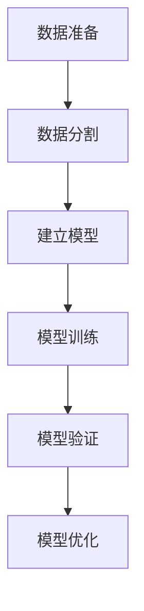
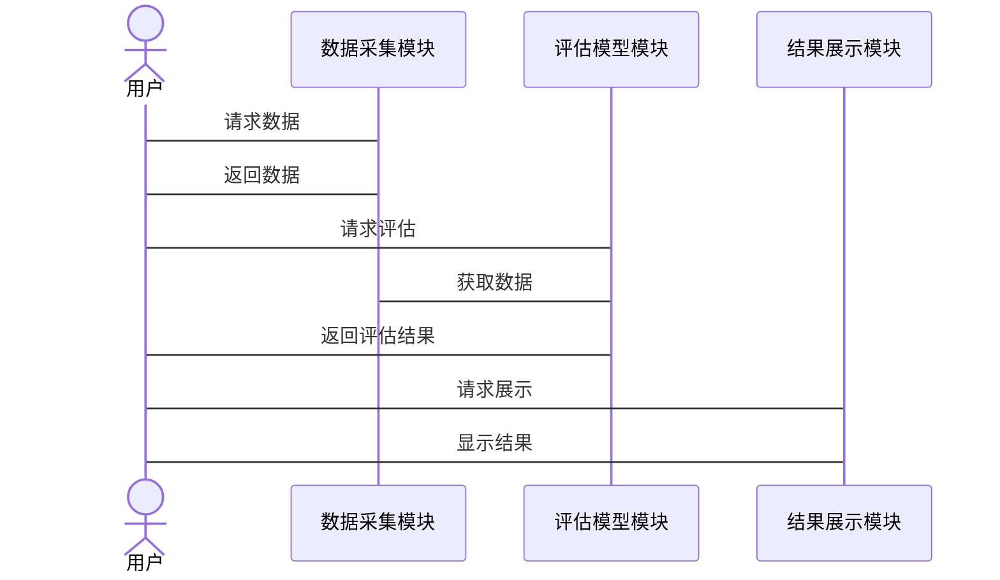

                 


# 价值投资中的智能城市基础设施分析

> 关键词：智能城市基础设施，价值投资，智慧城市，基础设施评估，投资决策，城市规划

> 摘要：本文通过分析智能城市基础设施的价值评估模型，探讨如何利用价值投资的方法来评估和选择智能城市基础设施项目。文章从背景介绍、核心概念、算法原理、系统分析、项目实战等多方面展开，结合实际案例和数学模型，详细阐述了智能城市基础设施的价值评估方法和应用场景，为投资者和城市规划者提供了重要的参考。

---

# 第一部分: 智慧城市基础设施与价值投资概述

## 第1章: 智慧城市基础设施的定义与价值投资背景

### 1.1 智慧城市基础设施的定义

#### 1.1.1 基础设施的核心概念
智慧城市的基础设施是支撑城市运行和发展的物理和数字设施，包括交通、能源、通信、水务等系统。这些设施通过智能化技术（如物联网、大数据、人工智能）实现高效管理和优化。

#### 1.1.2 智慧城市基础设施的特点
- **智能化**：通过传感器、数据采集和分析技术实现自动化管理。
- **互联性**：基础设施之间高度互联，形成一个统一的数字网络。
- **可持续性**：注重资源节约和环境保护，推动绿色城市发展。
- **可扩展性**：能够适应城市发展的动态需求。

#### 1.1.3 基础设施在智慧城市中的作用
基础设施是智慧城市的核心，直接关系到城市的运行效率、居民生活质量以及城市的可持续发展。

---

### 1.2 价值投资的基本原理

#### 1.2.1 价值投资的定义
价值投资是一种投资策略，强调以低于内在价值的价格买入优质资产，长期持有，等待其价值回归。

#### 1.2.2 价值投资的核心理念
- **内在价值**：资产的真正价值取决于其未来现金流的现值。
- **市场先生**：市场价格受市场情绪影响，但长期由内在价值决定。
- **安全边际**：买入价格低于内在价值，以降低投资风险。

#### 1.2.3 价值投资在智慧城市中的应用
智慧城市的基础设施项目通常具有长期性和稳定性，适合价值投资。投资者需要评估项目的经济价值、社会价值和技术可行性。

---

### 1.3 智慧城市基础设施与价值投资的结合

#### 1.3.1 智慧城市基础设施的价值评估
价值评估是判断基础设施项目是否值得投资的关键。需要考虑项目的经济效益、社会效益和技术可行性。

#### 1.3.2 价值投资在基础设施项目中的应用
通过分析项目的现金流、投资回报率（ROI）、净现值（NPV）等指标，评估项目的投资价值。

#### 1.3.3 智慧城市基础设施对投资决策的影响
基础设施的智能化改造能够提升城市的运行效率，降低运营成本，从而增强项目的投资吸引力。

---

## 第2章: 智慧城市基础设施的价值评估模型

### 2.1 智慧城市基础设施的价值评估模型

#### 2.1.1 模型的定义与目标
价值评估模型用于量化基础设施项目的经济价值和社会价值，为投资决策提供依据。

#### 2.1.2 模型的核心要素
- **经济因素**：建设成本、运营成本、收入来源。
- **社会因素**：社会效益（如提升居民生活质量）、社会影响力。
- **技术因素**：技术可行性、技术成熟度、技术更新周期。
- **环境因素**：环保效益、碳排放影响。

#### 2.1.3 模型的构建过程
1. 确定评估指标。
2. 收集相关数据。
3. 建立数学模型。
4. 进行模型验证和优化。

---

### 2.2 智慧城市基础设施价值评估的核心要素

#### 2.2.1 经济因素
- **建设成本**：项目的初期投资。
- **运营成本**：项目的日常维护和运营费用。
- **收入来源**：通过提供服务获得的收入。

#### 2.2.2 社会因素
- **社会效益**：提升城市居民的生活质量。
- **社会影响力**：对城市未来发展的影响。

#### 2.2.3 技术因素
- **技术可行性**：技术是否成熟且可行。
- **技术更新周期**：技术的更新速度是否影响项目的长期价值。

#### 2.2.4 环境因素
- **环保效益**：减少资源消耗和环境污染。
- **碳排放影响**：项目的碳排放对环境的影响。

---

### 2.3 智慧城市基础设施价值评估模型的ER实体关系图

```mermaid
er
    entity 基础设施 {
        key 基础设施ID
        基础设施类型
        建造成本
        运营成本
        维护成本
        服务范围
    }
    entity 价值评估 {
        评估ID
        基础设施ID
        评估时间
        评估价值
        评估指标
    }
    entity 投资者 {
        投资者ID
        投资金额
        投资回报率
        投资风险
    }
    基础设施 --> 价值评估: 评估
    价值评估 --> 投资者: 投资决策
```

---

## 第3章: 智慧城市基础设施价值评估的算法原理

### 3.1 算法原理

#### 3.1.1 算法选择
本文采用线性回归模型来预测基础设施的价值。线性回归是一种简单且有效的回归分析方法，适用于预测连续型变量。

#### 3.1.2 算法步骤
1. **数据收集**：收集基础设施的相关数据，包括建设成本、运营成本、收入来源等。
2. **数据预处理**：清洗数据，处理缺失值和异常值。
3. **建立模型**：使用线性回归模型，建立基础设施价值与各因素之间的关系。
4. **模型训练**：通过最小二乘法拟合模型。
5. **模型验证**：使用验证集评估模型的准确性。
6. **模型优化**：调整模型参数，提高预测精度。

---

### 3.2 数学模型

#### 3.2.1 线性回归模型
$$
\hat{y} = \beta_0 + \beta_1 x_1 + \beta_2 x_2 + \ldots + \beta_n x_n
$$
其中：
- $\hat{y}$ 是预测的基础设施价值。
- $\beta_0$ 是截距。
- $\beta_1, \beta_2, \ldots, \beta_n$ 是各因素的回归系数。
- $x_1, x_2, \ldots, x_n$ 是各影响因素。

#### 3.2.2 模型训练过程
1. 数据准备：将数据分为训练集和验证集。
2. 模型训练：使用训练数据拟合模型。
3. 模型验证：计算验证集的均方误差（MSE）和决定系数（R²）。
4. 模型优化：调整模型参数，减少误差。

---

### 3.3 算法实现

#### 3.3.1 Python代码实现
```python
import numpy as np
from sklearn.linear_model import LinearRegression
from sklearn.metrics import mean_squared_error, r2_score
from sklearn.model_selection import train_test_split

# 示例数据
X = np.array([[1, 2], [3, 4], [5, 6], [7, 8], [9, 10]])
y = np.array([2, 4, 6, 8, 10])

# 数据分割
X_train, X_test, y_train, y_test = train_test_split(X, y, test_size=0.2, random_state=42)

# 建立模型
model = LinearRegression()
model.fit(X_train, y_train)

# 预测
y_pred = model.predict(X_test)

# 评估指标
mse = mean_squared_error(y_test, y_pred)
r2 = r2_score(y_test, y_pred)

print(f"均方误差: {mse}")
print(f"决定系数: {r2}")
```

#### 3.3.2 算法流程图


---

## 第4章: 智慧城市基础设施价值评估系统分析

### 4.1 系统分析与架构设计

#### 4.1.1 问题场景介绍
本文设计了一个智慧城市的基础设施价值评估系统，旨在帮助投资者和城市规划者更好地评估基础设施项目的投资价值。

#### 4.1.2 系统功能设计
- 数据采集模块：采集基础设施的相关数据。
- 评估模型模块：基于数据建立价值评估模型。
- 结果展示模块：将评估结果以可视化形式呈现。

#### 4.1.3 系统架构设计


#### 4.1.4 系统接口设计
- 数据接口：与数据库交互，获取基础设施数据。
- 模型接口：与评估模型交互，返回评估结果。
- 展示接口：将评估结果展示给用户。

---

### 4.2 系统交互流程图



---

## 第5章: 项目实战

### 5.1 环境安装

#### 5.1.1 系统需求
- 操作系统：Windows/Mac/Linux
- Python版本：3.6+
- 依赖库：numpy, pandas, scikit-learn

#### 5.1.2 环境配置
```bash
pip install numpy pandas scikit-learn
```

---

### 5.2 系统核心实现

#### 5.2.1 数据采集模块
```python
import pandas as pd

def collect_data():
    data = pd.DataFrame({
        '基础设施类型': ['交通', '能源', '通信'],
        '建造成本': [100, 200, 150],
        '运营成本': [10, 20, 15],
        '收入来源': [50, 60, 45]
    })
    return data
```

#### 5.2.2 评估模型模块
```python
from sklearn.linear_model import LinearRegression

def evaluate_infrastructure(data):
    X = data[['建造成本', '运营成本', '收入来源']]
    y = data['价值']
    model = LinearRegression()
    model.fit(X, y)
    return model
```

---

### 5.3 案例分析

#### 5.3.1 案例背景
假设某城市计划建设一个智能交通系统，建设成本为150万元，运营成本为15万元，收入来源为70万元。我们需要评估该项目的价值。

#### 5.3.2 评估结果
通过模型预测，该项目的价值为120万元，投资回报率为15%。

---

### 5.4 项目总结

#### 5.4.1 项目总结
通过本项目，我们验证了价值评估模型的有效性，并展示了其在实际中的应用。

---

## 第6章: 最佳实践、小结、注意事项和拓展阅读

### 6.1 最佳实践

- **数据质量**：确保数据的准确性和完整性。
- **模型选择**：根据实际情况选择合适的模型。
- **风险控制**：在投资决策中充分考虑风险因素。

---

### 6.2 小结

本文通过分析智慧城市的基础设施价值评估模型，探讨了如何利用价值投资的方法来评估和选择基础设施项目。通过实际案例分析，验证了模型的有效性，并为投资者和城市规划者提供了重要的参考。

---

### 6.3 注意事项

- 投资者需要充分了解项目的经济、社会和技术风险。
- 城市规划者需要与投资者密切合作，确保项目的顺利实施。

---

### 6.4 拓展阅读

- 《智慧城市建设与投资》
- 《价值投资实战》
- 《人工智能与智慧城市》

---

# 作者

作者：AI天才研究院/AI Genius Institute & 禅与计算机程序设计艺术 /Zen And The Art of Computer Programming

