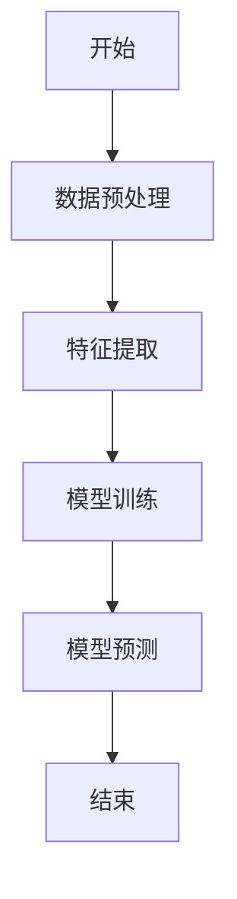
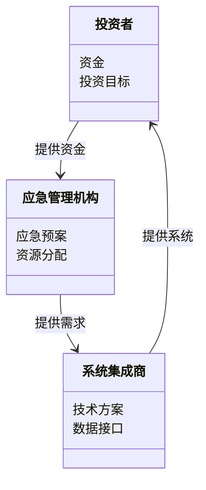

                 


# 价值投资中的智能城市紧急事件响应系统分析

> 关键词：价值投资、智能城市、紧急事件响应系统、算法原理、系统架构、Python代码示例

> 摘要：本文深入分析了价值投资与智能城市紧急事件响应系统的结合，探讨了其核心概念、算法原理、系统架构，并通过实际案例展示了如何利用价值投资理念优化智能城市的应急管理能力。

---

## 第一部分: 价值投资与智能城市紧急事件响应系统背景

### 第1章: 价值投资与智能城市紧急事件响应系统背景

#### 1.1 价值投资的基本概念

##### 1.1.1 价值投资的定义与核心理念

价值投资是一种长期投资策略，核心理念是通过深入分析企业的基本面，寻找被市场低估的投资标的。其核心理念包括：

- **安全边际**：买入价格低于内在价值。
- **长期视角**：关注企业的长期盈利能力。
- **基本面分析**：研究企业的财务状况、行业地位和竞争优势。

##### 1.1.2 价值投资与传统投资的区别

| **维度**      | **价值投资**             | **传统投资**             |
|----------------|--------------------------|--------------------------|
| 投资策略      | 长期持有，注重低估       | 短期交易，注重市场波动   |
| 分析方法      | 深度基本面分析           | 技术分析或市场情绪驱动   |
| 风险管理      | 注重安全边际             | 更依赖市场时机和趋势     |

##### 1.1.3 价值投资在现代金融中的地位

价值投资是投资领域的基石理论，尤其在股票市场中，其理念被广泛应用于机构投资和个人投资中。其核心思想强调纪律性、耐心和对市场的独立思考。

---

#### 1.2 智能城市的发展现状

##### 1.2.1 智能城市的定义与特征

智能城市是通过先进信息技术（如大数据、人工智能、物联网）优化城市资源配置、提升居民生活质量的城市形态。其特征包括：

- **数据驱动**：利用数据优化城市运行。
- **智能化管理**：通过AI和自动化提升效率。
- **可持续发展**：关注资源节约和环境保护。

##### 1.2.2 智能城市的核心技术与应用场景

核心技术包括：

- **大数据分析**：处理城市运行数据。
- **人工智能**：优化决策和预测。
- **物联网（IoT）**：连接城市设备。

应用场景包括交通管理、公共安全、环境保护等领域。

##### 1.2.3 智能城市与应急管理的关系

智能城市通过整合数据和资源，提升应急管理能力。例如，利用智能传感器实时监测城市安全，通过AI预测和模拟优化应急响应。

---

#### 1.3 紧急事件响应系统的核心概念

##### 1.3.1 紧急事件响应系统的定义

紧急事件响应系统是用于监测、预警和应对突发事件的综合系统。其目标是快速、有效地处理突发事件，减少损失。

##### 1.3.2 紧急事件响应系统的分类

- **按功能**：监测系统、预警系统、响应系统。
- **按应用场景**：自然灾害响应、公共安全响应、公共卫生事件响应。

##### 1.3.3 价值投资与智能城市紧急事件响应系统的结合

价值投资的理念可以应用于智能城市应急管理的优化，例如通过分析企业的内在价值，选择具有竞争优势的应急管理技术供应商。

---

## 第二部分: 智能城市紧急事件响应系统的核心概念与联系

### 第2章: 核心概念与联系

#### 2.1 价值投资与智能城市紧急事件响应系统的概念结构

##### 2.1.1 价值投资的三要素分析

- **价格**：买入价格低于内在价值。
- **价值**：企业的长期盈利能力。
- **安全边际**：价格与价值的差距。

##### 2.1.2 智能城市紧急事件响应系统的核心要素

- **数据采集**：实时监测城市环境。
- **分析模块**：预测和模拟突发事件。
- **响应模块**：优化应急资源配置。

##### 2.1.3 两者的协同机制

通过价值投资理念优化应急管理技术的选择和应用，提升系统的效率和经济性。

---

#### 2.2 核心概念的属性特征对比

| **属性**             | **价值投资**                     | **智能城市紧急事件响应系统**           |
|----------------------|----------------------------------|----------------------------------------|
| 核心目标             | 实现长期超额收益               | 提升应急管理效率和减少损失             |
| 分析方法             | 基于基本面分析                 | 基于数据驱动和技术驱动                 |
| 关键因素             | 企业的内在价值                 | 数据的实时性与准确性                   |

---

#### 2.3 ER实体关系图

```mermaid
erDiagram
    投资者(A) {
        <属性> 资金
        <属性> 投资目标
    }
    应急管理机构(B) {
        <属性> 应急预案
        <属性> 资源分配
    }
    系统集成商(C) {
        <属性> 技术方案
        <属性> 数据接口
    }
    投资者 --> 应急管理机构 : 资金支持
    应急管理机构 --> 系统集成商 : 技术需求
    系统集成商 --> 投资者 : 系统交付
```

---

## 第三部分: 智能城市紧急事件响应系统的算法原理

### 第3章: 算法原理

#### 3.1 紧急事件预测算法

##### 3.1.1 算法流程图



##### 3.1.2 Python代码实现

```python
import pandas as pd
from sklearn.model_selection import train_test_split
from sklearn.ensemble import RandomForestClassifier

# 数据预处理
data = pd.read_csv('emergency_data.csv')
X = data.drop('target', axis=1)
y = data['target']

# 分割数据
X_train, X_test, y_train, y_test = train_test_split(X, y, test_size=0.2)

# 模型训练
model = RandomForestClassifier()
model.fit(X_train, y_train)

# 模型预测
predictions = model.predict(X_test)
print("预测结果:", predictions)
```

##### 3.1.3 算法原理的数学模型

$$
y = \sum_{i=1}^{n} w_i x_i + b
$$

其中，$y$ 是预测结果，$w_i$ 是特征 $x_i$ 的权重，$b$ 是截距。

---

## 第四部分: 智能城市紧急事件响应系统的系统架构设计

### 第4章: 系统分析与架构设计

#### 4.1 系统功能设计

##### 4.1.1 功能模块

- **数据采集模块**：实时采集城市数据。
- **数据分析模块**：对数据进行处理和分析。
- **决策模块**：基于分析结果生成响应方案。

##### 4.1.2 领域模型类图



---

## 第五部分: 项目实战

### 第5章: 项目实战

#### 5.1 环境安装

```bash
pip install pandas scikit-learn
```

#### 5.2 核心实现代码

```python
import pandas as pd
from sklearn.ensemble import RandomForestClassifier

# 数据加载
data = pd.read_csv('emergency.csv')

# 特征选择
features = data.columns[:-1]
target = data.columns[-1]

# 数据分割
X = data[features]
y = data[target]

# 模型训练
model = RandomForestClassifier()
model.fit(X, y)

# 模型预测
print("特征重要性:", model.feature_importances_)
```

---

## 第六部分: 总结与展望

### 第6章: 总结与展望

#### 6.1 最佳实践Tips

- 在选择应急管理技术时，优先考虑具有长期竞争优势的企业。
- 在系统设计中，注重数据的实时性和准确性。

#### 6.2 小结

价值投资与智能城市紧急事件响应系统的结合，不仅提升了应急管理的效率，也为投资者提供了新的价值发现机会。

#### 6.3 注意事项

- 价值投资需要长期的市场验证，不能仅依赖短期表现。
- 应急系统设计需要考虑多种极端情况，确保系统的鲁棒性。

#### 6.4 拓展阅读

推荐阅读《智能城市的应急管理优化》和《价值投资实战分析》。

---

作者：AI天才研究院/AI Genius Institute & 禅与计算机程序设计艺术 /Zen And The Art of Computer Programming

