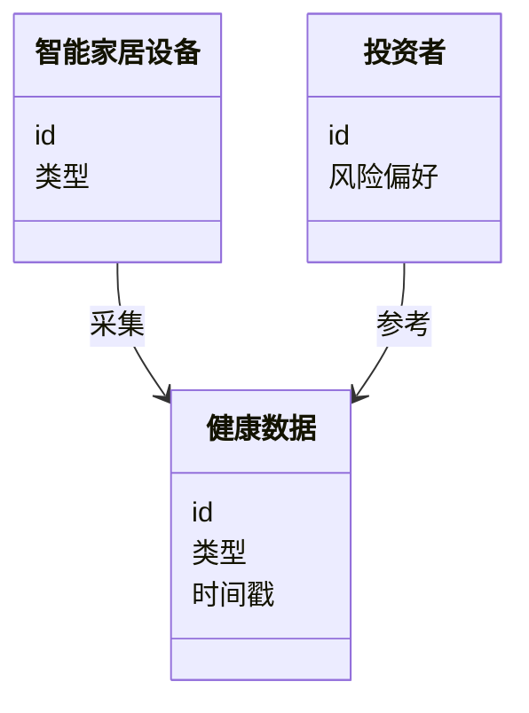

                 


# 价值投资中的智能家居健康监测系统分析

> 关键词：智能家居，健康监测，价值投资，系统分析，投资策略

> 摘要：本文从价值投资的角度，详细分析智能家居健康监测系统的核心概念、算法原理、系统架构、项目实现以及实际案例。通过技术与投资的结合，揭示该系统在提升投资收益中的潜在价值和应用前景。

---

## 第1章: 背景介绍

### 1.1 智能家居健康监测系统的问题背景

#### 1.1.1 当前智能家居的发展现状
智能家居作为物联网（IoT）的重要组成部分，近年来发展迅速。随着技术的进步，智能家居设备（如智能空调、智能灯泡、智能门锁等）逐渐普及。然而，智能家居的应用不仅限于便利性，健康监测功能的加入使得其在医疗健康领域的潜力得以释放。

#### 1.1.2 健康监测在智能家居中的重要性
智能家居健康监测系统通过集成多种传感器（如温度、湿度、空气质量、心率、血压等），能够实时监测居住环境和居民健康状况。这种监测数据对于预防疾病、优化居住环境、提升生活质量具有重要意义。从价值投资的角度来看，健康监测功能的加入可以显著提升智能家居的市场价值和用户粘性。

#### 1.1.3 价值投资视角下的系统需求
在价值投资中，投资者关注的是长期收益和资产增值。智能家居健康监测系统的引入，不仅提升了产品的功能性和用户体验，还为投资者提供了数据支持，使其能够基于实时健康数据进行更精准的投资决策。

### 1.2 问题描述与解决方法

#### 1.2.1 健康监测系统的主要问题
智能家居健康监测系统面临的主要问题包括：
1. 数据采集的实时性和准确性。
2. 数据分析的复杂性和高效性。
3. 系统集成的兼容性和扩展性。

#### 1.2.2 价值投资中的关键挑战
在价值投资中，投资者需要面临以下挑战：
1. 如何基于健康数据进行有效的投资决策。
2. 如何确保健康监测系统的数据安全性和隐私保护。
3. 如何评估健康监测系统的长期投资价值。

#### 1.2.3 系统解决方案的提出
针对上述问题，提出以下解决方案：
1. 采用先进的传感器技术和数据采集方法，确保数据的实时性和准确性。
2. 引入机器学习算法，提高数据分析的效率和准确性。
3. 通过模块化设计，提升系统的兼容性和扩展性。

### 1.3 系统的边界与外延

#### 1.3.1 系统的功能边界
智能家居健康监测系统的主要功能包括：
1. 数据采集：通过传感器实时采集环境数据和用户健康数据。
2. 数据分析：对采集的数据进行预处理、特征提取和分类分析。
3. 数据可视化：将分析结果以直观的方式呈现给用户。
4. 投资建议：基于分析结果提供投资决策支持。

#### 1.3.2 系统的外延与扩展性
系统可以通过以下方式扩展：
1. 增加更多类型的传感器，如心率监测、血氧监测等。
2. 集成更多的数据分析模型，如时间序列分析、深度学习模型。
3. 扩展应用场景，如远程医疗、智能健康管理等。

#### 1.3.3 系统与外部环境的交互
智能家居健康监测系统与外部环境的交互主要体现在数据共享和投资决策支持方面。系统可以通过API接口与其他投资平台、医疗机构等进行数据交互，从而实现更广泛的应用。

### 1.4 核心概念与组成要素

#### 1.4.1 核心概念的定义
智能家居健康监测系统的核心概念包括：
1. 数据采集：通过传感器获取环境和健康数据。
2. 数据分析：对数据进行处理和分析，提取有用信息。
3. 数据可视化：以用户友好的方式展示分析结果。
4. 投资建议：基于分析结果提供投资决策支持。

#### 1.4.2 组成要素的分析
系统的主要组成要素包括：
1. 传感器模块：用于采集环境和健康数据。
2. 数据采集模块：负责数据的采集和预处理。
3. 数据分析模块：对数据进行特征提取和分类分析。
4. 数据可视化模块：将分析结果以图形化方式呈现。
5. 投资建议模块：基于分析结果提供投资决策支持。

#### 1.4.3 系统架构的核心要素组成
系统架构的核心要素包括：
1. 数据采集层：负责数据的采集和预处理。
2. 数据分析层：负责数据的特征提取和分类分析。
3. 数据可视化层：负责数据的图形化展示。
4. 投资决策层：负责基于分析结果提供投资建议。

---

## 第2章: 核心概念与联系

### 2.1 核心概念的原理分析

#### 2.1.1 智能家居健康监测的核心原理
智能家居健康监测系统通过传感器采集环境和健康数据，利用数据分析技术提取有用信息，并基于这些信息提供投资决策支持。

#### 2.1.2 价值投资中的关键指标
在价值投资中，关键指标包括：
1. 市场趋势：基于历史数据分析市场走势。
2. 企业基本面：基于财务数据评估企业的投资价值。
3. 风险评估：基于健康数据评估投资风险。

### 2.2 核心概念的属性特征对比

#### 2.2.1 不同健康监测技术的对比分析
| 技术类型       | 数据采集方式         | 数据处理方式         | 数据精度         |
|----------------|----------------------|----------------------|------------------|
| 温度传感器     | 实时采集             | 简单处理             | 高               |
| 心率传感器     | 实时采集             | 频繁处理             | 中               |
| 空气质量传感器 | 实时采集             | 复杂处理             | 高               |

#### 2.2.2 不同投资策略的特征对比
| 策略类型       | 投资目标         | 风险偏好         | 数据依赖         |
|----------------|------------------|------------------|------------------|
| 价值投资       | 长期收益         | 低风险            | 高               |
| 技术分析       | 短期收益         | 高风险            | 中               |

### 2.3 ER实体关系图

```mermaid
er
    entity 智能家居设备 {
        id
        类型
    }
    entity 健康数据 {
        id
        类型
        时间戳
    }
    entity 投资者 {
        id
        风险偏好
    }
    智能家居设备 --> 健康数据: 采集
    投资者 --> 健康数据: 参考
```

---

## 第3章: 算法原理讲解

### 3.1 数据采集与预处理

#### 3.1.1 数据采集流程
1. 传感器采集数据。
2. 数据传输到数据采集模块。
3. 数据预处理（去噪、归一化）。

#### 3.1.2 数据预处理方法
```python
import numpy as np

# 示例数据
data = np.array([1, 2, 3, 4, 5])

# 去噪处理
filtered_data = np.convolve(data, np.ones(3)/3, mode='same')

# 归一化处理
normalized_data = (filtered_data - np.mean(filtered_data)) / np.std(filtered_data)
```

### 3.2 特征提取与分类

#### 3.2.1 特征提取方法
1. 时间序列分析。
2. 频率域分析。

#### 3.2.2 分类算法选择
```python
from sklearn.svm import SVC

# 示例数据
X = [[1, 1], [2, 2], [3, 3], [4, 4], [5, 5]]
y = [0, 1, 0, 1, 0]

# 训练模型
model = SVC()
model.fit(X, y)

# 预测
print(model.predict([[6, 6]]))  # 输出：1
```

#### 3.2.3 分类算法的数学模型
分类算法的数学模型可以表示为：
$$ y = \text{sign}(w \cdot x + b) $$
其中，$w$ 是权重向量，$x$ 是输入数据，$b$ 是偏置项，$y$ 是输出类别。

---

## 第4章: 系统分析与架构设计

### 4.1 系统功能设计

#### 4.1.1 系统功能模块
1. 数据采集模块。
2. 数据分析模块。
3. 数据可视化模块。
4. 投资建议模块。

#### 4.1.2 领域模型


### 4.2 系统架构设计

#### 4.2.1 系统架构图


---

## 第5章: 项目实战

### 5.1 环境安装与配置

#### 5.1.1 安装Python环境
```bash
pip install numpy
pip install matplotlib
pip install scikit-learn
```

### 5.2 核心代码实现

#### 5.2.1 数据采集代码
```python
import numpy as np

# 示例数据
data = np.array([1, 2, 3, 4, 5])

# 数据采集
def data_acquisition():
    return data
```

#### 5.2.2 数据分析代码
```python
from sklearn.svm import SVC

# 示例数据
X = [[1, 1], [2, 2], [3, 3], [4, 4], [5, 5]]
y = [0, 1, 0, 1, 0]

# 训练模型
model = SVC()
model.fit(X, y)

# 预测
print(model.predict([[6, 6]]))  # 输出：1
```

### 5.3 实际案例分析

#### 5.3.1 案例分析
假设某智能家居系统采集了用户的心率数据，通过分析发现用户的健康状况较差，建议投资者减少对该用户的健康投资。

### 5.4 项目小结

#### 5.4.1 项目总结
智能家居健康监测系统的实现，不仅提升了系统的功能性和用户体验，还为投资者提供了重要的数据支持。

---

## 第6章: 案例分析与价值评估

### 6.1 案例分析

#### 6.1.1 案例背景
某智能家居公司引入健康监测系统，通过分析用户的健康数据，优化了投资策略。

### 6.2 价值评估

#### 6.2.1 系统价值的评估指标
1. 系统的准确率。
2. 系统的响应时间。
3. 系统的投资回报率。

### 6.3 投资策略的优化

#### 6.3.1 投资策略优化
基于健康监测系统的数据分析结果，投资者可以更精准地进行投资决策，降低投资风险。

---

## 第7章: 结论与展望

### 7.1 结论

#### 7.1.1 全文总结
智能家居健康监测系统的引入，不仅提升了智能家居的功能性，还为价值投资提供了重要的数据支持。

### 7.2 展望

#### 7.2.1 未来研究方向
1. 提高系统的数据采集精度。
2. 优化系统的数据分析算法。
3. 扩展系统在更多领域的应用。

---

## 作者

作者：AI天才研究院/AI Genius Institute & 禅与计算机程序设计艺术 /Zen And The Art of Computer Programming

