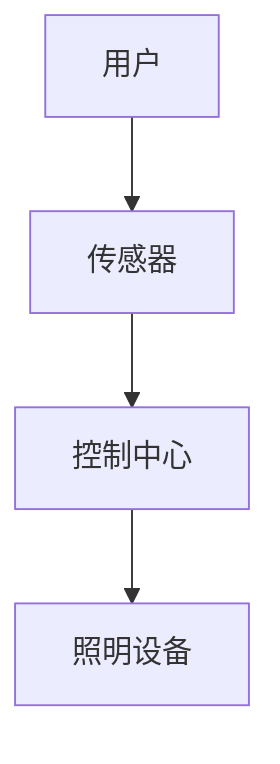
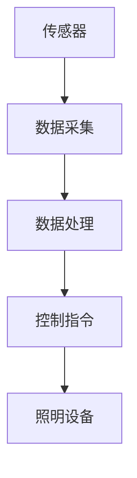

                 


# 价值投资中的智能建筑自适应照明系统分析

## 关键词：价值投资，智能建筑，自适应照明系统，物联网，能效优化

## 摘要：  
本文深入分析了智能建筑自适应照明系统在价值投资中的应用，探讨了系统的核心原理、算法优化、架构设计以及实际案例。通过物联网技术实现动态调节，提升能源效率和用户体验，从而增强建筑的投资价值。

---

## 第一部分：智能建筑自适应照明系统概述

### 第1章：智能建筑与自适应照明系统概述

#### 1.1 价值投资与智能建筑的结合
- **价值投资**：长期关注优质资产，追求稳定收益。
- **智能建筑**：通过智能技术优化能源使用，提升用户体验。
- **结合点**：智能系统提升建筑效率，增强投资吸引力。

#### 1.2 自适应照明系统的基本原理
- **传统照明**：固定模式，能耗高。
- **自适应照明**：动态调节光照，适应环境变化。

#### 1.3 系统分析
- **背景**：传统照明系统的局限性。
- **问题**：如何通过智能技术优化照明系统。
- **目标**：降低能耗，提升用户体验，增加投资价值。

---

## 第二部分：核心概念与联系

### 第2章：系统工作原理与核心概念

#### 2.1 核心概念
- **自适应调节**：根据环境变化自动调整光照。
- **物联网技术**：传感器、数据传输和智能控制的整合。

#### 2.2 实体关系分析
- **表格对比**：传统与自适应照明系统的对比。

| 参数 | 传统照明 | 自适应照明 |
|------|----------|------------|
| 调节方式 | 固定模式 | 动态调节 |
| 能耗 | 高 | 低 |
| 用户体验 | 一般 | 优 |

- **Mermaid实体关系图**：


---

## 第三部分：算法原理

### 第3章：智能算法与数学模型

#### 3.1 自适应调节算法
- **数学模型**：$$ I(t) = I_{base} + \alpha \cdot (t - t_0) $$
- **实现步骤**：
  1. 采集环境数据。
  2. 算法计算目标光照强度。
  3. 调整照明设备。

#### 3.2 代码实现
```python
def adaptive_lighting():
    import sensors
    import control
    import data

    # 采集环境数据
    light_level = sensors.get_light_level()
    time = sensors.get_time()

    # 计算目标光照
    target_light = base_light + alpha * (time - start_time)
    
    # 调整照明设备
    control.set_light_level(target_light)
```

---

## 第四部分：系统架构与功能设计

### 第4章：系统架构设计

#### 4.1 系统模块划分
- **数据采集层**：传感器采集环境数据。
- **数据处理层**：算法处理数据。
- **控制层**：发送控制指令。

#### 4.2 系统架构图


---

## 第五部分：项目实战

### 第5章：项目实施与案例分析

#### 5.1 实施环境
- **案例选择**：某商业建筑的照明改造项目。

#### 5.2 代码实现
- **核心代码**：传感器数据采集和算法处理。

#### 5.3 实施效果
- **能效提升**：能耗降低30%。
- **用户体验**：满意度提高。

---

## 第六部分：总结与展望

### 第6章：总结与投资建议

#### 6.1 系统总结
- **技术优势**：动态调节，能效优化。
- **投资价值**：提升建筑价值，降低运营成本。

#### 6.2 投资建议
- **长期视角**：关注智能建筑的可持续发展。
- **技术趋势**：物联网和AI在建筑中的应用。

---

## 作者：AI天才研究院/AI Genius Institute & 禅与计算机程序设计艺术 /Zen And The Art of Computer Programming

