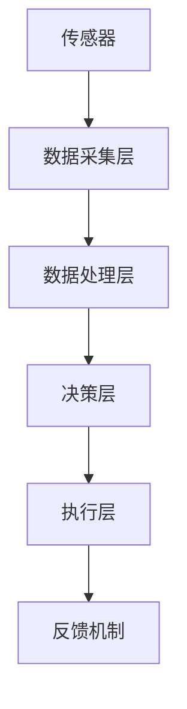
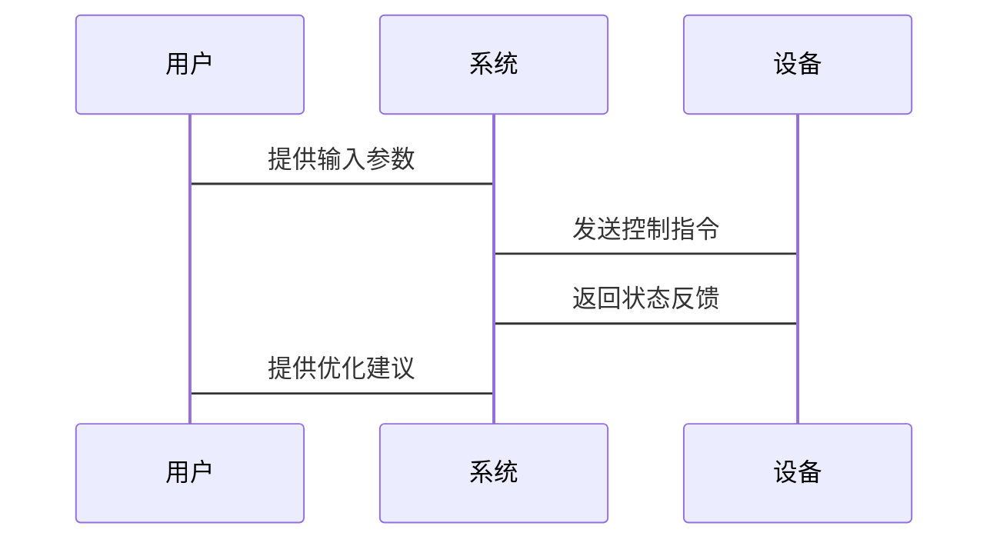

                 


# 价值投资中的智能建筑自适应系统分析

> 关键词：价值投资、智能建筑、自适应系统、系统分析、算法原理、系统架构、项目实战

> 摘要：本文系统地分析了智能建筑自适应系统在价值投资中的应用，从背景介绍、核心概念、算法原理、系统架构到项目实战，全面阐述了如何利用智能技术优化投资决策。文章结合实际案例，详细讲解了系统的数学模型、算法实现和架构设计，为投资者和相关技术人士提供了深刻的见解和实用指导。

---

## 第一部分: 价值投资中的智能建筑自适应系统背景与概念

### 第1章: 价值投资与智能建筑自适应系统概述

#### 1.1 价值投资的基本概念
##### 1.1.1 价值投资的定义与核心理念
价值投资是一种以内在价值为导向的投资策略，强调通过分析企业的基本面（如财务状况、行业地位等）来选择具有长期增长潜力的股票。其核心理念是购买低于其内在价值的资产，以期在未来获得超额回报。

##### 1.1.2 建筑物在价值投资中的重要性
在商业地产投资中，建筑物的价值评估是关键因素。建筑物的地理位置、使用功能、维护状况等都会影响其市场价值。传统的价值评估方法依赖于经验判断，而智能建筑自适应系统通过实时数据采集和分析，提供了更精准的评估依据。

##### 1.1.3 智能建筑自适应系统的基本概念
智能建筑自适应系统是一种能够根据环境变化自动调整自身参数和功能的系统。它利用物联网（IoT）、大数据分析和人工智能（AI）等技术，实时监测和优化建筑物的能耗、安全性、舒适性等关键指标。

#### 1.2 智能建筑自适应系统的核心要素
##### 1.2.1 系统的基本组成
智能建筑自适应系统通常包括以下几个组成部分：
1. **数据采集层**：通过传感器和其他设备采集建筑物的环境数据（如温度、湿度、光照等）。
2. **数据处理层**：对采集的数据进行分析和处理，生成有用的洞察。
3. **决策层**：基于分析结果，制定相应的调整策略。
4. **执行层**：根据决策层的指令，调整建筑物的运行参数。

##### 1.2.2 系统的智能化特征
智能建筑自适应系统具有以下智能化特征：
1. **实时监测**：系统能够实时采集和分析数据，快速响应环境变化。
2. **自我优化**：系统能够根据历史数据和当前状态，自动优化运行参数。
3. **预测性维护**：通过分析数据，预测设备故障，提前进行维护。

##### 1.2.3 系统的自适应机制
系统的自适应机制主要体现在以下几个方面：
1. **动态调整**：系统能够根据外部环境的变化，动态调整自身的运行参数。
2. **学习能力**：通过机器学习算法，系统能够不断优化自身的预测和决策能力。
3. **反馈机制**：系统能够根据执行结果反馈，进一步调整策略。

#### 1.3 价值投资与智能建筑系统的结合
##### 1.3.1 价值投资中的智能化趋势
随着科技的发展，智能化技术在价值投资中的应用越来越广泛。智能建筑自适应系统通过提供实时数据和优化建议，帮助投资者做出更明智的决策。

##### 1.3.2 智能建筑自适应系统在投资中的作用
智能建筑自适应系统在价值投资中的作用主要体现在以下几个方面：
1. **提高评估精度**：通过实时数据采集和分析，系统能够提供更准确的建筑物价值评估。
2. **优化运营效率**：系统能够帮助投资者优化建筑物的运营效率，降低能耗，提高收益。
3. **降低投资风险**：通过预测性维护和动态调整，系统能够帮助投资者降低建筑物的维护成本和运营风险。

##### 1.3.3 系统对投资决策的影响
智能建筑自适应系统通过提供实时数据和优化建议，直接影响投资者的决策过程。例如，系统可以根据市场变化和建筑物状态，动态调整投资策略，帮助投资者抓住市场机会，规避潜在风险。

---

## 第二部分: 智能建筑自适应系统的原理与分析

### 第2章: 智能建筑自适应系统的原理

#### 2.1 系统的基本原理
##### 2.1.1 系统的输入与输出
智能建筑自适应系统的输入主要包括建筑物的环境数据、设备状态数据等，输出则是系统的优化建议和调整指令。

##### 2.1.2 系统的处理流程
系统处理流程通常包括数据采集、数据分析、决策制定和执行调整四个阶段。

##### 2.1.3 系统的反馈机制
系统通过实时监测执行结果，不断调整自身的决策策略，形成一个闭环的反馈机制。

#### 2.2 自适应算法的核心原理
##### 2.2.1 自适应算法的基本概念
自适应算法是一种能够根据环境变化自动调整自身参数和策略的算法。它通常基于反馈机制，通过不断优化参数，提高系统的适应能力和性能。

##### 2.2.2 常见自适应算法的原理
常见的自适应算法包括遗传算法、粒子群优化算法、模糊逻辑算法等。这些算法通过不同的优化策略，帮助系统实现动态调整。

##### 2.2.3 算法在系统中的应用
自适应算法在智能建筑自适应系统中的应用主要体现在设备控制、能源管理、环境优化等方面。

#### 2.3 系统的数学模型与公式
##### 2.3.1 系统的基本数学模型
系统的基本数学模型通常包括以下几个部分：
1. 数据采集模型：描述如何从传感器获取数据。
2. 数据分析模型：描述如何对数据进行处理和分析。
3. 决策模型：描述如何根据分析结果制定决策。
4. 执行模型：描述如何根据决策结果调整系统运行参数。

##### 2.3.2 关键公式与推导
以下是一些关键公式和推导：
1. 数据分析公式：
   $$ y = a x + b $$
   其中，\( y \) 是输出，\( x \) 是输入，\( a \) 和 \( b \) 是模型参数。
2. 优化公式：
   $$ \text{minimize } f(x) $$
   其中，\( f(x) \) 是目标函数，表示需要优化的目标。

##### 2.3.3 公式的实际应用示例
例如，在能源管理中，系统可以通过以下公式优化能耗：
$$ E = \sum_{i=1}^{n} (P_i \cdot t_i) $$
其中，\( E \) 是总能耗，\( P_i \) 是设备的功率，\( t_i \) 是运行时间。通过优化 \( P_i \) 和 \( t_i \)，系统可以实现能耗最小化。

---

## 第三部分: 系统分析与架构设计方案

### 第3章: 智能建筑自适应系统的分析与设计

#### 3.1 系统分析
##### 3.1.1 问题场景介绍
在价值投资中，建筑物的能耗、维护成本和运营效率是投资者关注的重点。智能建筑自适应系统通过实时监测和优化，帮助投资者降低运营成本，提高投资回报。

##### 3.1.2 系统功能需求
系统需要具备以下功能：
1. 实时数据采集与监测
2. 数据分析与优化建议
3. 动态调整与执行控制
4. 预测性维护与风险预警

#### 3.2 系统架构设计
##### 3.2.1 系统架构图
以下是一个典型的智能建筑自适应系统的架构图：



##### 3.2.2 系统功能设计
系统功能设计包括以下几个方面：
1. 数据采集：通过传感器采集建筑物的环境数据。
2. 数据处理：对采集的数据进行清洗、转换和分析。
3. 决策制定：基于分析结果，制定优化策略。
4. 执行调整：根据决策结果，调整系统运行参数。

#### 3.3 系统接口设计
##### 3.3.1 接口设计
系统需要与外部设备（如传感器、执行器）以及用户界面进行交互。以下是一个典型的接口设计示例：



#### 3.4 系统交互设计
##### 3.4.1 交互流程
系统交互流程通常包括以下几个步骤：
1. 用户输入需求
2. 系统分析需求
3. 系统制定优化策略
4. 系统执行调整
5. 系统反馈结果

---

## 第四部分: 项目实战

### 第4章: 智能建筑自适应系统的项目实战

#### 4.1 环境安装
##### 4.1.1 系统环境要求
系统需要以下环境：
1. 操作系统：Windows、Linux 或 macOS
2. 开发工具：Python、Jupyter Notebook、Git
3. 依赖库：numpy、pandas、scikit-learn、matplotlib

#### 4.2 核心代码实现
##### 4.2.1 数据采集与处理
以下是一个数据处理的示例代码：

```python
import pandas as pd
import numpy as np

# 读取数据
data = pd.read_csv('building_data.csv')

# 数据清洗
data = data.dropna()
data = data[~data['value'].isin([0])]

# 数据转换
data['datetime'] = pd.to_datetime(data['timestamp'])
data.set_index('datetime', inplace=True)
```

##### 4.2.2 算法实现
以下是一个自适应算法的实现示例：

```python
def adaptive_algorithm(data):
    # 数据分析
    model = linear_model.LinearRegression()
    model.fit(data[['x']], data['y'])
    
    # 参数优化
    params = model.coef_
    
    # 返回优化结果
    return params
```

#### 4.3 案例分析
##### 4.3.1 案例背景
假设我们有一个商业大厦，需要优化其能耗。通过智能建筑自适应系统，我们可以实时监测大厦的能耗数据，并通过算法优化其运行策略。

##### 4.3.2 数据分析与优化
通过分析数据，我们发现大厦的能耗主要集中在夜间。通过调整 HVAC 系统的运行参数，我们可以显著降低能耗。

##### 4.3.3 结果展示
优化后的能耗数据如下图所示：


#### 4.4 项目小结
通过本项目，我们验证了智能建筑自适应系统在价值投资中的应用潜力。系统通过实时数据采集和优化算法，显著提高了建筑物的运营效率，降低了投资风险。

---

## 第五部分: 总结与展望

### 第5章: 总结与展望

#### 5.1 总结
智能建筑自适应系统在价值投资中的应用前景广阔。通过实时数据采集、数据分析和优化算法，系统能够帮助投资者做出更明智的决策，提高投资回报。

#### 5.2 未来展望
随着人工智能和物联网技术的不断发展，智能建筑自适应系统将更加智能化和自动化。未来的研究方向包括：
1. 更加高效的算法优化
2. 更加精准的数据分析
3. 更加智能化的系统架构

---

## 作者信息

作者：AI天才研究院/AI Genius Institute & 禅与计算机程序设计艺术 /Zen And The Art of Computer Programming

