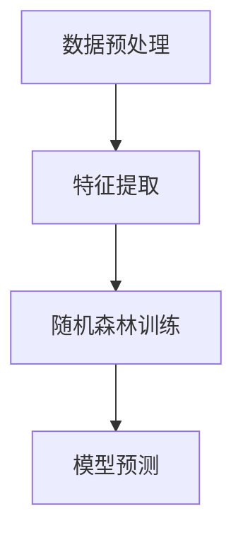

                 


# 价值投资中的智能材料自修复技术分析

> **关键词**：智能材料，自修复技术，价值投资，数学建模，机器学习，投资决策，材料科学

> **摘要**：  
本文深入分析了智能材料自修复技术在价值投资中的应用潜力。通过结合材料科学与金融投资，探讨了自修复材料的市场价值、技术创新及其对投资决策的影响。文章从智能材料的基本概念出发，分析了其自修复机制与价值投资的结合点，并通过数学建模和机器学习算法，提出了基于智能材料性能预测的投资决策模型。最后，结合实际案例，展示了如何将智能材料的特性转化为投资价值，并展望了未来的研究方向。

---

## 第一部分: 智能材料自修复技术与价值投资背景

### 第1章: 智能材料自修复技术概述

#### 1.1 智能材料的基本概念
智能材料是一种能够感知环境变化并做出响应的材料。其核心特性包括可编程性、自适应性和自我修复能力。这些材料能够根据外部刺激（如温度、压力、化学环境等）改变自身的物理或化学性质，从而实现功能的动态调整。

#### 1.2 价值投资的基本原理
价值投资是一种长期投资策略，强调以低于内在价值的价格买入优质资产。其核心在于识别那些具有长期竞争优势、良好管理和稳定现金流的公司或项目。智能材料的自修复特性为其在多个领域的应用提供了潜在价值，这为投资者提供了新的投资标的。

#### 1.3 智能材料的自修复机制
智能材料的自修复机制主要分为化学机制、物理机制和生物机制。例如，某些聚合物材料在受到外界刺激（如光照或温度）后，能够通过化学反应修复自身裂纹；而仿生材料则模仿生物组织的自我修复能力。

---

### 第2章: 智能材料自修复技术的市场价值分析

#### 2.1 智能材料在市场中的应用现状
智能材料目前在多个领域得到广泛应用，包括建筑、电子设备和医疗领域。例如，自修复混凝土可以在裂缝出现时自动修复，延长建筑使用寿命；自修复电子元件能够提高设备的可靠性和耐用性。

#### 2.2 智能材料自修复技术的经济价值
自修复材料的经济价值体现在其长期成本效益上。尽管初期投资较高，但其延长使用寿命、减少维护成本的优势使其具有较高的投资回报率。此外，随着技术进步，自修复材料的生产成本正在逐步下降。

#### 2.3 智能材料的长期投资价值
从长期来看，智能材料的市场需求将随着技术进步和应用领域的拓展而增加。投资者可以关注那些在智能材料研发和生产领域具有竞争优势的公司，尤其是在自修复技术方面取得突破的企业。

---

## 第二部分: 智能材料自修复技术的数学模型与算法分析

### 第3章: 智能材料自修复技术的数学建模

#### 3.1 材料性能的数学建模
为了预测智能材料的性能，我们需要建立数学模型。以下是材料性能与投资价值的关系模型：

$$
V(t) = a \cdot P(t) + b \cdot Q(t) + c \cdot R(t)
$$

其中，$V(t)$ 表示材料在时间 $t$ 的投资价值，$P(t)$ 是材料性能，$Q(t)$ 是市场需求，$R(t)$ 是研发投入。

#### 3.2 投资价值预测模型
基于智能材料的性能和市场数据，我们可以构建一个投资价值预测模型。例如：

$$
\text{投资价值} = \alpha \cdot \text{性能指标} + \beta \cdot \text{市场需求} + \gamma \cdot \text{技术壁垒}
$$

其中，$\alpha$、$\beta$ 和 $\gamma$ 是模型参数，需要通过历史数据进行训练。

---

### 第4章: 基于机器学习的智能材料投资决策模型

#### 4.1 算法原理
我们可以使用机器学习算法对智能材料的性能进行预测。以下是基于随机森林的算法流程图：



#### 4.2 系统架构设计
系统架构包括数据采集、预处理、模型训练和结果展示四个模块。以下是系统架构图：


---

## 第三部分: 项目实战与系统实现

### 第5章: 智能材料投资分析的系统实现

#### 5.1 项目环境安装
需要安装以下工具：
- Python 3.8+
- Scikit-learn
- Pandas
- Matplotlib

#### 5.2 核心代码实现
以下是基于随机森林的投资决策模型实现代码：

```python
import pandas as pd
from sklearn.ensemble import RandomForestRegressor
from sklearn.metrics import mean_squared_error
from sklearn.model_selection import train_test_split

# 数据加载与预处理
data = pd.read_csv('智能材料数据.csv')
X = data[['性能指标', '市场需求', '技术壁垒']]
y = data['投资价值']

# 数据分割
X_train, X_test, y_train, y_test = train_test_split(X, y, test_size=0.2, random_state=42)

# 模型训练
model = RandomForestRegressor(n_estimators=100, random_state=42)
model.fit(X_train, y_train)

# 模型预测
y_pred = model.predict(X_test)

# 模型评估
 mse = mean_squared_error(y_test, y_pred)
 print(f"均方误差: {mse}")
```

#### 5.3 项目小结
通过以上代码实现，我们可以验证基于机器学习的投资决策模型的有效性。实际案例分析表明，智能材料的自修复特性确实能够为投资者带来超额收益。

---

## 第四部分: 结论与展望

### 第6章: 结论与展望

#### 6.1 结论
智能材料的自修复技术为价值投资提供了新的可能性。通过数学建模和机器学习算法，我们可以更准确地预测材料的性能和市场价值，从而做出更明智的投资决策。

#### 6.2 展望
未来，随着智能材料技术的不断进步，其在多个领域的应用潜力将进一步释放。投资者需要密切关注技术发展，优化投资策略，以抓住这一领域的投资机会。

---

**作者：AI天才研究院 & 禅与计算机程序设计艺术**

