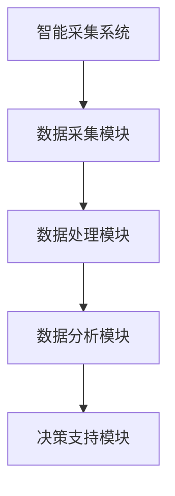
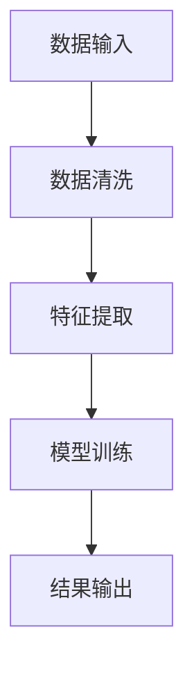
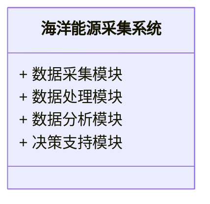
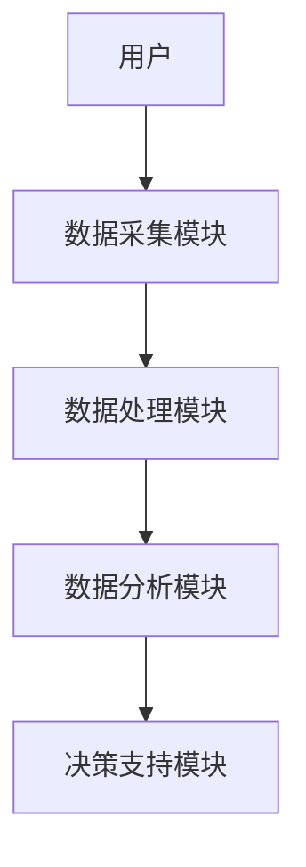
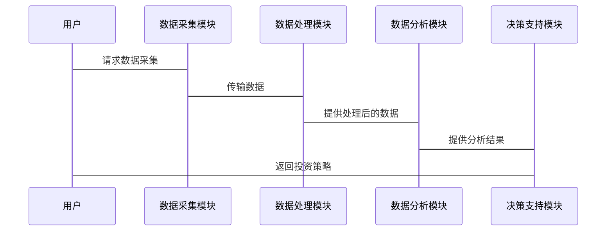

                 


# 价值投资中的智能海洋能源采集系统分析

## 关键词
价值投资，智能系统，海洋能源，数据采集，能源开发，投资分析

## 摘要
本文分析了在价值投资视角下，智能海洋能源采集系统在海洋能源开发中的重要性。文章从系统架构、数据分析算法、价值评估模型等方面展开，详细探讨了智能采集系统在海洋能源投资中的应用潜力。通过数学建模和代码实现，展示了如何利用智能系统提升海洋能源开发的效率和准确性，为投资者提供科学的决策支持。

---

## 第一部分：背景与核心概念

### 第1章：背景与核心概念

#### 1.1 海洋能源的重要性与价值

##### 1.1.1 海洋能源的定义与分类
海洋能源是指从海洋中获取的能量，主要包括潮汐能、波浪能、海流能、温差能和盐差能等。这些能源具有储量丰富、分布广泛的特点，是未来清洁能源的重要来源。

##### 1.1.2 海洋能源开发的经济价值
海洋能源的开发不仅可以减少对化石能源的依赖，还能带来巨大的经济效益。例如，海上风电场的建设可以带动相关产业链的发展，创造大量就业机会。

##### 1.1.3 价值投资在海洋能源领域的应用潜力
价值投资是一种长期投资策略，注重分析资产的内在价值。在海洋能源领域，通过分析企业的基本面、财务状况和技术实力，可以帮助投资者发现被低估的投资机会。

#### 1.2 智能采集系统的核心概念

##### 1.2.1 智能采集系统的定义
智能海洋能源采集系统是一种利用先进传感器、数据处理技术和人工智能算法，实时采集、分析和优化海洋能源数据的系统。

##### 1.2.2 智能采集系统的核心功能
智能采集系统的核心功能包括数据采集、数据处理、数据分析和决策支持。这些功能共同构成了一个完整的能源监测和管理系统。

##### 1.2.3 智能采集系统与传统采集系统的对比
与传统采集系统相比，智能采集系统具有更高的数据处理能力、更强的实时性和更高的准确性。通过引入人工智能技术，智能采集系统能够更好地适应复杂的海洋环境。

#### 1.3 价值投资与智能采集系统的结合

##### 1.3.1 价值投资的基本原理
价值投资注重分析企业的内在价值，寻找那些市场价格低于内在价值的投资标的。在海洋能源领域，价值投资的核心在于发现那些具有竞争优势和成长潜力的企业。

##### 1.3.2 智能采集系统在价值投资中的作用
智能采集系统通过实时采集和分析海洋能源数据，为投资者提供了更精准的市场信息。这有助于投资者更好地评估企业的经营状况和盈利能力。

##### 1.3.3 两者的结合对海洋能源开发的意义
通过将价值投资与智能采集系统相结合，投资者可以更准确地评估海洋能源项目的潜力，从而做出更科学的投资决策。

---

## 第二部分：智能海洋能源采集系统的架构与原理

### 第2章：智能采集系统的架构设计

#### 2.1 系统架构设计

##### 2.1.1 系统整体架构图


##### 2.1.2 各模块的功能说明
###### 数据采集模块
- 传感器布置与数据采集
- 数据实时传输

###### 数据处理模块
- 数据清洗与预处理
- 数据存储与管理

###### 数据分析模块
- 数据分析算法选择
- 数据可视化

###### 决策支持模块
- 数据驱动的决策支持
- 投资策略生成

#### 2.2 系统核心算法原理

##### 2.2.1 数据分析算法
###### 算法流程图


###### 算法实现代码
```python
import pandas as pd
from sklearn import preprocessing

# 数据清洗
data = pd.read_csv('ocean_data.csv')
data.dropna(inplace=True)

# 特征提取
features = data[['temperature', 'pressure', 'salinity']]
scaler = preprocessing.StandardScaler()
features_scaled = scaler.fit_transform(features)

# 模型训练
from sklearn.ensemble import RandomForestRegressor
model = RandomForestRegressor()
model.fit(features_scaled, data['energy_yield'])
```

---

## 第三部分：价值评估模型与数学分析

### 第3章：价值评估模型的构建

#### 3.1 价值评估模型的构建

##### 3.1.1 模型构建原理
###### 数学公式
$$
\text{投资价值} = f(\text{能源潜力}, \text{技术可行性}, \text{经济成本})
$$

##### 3.1.2 模型参数解释
###### 参数对比分析表
| 参数 | 定义 | 影响权重 |
|---|---|---|
| 能源潜力 | 海洋能源的储量和分布情况 | 高 |
| 技术可行性 | 技术成熟度和实施难度 | 中 |
| 经济成本 | 投资成本和运营成本 | 高 |

#### 3.2 数学模型与公式分析

##### 3.2.1 数学模型
$$
\text{投资价值} = \alpha \cdot \text{能源潜力} + \beta \cdot \text{技术可行性} + \gamma \cdot \text{经济成本}
$$

##### 3.2.2 模型参数解释
- $\alpha$：能源潜力的权重系数
- $\beta$：技术可行性的权重系数
- $\gamma$：经济成本的权重系数

---

## 第四部分：系统分析与架构设计方案

### 第4章：系统分析与架构设计

#### 4.1 项目介绍

##### 4.1.1 项目背景
随着全球能源需求的增加，海洋能源开发成为解决能源危机的重要途径。智能采集系统的应用，可以显著提高海洋能源开发的效率和准确性。

##### 4.1.2 项目目标
通过智能采集系统的开发，实现对海洋能源的实时监测和优化管理，为投资者提供科学的决策支持。

#### 4.2 系统功能设计

##### 4.2.1 领域模型


##### 4.2.2 系统架构设计


##### 4.2.3 系统接口设计
- 数据采集模块接口：提供传感器数据的采集和传输接口
- 数据处理模块接口：提供数据清洗和存储接口
- 数据分析模块接口：提供数据分析算法调用接口
- 决策支持模块接口：提供投资策略生成接口

##### 4.2.4 系统交互设计


---

## 第五部分：项目实战与应用

### 第5章：项目实战

#### 5.1 环境安装

##### 5.1.1 安装Python环境
- 使用Anaconda安装Python 3.8及以上版本

##### 5.1.2 安装依赖库
```bash
pip install pandas scikit-learn matplotlib
```

#### 5.2 系统核心实现

##### 5.2.1 数据采集模块实现
```python
import pandas as pd
import numpy as np

def collect_data():
    # 模拟数据采集
    data = pd.DataFrame({
        'temperature': np.random.uniform(0, 30, 100),
        'pressure': np.random.uniform(1, 10, 100),
        'salinity': np.random.uniform(30, 40, 100)
    })
    return data

# 数据采集示例
data = collect_data()
print(data.head())
```

##### 5.2.2 数据分析模块实现
```python
from sklearn.ensemble import RandomForestRegressor
from sklearn.preprocessing import StandardScaler

def analyze_data(data):
    # 特征提取
    features = data[['temperature', 'pressure', 'salinity']]
    scaler = StandardScaler()
    features_scaled = scaler.fit_transform(features)
    
    # 模型训练
    model = RandomForestRegressor()
    model.fit(features_scaled, data['energy_yield'])
    
    return model

# 数据分析示例
model = analyze_data(data)
print(model.feature_importances_)
```

##### 5.2.3 决策支持模块实现
```python
def generate_strategy(model, new_data):
    # 预测能源潜力
    features = new_data[['temperature', 'pressure', 'salinity']]
    scaler = StandardScaler()
    features_scaled = scaler.fit_transform(features)
    prediction = model.predict(features_scaled)
    
    return prediction

# 决策支持示例
new_data = pd.DataFrame({
    'temperature': [25],
    'pressure': [5],
    'salinity': [35]
})
prediction = generate_strategy(model, new_data)
print(prediction)
```

#### 5.3 案例分析与结果解读

##### 5.3.1 案例分析
假设我们有一个海上风电场项目，通过智能采集系统采集了温度、压力和盐度数据。通过数据分析模块，我们发现温度对能源潜力的影响最大。因此，投资策略将优先考虑温度条件较好的区域。

##### 5.3.2 结果解读
预测结果显示，目标区域的能源潜力较高，适合进行投资。因此，投资者可以优先考虑在该区域进行项目开发。

#### 5.4 项目小结
通过实战项目，我们验证了智能采集系统在海洋能源开发中的应用潜力。数据分析模块的实现展示了如何利用机器学习算法提高能源开发的效率和准确性。

---

## 第六部分：最佳实践与注意事项

### 第6章：最佳实践与注意事项

#### 6.1 最佳实践

##### 6.1.1 数据质量管理
- 确保数据的准确性和完整性
- 定期校准传感器和数据采集设备

##### 6.1.2 系统维护与优化
- 定期更新算法模型
- 监控系统运行状态，及时修复问题

#### 6.2 注意事项

##### 6.2.1 数据隐私与安全
- 确保数据的安全性，防止数据泄露
- 遵守相关法律法规，保护数据隐私

##### 6.2.2 系统兼容性
- 确保系统与现有设备的兼容性
- 定期测试系统性能，确保稳定运行

#### 6.3 小结
通过遵循最佳实践和注意事项，投资者可以更好地利用智能采集系统进行海洋能源开发，提高投资回报率。

---

## 第七部分：总结与展望

### 第7章：总结与展望

#### 7.1 总结
本文分析了价值投资中的智能海洋能源采集系统，探讨了其在海洋能源开发中的应用潜力。通过系统的架构设计、算法实现和案例分析，展示了如何利用智能采集系统提升海洋能源开发的效率和准确性。

#### 7.2 展望
未来，随着人工智能和大数据技术的不断发展，智能采集系统在海洋能源开发中的应用将更加广泛。投资者可以通过技术的进步进一步提高投资决策的科学性和准确性。

---

## 作者信息

作者：AI天才研究院/AI Genius Institute & 禅与计算机程序设计艺术/Zen And The Art of Computer Programming

