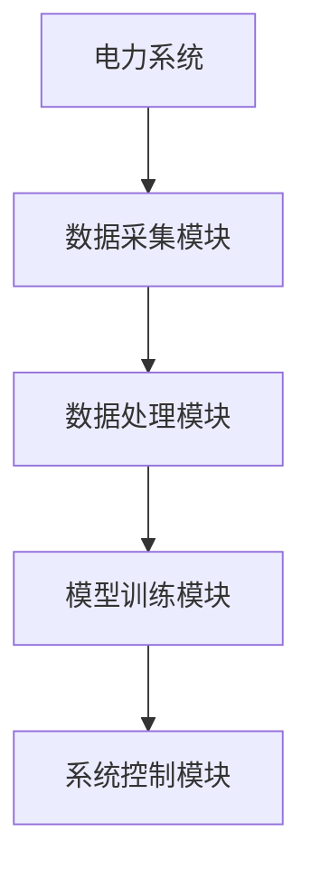

                 


# 价值投资中的智能电网技术发展趋势

---

## 关键词

智能电网技术、价值投资、能源互联网、负荷预测、电力系统稳定性

---

## 摘要

智能电网技术作为现代能源系统的核心，正在深刻改变电力行业的运行模式和价值创造方式。本文从价值投资的角度，分析智能电网技术的发展趋势，探讨其在能源互联网、智能输配电、能源存储等领域的应用潜力。通过负荷预测模型和电力系统稳定性分析，揭示智能电网技术如何为投资者创造价值。同时，结合实际案例，展示智能电网技术在投资分析中的应用，并总结未来的发展方向。

---

## 引言

智能电网技术是电力系统发展的必然趋势，其以数字化、智能化、网络化为特征，正在重新定义能源行业的价值创造方式。随着全球能源转型的推进，智能电网技术不仅提升了电力系统的效率，还为投资者提供了新的投资机会。本文将从技术、市场、投资等多角度，全面分析智能电网技术的发展趋势，为投资者提供决策参考。

---

## 第1章 智能电网技术概述

### 1.1 智能电网的定义与特点

智能电网（Smart Grid）是指通过先进信息通信技术、传感器技术、自动控制技术和能源管理技术，实现电力系统各个环节的智能化管理。其特点包括：

- **智能化**：通过智能设备和数据采集系统，实时监测和优化电力系统运行。
- **数字化**：基于大数据和人工智能技术，实现电力系统的全面数字化管理。
- **网络化**：通过互联网技术，实现电力系统各环节的互联互通。
- **高效性**：通过智能调度和优化控制，提高电力系统的效率和可靠性。

### 1.2 价值投资的基本概念

价值投资是一种投资策略，旨在通过分析企业的基本面，寻找被市场低估的投资标的。其核心理念是寻找具有长期竞争优势、稳定现金流和合理估值的企业。

---

## 第2章 智能电网技术的核心技术

### 2.1 智能输配电技术

智能输配电技术是智能电网的核心组成部分，包括智能变电站、智能配电系统等。以下是其关键特性：

- **智能变电站**：通过智能化设备实现变电站的无人值守和智能监控。
- **智能配电系统**：通过配电自动化技术，实现配电系统的智能化管理。

### 2.2 能源互联网技术

能源互联网是智能电网的重要延伸，它将电力系统与互联网技术深度融合，实现能源的智能调配和共享。能源互联网的核心优势包括：

- **多能源协同**：实现电能、热能、氢能等多种能源的协同优化。
- **分布式能源管理**：支持分布式能源的接入和管理，提高能源利用效率。
- **智能调配**：通过大数据和人工智能技术，实现能源的智能调配。

---

## 第3章 价值投资中的智能电网技术分析

### 3.1 智能电网技术的市场价值

智能电网技术的市场价值主要体现在以下几个方面：

1. **提高能源利用效率**：通过智能电网技术，可以减少能源浪费，降低能源成本。
2. **促进可再生能源发展**：智能电网技术为可再生能源的接入和管理提供了技术支持。
3. **降低投资风险**：通过智能电网技术，投资者可以更准确地预测能源需求和市场变化，降低投资风险。

### 3.2 智能电网技术的行业竞争分析

在智能电网技术领域，主要竞争企业包括：

1. **设备制造商**：如西门子、ABB、GE等。
2. **软件开发商**：如IBM、微软、谷歌等。
3. **能源互联网企业**：如特斯拉、蔚来等。

---

## 第4章 智能电网技术的算法原理

### 4.1 负荷预测模型

负荷预测是智能电网技术的重要组成部分，其准确性直接影响电力系统的运行效率。以下是负荷预测模型的原理：

- **数据采集**：通过传感器和数据采集系统，获取电力系统的负荷数据。
- **数据预处理**：对数据进行清洗、归一化等处理。
- **模型训练**：使用机器学习算法（如LSTM、XGBoost）进行模型训练。
- **预测结果**：基于训练好的模型，预测未来的负荷需求。

### 4.2 电力系统稳定性分析

电力系统稳定性分析是智能电网技术的关键环节，其目的是确保电力系统的安全运行。以下是电力系统稳定性分析的流程：

- **数据采集**：获取电力系统的运行数据。
- **模型构建**：建立电力系统的数学模型。
- **稳定性判断**：通过数学模型，判断电力系统的稳定性。
- **优化调整**：根据稳定性判断结果，优化电力系统的运行参数。

---

## 第5章 智能电网技术的系统架构设计

### 5.1 系统功能设计

智能电网技术的系统功能设计包括以下几个模块：

- **数据采集模块**：负责采集电力系统的实时数据。
- **数据处理模块**：对采集到的数据进行预处理和分析。
- **模型训练模块**：基于数据，训练负荷预测和稳定性分析模型。
- **系统控制模块**：根据模型结果，优化电力系统的运行。

### 5.2 系统架构设计

以下是智能电网技术的系统架构设计图：



### 5.3 系统接口设计

智能电网技术的系统接口设计需要考虑以下几个方面：

- **数据接口**：与传感器、数据库等外部系统对接。
- **用户接口**：提供友好的用户界面，方便用户操作。
- **通信接口**：实现系统内部各模块之间的通信。

---

## 第6章 项目实战：智能电网投资分析系统

### 6.1 环境安装

以下是智能电网投资分析系统的环境安装步骤：

1. **安装Python**：建议使用Python 3.8或以上版本。
2. **安装依赖库**：如pandas、numpy、scikit-learn等。
3. **安装可视化工具**：如Matplotlib、Seaborn等。

### 6.2 系统核心实现

以下是智能电网投资分析系统的Python代码示例：

```python
import pandas as pd
import numpy as np
from sklearn.model_selection import train_test_split
from sklearn.metrics import mean_squared_error
import matplotlib.pyplot as plt

# 数据加载
data = pd.read_csv('power_load.csv')

# 数据预处理
X = data.drop('load', axis=1)
y = data['load']

# 划分训练集和测试集
X_train, X_test, y_train, y_test = train_test_split(X, y, test_size=0.2, random_state=42)

# 模型训练
from sklearn.ensemble import RandomForestRegressor
model = RandomForestRegressor(n_estimators=100, random_state=42)
model.fit(X_train, y_train)

# 模型预测
y_pred = model.predict(X_test)

# 模型评估
mse = mean_squared_error(y_test, y_pred)
print(f"均方误差：{mse}")

# 可视化
plt.scatter(y_test, y_pred)
plt.xlabel('实际负荷')
plt.ylabel('预测负荷')
plt.title('负荷预测结果')
plt.show()
```

---

## 第7章 总结与展望

智能电网技术作为现代能源系统的核心，正在深刻改变电力行业的运行模式和价值创造方式。通过本文的分析，我们可以看到，智能电网技术在能源互联网、智能输配电、能源存储等领域具有广阔的应用前景。未来，随着人工智能、大数据等技术的进一步发展，智能电网技术将为投资者创造更大的价值。

---

## 作者：AI天才研究院/AI Genius Institute & 禅与计算机程序设计艺术 /Zen And The Art of Computer Programming

