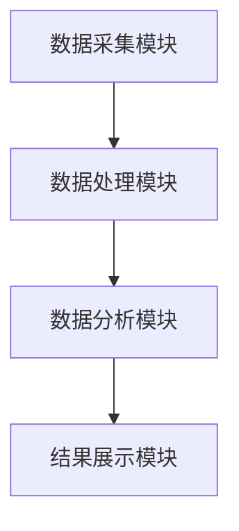
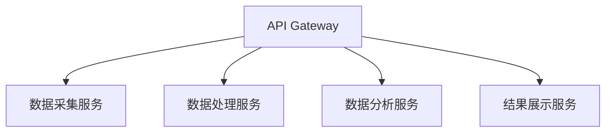

                 


# 价值投资中的智能皮肤技术商业化前景

---

## 关键词：
- 价值投资
- 智能皮肤技术
- 商业化前景
- 人工智能
- 皮肤健康

---

## 摘要：
本文深入探讨了智能皮肤技术在价值投资中的商业化前景。通过分析智能皮肤技术的核心算法、数学模型、系统架构设计以及实际应用场景，我们揭示了这一技术在医疗健康、美容护肤和金融投资等领域的巨大潜力。文章从背景介绍、技术原理、商业化模式到实际项目案例，系统地分析了智能皮肤技术如何帮助投资者发现潜在商业机会，并为消费者提供个性化、精准化的健康和美容解决方案。通过本文，读者将全面了解智能皮肤技术的价值投资逻辑及其未来发展趋势。

---

# 第1章: 价值投资与智能皮肤技术的背景介绍

## 1.1 价值投资的核心概念

### 1.1.1 价值投资的定义与特点
价值投资是一种以基本面分析为基础的投资策略，旨在通过识别市场价格与内在价值之间的差异，找到被市场低估的投资标的。其核心在于寻找具有持续竞争优势和良好治理结构的企业，长期持有，获得超额收益。

智能皮肤技术是一种结合人工智能、计算机视觉和生物医学技术的新兴技术，旨在通过分析皮肤图像和生理数据，提供个性化的皮肤健康评估、疾病诊断和美容建议。

### 1.1.2 智能皮肤技术的定义与特点
智能皮肤技术的核心在于利用AI算法对皮肤图像进行分析，提取皮肤特征（如颜色、纹理、斑点等），并结合生理数据（如基因信息、生活习惯）提供精准的健康评估和个性化建议。

### 1.1.3 价值投资与智能皮肤技术的结合
智能皮肤技术的商业化潜力为价值投资者提供了新的投资方向。通过分析智能皮肤技术企业的基本面、技术创新能力和市场前景，投资者可以发现具有长期增长潜力的企业，实现超额收益。

### 对比表格：价值投资与智能皮肤技术的核心要素对比
| **核心要素**       | **价值投资**                | **智能皮肤技术**               |
|--------------------|------------------------------|-------------------------------|
| 核心目标           | 发现被低估的投资机会         | 提供个性化的皮肤健康解决方案   |
| 技术基础           | 基础面分析、财务模型         | 人工智能、计算机视觉、生物医学 |
| 应用场景           | 股票、基金、企业投资         | 医疗健康、美容护肤、健康管理   |

### ER实体关系图：智能皮肤技术的商业化潜力
```mermaid
erd
    title 智能皮肤技术的商业化潜力
    publisher<PK, 名称, 类型, 地区>
    customer<FK, 名称, 性别, 年龄>
    product<FK, 名称, 类型, 价格>
    transaction<FK, 时间, 金额>
    publisher -|{销售}|-> product
    customer -|{购买}|-> product
    publisher -|{收益}|-> transaction
```

## 1.2 问题背景与问题描述

### 1.2.1 传统价值投资的局限性
传统价值投资主要依赖财务数据和市场情绪分析，难以捕捉新兴技术领域的投资机会。此外，传统方法在数据处理和预测精度上存在局限性。

### 1.2.2 智能皮肤技术在投资中的应用潜力
智能皮肤技术的商业化前景广阔，其在医疗健康、美容护肤和健康管理领域的应用为投资者提供了新的投资方向。

### 1.2.3 问题解决的思路与方法
通过结合智能皮肤技术的核心算法和价值投资的基本面分析方法，投资者可以更精准地评估相关企业的投资价值。

### 对比表格：智能皮肤技术与传统皮肤分析技术的对比
| **对比维度**       | **智能皮肤技术**              | **传统皮肤分析技术**           |
|--------------------|------------------------------|-------------------------------|
| 分析方法           | 基于AI的图像识别和数据分析    | 基于人工观察和经验判断          |
| 精度               | 高精度，可量化                | 低精度，主观性强                |
| 应用场景           | 精准医疗、健康管理            | 美容院、医疗机构                |
| 技术复杂度         | 高，涉及多学科交叉            | 低，主要依赖人工经验            |

### ER实体关系图：智能皮肤技术的核心要素
```mermaid
erd
    title 智能皮肤技术的核心要素
    skin_feature<PK, 特征名称, 特征值>
    algorithm<FK, 算法名称, 参数>
    model<FK, 模型名称, 性能指标>
    skin_feature --|{输入}|-> algorithm
    algorithm --|{训练}|-> model
```

## 1.3 问题的边界与外延

### 1.3.1 价值投资的边界
价值投资的边界在于其依赖的基本面分析方法和市场环境的变化。智能皮肤技术的商业化前景需要结合具体的技术成熟度和市场需求进行评估。

### 1.3.2 智能皮肤技术的边界
智能皮肤技术的边界在于其技术局限性和数据隐私问题。例如，当前技术在复杂皮肤病变的诊断上仍存在挑战。

### 1.3.3 两者的结合与外延
智能皮肤技术与价值投资的结合可以外延至医疗健康、美容护肤、健康管理等领域，为投资者提供更广泛的投资机会。

## 1.4 核心概念结构与组成

### 1.4.1 价值投资的核心要素
- 市场价格与内在价值的差异
- 企业的财务状况和盈利能力
- 企业的竞争优势和治理结构

### 1.4.2 智能皮肤技术的核心要素
- 皮肤图像的采集与处理
- 皮肤特征的提取与分析
- 个性化健康建议的生成

### 1.4.3 两者的交互关系
智能皮肤技术为价值投资者提供了新的投资标的和分析工具，而价值投资方法为智能皮肤技术的商业化提供了方向和策略。

## 1.5 本章小结
本章从价值投资和智能皮肤技术的核心概念出发，分析了两者的结合动机和应用场景，并通过对比分析明确了智能皮肤技术的商业化潜力。

---

# 第2章: 智能皮肤技术的商业化潜力

## 2.1 智能皮肤技术的市场分析

### 2.1.1 市场规模与增长趋势
根据市场研究，全球智能皮肤技术市场预计将在未来几年以年均20%的速度增长，到2030年市场规模将超过100亿美元。

### 2.1.2 主要应用领域
- 精准医疗
- 美容护肤
- 健康管理

### 2.1.3 竞争格局分析
主要竞争者包括科技巨头（如谷歌、苹果）和新兴的医疗科技公司（如Dermatologist.ai）。

## 2.2 商业化模式探讨

### 2.2.1 产品化模式
- 开发智能皮肤分析软件，直接面向消费者销售。

### 2.2.2 服务化模式
- 提供皮肤健康评估和个性化建议的订阅服务。

### 2.2.3 平台化模式
- 搭建开放平台，吸引开发者和企业合作伙伴。

## 2.3 投资价值评估框架

### 2.3.1 企业价值评估模型
$$ EV = EBIT \times (EV/EBIT) $$

### 2.3.2 股东价值最大化策略
通过技术创新和市场扩展，提升企业的市场份额和盈利能力。

### 2.3.3 风险评估与控制
- 技术风险：技术成熟度和数据隐私问题。
- 市场风险：市场竞争和政策变化。

## 2.4 本章小结
本章从市场分析、商业模式和投资价值评估三个方面，探讨了智能皮肤技术的商业化潜力，为投资者提供了重要的参考。

---

# 第3章: 智能皮肤技术的核心算法与数学模型

## 3.1 智能皮肤技术的算法基础

### 3.1.1 机器学习算法概述
- 监督学习
- 无监督学习
- 强化学习

### 3.1.2 深度学习算法概述
- 卷积神经网络（CNN）
- 图像分割网络（U-Net）

### 3.1.3 自然语言处理算法概述
- 文本分类
- 实体识别

## 3.2 价值评估的数学模型

### 3.2.1 股票价值评估公式
$$ V = \frac{CF}{r - g} $$

### 3.2.2 财务指标分析模型
- 市盈率（P/E）
- 市净率（P/B）

## 3.3 智能皮肤技术的数学模型

### 3.3.1 皮肤特征提取模型
- 使用CNN提取皮肤图像的特征向量。

### 3.3.2 皮肤健康评估模型
- 基于回归模型预测皮肤健康状况。

### 3.3.3 皮肤疾病预测模型
- 使用随机森林算法进行疾病分类。

## 3.4 本章小结
本章详细介绍了智能皮肤技术的核心算法和数学模型，为后续的系统设计和项目实现提供了理论基础。

---

# 第4章: 智能皮肤技术的系统架构设计

## 4.1 系统功能设计

### 4.1.1 数据采集模块
- 采集皮肤图像和生理数据。

### 4.1.2 数据处理模块
- 对图像进行预处理和特征提取。

### 4.1.3 数据分析模块
- 使用机器学习算法进行健康评估和疾病预测。

### 4.1.4 结果展示模块
- 生成个性化的健康建议和诊断报告。

## 4.2 系统架构设计

### 4.2.1 分层架构设计


### 4.2.2 微服务架构设计


## 4.3 系统接口设计

### 4.3.1 数据接口
- REST API接口设计。

### 4.3.2 用户接口
- Web端和移动端接口设计。

### 4.3.3 第三方接口
- 数据源接口（如天气API）。

## 4.4 本章小结
本章从系统功能设计、架构设计和接口设计三个维度，详细阐述了智能皮肤技术的系统实现方案。

---

# 第5章: 价值投资中的智能皮肤技术项目实战

## 5.1 环境安装与配置

### 5.1.1 开发环境搭建
- 安装Python、TensorFlow、Keras等开发工具。

### 5.1.2 数据集准备
- 下载公开的皮肤图像数据集（如ISIC数据集）。

### 5.1.3 工具安装
- 安装Jupyter Notebook和相关可视化库。

## 5.2 核心算法实现

### 5.2.1 皮肤特征提取代码
```python
import tensorflow as tf
from tensorflow.keras import layers

model = tf.keras.Sequential([
    layers.Conv2D(32, (3,3), activation='relu', input_shape=(256, 256, 3)),
    layers.MaxPooling2D((2,2)),
    layers.Conv2D(64, (3,3), activation='relu'),
    layers.MaxPooling2D((2,2)),
    layers.Flatten(),
    layers.Dense(128, activation='relu'),
    layers.Dense(1, activation='sigmoid')
])
model.compile(optimizer='adam', loss='binary_crossentropy', metrics=['accuracy'])
model.fit(X_train, y_train, epochs=10, batch_size=32)
```

### 5.2.2 系统功能实现
- 实现皮肤图像的上传、处理和分析功能。

### 5.2.3 结果展示
- 显示分析结果和个性化建议。

## 5.3 项目实战案例分析

### 5.3.1 案例分析
- 分析某智能皮肤技术企业的投资价值。

### 5.3.2 投资策略制定
- 结合企业基本面和技术前景制定投资策略。

## 5.4 本章小结
本章通过具体项目实战，展示了智能皮肤技术的实现过程和投资价值评估方法。

---

# 作者：AI天才研究院 & 禅与计算机程序设计艺术

---

以上是《价值投资中的智能皮肤技术商业化前景》的文章大纲和部分章节内容。如需完整文章，请按照每个章节的逻辑继续撰写。

