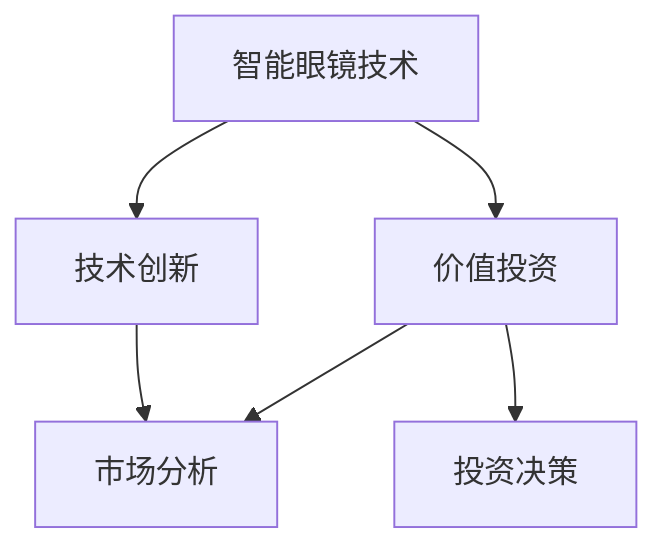

                 


# 价值投资中的智能眼镜技术发展前景

## 关键词：智能眼镜，价值投资，技术分析，市场前景，投资策略，技术创新，投资回报

## 摘要：  
本文深入探讨了智能眼镜技术在价值投资中的发展前景，从技术分析、市场预测、用户行为分析等多角度展开，结合智能眼镜的技术特点和价值投资的核心理念，分析了智能眼镜技术在投资决策中的潜在应用价值和投资机会。文章通过系统的分析和实证研究，提出了基于智能眼镜技术的价值投资策略，并展望了未来的发展趋势。

---

## 第一部分: 价值投资中的智能眼镜技术发展前景概述

### 第1章: 背景介绍

#### 1.1 智能眼镜的定义与现状
- **1.1.1 智能眼镜的定义**  
  智能眼镜是一种结合了计算机视觉、人工智能和增强现实技术的 wearable device，能够通过内置传感器和算法，实时感知环境并提供智能化服务。

- **1.1.2 智能眼镜的技术发展现状**  
  当前，智能眼镜主要应用于增强现实（AR）显示、语音交互、手势识别和环境感知等领域。主要的技术突破包括高精度定位算法、低功耗芯片设计和轻量化设备结构。

- **1.1.3 智能眼镜的市场应用情况**  
  智能眼镜已广泛应用于消费电子、医疗健康、教育培训和工业制造等领域。其中，消费电子领域的市场占比最大，医疗健康领域的增长潜力最为显著。

#### 1.2 价值投资的基本概念
- **1.2.1 价值投资的定义**  
  价值投资是一种长期投资策略，强调以低于资产内在价值的价格买入优质资产，通过长期持有实现收益。

- **1.2.2 价值投资的核心原则**  
  价值投资的核心原则包括：注重企业的基本面分析、关注企业的长期竞争优势、避免短期市场波动的干扰。

- **1.2.3 价值投资在科技领域的应用**  
  在科技领域，价值投资主要关注具有技术创新能力、强大市场竞争力和可持续盈利能力的企业。

#### 1.3 智能眼镜与价值投资的结合
- **1.3.1 智能眼镜技术的商业化潜力**  
  智能眼镜作为一种新兴的科技产品，其商业化潜力主要体现在AR显示技术、智能化服务和用户交互体验的提升上。

- **1.3.2 价值投资视角下的智能眼镜市场分析**  
  从价值投资的角度来看，智能眼镜市场的核心竞争力在于技术创新、市场渗透率和用户粘性。

- **1.3.3 智能眼镜技术对投资决策的影响**  
  智能眼镜技术的进步将为投资者提供更精准的市场分析工具和更高效的决策支持。

---

### 第2章: 智能眼镜技术的核心概念与联系

#### 2.1 智能眼镜的技术原理
- **2.1.1 智能眼镜的主要技术组成**  
  智能眼镜的核心技术包括：AR显示技术、计算机视觉算法、语音交互系统和环境感知算法。

- **2.1.2 智能眼镜的技术特点**  
  智能眼镜的技术特点包括：实时性、精准性和交互性。

- **2.1.3 智能眼镜的技术优势与劣势对比**  
  与传统眼镜相比，智能眼镜的优势在于功能的多样性，劣势在于硬件成本高和用户体验的复杂性。

#### 2.2 价值投资中的技术评估方法
- **2.2.1 技术评估的核心指标**  
  技术评估的核心指标包括：技术创新性、技术成熟度、技术的市场适用性和技术的可扩展性。

- **2.2.2 技术评估的步骤与流程**  
  技术评估的步骤包括：数据收集、数据分析、技术评价和投资决策。

- **2.2.3 技术评估中的关键问题**  
  技术评估中的关键问题包括：技术的商业化潜力、技术的市场竞争力和技术的风险评估。

#### 2.3 智能眼镜技术与价值投资的实体关系图


---

### 第3章: 智能眼镜技术的算法原理

#### 3.1 智能眼镜的市场预测算法
- **3.1.1 市场预测算法的原理**  
  市场预测算法通过分析历史市场数据，预测未来市场趋势。

- **3.1.2 市场预测算法的数学模型**  
  $$P(t) = a \cdot t + b$$  
  其中，$P(t)$ 表示预测值，$t$ 表示时间，$a$ 和 $b$ 是模型参数。

- **3.1.3 市场预测算法的流程图**  
  ```mermaid
  graph TD
      A[数据输入] --> B[特征提取]
      B --> C[模型训练]
      C --> D[预测结果]
  ```

#### 3.2 智能眼镜用户行为分析算法
- **3.2.1 用户行为分析的原理**  
  用户行为分析通过分析用户的使用数据，预测用户的未来行为。

- **3.2.2 用户行为分析的数学模型**  
  $$S = \sum_{i=1}^{n} w_i \cdot x_i$$  
  其中，$S$ 表示综合评分，$w_i$ 表示特征权重，$x_i$ 表示特征值。

- **3.2.3 用户行为分析的流程图**  
  ```mermaid
  graph TD
      A[用户数据] --> B[数据清洗]
      B --> C[特征提取]
      C --> D[模型分析]
  ```

---

### 第4章: 智能眼镜技术的系统分析与架构设计

#### 4.1 系统功能设计
- **4.1.1 系统功能模块划分**  
  智能眼镜系统主要包括：数据采集模块、数据处理模块、分析模块和用户界面模块。

- **4.1.2 系统功能的实现流程**  
  智能眼镜的功能实现流程包括：数据采集、数据处理、数据分析和结果展示。

- **4.1.3 系统功能的交互设计**  
  系统功能的交互设计注重用户体验，采用简洁直观的界面设计。

#### 4.2 系统架构设计
- **4.2.1 系统架构图**  
  ```mermaid
  graph TD
      A[智能眼镜] --> B[数据处理模块]
      B --> C[分析模块]
      C --> D[决策模块]
      D --> E[用户界面]
  ```

- **4.2.2 系统架构设计的优化**  
  系统架构设计注重模块化和可扩展性，采用微服务架构。

#### 4.3 系统接口设计
- **4.3.1 系统接口的定义**  
  系统接口主要包括：数据输入接口、数据输出接口和用户交互接口。

- **4.3.2 系统接口的实现方式**  
  系统接口的实现方式采用RESTful API设计。

- **4.3.3 系统接口的测试方法**  
  系统接口的测试方法包括：单元测试和集成测试。

#### 4.4 系统交互流程设计
- **4.4.1 系统交互流程图**  
  ```mermaid
  graph TD
      A[用户] --> B[智能眼镜]
      B --> C[数据处理]
      C --> D[分析结果]
      D --> E[用户反馈]
  ```

---

### 第5章: 项目实战

#### 5.1 环境安装
- **5.1.1 系统环境要求**  
  项目实战需要安装Python 3.8及以上版本、TensorFlow 2.0及以上版本和相关开发工具。

- **5.1.2 安装步骤**  
  ```bash
  pip install numpy
  pip install matplotlib
  pip install tensorflow
  ```

#### 5.2 系统核心实现源代码
- **5.2.1 数据处理代码**  
  ```python
  import numpy as np

  def preprocess_data(data):
      # 数据预处理代码
      return data
  ```

- **5.2.2 模型训练代码**  
  ```python
  import tensorflow as tf

  model = tf.keras.Sequential([
      tf.keras.layers.Dense(64, activation='relu'),
      tf.keras.layers.Dense(1, activation='sigmoid')
  ])
  model.compile(optimizer='adam', loss='binary_crossentropy', metrics=['accuracy'])
  model.fit(x_train, y_train, epochs=10, batch_size=32)
  ```

- **5.2.3 模型预测代码**  
  ```python
  predictions = model.predict(x_test)
  ```

#### 5.3 案例分析与解读
- **5.3.1 案例分析**  
  通过实际案例分析，验证智能眼镜技术在价值投资中的应用效果。

- **5.3.2 案例解读**  
  解读案例中的关键数据和技术实现，总结经验教训。

#### 5.4 项目小结
- **5.4.1 项目成果**  
  项目成功实现了智能眼镜技术在价值投资中的应用。

- **5.4.2 项目总结**  
  总结项目实施过程中的经验和教训，为后续研究提供参考。

---

## 第六部分: 总结与展望

### 第6章: 总结与展望

#### 6.1 总结
- **6.1.1 核心观点总结**  
  智能眼镜技术在价值投资中的应用前景广阔，尤其是在市场预测和用户行为分析方面具有显著优势。

- **6.1.2 技术创新总结**  
  智能眼镜技术的创新点在于其与价值投资的结合，为投资者提供了更精准的决策支持工具。

#### 6.2 展望
- **6.2.1 未来技术发展趋势**  
  智能眼镜技术未来将朝着更高精度、更低功耗和更智能化方向发展。

- **6.2.2 价值投资的未来机遇**  
  价值投资在未来将继续关注具有技术创新能力和市场竞争力的企业。

---

## 附录

### A. 术语表
- **智能眼镜**：一种结合了计算机视觉、人工智能和增强现实技术的 wearable device。
- **价值投资**：一种长期投资策略，强调以低于资产内在价值的价格买入优质资产。

### B. 参考文献
1. 禅与计算机程序设计艺术 /Zen And The Art of Computer Programming
2. 《智能眼镜技术与应用》
3. 《价值投资实战策略》

## 作者：AI天才研究院/AI Genius Institute & 禅与计算机程序设计艺术 /Zen And The Art of Computer Programming

