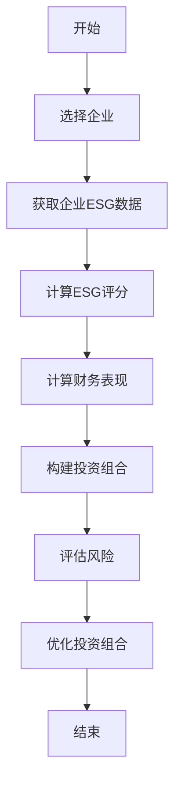

                 


# 《价值投资中的环境、社会和治理（ESG）因素》

## 关键词：价值投资、ESG、环境、社会、治理、投资策略、可持续发展

## 摘要：  
本文探讨了环境（Environmental）、社会（Social）和治理（Governance）因素在价值投资中的重要性。通过分析ESG的定义、核心概念、算法原理和系统架构，本文展示了如何将ESG因素纳入投资决策，并通过实际案例展示了如何构建ESG投资组合。文章还讨论了ESG在投资中的挑战和未来发展方向。

---

## 第一部分: 价值投资与ESG的背景介绍

### 第1章: ESG的定义与核心概念

#### 1.1 ESG的定义与背景  
- **环境（Environmental）**：关注企业在资源利用、碳排放、污染等方面的表现。  
- **社会（Social）**：关注企业在员工权益、社会责任、供应链管理等方面的表现。  
- **治理（Governance）**：关注企业在公司治理结构、高管薪酬、透明度等方面的表现。  

ESG投资的核心理念是通过关注企业在可持续发展方面的表现，寻找具有长期投资价值的企业。  

#### 1.2 ESG的核心要素  
- **环境**：碳排放、资源利用效率、绿色能源使用情况。  
- **社会**：员工权益、社会责任、社区参与。  
- **治理**：董事会结构、高管薪酬、公司透明度。  

#### 1.3 ESG与价值投资的结合  
- ESG因子可以帮助投资者识别那些在长期发展中具有优势的企业。  
- ESG因子与企业财务表现密切相关，尤其是在风险调整后收益方面。  

---

### 第2章: ESG投资的理论基础  

#### 2.1 投资学基础  
- 传统投资理论与ESG的结合：ESG因子是资产定价的重要组成部分。  
- 现代投资组合理论（MPT）的扩展：通过引入ESG因子优化投资组合。  
- ESG因子与资产定价模型：ESG因子可以作为风险调整收益的重要组成部分。  

#### 2.2 ESG因子与风险调整收益  
- ESG因子对风险调整收益的影响：企业ESG表现好的公司往往具有更低的市场风险。  
- ESG因子与CAPM模型的结合：将ESG因子纳入资本资产定价模型中。  

#### 2.3 ESG投资的边界与外延  
- ESG投资的适用范围：适用于所有行业和市场环境。  
- ESG与非财务因素的关联：ESG因子与企业声誉、长期竞争力密切相关。  

---

## 第二部分: ESG投资的核心概念与联系  

### 第3章: ESG的核心概念原理  

#### 3.1 ESG因子的属性特征对比  
| **属性**   | **环境（E）**       | **社会（S）**         | **治理（G）**         |  
|------------|---------------------|-----------------------|-----------------------|  
| **关注点** | 环境影响             | 社会责任             | 公司治理结构         |  
| **指标**   | 碳排放、资源利用     | 员工权益、社区参与   | 董事会结构、高管薪酬 |  

通过对比分析，可以发现ESG三者的属性特征各不相同，但又相互关联。  

#### 3.2 ESG的ER实体关系图  
使用Mermaid绘制的ER实体关系图：  
```mermaid
erDiagram
    actor 投资者 {
        <属性> 投资目标
        <属性> 风险偏好
    }
    actor 企业 {
        <属性> ESG 评分
        <属性> 财务表现
    }
    actor 市场 {
        <属性> 市场风险
        <属性> 市场回报
    }
    投资者 --> 企业 : 评估企业
    企业 --> 市场 : 影响市场
```

---

### 第4章: ESG投资的算法原理  

#### 4.1 ESG投资的数学模型  
使用Mermaid绘制的算法流程图：  


#### 4.2 ESG因子的数学公式  
ESG评分公式：  
$$ ESG\_score = \alpha \cdot E + \beta \cdot S + \gamma \cdot G $$  
其中，$\alpha$、$\beta$、$\gamma$为权重系数，$E$、$S$、$G$分别为环境、社会、治理评分。  

---

## 第三部分: ESG投资的系统分析与架构设计  

### 第5章: 系统分析与架构设计方案  

#### 5.1 系统功能设计（领域模型）  
使用Mermaid绘制的领域模型类图：  


#### 5.2 系统架构设计  
使用Mermaid绘制的系统架构图：  
```mermaid
container 整体架构 {
    数据源（企业ESG数据、市场数据）
    服务层（ESG评分计算、投资组合优化）
    展示层（投资者界面）
}
```

---

## 第四部分: 项目实战  

### 第6章: 项目实战：构建ESG投资组合  

#### 6.1 环境安装  
- 数据源：使用公开的ESG评分数据和财务数据。  
- 工具：Python、Pandas、NumPy、Matplotlib。  

#### 6.2 核心代码实现  

```python
import pandas as pd
import numpy as np
import matplotlib.pyplot as plt

# 示例数据
data = {
    '企业': ['A', 'B', 'C', 'D'],
    'E': [0.8, 0.6, 0.7, 0.9],
    'S': [0.7, 0.8, 0.6, 0.8],
    'G': [0.6, 0.7, 0.5, 0.8]
}

df = pd.DataFrame(data)

# 计算ESG评分
df['ESG评分'] = 0.4 * df['E'] + 0.3 * df['S'] + 0.3 * df['G']

# 可视化
plt.figure(figsize=(10, 6))
plt.bar(df['企业'], df['ESG评分'])
plt.title('ESG评分')
plt.xlabel('企业')
plt.ylabel('ESG评分')
plt.show()
```

#### 6.3 案例分析  
- 数据采集：从公开数据库获取企业ESG评分和财务数据。  
- 计算ESG评分：使用加权公式计算ESG评分。  
- 构建投资组合：基于ESG评分和财务表现优化投资组合。  

---

## 第五部分: 总结与展望  

### 第7章: 总结与展望  

#### 7.1 总结  
- 本文详细探讨了ESG在价值投资中的应用，展示了如何通过ESG因子优化投资组合。  
- ESG投资不仅考虑企业的财务表现，还关注其环境、社会和治理表现。  

#### 7.2 展望  
- ESG投资的未来发展趋势：随着可持续发展理念的普及，ESG投资将越来越受到重视。  
- 技术创新：通过大数据和人工智能技术进一步优化ESG投资策略。  

---

## 作者：AI天才研究院/AI Genius Institute & 禅与计算机程序设计艺术 /Zen And The Art of Computer Programming

