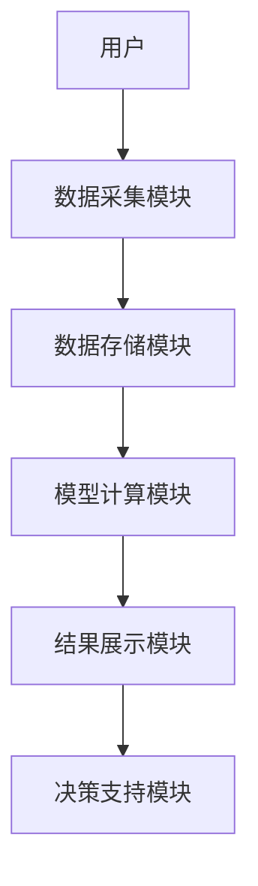

                 


# 监管风险的定量评估

## 第4章：监管风险的定量评估

### 4.1 定量评估的核心原理

定量评估监管风险的核心在于将监管风险转化为可量化的指标，并通过数学模型计算其对投资组合的影响。常用的定量模型包括风险价值（VaR）、情景分析和蒙特卡洛模拟等方法。这些方法能够帮助投资者量化监管政策变化可能带来的潜在损失，并制定相应的风险管理策略。

#### 监管风险的数学模型

风险价值（VaR）是衡量金融资产在正常市场条件下可能遭受的最大损失的一种方法。在监管风险评估中，我们可以将VaR扩展到监管政策变化带来的潜在损失。

公式如下：

$$ \text{VaR} = \text{Value} \times \text{风险系数} $$

其中，风险系数由监管政策的变化幅度和市场反应的敏感性决定。

### 4.2 监管风险的定量指标

#### 4.2.1 风险价值（VaR）

 VaR模型用于量化在给定置信水平下，监管政策变化可能导致的最大损失。例如，在95%的置信水平下，意味着在大多数情况下，损失不会超过计算出的VaR值。

公式如下：

$$ \text{VaR} = \text{资产价值} \times \text{风险系数} $$

#### 4.2.2 情景分析

情景分析是一种通过模拟不同监管政策变化情景来评估其影响的方法。例如，假设新的监管政策导致某行业的税率提高，情景分析可以帮助评估该政策对企业盈利能力和股票价格的具体影响。

#### 4.2.3 蒙特卡洛模拟

蒙特卡洛模拟通过生成大量可能的监管政策变化情景，计算这些情景对投资组合的影响。这种方法特别适用于复杂和不确定的监管环境。

### 4.3 监管风险的定量评估步骤

1. **数据收集**：收集相关的监管政策变化数据、市场数据和资产表现数据。
2. **模型选择**：选择合适的定量模型，如VaR、情景分析或蒙特卡洛模拟。
3. **参数估计**：估计模型的参数，如风险系数、波动率等。
4. **计算与分析**：运行模型，计算监管风险的影响，并进行敏感性分析。
5. **结果解读**：根据模型输出，评估监管风险对投资组合的影响，并制定相应的风险管理策略。

---

## 系统设计

### 4.4 监管风险评估系统的架构设计

#### 系统功能模块

- **数据采集模块**：收集监管政策、市场数据和资产信息。
- **模型计算模块**：运行VaR、情景分析或蒙特卡洛模拟。
- **结果展示模块**：以图表形式展示监管风险的影响。
- **决策支持模块**：提供风险管理建议。

#### 系统架构图



### 4.5 系统接口设计

- **输入接口**：接收监管政策数据和资产数据。
- **输出接口**：提供风险评估结果和管理建议。

---

## 项目实战

### 4.6 项目实战：监管风险评估系统实现

#### 环境搭建

- **工具安装**：安装Python、Pandas、NumPy、Matplotlib等库。
- **数据准备**：收集相关监管政策数据和资产数据。

#### 核心代码实现

```python
import numpy as np
import pandas as pd
import matplotlib.pyplot as plt

def calculate VaR(returns, confidence_level=0.95):
    sorted_returns = sorted(returns)
    var_index = int(len(sorted_returns) * (1 - confidence_level))
    var = -sorted_returns[var_index]
    return var

# 示例数据
returns = np.random.normal(0, 1, 1000)
var = calculate VaR(returns, 0.95)
print(f"VaR at 95% confidence level: {var}")
```

---

## 总结与展望

### 4.7 总结

监管风险是价值投资中不可忽视的重要因素。通过定量和定性分析相结合，投资者可以更好地识别和评估监管风险，制定有效的风险管理策略。

### 4.8 展望

未来的研究可以进一步探索监管风险的动态变化，结合人工智能技术，提高风险评估的准确性和及时性。

---

## 作者

作者：AI天才研究院/AI Genius Institute & 禅与计算机程序设计艺术 /Zen And The Art of Computer Programming

