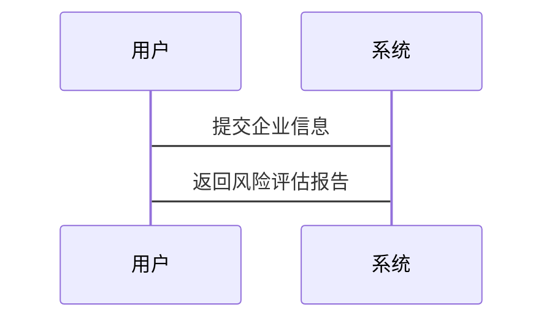

                 


# 价值投资中的科技颠覆风险评估

> 关键词：价值投资、科技颠覆、风险评估、企业估值、技术生命周期

> 摘要：在科技迅速发展的今天，科技颠覆已经成为价值投资者必须面对的重要挑战。本文从科技颠覆的基本概念出发，深入分析其对企业估值的影响，并结合实际案例，探讨如何通过技术生命周期、市场竞争和企业适应能力等核心维度，构建科技颠覆风险评估的框架与方法。同时，本文还详细介绍了评估模型的数学公式和算法实现，为投资者提供实用的工具与策略。

---

## 第一部分: 价值投资中的科技颠覆风险评估背景与概念

### 第1章: 科技颠覆与价值投资概述

#### 1.1 科技颠覆的定义与特征
- **1.1.1 科技颠覆的定义**  
  科技颠覆是指由于新技术的出现和广泛应用，导致原有商业模式、产业格局或技术路径发生根本性改变的过程。例如，互联网颠覆了传统零售业，人工智能颠覆了传统客服行业。

- **1.1.2 科技颠覆的核心特征**  
  科技颠覆具有突发性、不可逆性和广泛性。例如，人工智能技术的突破可能在短时间内改变多个行业的格局。

- **1.1.3 科技颠覆与价值投资的关系**  
  科技颠覆既是价值投资的机会，也是风险。例如，投资一家颠覆性技术公司可能带来超额收益，但如果未能准确评估颠覆风险，也可能导致重大损失。

#### 1.2 价值投资的基本原理
- **1.2.1 价值投资的定义**  
  价值投资是一种投资策略，强调以低于内在价值的价格买入优质资产。其核心在于识别被市场低估的企业。

- **1.2.2 价值投资的核心原则**  
  - **长期视角**：关注企业的长期价值，而非短期波动。  
  - **安全边际**：买入价格低于内在价值，以降低风险。  
  - **优质企业**：选择具有强大护城河和持续盈利能力的企业。

- **1.2.3 价值投资在现代金融中的地位**  
  价值投资与现代金融理论（如CAPM）有所不同，但其长期表现往往优于短期投机策略。

#### 1.3 科技颠覆风险评估的必要性
- **1.3.1 科技发展对企业价值的影响**  
  科技颠覆可能改变企业的竞争优势，例如，传统银行业可能因区块链技术而面临挑战。

- **1.3.2 科技颠覆风险对企业估值的挑战**  
  如果未能准确评估科技颠覆风险，企业估值可能严重偏离实际价值。

- **1.3.3 价值投资者如何应对科技颠覆风险**  
  价值投资者需要将科技颠覆风险纳入估值模型，通过动态调整企业价值来应对不确定性。

### 第2章: 科技颠覆风险评估的核心概念

#### 2.1 科技颠覆风险的构成要素
- **2.1.1 技术创新的不确定性**  
  新技术的出现可能具有不确定性，例如，AI技术的发展可能带来颠覆性影响。

- **2.1.2 市场竞争的剧烈性**  
  科技颠覆可能导致市场竞争加剧，例如，电动汽车的普及可能冲击传统汽车制造商。

- **2.1.3 企业适应能力的强弱**  
  企业是否能够快速适应科技变化，直接影响其生存能力。例如，苹果公司成功转型为一家科技公司，而柯达因未能及时转型而破产。

#### 2.2 价值投资中的科技颠覆风险评估框架
- **2.2.1 评估框架的构建逻辑**  
  从技术生命周期、市场竞争和企业适应能力三个维度构建评估框架。

- **2.2.2 评估框架的核心维度**  
  - **技术生命周期**：分析技术的成熟度和演变趋势。  
  - **市场竞争**：评估企业所处的竞争环境和市场份额变化。  
  - **企业适应能力**：衡量企业在科技颠覆中的应对能力。

- **2.2.3 评估框架的应用场景**  
  例如，在投资科技公司时，可以通过技术生命周期预测其未来的发展潜力。

#### 2.3 科技颠覆风险与企业估值的关系
- **2.3.1 科技颠覆风险对企业估值的影响**  
  科技颠覆可能导致企业价值的大幅波动，例如，一家依赖传统技术的企业可能因新技术的出现而估值大幅下降。

- **2.3.2 价值投资者如何量化科技颠覆风险**  
  通过构建数学模型，将科技颠覆风险转化为具体的估值调整参数。

- **2.3.3 科技颠覆风险的长期与短期影响**  
  短期来看，科技颠覆可能带来股价波动；长期来看，成功适应颠覆的企业可能实现超额收益。

---

## 第二部分: 科技颠覆风险评估的核心模型与方法

### 第3章: 科技颠覆风险评估的核心模型与方法

#### 3.1 科技颠覆风险评估的主要模型
- **3.1.1 基于技术生命周期的评估模型**  
  技术生命周期包括导入期、成长期、成熟期和衰退期。例如，区块链技术目前处于导入期，可能对企业估值产生重大影响。

- **3.1.2 基于市场竞争的评估模型**  
  通过分析市场份额变化，评估企业因科技颠覆而面临的竞争压力。

- **3.1.3 基于企业适应能力的评估模型**  
  评估企业在面对科技颠覆时的应对能力，例如，是否拥有研发能力和灵活的组织结构。

#### 3.2 科技颠覆风险评估的数学模型
- **3.2.1 技术替代概率的计算公式**  
  技术替代概率可以通过历史数据和市场调研进行估计，例如：  
  $$ P_{\text{替代}} = \frac{\text{新技术的市场接受度}}{\text{新技术的成熟度}} $$

- **3.2.2 市场份额变化的预测模型**  
  市场份额变化可以通过回归分析或蒙特卡洛模拟进行预测，例如：  
  $$ \text{市场份额变化} = \beta \times P_{\text{替代}} + \epsilon $$

- **3.2.3 企业估值调整的数学公式**  
  企业估值调整公式：  
  $$ V_{\text{调整}} = V_{\text{原始}} \times (1 - P_{\text{风险}}) $$

#### 3.3 科技颠覆风险评估的算法实现
- **3.3.1 算法原理概述**  
  通过机器学习模型（如随机森林）预测技术替代概率，再结合企业适应能力进行估值调整。

- **3.3.2 算法实现步骤**  
  - 数据收集：收集技术生命周期、市场份额和企业适应能力数据。  
  - 数据预处理：清洗和标准化数据。  
  - 模型训练：使用机器学习算法训练预测模型。  
  - 结果分析：结合模型输出进行估值调整。

- **3.3.3 算法的优缺点分析**  
  优点：高精度；缺点：计算复杂，需要大量数据支持。

---

## 第三部分: 科技颠覆风险评估的系统架构设计

### 第4章: 科技颠覆风险评估的系统架构设计

#### 4.1 系统功能设计
- **4.1.1 评估模块的功能描述**  
  输入企业信息，输出科技颠覆风险评估结果。

- **4.1.2 数据收集模块的功能描述**  
  收集技术生命周期、市场份额和企业适应能力数据。

- **4.1.3 结果展示模块的功能描述**  
  可视化展示评估结果，例如，生成风险等级报告。

#### 4.2 系统架构设计
- **4.2.1 系统架构图（Mermaid图）**  
  ```mermaid
  graph TD
      A[用户] --> B[数据收集模块]
      B --> C[评估模块]
      C --> D[结果展示模块]
  ```

- **4.2.2 系统功能模块的交互流程**  
  用户输入企业信息，数据收集模块处理数据，评估模块进行计算，最后结果展示模块输出报告。

#### 4.3 系统接口设计
- **4.3.1 数据接口**  
  - 输入接口：企业信息接口。  
  - 输出接口：风险评估报告接口。

- **4.3.2 系统交互流程**  
  用户提交企业信息，系统处理数据，生成评估报告。

#### 4.4 系统交互的序列图（Mermaid图）


---

## 第四部分: 项目实战与最佳实践

### 第5章: 项目实战

#### 5.1 环境安装与配置
- **5.1.1 安装Python和相关库**  
  安装`numpy`, `pandas`, `scikit-learn`等库。

#### 5.2 核心实现源代码
- **5.2.1 数据预处理代码**  
  ```python
  import pandas as pd
  data = pd.read_csv('企业信息.csv')
  data.dropna(inplace=True)
  ```

- **5.2.2 模型训练代码**  
  ```python
  from sklearn.ensemble import RandomForestRegressor
  model = RandomForestRegressor()
  model.fit(X, y)
  ```

- **5.2.3 结果展示代码**  
  ```python
  import matplotlib.pyplot as plt
  plt.bar(tech, risk_level)
  plt.show()
  ```

#### 5.3 案例分析
- **5.3.1 案例背景**  
  以特斯拉为例，分析其因科技颠覆带来的风险与机会。

- **5.3.2 分析过程**  
  使用上述模型评估特斯拉的技术颠覆风险。

- **5.3.3 结果解读**  
  根据模型输出，特斯拉的颠覆风险较低，但需关注其技术更新速度。

#### 5.4 项目总结
- **5.4.1 成功经验**  
  模型准确率较高，结果可视化清晰。

- **5.4.2 改进建议**  
  增加更多的数据维度，例如，行业政策和宏观经济指标。

---

## 第五部分: 最佳实践与小结

### 第6章: 最佳实践

#### 6.1 小结
- 科技颠覆风险评估是价值投资的重要组成部分。  
- 通过技术生命周期、市场竞争和企业适应能力三个维度构建评估框架。  
- 使用机器学习算法提高评估精度。

#### 6.2 投资建议
- **分散投资**：避免过度集中于单一技术领域。  
- **持续学习**：密切关注新技术的发展动态。  
- **动态调整**：定期更新估值模型，以反映最新变化。

#### 6.3 注意事项
- 科技颠覆风险具有不确定性，模型结果仅供参考。  
- 估值调整需结合具体企业的实际情况。  
- 投资需谨慎，建议在专业指导下进行。

#### 6.4 拓展阅读
- 建议阅读《科技企业估值方法》和《风险管理与投资策略》。

---

## 作者信息

作者：AI天才研究院/AI Genius Institute & 禅与计算机程序设计艺术 /Zen And The Art of Computer Programming

