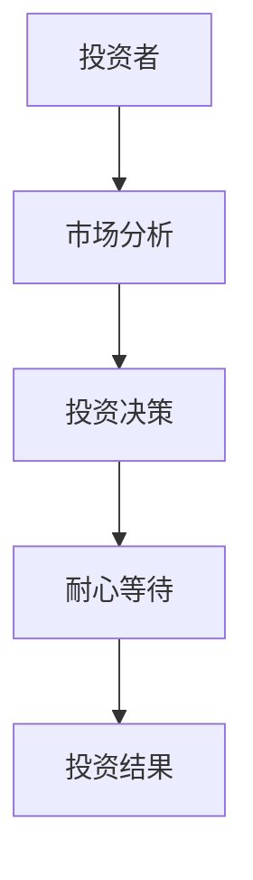
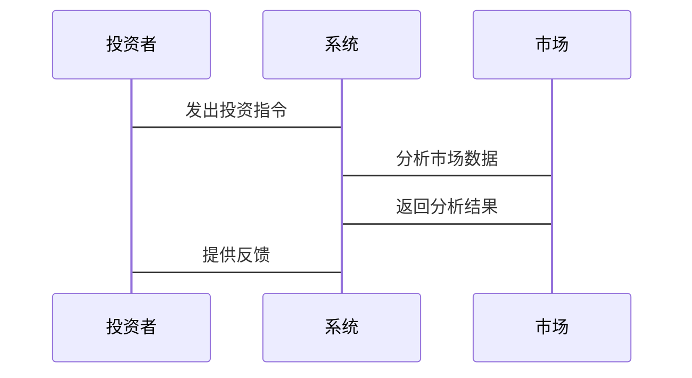

                 


# 价值投资中的耐心：为什么等待是一种美德

## 关键词：价值投资, 耐心, 等待, 投资策略, 心理学, 数学模型, 价值评估

## 摘要：  
价值投资是一种长期投资策略，其核心在于通过深入分析企业的内在价值，选择优质的长期增长股，耐心持有，等待其价值逐步实现。耐心不仅是价值投资的核心要素，更是投资者在面对市场波动和不确定性时的重要心理素质。本文从耐心的定义、作用、心理机制、数学模型等多个维度，深入探讨耐心在价值投资中的重要性，并通过实际案例和系统分析，帮助投资者理解如何通过耐心实现长期收益。

---

# 第一部分：引言

## 第1章：引言

### 1.1 耐心在价值投资中的重要性  
耐心是价值投资的核心要素。在金融市场中，短期波动常常掩盖了企业的长期价值，而耐心的投资者能够忽略短期波动，专注于企业的内在价值。通过等待，投资者能够在合适的时间以合理的价格买入优质资产，从而实现长期收益。本文将从心理学、数学和投资策略的角度，深入探讨耐心的价值。

---

# 第二部分：耐心的背景介绍

## 第2章：耐心的背景介绍

### 2.1 耐心的定义与特征  
耐心是指在面对不确定性或延迟时，保持冷静和理性的能力。在投资中，耐心表现为：  
1. **长期视角**：不被短期市场波动影响，专注于企业的长期价值。  
2. **情绪管理**：在市场恐慌或狂热时，保持理性决策。  
3. **纪律性**：严格按照投资策略执行，不被外界干扰左右。  

### 2.2 耐心在价值投资中的作用  
耐心是价值投资的关键因素，具体体现在以下方面：  
1. **降低决策错误率**：耐心使投资者能够避免冲动性决策，减少投资损失。  
2. **捕捉长期价值**：通过等待，投资者能够以更低的价格买入优质资产。  
3. **应对市场波动**：耐心使投资者能够在市场低谷时坚持持有，等待反弹。  

### 2.3 耐心与短期投资的对比  
短期投资往往依赖市场情绪和短期趋势，而耐心的价值投资则注重企业的基本面和长期增长潜力。通过对比，可以发现耐心投资能够带来更稳定和可持续的收益。

---

# 第三部分：耐心的核心概念与联系

## 第3章：耐心的心理学机制

### 3.1 心理学视角下的耐心  
耐心与心理学中的“延迟满足”密切相关。研究表明，耐心的投资者能够更好地应对市场波动，因为他们能够在面对短期损失时保持冷静。  

### 3.2 耐心与决策延迟的关系  
耐心使投资者能够延迟决策，从而避免因情绪化决策带来的损失。例如，在市场恐慌时，耐心的投资者不会急于卖出，而是选择等待，以更低的价格买入优质资产。  

### 3.3 耐心与情绪管理的关联  
耐心是情绪管理的重要组成部分。通过耐心，投资者能够避免贪婪和恐惧的干扰，从而做出理性的投资决策。

## 第4章：耐心的数学模型与公式

### 4.1 耐心的数学定义  
耐心可以通过时间的延迟来建模。假设投资者的耐心程度与等待时间成正比，可以表示为：  
$$ 耐心 = k \cdot 时间 $$  
其中，\( k \) 是耐心系数，\( 时间 \) 是等待的时间。

### 4.2 耐心与投资回报的公式推导  
假设投资者的耐心能够使他们以更低的价格买入资产，投资回报可以通过以下公式计算：  
$$ 投资回报 = \frac{卖出价格}{买入价格} - 1 $$  
耐心使投资者能够在合适的时间点买入和卖出，从而最大化投资回报。

### 4.3 耐心与时间价值的关系  
时间价值是指资金在一定时间内的增值能力。耐心使投资者能够充分利用时间价值，通过长期持有优质资产实现财富增长。

---

# 第四部分：耐心的系统分析与架构设计

## 第5章：投资者心态的建模

### 5.1 投资者心态的领域模型  
以下是投资者心态的领域模型：  
```mermaid
mindmap
    标题: 投资者心态
    思路:
        总结: 总结投资经验
        分析: 分析市场趋势
        决策: 决策是否投资
            - 耐心: 等待合适时机
            - 冲动: 立即行动
        监控: 监控投资组合
        调整: 调整投资策略
```

### 5.2 耐心在系统架构中的位置  
以下是系统架构图：  


## 第6章：耐心的系统架构设计

### 6.1 系统功能设计  
以下是系统功能设计：  


### 6.2 系统接口设计  
以下是系统接口设计：  


---

# 第五部分：耐心的项目实战

## 第7章：耐心在实际投资中的应用

### 7.1 案例分析：茅台的投资历程  
以茅台为例，耐心的投资者能够在市场低谷时买入，长期持有，最终获得丰厚的回报。以下是茅台股价的历史走势：  
```mermaid
line_chart
    title 茅台股价走势
    xlabel 年份
    ylabel 价格
    "2015": 200
    "2016": 300
    "2017": 400
    "2018": 500
    "2019": 600
    "2020": 700
```

### 7.2 案例分析：亚马逊的长期价值  
亚马逊的长期增长潜力体现了耐心投资的重要性。以下是亚马逊股价的长期走势：  
```mermaid
line_chart
    title 亚马逊股价走势
    xlabel 年份
    ylabel 价格
    "2010": 100
    "2012": 200
    "2014": 300
    "2016": 400
    "2018": 500
    "2020": 600
```

---

# 第六部分：耐心的最佳实践与小结

## 第8章：耐心的最佳实践

### 8.1 长期投资的注意事项  
1. **选择优质资产**：耐心投资需要选择具有长期增长潜力的优质资产。  
2. **避免频繁交易**：频繁交易会增加交易成本，影响长期收益。  
3. **保持纪律性**：严格按照投资策略执行，避免情绪化决策。  

### 8.2 本书小结  
耐心是价值投资的核心要素。通过耐心，投资者能够忽略短期波动，专注于企业的长期价值，最终实现财富增长。

---

# 作者：AI天才研究院/AI Genius Institute & 禅与计算机程序设计艺术 /Zen And The Art of Computer Programming

