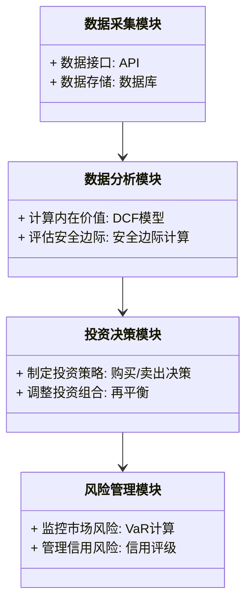

                 


# 价值投资中的耐心：长期持有的力量

> 关键词：价值投资, 耐心, 长期持有, 内在价值, 安全边际, 投资策略

> 摘要：价值投资是一种以内在价值为导向，注重长期持有的投资策略。本文通过分析价值投资的核心概念、耐心的重要性、长期持有的力量，结合数学模型和系统架构，深入探讨如何在投资中培养耐心，实现长期收益。文章还通过实际案例和代码实现，展示了价值投资的具体应用。

---

## 第1章 价值投资的背景与核心概念

### 1.1 价值投资的起源与发展

价值投资是一种以基本面分析为基础的投资策略，起源于20世纪初。本杰明·格雷厄姆和戴维·多德是价值投资的奠基人，他们强调以低于内在价值的价格买入优质资产，并长期持有。这种投资理念与市场的短期波动形成了鲜明对比。

#### 1.1.1 价值投资的核心理念

价值投资的核心理念包括：

- **内在价值**：资产的真实价值，与市场波动无关。
- **安全边际**：买入价格低于内在价值，以降低风险。
- **长期视角**：关注企业的长期盈利能力，而非短期价格波动。

#### 1.1.2 耐心在价值投资中的重要性

耐心是价值投资成功的关键因素之一。市场的短期波动往往会导致投资者情绪化决策，而耐心使投资者能够在市场恐慌时买入优质资产，在市场狂热时保持冷静。

---

### 1.2 价值投资与耐心的关系

#### 1.2.1 耐心对投资决策的影响

耐心使投资者能够坚持长期持有的策略，避免因短期波动而频繁交易。这种纪律性是价值投资成功的重要保障。

#### 1.2.2 耐心与长期持有的内在联系

长期持有是价值投资的核心策略，耐心使投资者能够在市场低迷时坚持持有优质资产，最终获得超额收益。

---

## 第2章 耐心的哲学与心理学分析

### 2.1 耐心的哲学思考

#### 2.1.1 耐心与时间的关系

时间是价值投资的盟友。优质资产的内在价值会随着时间的推移而增长，耐心使投资者能够充分利用时间的力量。

#### 2.1.2 耐心与成长的辩证统一

耐心不仅是等待，更是通过持续学习和分析来优化投资策略。真正的耐心是基于知识和经验的积累。

---

### 2.2 耐心的心理学特征

#### 2.2.1 耐心与情绪管理

情绪化决策是投资失败的主要原因之一。耐心要求投资者在市场波动中保持冷静，避免贪婪和恐惧的干扰。

#### 2.2.2 耐心与决策过程的互动

耐心影响投资决策的每一个环节。从选股到买入，再到持有，耐心使投资者能够做出更理性的决策。

---

## 第3章 长期持有的数学模型与算法原理

### 3.1 内在价值评估模型

#### 3.1.1 内在价值的计算公式

内在价值可以通过多种方法进行估算，其中最常用的是现金流折现法（DCF）。以下是DCF模型的核心公式：

$$
\text{内在价值} = \sum_{t=1}^{n} \frac{\text{自由现金流}_t}{(1 + r)^t} + \frac{\text{终值}}{(1 + r)^n}
$$

其中，\( r \) 是折现率，\( n \) 是预测期数，\( \text{自由现金流}_t \) 是第 \( t \) 年的自由现金流，\( \text{终值} \) 是第 \( n \) 年后的终值。

#### 3.1.2 内在价值评估的步骤

1. 预测未来现金流。
2. 确定合理的折现率。
3. 计算终值。
4. 将所有现金流折现并求和，得到内在价值。

---

### 3.2 耐心的量化分析

#### 3.2.1 耐心的度量指标

耐心可以通过以下指标量化：

- **持有期**：投资的平均持有时间。
- **换手率**：投资组合的换手率，换手率越低，耐心越强。

#### 3.2.2 耐心与投资收益的关系

研究表明，耐心与投资收益呈正相关。长期持有优质资产的投资者通常能够获得更高的收益。

---

## 第4章 系统分析与架构设计方案

### 4.1 价值投资系统的构成

#### 4.1.1 系统功能模块划分

- 数据采集模块：收集市场数据，包括股价、财务报表等。
- 数据分析模块：计算内在价值，评估安全边际。
- 投资决策模块：基于分析结果制定投资策略。
- 风险管理模块：监控投资组合，管理风险。

#### 4.1.2 系统架构设计

以下是系统架构的类图：



---

### 4.2 项目实战

#### 4.2.1 实际案例分析

假设我们选择一家公司进行分析：

1. **数据采集**：收集该公司的财务报表和股价数据。
2. **内在价值计算**：使用DCF模型计算内在价值。
3. **安全边际评估**：确定买入价格的安全边际。
4. **投资决策**：基于分析结果制定买入或卖出策略。

#### 4.2.2 代码实现

以下是DCF模型的Python代码示例：

```python
def calculate_intrinsic_value(free_cash_flows, discount_rate, terminal_value):
    n = len(free_cash_flows)
    present_value = 0
    for t in range(n):
        present_value += free_cash_flows[t] / (1 + discount_rate)**t
    present_value += terminal_value / (1 + discount_rate)**n
    return present_value

# 示例数据
free_cash_flows = [100, 120, 150]  # 第1、2、3年的自由现金流
discount_rate = 0.10  # 折现率
terminal_value = 200  # 终值

intrinsic_value = calculate_intrinsic_value(free_cash_flows, discount_rate, terminal_value)
print("内在价值：", intrinsic_value)
```

---

## 第5章 最佳实践与小结

### 5.1 最佳实践

- **保持耐心**：坚持长期持有优质资产。
- **持续学习**：不断提升自己的分析能力。
- **风险管理**：合理控制投资组合的风险。

### 5.2 小结

价值投资的核心在于耐心和长期持有。通过深入分析内在价值和安全边际，投资者可以在市场波动中保持冷静，最终实现超额收益。

---

作者：AI天才研究院/AI Genius Institute & 禅与计算机程序设计艺术 /Zen And The Art of Computer Programming

