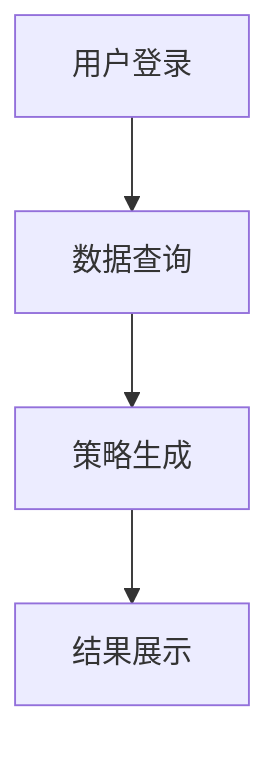

                 


# 价值投资中的行为金融学应用

---

## 关键词：
价值投资，行为金融学，投资者心理，情绪决策，认知偏差，市场行为

---

## 摘要：
本文深入探讨了行为金融学在价值投资中的应用，分析了投资者心理和行为偏差对投资决策的影响。结合行为金融学的核心理论，如前景理论和心理账户理论，本文揭示了情绪和认知偏差如何影响市场定价和投资机会。通过算法模型和系统架构设计，本文展示了如何将行为金融学的原理转化为实际的投资策略，并通过项目实战提供可操作的实现方案。

---

## 第一部分：行为金融学与价值投资概述

### 第1章：行为金融学的基本概念

#### 1.1 行为金融学的定义与核心理论
行为金融学（Behavioral Finance）是研究投资者心理和行为偏差对金融市场影响的学科。与传统金融学不同，行为金融学认为市场参与者并非总是理性的，而是会受到情绪、认知偏差和社会环境的影响。

#### 1.1.1 行为金融学的起源与发展
行为金融学起源于20世纪80年代，最初的研究集中在投资者心理和市场异象上。与传统金融学的假设（即市场参与者是理性的、市场是有效的）不同，行为金融学强调人类心理因素在市场中的作用。

#### 1.1.2 行为金融学与传统金融学的区别
- **假设差异**：传统金融学假设市场参与者是理性的，而行为金融学认为市场参与者会受到情绪和认知偏差的影响。
- **研究方法**：传统金融学更注重数学模型和统计分析，而行为金融学更关注心理学和社会学因素。
- **应用领域**：行为金融学广泛应用于投资决策、风险管理等领域。

#### 1.1.3 行为金融学的核心假设与研究方法
- **核心假设**：投资者并非总是理性的，情绪和认知偏差会影响投资决策。
- **研究方法**：结合心理学实验和金融市场数据，分析投资者行为对市场的影响。

#### 1.2 价值投资的基本原理
价值投资是一种以基本面分析为基础的投资策略，旨在通过寻找市场价格低于内在价值的股票来获得超额收益。

#### 1.2.1 价值投资的定义与特点
- **定义**：价值投资是一种长期投资策略，强调购买市场价格低于其内在价值的股票。
- **特点**：注重基本面分析，寻找被市场低估的投资标的。

#### 1.2.2 价值投资的核心理念：寻找市场低估的股票
价值投资者认为，市场的短期波动并不反映公司的长期价值，因此他们关注公司基本面，寻找被市场低估的股票。

#### 1.2.3 价值投资与行为金融学的结合
行为金融学提供了投资者心理和行为偏差的理论框架，帮助价值投资者更好地理解市场波动和投资机会。

### 第2章：投资者心理与行为偏差

#### 2.1 投资者的认知偏差
认知偏差是指投资者在决策过程中因主观认知错误而导致的判断失误。

#### 2.1.1 过度自信偏差
投资者往往过度自信于自己的判断，导致决策失误。

#### 2.1.2 沉没成本偏差
投资者在决策时，往往会因为已经投入了时间和金钱，而继续坚持错误的决策。

#### 2.1.3 羊群效应
投资者往往会跟随市场潮流，导致市场波动加剧。

#### 2.2 情绪与决策
情绪是投资者决策的重要因素，恐惧和贪婪是市场波动的主要驱动因素。

#### 2.2.1 恐惧与贪婪的双重影响
- **恐惧**：市场下跌时，投资者往往倾向于抛售股票，导致市场进一步下跌。
- **贪婪**：市场上涨时，投资者倾向于追涨，导致市场泡沫。

#### 2.2.2 投资者情绪的周期性波动
投资者情绪会随着市场波动而周期性变化，这种情绪波动会影响市场定价。

#### 2.2.3 情绪对投资决策的具体影响
- **情绪化决策**：投资者在情绪激动时容易做出错误决策。
- **情绪与市场周期**：投资者情绪与市场周期密切相关。

#### 2.3 行为偏差对价值投资的影响
行为偏差会影响价值投资者的决策，导致投资失误。

#### 2.3.1 市场恐慌与价值投资机会
市场恐慌时，许多优质股票可能被低估，为价值投资者提供了投资机会。

#### 2.3.2 情绪波动对股价的影响
投资者情绪波动会影响股价，但长期来看，股价仍由公司基本面决定。

#### 2.3.3 投资者心理与市场周期的关系
投资者心理与市场周期密切相关，市场周期会影响投资者情绪和行为。

### 第3章：行为金融学在价值投资中的应用

#### 3.1 行为金融学的核心理论
行为金融学提供了许多理论工具，帮助价值投资者更好地理解市场。

#### 3.1.1 前景理论（Prospect Theory）
前景理论由Kahneman和Tversky提出，描述了投资者在决策时如何评估收益和损失。

#### 3.1.2 心理账户理论（Mental Accounting）
心理账户理论认为投资者会将资金分配到不同的心理账户，影响其决策。

#### 3.1.3 框架效应（
Frame Effect）
框架效应是指投资者在不同框架下的决策会有所不同。

#### 3.1.4 有限理性理论（Bounded Rationality）
有限理性理论认为投资者在决策时受到信息处理能力和认知资源的限制。

#### 3.2 价值投资中的行为偏差修正
价值投资者需要克服行为偏差，避免情绪化决策。

#### 3.2.1 认知偏差的克服方法
- **减少过度自信**：通过团队合作和外部意见来减少过度自信。
- **避免沉没成本偏差**：学会及时止损，避免沉没成本影响决策。
- **抑制羊群效应**：独立思考，避免跟随市场潮流。

#### 3.2.2 情绪管理策略
- **情绪化决策的识别**：识别情绪化决策，避免冲动交易。
- **情绪调节技巧**：通过冥想、运动等方式调节情绪。

#### 3.3 行为金融学在投资策略中的应用
行为金融学提供了许多投资策略，帮助价值投资者更好地捕捉市场机会。

#### 3.3.1 情绪指标的应用
- **市场情绪指标**：通过分析投资者情绪指标，判断市场走势。
- **情绪与投资机会**：市场恐慌时，寻找被低估的投资标的。

#### 3.3.2 认知偏差与投资决策
- **认知偏差的识别**：识别投资者的认知偏差，避免决策失误。
- **认知偏差的利用**：利用认知偏差，寻找市场机会。

---

## 第二部分：行为金融学的算法与数学模型

### 第4章：行为金融学的算法与数学模型

#### 4.1 情绪指标与投资策略
情绪指标是行为金融学的重要工具，用于衡量市场情绪。

#### 4.1.1 情绪指标的计算方法
- **投资者情绪指数（PSM）**：通过分析投资者情绪数据，计算投资者情绪指数。
- **市场情绪指数（NIM）**：通过分析市场数据，计算市场情绪指数。

#### 4.1.2 情绪指标与投资策略
- **基于情绪指标的投资策略**：通过分析情绪指标，制定投资策略。
- **情绪指标的预测能力**：情绪指标对市场预测的能力。

#### 4.2 前景理论的数学模型
前景理论提供了投资者决策的数学模型。

#### 4.2.1 前景理论公式
前景理论的数学公式如下：
$$ U(x) = \begin{cases} 
x^{2.5} & \text{如果 } x > 0 \\
-10^{(-x/10)} & \text{如果 } x \leq 0 
\end{cases} $$

#### 4.2.2 前景理论的应用
前景理论可以用于解释投资者的行为偏差，帮助价值投资者更好地理解市场。

#### 4.3 有限理性与投资决策
有限理性理论对投资决策有重要影响。

#### 4.3.1 有限理性的数学模型
有限理性的数学模型可以用于描述投资者的决策过程。

#### 4.3.2 有限理性与投资策略
有限理性理论可以帮助投资者制定更合理的投资策略。

---

## 第三部分：系统分析与架构设计

### 第5章：系统分析与架构设计

#### 5.1 投资决策支持系统的架构设计
投资决策支持系统（IDSS）是一个基于行为金融学的决策支持系统。

#### 5.1.1 系统功能设计
- **数据采集模块**：采集市场数据和投资者情绪数据。
- **数据处理模块**：对数据进行清洗和预处理。
- **数据分析模块**：基于行为金融学理论，分析数据并生成投资策略。
- **用户界面模块**：提供友好的用户界面，方便用户使用。

#### 5.1.2 系统架构设计
- **分层架构**：系统分为数据层、业务逻辑层和用户界面层。
- **模块化设计**：每个模块独立开发，便于维护和升级。

#### 5.1.3 系统接口设计
- **数据接口**：与数据源对接，获取市场数据和投资者情绪数据。
- **用户接口**：与用户交互，提供投资建议和决策支持。

#### 5.2 系统交互设计
系统交互设计是投资决策支持系统的重要组成部分。

#### 5.2.1 用户流程设计
- **用户登录**：用户登录系统。
- **数据查询**：用户查询市场数据和投资者情绪数据。
- **策略生成**：系统根据数据生成投资策略。
- **结果展示**：系统展示投资策略和结果。

#### 5.2.2 系统功能流程图
系统功能流程图如图所示：



---

## 第四部分：项目实战

### 第6章：项目实战

#### 6.1 环境安装与配置
项目实战需要安装和配置相关工具。

#### 6.1.1 Python环境安装
安装Python和必要的库，如pandas、numpy、scikit-learn等。

#### 6.1.2 数据源配置
配置数据源，如股票数据和投资者情绪数据。

#### 6.2 系统核心实现
系统核心实现包括数据处理、数据分析和投资策略生成。

#### 6.2.1 数据处理
- **数据清洗**：清洗数据，去除异常值。
- **数据预处理**：对数据进行标准化和归一化处理。

#### 6.2.2 数据分析
- **情绪指标计算**：计算投资者情绪指标。
- **策略生成**：基于情绪指标生成投资策略。

#### 6.2.3 投资策略生成
- **策略优化**：优化投资策略，提高收益率。
- **风险控制**：控制投资风险，减少回撤。

#### 6.3 代码实现与解读
代码实现是项目实战的重要部分。

#### 6.3.1 数据处理代码
```python
import pandas as pd
import numpy as np

# 数据清洗
data = pd.read_csv('data.csv')
data = data.dropna()
data = data.drop_duplicates()

# 数据预处理
data['date'] = pd.to_datetime(data['date'])
data.set_index('date', inplace=True)
```

#### 6.3.2 策略生成代码
```python
from sklearn import linear_model

# 情绪指标计算
def calculate_emotion_index(data):
    # 计算情绪指数
    emotion_index = data['sentiment'].mean()
    return emotion_index

# 投资策略生成
def generate_strategy(emotion_index):
    if emotion_index > 0.5:
        return '买入'
    else:
        return '卖出'

emotion_index = calculate_emotion_index(data)
strategy = generate_strategy(emotion_index)
print('投资策略：', strategy)
```

#### 6.4 案例分析与结果解读
案例分析是项目实战的重要部分。

#### 6.4.1 案例分析
以某只股票为例，分析其情绪指标和投资策略。

#### 6.4.2 结果解读
解释分析结果，说明投资策略的有效性。

---

## 第五部分：最佳实践与总结

### 第7章：最佳实践与总结

#### 7.1 小结
本文通过行为金融学的理论和实践，探讨了价值投资中的行为金融学应用。

#### 7.2 注意事项
- **情绪管理**：投资者需要管理好情绪，避免情绪化决策。
- **认知偏差**：投资者需要识别和克服认知偏差，避免决策失误。

#### 7.3 拓展阅读
- **行为金融学经典著作**：《怪诞行为学》、《投资者的天敌》
- **价值投资经典著作**：《聪明的投资者》

---

## 作者：AI天才研究院/AI Genius Institute & 禅与计算机程序设计艺术/Zen And The Art of Computer Programming

---

**摘要**：本文深入探讨了行为金融学在价值投资中的应用，分析了投资者心理和行为偏差对投资决策的影响。结合行为金融学的核心理论，如前景理论和心理账户理论，本文揭示了情绪和认知偏差如何影响市场定价和投资机会。通过算法模型和系统架构设计，本文展示了如何将行为金融学的原理转化为实际的投资策略，并通过项目实战提供可操作的实现方案。

