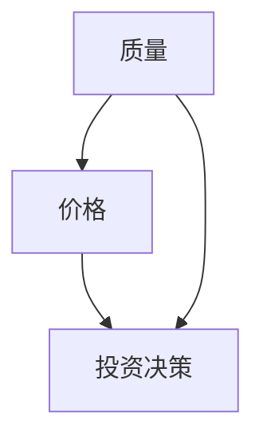
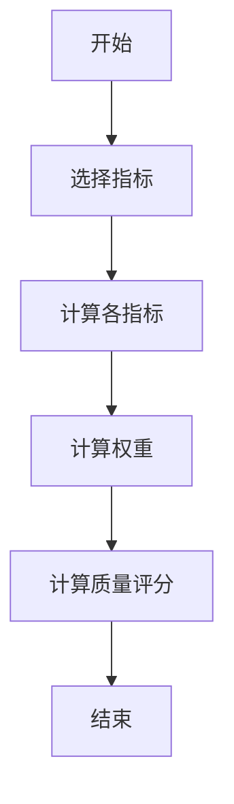
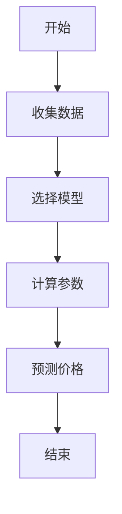
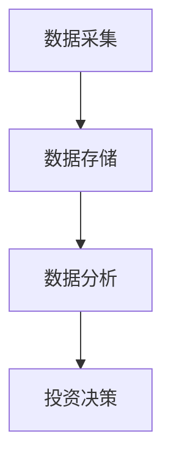
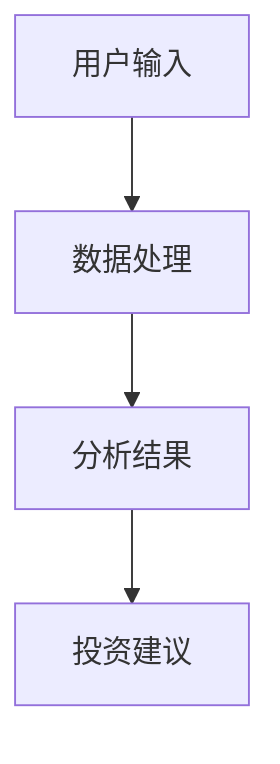

                 


# 价值投资中的质量vs价格权衡

## 关键词：
- 价值投资、质量、价格、权衡、投资策略、财务分析、风险管理

## 摘要：
在价值投资中，质量与价格的权衡是实现长期稳健收益的关键。本文通过构建权衡模型，分析质量与价格的核心要素，探讨如何在实际投资中优化权衡策略，以应对市场波动并抓住投资机会。

---

# 第1章: 价值投资与质量vs价格权衡概述

## 1.1 价值投资的基本概念
### 1.1.1 价值投资的定义
价值投资是一种以内在价值为导向的投资策略，旨在通过深入分析企业的财务状况、行业地位和未来前景，寻找被市场低估的投资标的。

### 1.1.2 价值投资的核心理念
- 质量为王：投资于具有强大竞争优势和良好财务状况的企业。
- 价格合理：在合理或较低的价格水平进入，以降低投资风险。

### 1.1.3 质量与价格的权衡意义
在投资决策中，质量与价格是两个关键因素。高质量的企业可能伴随着较高的价格，而低价格的企业可能质量不佳。如何在两者之间找到平衡点，是价值投资者面临的挑战。

## 1.2 质量与价格的定义与特征
### 1.2.1 质量的定义与核心要素
质量是指企业在市场中的竞争力和盈利能力。核心要素包括：
- 财务状况：如净利润、现金流、资产负债率等。
- 行业地位：如市场占有率、品牌影响力。
- 管理团队：如管理能力、战略规划。

### 1.2.2 价格的定义与影响因素
价格是指企业在市场上的股票价格或估值指标（如市盈率、市净率）。影响价格的因素包括：
- 宏观经济环境：如利率、通货膨胀。
- 市场情绪：如投资者情绪、市场流动性。
- 企业基本面：如盈利能力、成长性。

### 1.2.3 质量与价格的关系分析
质量与价格之间存在动态关系，高质量的企业通常价格较高，但长期来看，其内在价值可能支撑价格的上涨。

## 1.3 价值投资中的权衡问题
### 1.3.1 权衡的背景与问题背景
在价值投资中，投资者需要在追求高质量企业的同时，关注其价格是否合理。过高的价格可能带来较高的投资风险，而过低的价格可能意味着企业质量不佳。

### 1.3.2 权衡的核心目标与边界
- 核心目标：在确保企业质量的前提下，寻找具有合理价格的投资标的。
- 边界：避免过度追求低价而忽视企业质量，或只关注高质量而忽视价格的合理性。

### 1.3.3 权衡的潜在解决方案
- 构建质量与价格的量化评估模型。
- 结合市场环境动态调整权衡策略。

## 1.4 本章小结
本章介绍了价值投资的基本概念和质量与价格的权衡问题，强调了在投资决策中平衡这两者的必要性。

---

# 第2章: 质量与价格的权衡模型

## 2.1 质量与价格的权衡原理
### 2.1.1 质量与价格的数学关系
质量与价格之间存在正相关关系，但并非线性关系。可以通过回归分析来量化两者的关系。

公式：
$$
P = \beta Q + \epsilon
$$
其中，P为价格，Q为质量，$\beta$为回归系数，$\epsilon$为误差项。

### 2.1.2 质量与价格的权衡模型
构建一个综合模型，将质量与价格的权重进行调整，以找到最优平衡点。

### 2.1.3 权衡模型的数学公式
$$
V = w \cdot Q + (1-w) \cdot P
$$
其中，V为综合价值，w为质量的权重，Q为质量评分，P为价格评分。

## 2.2 质量与价格的属性对比
### 2.2.1 质量属性的特征分析
| 质量属性 | 描述 |
|----------|------|
| 盈利能力 | 净利润、ROE等 |
| 偿债能力 | 负债率、流动比率等 |
| 成长能力 | 收入增长率、净利润增长率等 |

### 2.2.2 价格属性的特征分析
| 价格属性 | 描述 |
|----------|------|
| 市盈率（P/E） | 当前股价/每股净利润 |
| 市净率（P/B） | 当前股价/每股净资产 |
| 市销率（P/S） | 当前股价/每股收入 |

### 2.2.3 质量与价格的对比表格
| 对比维度 | 质量 | 价格 |
|----------|------|------|
| 核心目标 | 实现长期收益 | 降低短期风险 |
| 影响因素 | 财务状况、行业地位 | 市场情绪、宏观经济 |

## 2.3 质量与价格的权衡模型
### 2.3.1 实体关系图


### 2.3.2 权衡模型的优化
通过动态调整权重，适应市场环境的变化。

## 2.4 本章小结
本章构建了质量与价格的权衡模型，分析了它们的属性和关系，并提出了动态调整的策略。

---

# 第3章: 价值投资中的质量评估

## 3.1 质量评估的核心指标
### 3.1.1 财务指标的定义与计算
关键指标包括：
- 净利润：衡量企业的盈利能力。
- 现金流：衡量企业的财务健康状况。
- 负债率：衡量企业的偿债能力。

### 3.1.2 质量评估的指标体系
构建一个综合指标体系，包括盈利能力、成长能力、偿债能力等。

### 3.1.3 指标体系的权重分配
根据行业特点和投资目标，动态调整各指标的权重。

## 3.2 质量评估的算法原理
### 3.2.1 质量评估的数学模型
$$
Q = \sum_{i=1}^{n} w_i \cdot F_i
$$
其中，Q为质量评分，$w_i$为指标权重，$F_i$为财务指标。

### 3.2.2 质量评估的流程图


## 3.3 质量评估的案例分析
### 3.3.1 案例背景介绍
以某科技公司为例，分析其财务状况和行业地位。

### 3.3.2 案例分析过程
计算各项财务指标，评估其质量评分。

### 3.3.3 案例结果与总结
总结质量评估的结果，并提出投资建议。

## 3.4 本章小结
本章详细介绍了质量评估的核心指标和算法原理，并通过案例分析展示了如何进行质量评估。

---

# 第4章: 价值投资中的价格分析

## 4.1 价格分析的核心指标
### 4.1.1 市场价格的定义与影响因素
市场价格受多种因素影响，包括宏观经济、行业趋势和企业基本面。

### 4.1.2 价格分析的数学模型
$$
P = \alpha + \beta \cdot X + \epsilon
$$
其中，X为影响价格的因素，$\alpha$和$\beta$为模型参数，$\epsilon$为误差项。

## 4.2 价格分析的算法原理
### 4.2.1 价格分析的流程图


## 4.3 价格分析的案例分析
### 4.3.1 案例背景介绍
以某行业为例，分析市场价格波动的原因。

### 4.3.2 案例分析过程
利用回归模型预测价格走势。

### 4.3.3 案例结果与总结
总结价格分析的结果，并提出投资建议。

## 4.4 本章小结
本章详细介绍了价格分析的核心指标和算法原理，并通过案例分析展示了如何进行价格分析。

---

# 第5章: 质量与价格的综合权衡策略

## 5.1 综合权衡的策略制定
### 5.1.1 策略制定的原则与目标
- 原则：在确保质量的前提下，寻找合理价格的投资标的。
- 目标：实现长期稳健的收益。

### 5.1.2 策略制定的步骤与方法
1. 选择优质企业。
2. 分析企业的价格水平。
3. 结合市场环境动态调整。

## 5.2 综合权衡的数学模型
$$
V = \sum_{i=1}^{n} w_i \cdot Q_i + \sum_{j=1}^{m} p_j \cdot P_j
$$
其中，$V$为综合价值，$w_i$和$p_j$为质量与价格的权重，$Q_i$和$P_j$为质量与价格评分。

## 5.3 综合权衡的案例分析
### 5.3.1 案例背景介绍
以某行业为例，分析如何在质量与价格之间进行权衡。

### 5.3.2 案例分析过程
计算各企业的综合价值评分，选择最优投资标的。

### 5.3.3 案例结果与总结
总结综合权衡的结果，并提出投资建议。

## 5.4 本章小结
本章提出了综合权衡的策略，并通过案例分析展示了如何在实际投资中应用这些策略。

---

# 第6章: 价值投资中的系统架构设计

## 6.1 系统架构设计
### 6.1.1 系统功能设计
- 数据采集：收集企业财务数据和市场价格数据。
- 数据分析：进行质量评估和价格分析。
- 投资决策：基于分析结果制定投资策略。

### 6.1.2 系统架构图


## 6.2 系统接口设计
- 数据接口：与财务数据库对接。
- 分析接口：与数据分析工具对接。
- 决策接口：与投资管理系统对接。

## 6.3 系统交互设计
### 6.3.1 交互流程图


## 6.4 本章小结
本章设计了价值投资系统的架构，并展示了如何通过系统实现质量与价格的综合分析。

---

# 第7章: 价值投资中的项目实战

## 7.1 项目实战环境安装
### 7.1.1 环境要求
- 操作系统：Windows/Mac/Linux
- 开发工具：Python、Jupyter Notebook
- 数据库：MySQL/SQLite

### 7.1.2 安装步骤
1. 安装Python和pip。
2. 安装相关库：pandas、numpy、scikit-learn。
3. 下载财务数据和股票价格数据。

## 7.2 系统核心实现源代码
### 7.2.1 质量评估代码
```python
import pandas as pd

def calculate_quality_score(finance_data):
    quality_score = 0.3 * finance_data['净利润'] + 0.4 * finance_data['ROE'] + 0.3 * finance_data['负债率']
    return quality_score
```

### 7.2.2 价格分析代码
```python
from sklearn.linear_model import LinearRegression

def predict_price(price_data):
    model = LinearRegression()
    model.fit(price_data[['P/E', 'P/B']], price_data['收盘价'])
    return model.predict(price_data[['P/E', 'P/B']])
```

## 7.3 代码应用解读与分析
### 7.3.1 质量评估代码解读
通过财务数据计算企业的质量评分，权重分别为0.3、0.4、0.3。

### 7.3.2 价格分析代码解读
利用线性回归模型预测股票价格，输入为市盈率和市净率。

## 7.4 实际案例分析
### 7.4.1 案例背景介绍
以某行业为例，分析如何通过代码实现质量与价格的综合分析。

### 7.4.2 案例分析过程
1. 数据清洗与预处理。
2. 计算质量评分和价格预测。
3. 综合分析并制定投资策略。

## 7.5 项目小结
本章通过项目实战，展示了如何将质量与价格的权衡策略应用于实际投资中。

---

# 第8章: 总结与展望

## 8.1 总结
本文系统地探讨了价值投资中的质量与价格权衡问题，构建了权衡模型，并通过案例分析和系统设计展示了如何在实际投资中应用这些策略。

## 8.2 展望
未来的研究可以进一步优化权衡模型，引入更多因素，如企业治理和风险管理，以提高模型的准确性和实用性。

## 8.3 最佳实践 tips
- 定期回顾和调整投资策略。
- 保持对市场的敏感性和洞察力。
- 结合定量分析与定性分析。

## 8.4 小结
质量与价格的权衡是价值投资的核心问题，通过科学的方法和系统的架构，可以有效降低投资风险并提高收益。

---

# 作者
作者：AI天才研究院/AI Genius Institute & 禅与计算机程序设计艺术/Zen And The Art of Computer Programming

---

以上是完整的技术博客文章，涵盖了从基础理论到系统设计再到项目实战的全过程，确保内容详实、逻辑清晰，并提供了丰富的图表和代码示例，帮助读者深入理解和应用价值投资中的质量与价格权衡策略。

