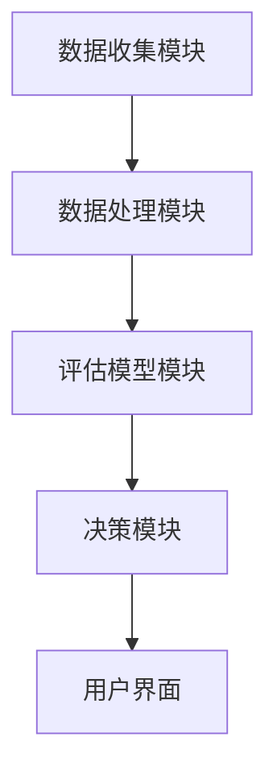

                 


# 《价值投资中的质量与价格平衡》

---

## 关键词  
价值投资、质量评估、价格评估、安全边际、投资策略、算法模型、系统架构  

---

## 摘要  
价值投资是一种长期有效的投资策略，其核心在于找到质量高且价格合理的资产。本文通过分析质量与价格的平衡关系，结合数学模型、算法原理和系统设计，详细探讨如何在投资决策中实现这种平衡。文章从价值投资的背景出发，逐步深入，最终为投资者提供一套实用的策略框架。

---

# 第一部分：价值投资的背景与基础

## 第1章：价值投资的核心理念

### 1.1 价值投资的起源与发展  
价值投资起源于20世纪初，由本杰明·格雷厄姆和戴维·多德等人提出。它强调以低于内在价值的价格买入优质资产，从而在市场波动中实现长期收益。  

#### 1.1.1 价值投资的起源  
价值投资的起源可以追溯到19世纪末的美国，早期投资者开始意识到市场波动与资产真实价值之间的差异。  

#### 1.1.2 价值投资的核心理念  
价值投资的核心理念是：市场短期波动不可预测，但优质资产的长期价值是可计算的。投资者应关注企业的基本面，而非市场的短期情绪。  

#### 1.1.3 价值投资与其他投资策略的区别  
与趋势投资和短线交易不同，价值投资注重长期持有优质资产，而非短期价格波动。  

---

### 1.2 质量与价格的定义与关系  

#### 1.2.1 质量的定义与衡量标准  
质量在投资中通常指企业的基本面，包括财务健康状况、竞争优势和管理能力。  

#### 1.2.2 价格的定义与影响因素  
价格指资产的市场价值，受供需关系、市场情绪和宏观经济因素影响。  

#### 1.2.3 质量与价格的动态平衡  
质量与价格的关系是动态的，优质资产可能因市场低估而价格低于价值，也可能因市场高估而价格高于价值。  

---

## 第2章：价值投资的基本原理  

### 2.1 投资者的决策模型  

#### 2.1.1 投资者心理与行为分析  
投资者的行为往往受情绪影响，如贪婪和恐惧，这会导致市场波动。  

#### 2.1.2 市场情绪与价格波动的关系  
市场情绪通过影响供需关系间接影响价格，但优质资产的价格波动最终回归其内在价值。  

#### 2.1.3 理性决策与非理性决策的平衡  
投资者应尽量减少非理性决策，通过基本面分析和长期持有来实现理性投资。  

---

### 2.2 质量与价格的数学模型  

#### 2.2.1 质量评分模型的构建  
质量评分模型通过加权平均的方法，将企业的财务状况、竞争优势和管理能力量化。  

$$ \text{质量评分} = w_1 \times \text{财务质量} + w_2 \times \text{竞争优势} + w_3 \times \text{管理能力} $$  

其中，$w_1, w_2, w_3$为各因素的权重，通常根据行业特点调整。  

---

# 第二部分：质量与价格的平衡策略

## 第3章：质量评估的核心要素  

### 3.1 财务质量的评估  

#### 3.1.1 财务报表分析方法  
财务报表分析包括资产负债表、利润表和现金流量表的分析。  

#### 3.1.2 资产负债表、利润表与现金流量表的关键指标  
- 资产负债表：关注资产结构和负债水平。  
- 利润表：关注收入、成本和利润。  
- 现金流量表：关注现金流健康状况。  

#### 3.1.3 财务健康状况的综合评估  
通过ROE（净资产收益率）、ROA（资产回报率）等指标评估企业盈利能力。  

---

### 3.2 行业地位与竞争优势分析  

#### 3.2.1 行业生命周期与企业所处阶段  
行业生命周期包括导入期、成长期、成熟期和衰退期，企业所处阶段影响其竞争地位。  

#### 3.2.2 企业的核心竞争优势  
竞争优势包括成本优势、技术优势和品牌优势等。  

#### 3.2.3 行业集中度与市场结构分析  
高集中度行业通常具有更强的定价能力。  

---

### 3.3 管理团队与治理结构  

#### 3.3.1 管理团队的能力与稳定性  
优秀的管理团队能够持续创造价值。  

#### 3.3.2 公司治理结构的优劣分析  
良好的治理结构包括透明的董事会和有效的内部控制。  

#### 3.3.3 内部控制与风险管理能力  
内部控制能力强的企业能够降低经营风险。  

---

## 第4章：价格评估与安全边际  

### 4.1 市场定价的偏差与  

#### 4.1.1 市场定价的偏差  
市场定价可能偏离资产的内在价值，这种偏差为价值投资者提供了机会。  

#### 4.1.2 安全边际的定义与作用  
安全边际指资产价格低于其内在价值的部分，提供了风险缓冲。  

#### 4.1.3 安全边际的计算方法  
$$ \text{安全边际} = \text{内在价值} - \text{市场价格} $$  

---

# 第三部分：算法与系统设计

## 第5章：质量与价格平衡的算法实现  

### 5.1 算法原理  

#### 5.1.1 质量评分模型的实现  
通过Python代码实现质量评分模型，如下：  

```python
def calculate_quality_score(finance_score, competitive_edge, management_score):
    weights = [0.5, 0.3, 0.2]
    quality_score = finance_score * weights[0] + competitive_edge * weights[1] + management_score * weights[2]
    return quality_score
```

#### 5.1.2 价格评估模型的实现  
通过相对估值法（如市盈率、市净率）评估价格是否合理。  

#### 5.1.3 质量与价格的平衡算法  
综合质量评分和价格评估结果，计算投资价值。  

$$ \text{投资价值} = \alpha \times \text{质量评分} + \beta \times \text{价格评估} $$  

---

## 第6章：系统架构与实现  

### 6.1 系统功能设计  

#### 6.1.1 数据收集模块  
从数据库中获取企业的财务数据和市场数据。  

#### 6.1.2 评估模型模块  
运行质量评分和价格评估算法。  

#### 6.1.3 决策模块  
根据评估结果生成投资建议。  

### 6.2 系统架构设计  

#### 6.2.1 系统架构图  
使用Mermaid图展示系统架构：  



---

## 第7章：项目实战与案例分析  

### 7.1 项目环境配置  

#### 7.1.1 技术选型  
使用Python和相关库（如Pandas、NumPy）进行数据分析。  

#### 7.1.2 数据来源  
从公开数据库获取企业财务数据和市场数据。  

---

### 7.2 核心代码实现  

#### 7.2.1 质量评分代码  
```python
def calculate_quality_score(finance_score, competitive_edge, management_score):
    weights = [0.5, 0.3, 0.2]
    quality_score = finance_score * weights[0] + competitive_edge * weights[1] + management_score * weights[2]
    return quality_score
```

#### 7.2.2 价格评估代码  
```python
def calculate_price_ratio(current_price, intrinsic_value):
    return current_price / intrinsic_value
```

---

### 7.3 案例分析  

#### 7.3.1 案例背景  
以某科技公司为例，分析其质量和价格的平衡。  

#### 7.3.2 数据分析与评估  
通过代码计算质量评分和价格比率，得出投资建议。  

---

## 第8章：总结与展望  

### 8.1 最佳实践与注意事项  

#### 8.1.1 投资策略  
长期持有优质资产，关注基本面变化。  

#### 8.1.2 风险管理  
设置止损点，分散投资以降低风险。  

### 8.2 未来研究方向  

#### 8.2.1 更复杂的算法优化  
如机器学习在质量评估中的应用。  

#### 8.2.2 多因素模型的扩展  
考虑更多影响质量和价格的因素。  

---

## 参考文献  

1. 格雷厄姆, B. F. (1974). 《The Intelligent Investor》.  
2. 巴菲特, W. (1996). 《巴菲特致股东的信》.  
3. 西蒙斯, J. (2013). 《A Random Walk Down Wall Street》.  

---

## 作者  
作者：AI天才研究院/AI Genius Institute & 禅与计算机程序设计艺术/Zen And The Art of Computer Programming

