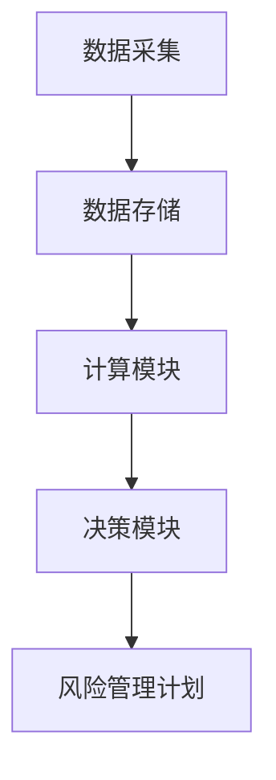
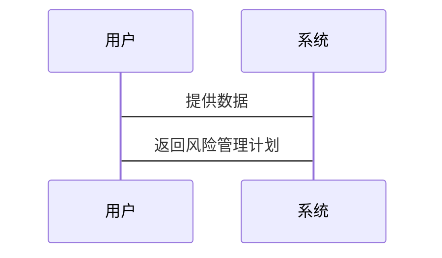

                 


# 价值投资中的风险管理策略

> 关键词：价值投资，风险管理，风险识别，风险评估，风险控制，数学模型

> 摘要：本文详细探讨了价值投资中的风险管理策略，从核心概念、数学模型、系统设计到实际应用，全面分析了风险管理在价值投资中的重要性及其具体实施方法。通过理论与实践相结合的方式，帮助投资者在价值投资中有效控制风险，实现稳健收益。

---

## 第1章: 价值投资的定义与特点

### 1.1 价值投资的定义

#### 1.1.1 价值投资的核心理念
价值投资是一种长期投资策略，强调以低于内在价值的价格购买优质资产。其核心理念是通过深入分析企业的基本面，寻找被市场低估的投资标的。价值投资并非追求短期收益，而是关注企业的长期价值和可持续发展能力。

#### 1.1.2 价值投资的主要特点
- **长期性**：价值投资强调长期持有，关注企业的内在价值。
- **安全性**：注重风险控制，避免投资于高风险资产。
- **逆向思维**：在市场恐慌时寻找低估资产，在市场繁荣时保持冷静。

#### 1.1.3 价值投资与其它投资策略的区别
- **技术分析**：技术分析依赖价格走势和成交量，而价值投资关注基本面。
- **短期交易**：短期交易追求快速收益，而价值投资注重长期稳健。

---

## 第2章: 风险管理的核心概念

### 2.1 风险的定义与分类

#### 2.1.1 风险的定义
风险是指在投资过程中，由于不确定性因素导致投资收益低于预期或出现损失的可能性。风险是投资收益的“双刃剑”，合理的风险管理可以降低损失，提高收益。

#### 2.1.2 风险的分类
- **系统性风险**：由市场整体波动引起的，如经济衰退、政策变化。
- **非系统性风险**：由特定资产或企业自身因素引起的，如企业盈利下降、管理问题。
- **流动性风险**：资产难以快速变现的风险。

#### 2.1.3 风险的量化方法
风险的量化通常通过波动率、VaR（在险价值）和CVaR（条件在险价值）等指标进行衡量。

### 2.2 风险管理的重要性

#### 2.2.1 风险管理在投资中的作用
- **保护本金**：避免重大损失，确保投资本金的安全。
- **提高收益稳定性**：通过分散投资和风险控制，提高收益的稳定性。
- **增强投资信心**：合理的风险管理可以增强投资者信心，避免情绪化决策。

#### 2.2.2 风险管理与投资收益的关系
风险管理并不是为了消除风险，而是为了在可控范围内追求更高的收益。合理的风险管理可以降低投资组合的波动性，从而提高长期收益。

#### 2.2.3 风险管理的核心原则
- **分散投资**：通过投资不同资产类别和行业分散风险。
- **止损机制**：设定止损点，避免亏损过大。
- **持续监控**：定期评估投资组合的风险敞口，及时调整策略。

---

## 第3章: 价值投资中的风险管理策略

### 3.1 价值投资中的风险识别

#### 3.1.1 风险识别的方法
- **基本面分析**：通过分析企业的财务报表、行业地位、竞争优势等，识别企业的经营风险。
- **市场分析**：关注宏观经济环境、行业趋势和市场波动，识别市场风险。

#### 3.1.2 风险识别的关键指标
- **市盈率（P/E）**：衡量股价是否被高估或低估。
- **市净率（P/B）**：衡量股价与资产净值的比率。
- **股息率**：衡量企业的分红能力。

#### 3.1.3 风险识别的流程
1. **确定投资目标**：明确投资目标和风险承受能力。
2. **分析企业基本面**：评估企业的财务状况、行业地位和竞争优势。
3. **评估市场环境**：关注宏观经济和市场波动对投资的影响。
4. **识别潜在风险**：列出可能影响投资收益的风险因素。

### 3.2 价值投资中的风险评估

#### 3.2.1 风险评估的模型
- **VaR模型**：计算投资组合在给定置信水平下的最大损失。
- **CVaR模型**：计算在VaR超过预期损失的情况下的平均损失。

#### 3.2.2 风险评估的步骤
1. **数据收集**：收集投资组合的历史数据和市场数据。
2. **模型选择**：选择适合的风险评估模型。
3. **参数设定**：设定模型的参数，如置信水平和时间窗口。
4. **计算风险值**：计算投资组合的风险值，如VaR和CVaR。

#### 3.2.3 风险评估的结果分析
通过分析VaR和CVaR等指标，评估投资组合在不同市场环境下的风险敞口，并根据评估结果调整投资策略。

### 3.3 价值投资中的风险控制

#### 3.3.1 风险控制的策略
- **分散投资**：通过投资不同资产类别和行业降低风险。
- **设定止损**：在投资组合中设定止损点，避免亏损过大。
- **动态调整**：根据市场变化和企业基本面调整投资组合。

#### 3.3.2 风险控制的工具
- **期权和期货**：利用衍生品对冲市场风险。
- **投资组合优化**：通过优化投资组合的构成降低风险。

#### 3.3.3 风险控制的实施步骤
1. **制定风险管理计划**：根据投资目标和风险承受能力制定风险管理计划。
2. **选择风险管理工具**：根据风险评估结果选择合适的风险管理工具。
3. **实施风险管理计划**：通过动态调整投资组合和使用衍生品等工具实施风险管理计划。

---

## 第4章: 风险管理的数学模型与算法

### 4.1 风险管理的数学模型

#### 4.1.1 VaR模型
VaR（在险价值）是指在给定置信水平和时间窗口下，投资组合的最大可能损失。VaR模型通常用于衡量投资组合的市场风险。

$$ \text{VaR} = \text{Value at Risk} $$

#### 4.1.2 CVaR模型
CVaR（条件在险价值）是指在VaR超过预期损失的情况下的平均损失。CVaR模型通常用于衡量投资组合的尾部风险。

$$ \text{CVaR} = \text{Conditional Value at Risk} $$

#### 4.1.3 风险调整的资本资产定价模型（RAROC）
RAROC（风险调整后的资本回报率）是一种衡量投资回报的指标，考虑了投资风险。

$$ \text{RAROC} = \frac{\text{净利润}}{\text{风险资本}} $$

### 4.2 风险管理的算法实现

#### 4.2.1 VaR算法实现
以下是VaR模型的Python实现示例：

```python
import numpy as np
import pandas as pd

def calculate_var(data, confidence_level):
    sorted_data = np.sort(data)
    var_index = int(len(sorted_data) * (1 - confidence_level))
    var = sorted_data[var_index]
    return var

# 示例数据
returns = np.array([0.02, 0.03, -0.01, 0.05, -0.02, 0.01, 0.04, -0.03, 0.06, -0.04])

# 计算VaR
confidence_level = 0.95
var = calculate_var(returns, confidence_level)
print(f"VaR at {confidence_level} confidence level: {var}")
```

#### 4.2.2 CVaR算法实现
以下是CVaR模型的Python实现示例：

```python
def calculate_cvar(data, confidence_level):
    sorted_data = np.sort(data)
    var_index = int(len(sorted_data) * (1 - confidence_level))
    cvar = np.mean(sorted_data[var_index:])
    return cvar

# 示例数据
returns = np.array([0.02, 0.03, -0.01, 0.05, -0.02, 0.01, 0.04, -0.03, 0.06, -0.04])

# 计算CVaR
confidence_level = 0.95
cvar = calculate_cvar(returns, confidence_level)
print(f"CVaR at {confidence_level} confidence level: {cvar}")
```

---

## 第5章: 系统分析与架构设计方案

### 5.1 问题场景介绍
在价值投资中，风险管理系统的功能需求包括：
- **数据采集**：收集市场数据和企业基本面数据。
- **风险评估**：计算VaR和CVaR等风险指标。
- **风险控制**：制定和实施风险管理计划。

### 5.2 系统架构设计

#### 5.2.1 系统功能设计
- **数据模块**：负责数据的采集和存储。
- **计算模块**：负责计算VaR和CVaR等风险指标。
- **决策模块**：根据风险评估结果制定风险管理计划。

#### 5.2.2 系统架构图


### 5.3 系统接口设计

#### 5.3.1 数据接口
- **输入接口**：接收市场数据和企业基本面数据。
- **输出接口**：输出计算结果和风险管理计划。

#### 5.3.2 交互图


---

## 第6章: 项目实战

### 6.1 环境安装
需要安装的Python库包括：
- `numpy`
- `pandas`
- `scipy`

### 6.2 核心实现源代码

#### 6.2.1 风险管理系统的实现
以下是风险管理系统的Python代码示例：

```python
import numpy as np
import pandas as pd

def calculate_var(data, confidence_level):
    sorted_data = np.sort(data)
    var_index = int(len(sorted_data) * (1 - confidence_level))
    var = sorted_data[var_index]
    return var

def calculate_cvar(data, confidence_level):
    sorted_data = np.sort(data)
    var_index = int(len(sorted_data) * (1 - confidence_level))
    cvar = np.mean(sorted_data[var_index:])
    return cvar

# 示例数据
returns = np.array([0.02, 0.03, -0.01, 0.05, -0.02, 0.01, 0.04, -0.03, 0.06, -0.04])

# 计算VaR和CVaR
confidence_level = 0.95
var = calculate_var(returns, confidence_level)
cvar = calculate_cvar(returns, confidence_level)

print(f"VaR at {confidence_level} confidence level: {var}")
print(f"CVaR at {confidence_level} confidence level: {cvar}")
```

### 6.3 代码应用解读与分析
通过上述代码，我们可以计算投资组合在给定置信水平下的VaR和CVaR值，从而评估投资组合的风险敞口，并制定相应的风险管理计划。

### 6.4 实际案例分析
假设我们有一个投资组合，其历史收益率如下：
```
returns = [0.02, 0.03, -0.01, 0.05, -0.02, 0.01, 0.04, -0.03, 0.06, -0.04]
```
在95%的置信水平下，VaR为-0.04，CVaR为-0.035。这意味着在95%的概率下，投资组合的最大损失为4%，而在超过VaR的情况下的平均损失为3.5%。

---

## 第7章: 总结与展望

### 7.1 最佳实践 tips
- **持续学习**：关注市场动态和企业基本面，及时调整投资策略。
- **严格止损**：设定止损点，避免亏损过大。
- **分散投资**：通过投资不同资产类别和行业降低风险。

### 7.2 小结
风险管理是价值投资的重要组成部分，通过合理的风险管理策略，投资者可以降低投资组合的波动性，提高收益的稳定性。

### 7.3 注意事项
- **避免过度分散**：分散投资应基于合理的资产配置，避免过度分散导致收益下降。
- **关注流动性风险**：确保投资组合的流动性，避免因市场波动导致无法变现。

### 7.4 拓展阅读
- 《风险管理与投资组合优化》
- 《VaR与CVaR模型的深度解析》
- 《价值投资与风险管理策略》

---

## 作者

作者：AI天才研究院/AI Genius Institute & 禅与计算机程序设计艺术 /Zen And The Art of Computer Programming

