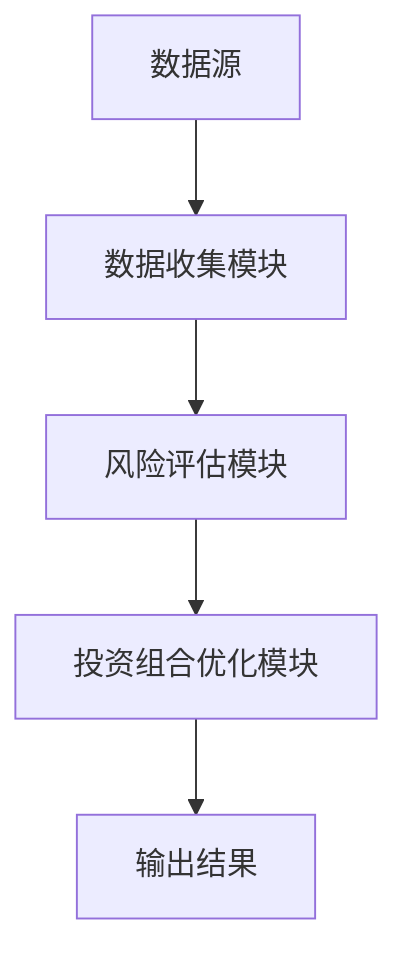

                 


# 价值投资中的风险管理：如何降低损失

---

## 关键词：  
风险管理、价值投资、投资组合、风险评估、概率论、统计学、投资策略

---

## 摘要：  
在价值投资中，风险管理是确保投资组合稳健增长的核心。本文从数学基础、算法原理、系统架构、实战案例等多维度，详细讲解如何通过概率分析、统计模型、投资组合优化和机器学习技术，降低投资风险，实现稳健收益。

---

## 正文：

---

## 第一部分: 风险管理的重要性与背景

### 第1章: 风险管理的重要性

#### 1.1 风险管理的核心概念  
风险管理是指通过识别、评估和应对风险，降低其对投资组合的负面影响。核心在于平衡风险与收益。

#### 1.2 价值投资的背景  
价值投资通过寻找被市场低估的资产，追求长期稳健收益。风险管理确保投资组合在波动中保持稳定。

#### 1.3 风险管理的目标  
- **降低损失**：通过风险评估和控制，避免重大损失。  
- **稳健收益**：通过分散化和对冲，实现长期稳健收益。  

---

### 第2章: 风险管理的数学基础

#### 2.1 概率论与统计学基础  
概率分布（如正态分布）是风险评估的基础，用于量化资产价格波动的可能性。

#### 2.2 风险评估的数学模型  
- **VaR（Value at Risk）**：衡量在给定置信水平下的潜在损失。  
- **CVaR（Conditional Value at Risk）**：VaR的扩展，考虑尾部风险。

#### 2.3 数学模型公式  
$$ VaR = \mu + z \cdot \sigma $$  
其中，$\mu$是均值，$z$是标准正态分布的分位数，$\sigma$是标准差。

---

## 第二部分: 投资组合的风险管理

### 第3章: 投资组合的风险管理策略

#### 3.1 投资组合分散化  
分散化通过多样化投资降低非系统性风险，公式：$$ \text{Var}(R_p) = \sum w_i^2 \cdot \text{Var}(R_i) + \sum w_i w_j \cdot \text{Cov}(R_i, R_j) $$

#### 3.2 风险对冲  
通过期货、期权等衍生工具对冲系统性风险，降低投资组合的波动性。

#### 3.3 止损机制  
设定止损点，避免单个资产的重大损失，保护投资组合的整体收益。

---

### 第4章: 算法原理与实现

#### 4.1 风险评估算法  
- **算法步骤**：  
  1. 数据收集与清洗。  
  2. 计算资产收益与协方差矩阵。  
  3. 应用VaR或CVaR模型。  

- **Python代码示例**：  
  ```python
  import numpy as np
  def calculate VaR(returns, confidence_level):
      sorted_returns = np.sort(returns)
      var_index = int(len(sorted_returns) * (1 - confidence_level))
      return -sorted_returns[var_index]
  ```

---

### 第5章: 系统架构与设计

#### 5.1 系统功能设计  
- **数据收集模块**：收集资产价格数据。  
- **风险评估模块**：计算VaR和CVaR。  
- **投资组合优化模块**：优化投资组合以降低风险。  

#### 5.2 系统架构图  


---

### 第6章: 项目实战

#### 6.1 实战案例分析  
通过实际数据，应用VaR模型进行风险评估，并优化投资组合。  

#### 6.2 实战步骤  
1. 数据收集：获取某股票的历史价格数据。  
2. 计算收益与协方差矩阵。  
3. 应用VaR模型，计算95%置信水平下的VaR。  
4. 优化投资组合，降低VaR值。  

#### 6.3 代码实现  
```python
import numpy as np
import pandas as pd

# 假设returns为资产的收益率数组
returns = pd.Series([...])
confidence_level = 0.95
sorted_returns = np.sort(returns)
var_index = int(len(sorted_returns) * (1 - confidence_level))
var = -sorted_returns[var_index]
print(f"VaR at {confidence_level} confidence level: {var}")
```

---

### 第7章: 风险管理的最佳实践

#### 7.1 风险管理中的心理学因素  
克服认知偏差，保持理性决策，避免情绪化投资。

#### 7.2 定期审查与调整  
定期审查投资组合，根据市场变化调整风险管理策略。

#### 7.3 拓展阅读  
推荐书籍和资源，深入学习风险管理理论与实践。

---

## 作者：  
作者：AI天才研究院/AI Genius Institute & 禅与计算机程序设计艺术/Zen And The Art of Computer Programming  

---

这篇博客文章系统地介绍了价值投资中的风险管理，从数学基础到实际应用，帮助读者全面理解和应用风险管理技术，降低投资损失，实现稳健收益。

